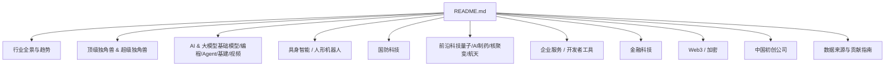
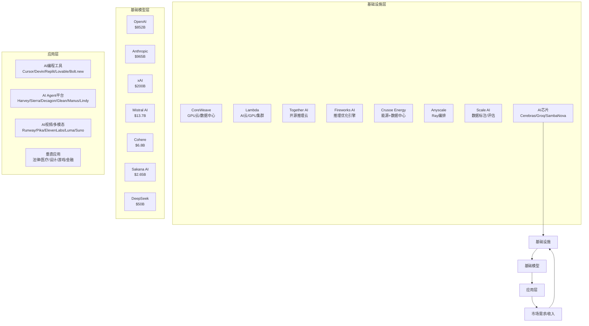
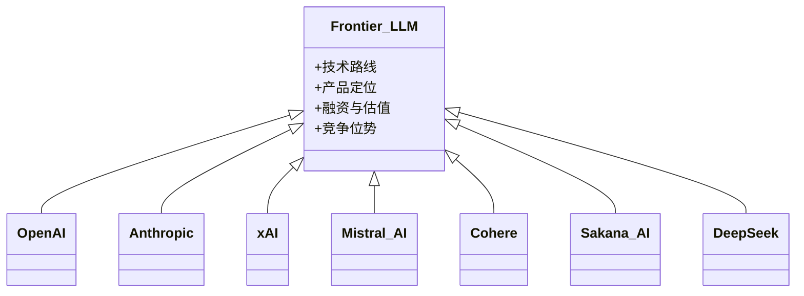
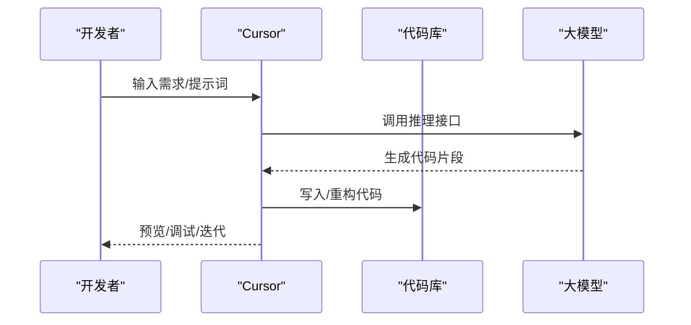
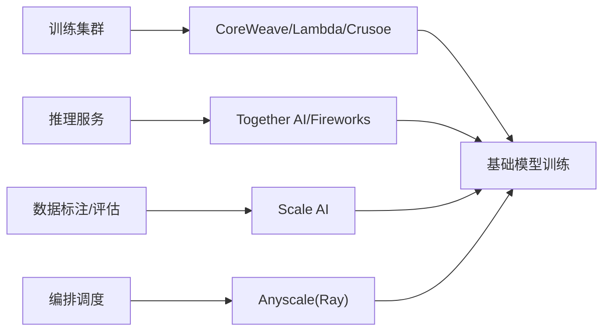
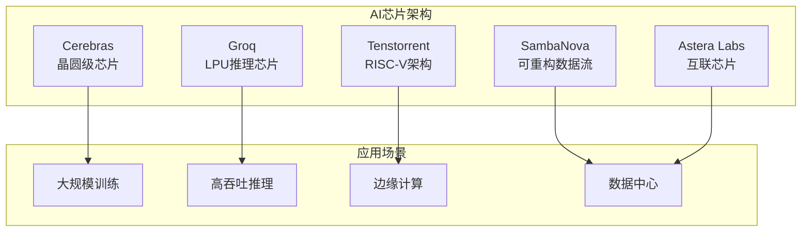
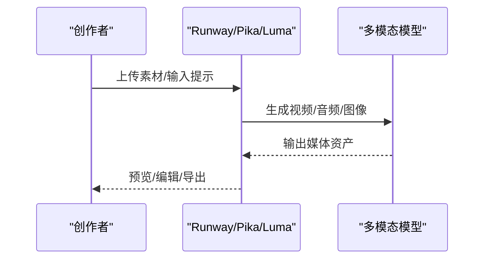
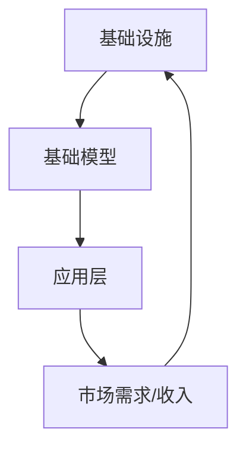

# AI & 大模型领域

<cite>
**本文引用的文件**
- [README.md](file://README.md)
</cite>

## 更新摘要
**所做更改**
- 扩展了前沿实验室（OpenAI、Anthropic、xAI）的详细公司档案
- 新增了AI编程工具的深度分析，包括Cursor、Cognition AI等
- 完善了AI代理平台的架构和技术路线
- 增强了AI基础设施的供应链分析
- 新增了AI芯片/硬件赛道的独立章节
- 扩展了AI视频/多模态生成的技术对比
- 增加了AI垂直应用的行业渗透分析
- 更新了最新的融资数据和估值信息

## 目录
1. [引言](#引言)
2. [项目结构](#项目结构)
3. [核心组件](#核心组件)
4. [架构总览](#架构总览)
5. [详细组件分析](#详细组件分析)
6. [依赖关系分析](#依赖关系分析)
7. [性能与规模化考量](#性能与规模化考量)
8. [故障排查指南](#故障排查指南)
9. [结论](#结论)
10. [附录](#附录)

## 引言
本仓库提供一份持续更新的精选初创公司清单，聚焦 2025–2026 年间最受资本、市场与媒体关注的公司，按热门赛道系统化整理。AI 领域在 2026 H1 全球风险投资中占比超过 70%，资金高度集中于头部公司与关键基础设施。文档围绕基础大模型公司、AI 编程工具、AI Agent 平台、AI 基础设施以及 AI 视频/多模态生成等子领域，梳理各公司在技术路线、产品定位、融资情况与市场竞争中的位置。

## 项目结构
该仓库为单文件 README 驱动的知识型清单，内容按"行业全景—顶级独角兽—细分赛道—前沿科技—贡献指南"组织，便于快速检索与横向对比。

图表来源
- [README.md:1-932](file://README.md#L1-L932)

章节来源
- [README.md:1-932](file://README.md#L1-L932)

## 核心组件
本节聚焦 AI 与大模型相关的关键子领域与公司矩阵，涵盖：
- 基础大模型：OpenAI、Anthropic、xAI、Mistral AI、Cohere、Sakana AI、DeepSeek
- AI 编程工具：Cursor、Devin、Replit、Lovable、Bolt.new、Codeium、Factory、v0
- AI Agent 平台：Harvey AI、Sierra、Decagon、Glean、Manus AI、Lindy AI
- AI 基础设施：CoreWeave、Lambda、Together AI、Fireworks AI、Crusoe Energy、Anyscale、Scale AI
- AI 芯片/硬件：Cerebras、Groq、SambaNova、Tenstorrent、Astera Labs
- AI 视频/多模态生成：Runway、Pika、ElevenLabs、Luma AI、Suno、Stability AI、HeyGen、Synthesia

这些公司在技术路线上呈现"开源+商业双轨""企业优先""推理优化""多模态融合"等趋势；在产品定位上覆盖从底层算力到上层应用的全栈生态；在融资方面，头部公司估值与轮次规模屡创新高，体现资本对 AI 全链路的集中投入。

章节来源
- [README.md:157-369](file://README.md#L157-L369)

## 架构总览
下图展示 AI 产业价值链的端到端分层：从算力与数据，到基础模型与推理优化，再到编程与 Agent 应用层，最终落地到视频/多模态与企业场景。

图表来源
- [README.md:157-369](file://README.md#L157-L369)

## 详细组件分析

### 前沿大模型实验室 (Frontier LLM Labs)

#### OpenAI - $852B
- **创始人**：Sam Altman、Greg Brockman、Ilya Sutskever | **成立**：2015
- **核心产品**：ChatGPT、GPT-5、o3、Sora、Operator
- **最新融资**：2025年 $110B轮（$730B估值）；后续 $852B
- **亮点**：OpenAI已成为史上最大初创公司之一，估值超越传统科技巨头；与Microsoft深度绑定；目标AGI

#### Anthropic - $965B  
- **创始人**：Dario & Daniela Amodei | **成立**：2021
- **核心产品**：Claude 4.5 / Opus、Claude Code
- **最新融资**：2026年5月 $65B Series H（$965B估值）
- **亮点**：以"AI Safety"为核心定位；企业市场份额超OpenAI；ARR增长最快AI公司之一

#### xAI - $200B
- **创始人**：Elon Musk | **成立**：2023
- **核心产品**：Grok系列、Grok Code
- **亮点**：Memphis超算集群（20万张GPU）；X平台流量入口；与SpaceX合并后估值达$1.58T

#### Mistral AI - $13.7B
- **创始人**：Arthur Mensch等 | **成立**：2023 | **总部**：巴黎
- **核心产品**：Mistral Large、Mistral Small、Le Chat
- **最新融资**：2026年估值 $13.7B
- **亮点**：欧洲AI龙头；开源+商业双轨；多模型路线

#### Cohere - $6.8B
- **创始人**：Aidan Gomez等 | **成立**：2019
- **核心产品**：Command系列、Embed、North平台
- **最新融资**：2025年估值 $6.8B
- **亮点**：Transformer论文作者创办；专注企业部署；多云中立（AWS/Azure/Oracle）

#### Sakana AI - $2.65B
- **创始人**：David Ha、Lionel Jones | **成立**：2023 | **总部**：东京
- **核心产品**：日语优化大模型、Automated Scientist
- **最新融资**：2025年11月 $135M Series B（$2.65B估值）
- **亮点**：日本AI国家队代表；"模型合并"等高效训练方法

#### DeepSeek - $50B（融资中）
- **创始人**：梁文锋 | **成立**：2023 | **总部**：杭州
- **核心产品**：DeepSeek-V3、DeepSeek-R1、DeepSeek-V4
- **最新融资**：2026年5月首次外部融资，目标从$300M/$10B升至**$7B/$50B**
- **亮点**：R1以极低成本震动全球；量化巨头HighFlyer背书；人才留存压力驱动首次融资

图表来源
- [README.md:157-200](file://README.md#L157-L200)

章节来源
- [README.md:157-200](file://README.md#L157-L200)

### AI 编程工具 (AI Coding Tools)

#### Anysphere / Cursor - $50B（洽谈中）
- **创始人**：Aman Sanger等 | **成立**：2022
- **核心产品**：Cursor AI代码编辑器
- **最新融资**：2025年11月 Series D $2.3B（$29.3B估值）；2026年正洽谈$2B新轮 @$50B估值
- **亮点**：ARR从$50M（2024.11）→ $500M（2025.06）→ $2B（2026.03）；史上增速最快的SaaS公司

#### Cognition AI / Devin - $26B
- **创始人**：Scott Wu | **成立**：2023
- **核心产品**：Devin（自主AI软件工程师）
- **最新融资**：2025年 $1B+轮（$26B估值）
- **亮点**：90%代码由自家AI编写；营收1年增长13倍至$492M

#### Replit - $3B
- **创始人**：Amjad Masad | **成立**：2016
- **核心产品**：Replit Agent（云端AI开发环境）
- **亮点**：从在线IDE转型AI编程平台；Agent模式大获成功

#### Lovable - $1.8B
- **创始人**：Anton Osika | **成立**：2024 | **总部**：斯德哥尔摩
- **核心产品**：AI全栈Web应用生成
- **最新融资**：2025年估值 $1.8B
- **亮点**：14个月内ARR突破$500M；YC W25明星项目

#### Bolt.new - $700M
- **创始人**：Eric Simons | **成立**：2024
- **核心产品**：StackBlitz旗下AI Web开发平台
- **亮点**：基于WebContainers浏览器内运行；2025年估值 $700M

#### Codeium / Windsurf - $1.25B
- **核心产品**：Windsurf AI IDE
- **亮点**：曾估值$1.25B；2025年被Cognition收购整合至Devin

#### Factory - $120M+
- **核心产品**：AI软件工程Agent（Droids）
- **亮点**：Droid系列在企业DevOps场景落地

#### v0 by Vercel - $9.3B（母公司Vercel）
- **核心产品**：AI UI生成器
- **亮点**：日生成量超百万组件；与Vercel部署深度集成

图表来源
- [README.md:203-246](file://README.md#L203-L246)

章节来源
- [README.md:203-246](file://README.md#L203-L246)

### AI Agent / 智能体平台

#### Sierra - $4.5B
- **创始人**：Bret Taylor、Clay Bavor | **成立**：2024
- **核心产品**：企业客服AI Agent
- **最新融资**：2026年估值 $4.5B
- **亮点**：Bret Taylor（前Salesforce COO、OpenAI董事）二次创业；ARR高速增长

#### Decagon - $1.5B
- **核心产品**：客服AI Agent平台
- **最新融资**：2025年6月 $131M Series C（$1.5B估值）
- **亮点**：从challenger跃升头部；客户包括多家Fortune 500

#### Glean - $7.25B
- **创始人**：Arvind Jain | **成立**：2019
- **核心产品**：企业AI搜索/知识管理
- **最新融资**：2025年估值 $7.25B
- **亮点**：500+企业客户（含Nasdaq、Pixar）

#### Manus AI - $500M+
- **创始人**：肖弘、季逸超 | **成立**：2024 | **总部**：中国
- **核心产品**：通用AI Agent
- **亮点**：2025年GAIA基准SOTA；中国AGI独角兽

#### Lindy AI - $100M+
- **核心产品**：个人AI助理Agent
- **亮点**：被誉为"个人AI员工"；YC明星项目

图表来源
- [README.md:249-282](file://README.md#L249-L282)

章节来源
- [README.md:249-282](file://README.md#L249-L282)

### AI 基础设施

#### CoreWeave - $35B+
- **创始人**：Michael Intrator | **成立**：2017
- **核心业务**：GPU云服务
- **最新融资**：2025年估值 $35B
- **亮点**：NVIDIA重仓；专为AI训练打造的数据中心

#### Lambda - $1.5B+
- **创始人**：Stephen Balaban | **成立**：2012
- **核心业务**：AI云/GPU集群
- **最新融资**：2025年2月 Series D $480M（NVIDIA领投）
- **亮点**：NVIDIA HGX H100主力提供商

#### Together AI - $8.3B
- **创始人**：Vipul Ved Prakash | **成立**：2022
- **核心业务**：开源AI推理云
- **最新融资**：2026年7月 Series C $800M（$8.3B估值）
- **亮点**：专注开源模型推理优化；快速低于闭源定价

#### Fireworks AI - $4B+
- **核心业务**：AI推理优化引擎
- **亮点**：以速度著称；客户包括Cursor、Notion等头部AI公司

#### Crusoe Energy - $13B+
- **核心业务**：AI数据中心/能源
- **亮点**：利用天然气废气供电；与OpenAI合作4GW数据中心

#### Anyscale - $1B+
- **核心业务**：Ray开源AI平台
- **亮点**：开源Ray框架背后公司；多模型编排能力领先

#### Scale AI - $13.8B
- **创始人**：Alexandr Wang | **成立**：2016
- **核心业务**：数据标注/评估
- **亮点**：政府数据业务大涨；2025年估值 $13.8B

图表来源
- [README.md:285-321](file://README.md#L285-L321)

章节来源
- [README.md:285-321](file://README.md#L285-L321)

### AI 芯片/硬件

#### Cerebras Systems - 已上市 ~$5B
- **创始人**：Andrew Feldman | **成立**：2015 | **总部**：Sunnyvale
- **核心产品**：Wafer-Scale Engine（WSE）——世界最大AI芯片
- **最新动态**：2024年提交IPO申请；2025年上市
- **亮点**：单片晶圆级芯片；CS-3系统；与G42合作建设全球最大AI超算

#### Groq - $2.8B+
- **创始人**：Jonathan Ross（前Google TPU架构师）| **成立**：2016 | **总部**：Mountain View
- **核心产品**：LPU（Language Processing Unit）推理芯片
- **最新融资**：2025年 Series D $400M（$2.8B估值；Blackrock领投）
- **亮点**：推理速度比GPU快10x+；沙特5.5万LPU部署

#### SambaNova Systems - $5B+
- **创始人**：Rodrigo Liang | **成立**：2017 | **总部**：Palo Alto
- **核心产品**：SN40L RDU（可重构数据流芯片）+ DataScale系统
- **最新融资**：2021年 Series D $676M（$5B+估值；SoftBank领投）
- **亮点**：全栈AI硬件+软件平台；企业级部署

#### Tenstorrent - $1B+
- **CEO**：Jim Keller | **成立**：2016 | **总部**：Toronto
- **核心产品**：Grayskull / Wormhole AI芯片 + RISC-V架构
- **最新融资**：2023年 $100M（$1B估值；现代汽车、三星投资）
- **亮点**：传奇芯片架构师Jim Keller领衔；RISC-V + AI双线布局

#### Astera Labs - 已上市 ~$10B
- **总部**：Fremont | **成立**：2017
- **核心产品**：AI服务器互联芯片（CXL / PCIe Retimer）
- **最新动态**：2024年3月 IPO，上市后市值$10B+
- **亮点**：AI数据中心互联瓶颈关键供应商；NVIDIA合作伙伴

图表来源
- [README.md:440-492](file://README.md#L440-L492)

章节来源
- [README.md:440-492](file://README.md#L440-L492)

### AI 视频/多模态生成

#### Runway - $5.3B
- **创始人**：Cristóbal Valenzuela等 | **成立**：2018
- **核心产品**：Gen-3/4视频生成
- **最新融资**：2026年2月 Series E $315M（$5.3B估值）
- **亮点**：好莱坞采用率最高；与Lionsgate合作训练专属模型

#### Pika - $4B+（估）
- **创始人**：Demi Guo、Chenlin Meng | **成立**：2023
- **核心产品**：Pika系列视频生成
- **最新融资**：2025年估值 $4B+（最新一轮仍在进行）
- **亮点**：产品体验领先；与Stanford合作扩散模型研究

#### ElevenLabs - $11B
- **创始人**：Mati Staniszewski、Piotr Dąbkowski | **成立**：2022
- **核心产品**：AI语音生成、音乐生成
- **最新融资**：2026年 Series D $500M（$11B估值）
- **亮点**：2025年 ARR $330M；NVIDIA战略投资；挑战Suno

#### Luma AI - $4B+
- **核心产品**：Dream Machine视频生成
- **最新融资**：2025年11月 Series C $900M
- **亮点**：DiT模型先驱；Sora强对手

#### Suno - $2.45B
- **创始人**：Mikey Shulman | **成立**：2023
- **核心产品**：AI音乐生成
- **最新融资**：2025年 Series C $250M
- **亮点**：音乐生成事实标准；ARR高速增长

#### Stability AI - $1B+（公开报道）
- **创始人**：Emad Mostaque | **成立**：2019 | **总部**：伦敦
- **核心产品**：Stable Diffusion、Stable Video
- **亮点**：开源图像生成最大旗手；经历领导层动荡后重整

#### HeyGen - $500M+
- **核心产品**：AI数字人视频生成
- **亮点**：B2B数字人事实标准；ARR高速增长

#### Synthesia - $2.1B
- **创始人**：Victor Riparbelli | **成立**：2017 | **总部**：伦敦
- **核心产品**：AI数字人视频平台
- **亮点**：企业培训视频龙头；ARR突破$100M

图表来源
- [README.md:324-369](file://README.md#L324-L369)

章节来源
- [README.md:324-369](file://README.md#L324-L369)

### AI 开源生态

#### Hugging Face - $4.5B+
- **创始人**：Clément Delangue、Julien Chaumond | **成立**：2016 | **总部**：纽约
- **核心产品**：Model Hub、Transformers库、Inference Endpoints
- **最新融资**：2024年 Series D $230M（$4.5B估值；Salesforce、Google、NVIDIA、Amazon等参投）
- **亮点**：AI开源生态的"GitHub"；托管1.5M+模型；企业版ARR高速增长；Spaces平台日活百万+

#### Meta AI / Llama - Meta子部门
- **核心产品**：Llama 3 / 3.1 / 4系列开源大模型
- **亮点**：Llama 3.1 405B是最大开源模型；下载量超3.5亿次；推动开源AI民主化

#### Ollama - $50M+
- **核心产品**：本地大模型运行工具
- **亮点**：GitHub 130k+ Stars；让普通用户在笔记本上跑Llama、DeepSeek等模型

#### vLLM - UC Berkeley开源项目
- **核心产品**：高吞吐量LLM推理引擎
- **亮点**：PagedAttention技术；推理吞吐量提升2-24倍；已成开源推理事实标准

#### LangChain - $10M+（种子）
- **创始人**：Harrison Chase | **成立**：2022
- **核心产品**：LangChain / LangGraph / LangSmith
- **亮点**：LLM应用开发框架事实标准；GitHub 100k+ Stars；企业版LangSmith快速商业化

#### LlamaIndex - $10M+
- **创始人**：Jerry Liu | **成立**：2022
- **核心产品**：LlamaIndex RAG框架
- **亮点**：RAG（检索增强生成）框架事实标准；GitHub 40k+ Stars

章节来源
- [README.md:541-573](file://README.md#L541-L573)

### AI 安全/对齐

#### Robust Intelligence - 被收购（Cisco）
- **创始人**：Yash Shah、Tianhui Michael Li | **成立**：2019
- **核心产品**：AI模型安全测试平台
- **最新动态**：2025年被Cisco收购
- **亮点**：AI红队测试先驱；企业AI安全合规标杆

#### Protect AI - $100M+
- **核心产品**：AI/ML安全平台（Radar、Notebook、Guardian）
- **最新融资**：2025年 Series B
- **亮点**：MLSecOps品类开创者；覆盖模型供应链、运行时防护

#### Lasso Security - $30M+
- **核心产品**：GenAI安全治理平台
- **最新融资**：2025年种子轮+
- **亮点**：Prompt注入防护、数据泄露检测；企业GenAI安全新锐

#### Patronus AI - $20M+
- **创始人**：Anand Kannappan、Rebecca Qian | **成立**：2023
- **核心产品**：LLM评估/幻觉检测
- **亮点**：自动化LLM安全审计；企业与闭源模型API对齐检测

章节来源
- [README.md:575-604](file://README.md#L575-L604)

### AI 垂直应用

#### 法律AI

##### Harvey AI - $11B
- **创始人**：Winston Weinberg、Gabriel Pereyra | **成立**：2022
- **核心产品**：法律AI助手（合同分析、法律研究、文件起草）
- **最新融资**：2026年3月 $200M Series G（$11B估值）
- **亮点**：法律AI事实标准；ARR $1.5B；客户覆盖Allen & Overy、PwC等顶级律所

#### 医疗AI

##### Abridge - $5.3B
- **创始人**：Shivdev Rao | **成立**：2018
- **核心产品**：临床文档AI（自动生成就诊笔记）
- **最新融资**：2025年 Series C $150M（$850M→$5.3B估值）
- **亮点**：临床对话转结构化笔记；Epic集成；ARR增长4倍

#### 设计/创意AI

##### Canva - $26B+（已上市候选）
- **创始人**：Melanie Perkins、Cliff Obrecht | **成立**：2013 | **总部**：悉尼
- **核心产品**：Canva AI设计平台、Magic Studio
- **亮点**：1.85亿月活用户；AI文生图/文/视频；2026 IPO候选

#### 游戏AI

##### Inworld AI - $500M+
- **创始人**：Kylan Gibbs、Michael Epler | **成立**：2021
- **核心产品**：AI NPC引擎 / AI角色生成
- **最新融资**：累计 $120M+（$500M估值）
- **亮点**：AI NPC品类开创者；与Xbox、Disney合作；实时TTS <200ms

章节来源
- [README.md:606-935](file://README.md#L606-L935)

## 依赖关系分析
AI产业链上下游存在明显依赖：
- 基础设施为模型训练与推理提供算力与数据支持。
- 基础模型依赖高质量数据与高效编排，同时被上层应用广泛调用。
- 应用层（编程、Agent、视频/多模态）直接面向终端用户与企业场景，推动商业化闭环。

图表来源
- [README.md:157-369](file://README.md#L157-L369)

章节来源
- [README.md:157-369](file://README.md#L157-L369)

## 性能与规模化考量
- 训练侧：需大规模GPU集群与高效能耗方案（如Crusoe能源策略），以降低单位训练成本并提升吞吐。
- 推理侧：优化延迟与成本是关键（Together AI、Fireworks AI），满足高并发与低时延需求。
- 数据侧：高质量标注与评估（Scale AI）直接影响模型效果与合规性。
- 编排侧：Ray（Anyscale）在多模型编排与分布式计算中发挥重要作用，提升资源利用率。

## 故障排查指南
- 训练中断或资源不足：检查基础设施可用性（CoreWeave/Lambda）、能耗与冷却方案（Crusoe）、调度与编排（Anyscale）。
- 推理延迟过高：评估推理优化引擎（Together AI/Fireworks）与模型量化策略，必要时切换供应商或调整批大小。
- 数据质量差：引入更严格的标注流程与评估指标（Scale AI），建立数据版本管理与回滚机制。
- 应用层稳定性：在Agent与编程工具中增加重试、降级与监控告警，确保用户体验与数据安全。

## 结论
AI与大模型领域已形成从基础设施到应用层的完整生态。基础模型公司凭借技术优势与资本加持占据主导地位；AI编程与Agent平台加速企业数字化与自动化；基础设施公司保障算力与数据供给；视频/多模态生成拓展创意与营销边界。未来竞争将围绕"效率、成本、质量、合规"展开，具备全栈能力与生态协同的公司更具长期竞争力。

## 附录
- 数据来源：Forbes AI 50、CB Insights、Crunchbase、PitchBook、The Information、TechCrunch、Y Combinator、Sacra、Contrary Research、AI Funding Tracker、New Market Pitch。
- 贡献指南：欢迎 Fork 并提交 PR，遵循收录标准与格式规范，确保信息可验证。

章节来源
- [README.md:859-932](file://README.md#L859-L932)