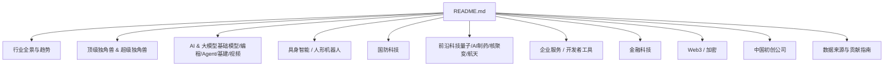
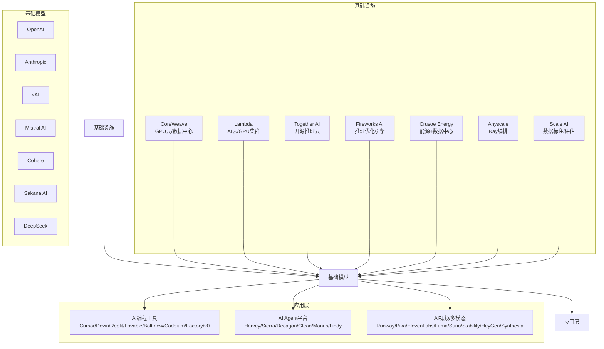
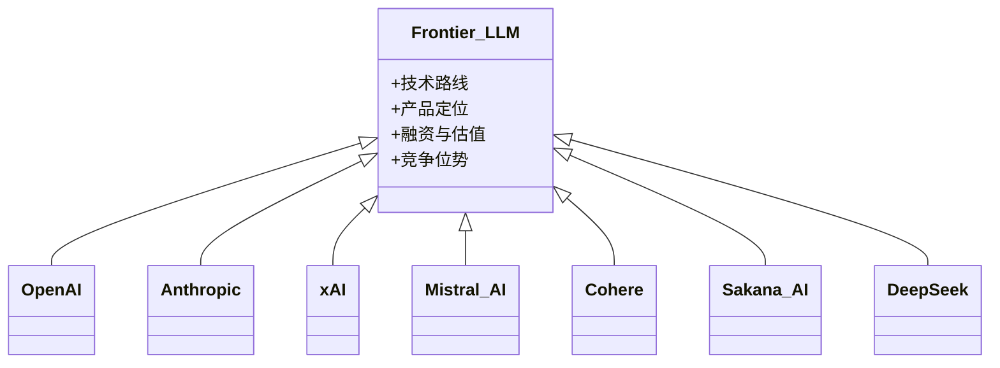
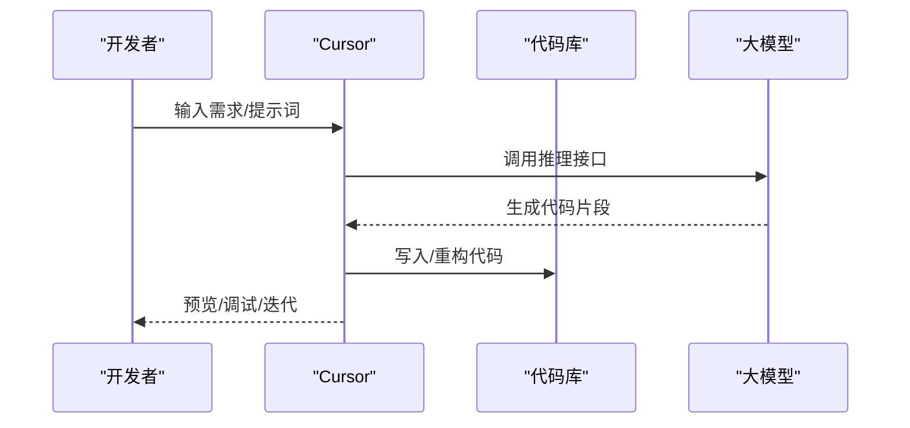
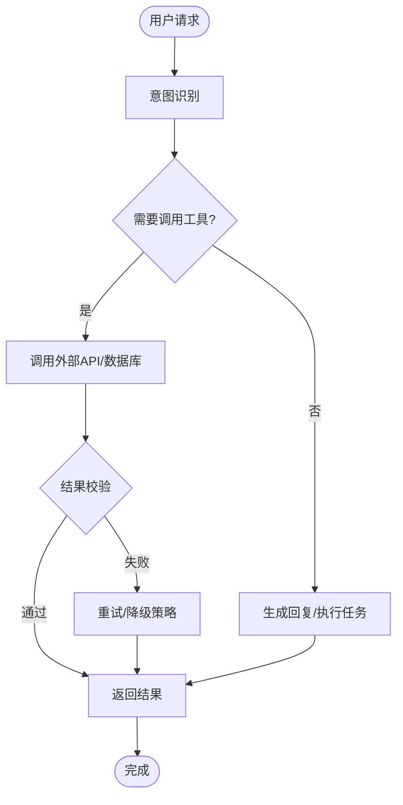
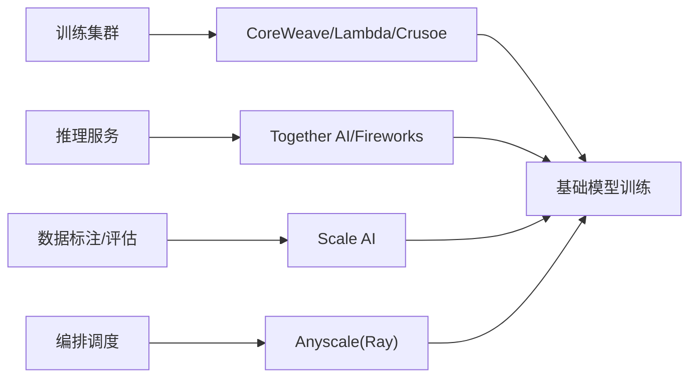
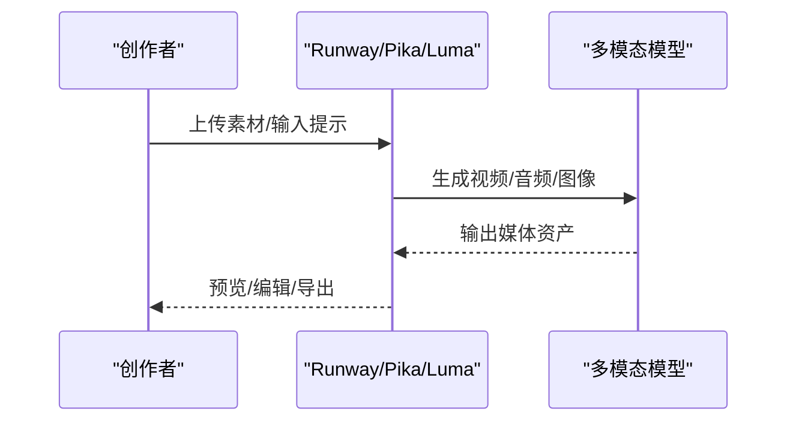
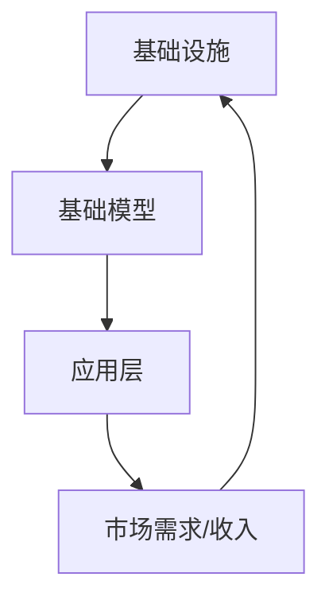

# AI & 大模型领域

<cite>
**本文引用的文件**
- [README.md](file://README.md)
</cite>

## 目录
1. [引言](#引言)
2. [项目结构](#项目结构)
3. [核心组件](#核心组件)
4. [架构总览](#架构总览)
5. [详细组件分析](#详细组件分析)
6. [依赖关系分析](#依赖关系分析)
7. [性能与规模化考量](#性能与规模化考量)
8. [故障排查指南](#故障排查指南)
9. [结论](#结论)
10. [附录](#附录)

## 引言
本仓库提供一份持续更新的精选初创公司清单，聚焦 2025–2026 年间最受资本、市场与媒体关注的公司，按热门赛道系统化整理。AI 领域在 2026 H1 全球风险投资中占比超过 70%，资金高度集中于头部公司与关键基础设施。文档围绕基础大模型公司、AI 编程工具、AI Agent 平台、AI 基础设施以及 AI 视频/多模态生成等子领域，梳理各公司在技术路线、产品定位、融资情况与市场竞争中的位置。

## 项目结构
该仓库为单文件 README 驱动的知识型清单，内容按“行业全景—顶级独角兽—细分赛道—前沿科技—贡献指南”组织，便于快速检索与横向对比。

图表来源
- [README.md:1-932](file://README.md#L1-L932)

章节来源
- [README.md:1-932](file://README.md#L1-L932)

## 核心组件
本节聚焦 AI 与大模型相关的关键子领域与公司矩阵，涵盖：
- 基础大模型：OpenAI、Anthropic、xAI、Mistral AI、Cohere、Sakana AI、DeepSeek
- AI 编程工具：Cursor、Devin、Replit、Lovable、Bolt.new、Codeium、Factory、v0
- AI Agent 平台：Harvey AI、Sierra、Decagon、Glean、Manus AI、Lindy AI
- AI 基础设施：CoreWeave、Lambda、Together AI、Fireworks AI、Crusoe Energy、Anyscale、Scale AI
- AI 视频/多模态生成：Runway、Pika、ElevenLabs、Luma AI、Suno、Stability AI、HeyGen、Synthesia

这些公司在技术路线上呈现“开源+商业双轨”“企业优先”“推理优化”“多模态融合”等趋势；在产品定位上覆盖从底层算力到上层应用的全栈生态；在融资方面，头部公司估值与轮次规模屡创新高，体现资本对 AI 全链路的集中投入。

章节来源
- [README.md:157-369](file://README.md#L157-L369)

## 架构总览
下图展示 AI 产业价值链的端到端分层：从算力与数据，到基础模型与推理优化，再到编程与 Agent 应用层，最终落地到视频/多模态与企业场景。

图表来源
- [README.md:157-369](file://README.md#L157-L369)

## 详细组件分析

### 基础大模型公司
- OpenAI：以 ChatGPT、GPT-5、Sora 等产品为核心，目标 AGI，与 Microsoft 深度绑定，估值与融资规模处于行业顶端。
- Anthropic：强调 AI 安全与企业市场，Claude 系列模型 ARR 高速增长，企业份额领先。
- xAI：Grok 系列与 X 平台整合，Memphis 超算集群支撑训练，与 SpaceX 合并后形成巨无霸实体。
- Mistral AI：欧洲最大 AI 公司，开源+商业双轨，Le Chat 产品推进多模型路线。
- Cohere：专注企业部署与多云中立，Command 系列模型与 North 平台服务大型企业。
- Sakana AI：日本国家队代表，EfficientLLM 等方法研究领先，日语优化模型突出。
- DeepSeek：R1 模型以低成本训练引发关注，中国 AGI 先锋，外部融资估值高。

图表来源
- [README.md:157-200](file://README.md#L157-L200)

章节来源
- [README.md:157-200](file://README.md#L157-L200)

### AI 编程工具
- Cursor：ARR 增速极快，从 $50M 到 $2B 级别，估值洽谈至 $50B。
- Devin：自主软件工程师，营收一年增长 13 倍至 $492M，估值 $26B。
- Replit：从在线 IDE 转型 AI 编程平台，Agent 模式成功。
- Lovable：AI 全栈 Web 应用生成，ARR 突破 $500M，估值 $1.8B。
- Bolt.new：StackBlitz 旗下 AI Web 开发平台，基于浏览器内运行。
- Codeium/Windsurf：曾估值 $1.25B，后被 Cognition 收购整合至 Devin。
- Factory：Droid 系列在企业 DevOps 落地。
- v0 by Vercel：AI UI 生成器，日生成量超百万组件，与部署集成紧密。

图表来源
- [README.md:203-246](file://README.md#L203-L246)

章节来源
- [README.md:203-246](file://README.md#L203-L246)

### AI Agent 平台
- Harvey AI：法律 AI 助手，ARR $1.5B，财富 500 强律所采用。
- Sierra：企业客服 AI Agent，ARR 高速增长，由前 Salesforce COO 二次创业。
- Decagon：客服 AI Agent 平台，跃升头部，客户包括多家 Fortune 500。
- Glean：企业 AI 搜索与知识管理，500+ 企业客户。
- Manus AI：通用 AI Agent，GAIA 基准 SOTA，中国 AGI 独角兽。
- Lindy AI：个人 AI 助理 Agent，被誉为“个人 AI 员工”。

图表来源
- [README.md:249-282](file://README.md#L249-L282)

章节来源
- [README.md:249-282](file://README.md#L249-L282)

### AI 基础设施
- CoreWeave：NVIDIA 重仓，专为 AI 训练的数据中心。
- Lambda：NVIDIA HGX H100 主力提供商，AI 云/GPU 集群。
- Together AI：开源模型推理优化，定价低于闭源。
- Fireworks AI：以速度著称，服务 Cursor、Notion 等头部公司。
- Crusoe Energy：利用天然气废气供电，与 OpenAI 合作数据中心。
- Anyscale：Ray 开源框架背后公司，多模型编排能力领先。
- Scale AI：政府数据业务大涨，数据标注与评估。

图表来源
- [README.md:285-321](file://README.md#L285-L321)

章节来源
- [README.md:285-321](file://README.md#L285-L321)

### AI 视频/多模态生成
- Runway：好莱坞采用率最高，Gen-3/4 视频生成，与 Lionsgate 合作专属模型。
- Pika：产品体验领先，扩散模型研究与产品化结合。
- ElevenLabs：AI 语音与音乐生成，ARR $330M，挑战 Suno。
- Luma AI：Dream Machine 视频生成，DiT 模型先驱。
- Suno：AI 音乐生成事实标准，ARR 高速增长。
- Stability AI：开源图像生成最大旗手，经历领导层动荡后重整。
- HeyGen：B2B 数字人事实标准，ARR 高速增长。
- Synthesia：企业培训视频龙头，ARR 突破 $100M。

图表来源
- [README.md:324-369](file://README.md#L324-L369)

章节来源
- [README.md:324-369](file://README.md#L324-L369)

## 依赖关系分析
AI 产业链上下游存在明显依赖：
- 基础设施为模型训练与推理提供算力与数据支持。
- 基础模型依赖高质量数据与高效编排，同时被上层应用广泛调用。
- 应用层（编程、Agent、视频/多模态）直接面向终端用户与企业场景，推动商业化闭环。

图表来源
- [README.md:157-369](file://README.md#L157-L369)

章节来源
- [README.md:157-369](file://README.md#L157-L369)

## 性能与规模化考量
- 训练侧：需大规模 GPU 集群与高效能耗方案（如 Crusoe 能源策略），以降低单位训练成本并提升吞吐。
- 推理侧：优化延迟与成本是关键（Together AI、Fireworks AI），满足高并发与低时延需求。
- 数据侧：高质量标注与评估（Scale AI）直接影响模型效果与合规性。
- 编排侧：Ray（Anyscale）在多模型编排与分布式计算中发挥重要作用，提升资源利用率。

[本节为通用指导，不直接分析具体文件]

## 故障排查指南
- 训练中断或资源不足：检查基础设施可用性（CoreWeave/Lambda）、能耗与冷却方案（Crusoe）、调度与编排（Anyscale）。
- 推理延迟过高：评估推理优化引擎（Together AI/Fireworks）与模型量化策略，必要时切换供应商或调整批大小。
- 数据质量差：引入更严格的标注流程与评估指标（Scale AI），建立数据版本管理与回滚机制。
- 应用层稳定性：在 Agent 与编程工具中增加重试、降级与监控告警，确保用户体验与数据安全。

[本节为通用指导，不直接分析具体文件]

## 结论
AI 与大模型领域已形成从基础设施到应用层的完整生态。基础模型公司凭借技术优势与资本加持占据主导地位；AI 编程与 Agent 平台加速企业数字化与自动化；基础设施公司保障算力与数据供给；视频/多模态生成拓展创意与营销边界。未来竞争将围绕“效率、成本、质量、合规”展开，具备全栈能力与生态协同的公司更具长期竞争力。

[本节总结性内容，不直接分析具体文件]

## 附录
- 数据来源：Forbes AI 50、CB Insights、Crunchbase、PitchBook、The Information、TechCrunch、Y Combinator、Sacra、Contrary Research、AI Funding Tracker、New Market Pitch。
- 贡献指南：欢迎 Fork 并提交 PR，遵循收录标准与格式规范，确保信息可验证。

章节来源
- [README.md:859-932](file://README.md#L859-L932)