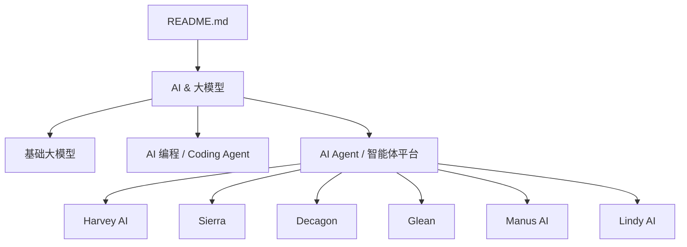
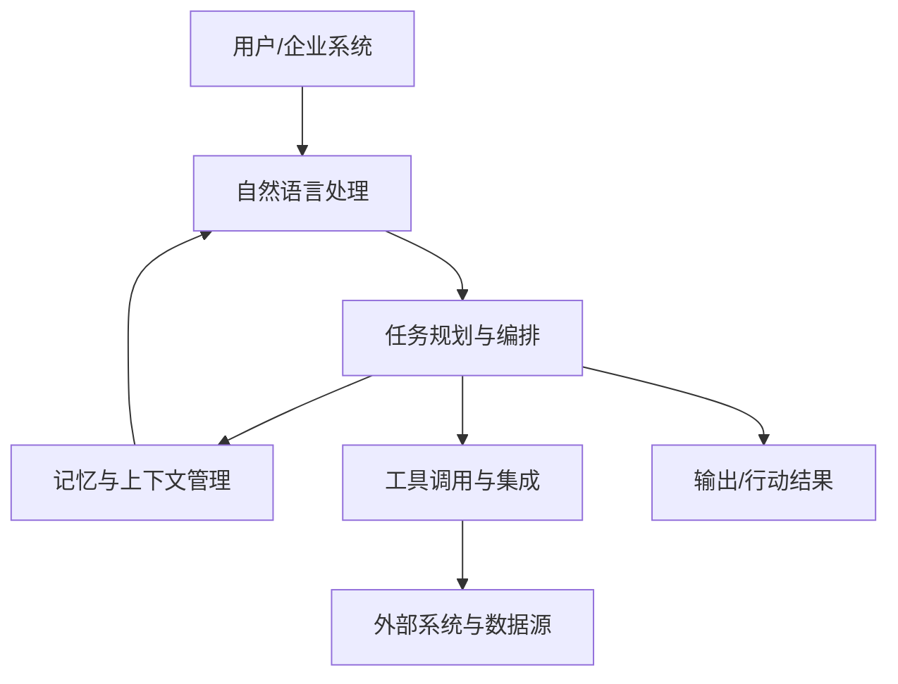
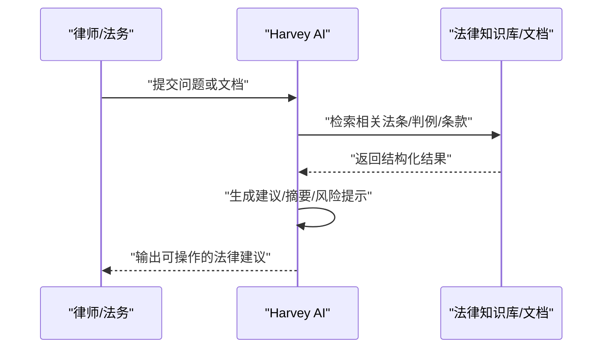
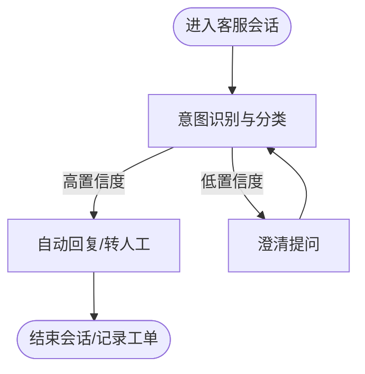
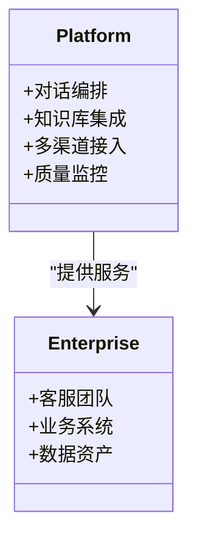
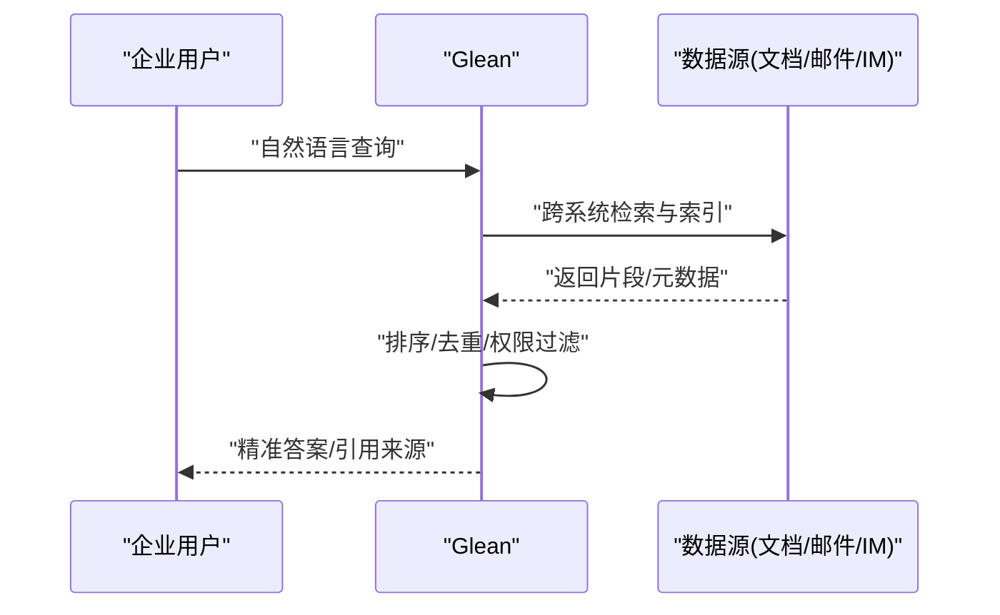
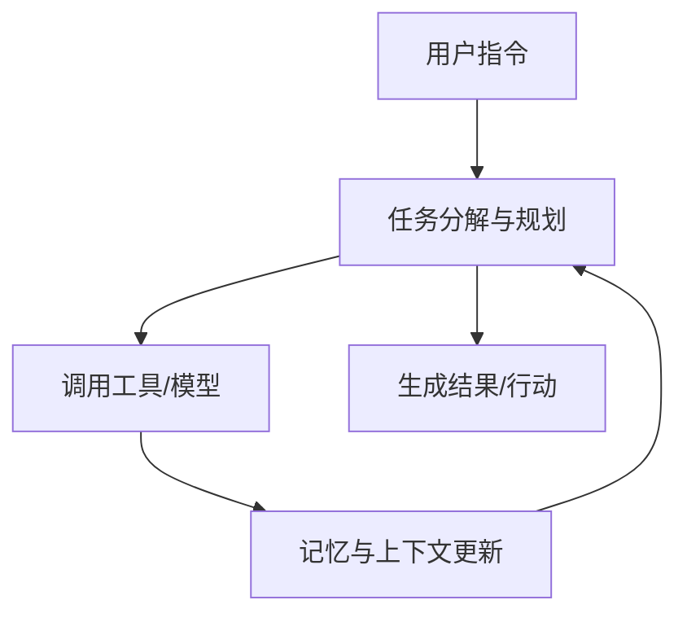
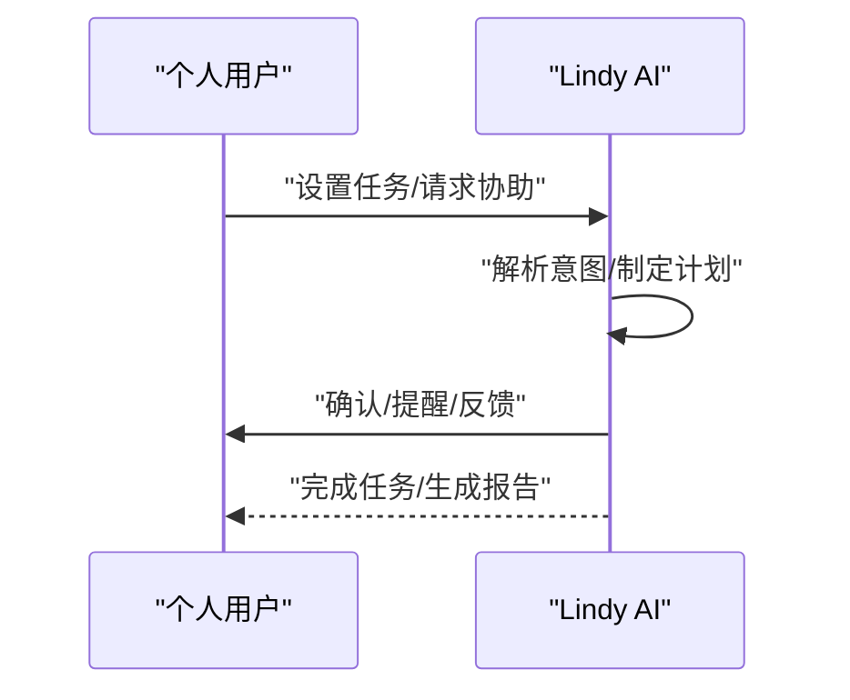
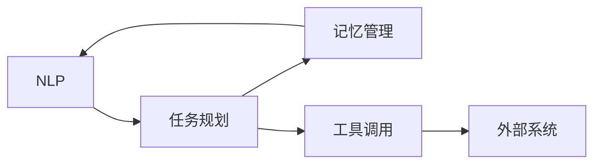

# AI Agent / 智能体平台

<cite>
**本文引用的文件**
- [README.md](file://README.md)
</cite>

## 目录
1. [简介](#简介)
2. [项目结构](#项目结构)
3. [核心组件](#核心组件)
4. [架构总览](#架构总览)
5. [详细组件分析](#详细组件分析)
6. [依赖关系分析](#依赖关系分析)
7. [性能考量](#性能考量)
8. [故障排查指南](#故障排查指南)
9. [结论](#结论)
10. [附录](#附录)

## 简介
本文件聚焦于 AI Agent 与智能体平台，围绕 Harvey、Sierra、Decagon、Glean、Manus AI、Lindy AI 等代表性产品，系统梳理其目标市场、技术能力（自然语言处理、任务规划、工具调用、记忆管理等）、API/开发框架、部署方式与生态合作，并给出从“简单聊天机器人”到“复杂业务自动化”的演进路径。内容基于仓库中的公司清单信息整理而成，旨在帮助读者快速理解各平台在垂直领域的应用定位与技术趋势。

## 项目结构
该仓库为一份持续更新的精选初创公司清单，按赛道组织，其中“AI & 大模型”下的“AI Agent / 智能体平台”小节集中收录了目标平台的基本信息与亮点。

图表来源
- [README.md:250-284](file://README.md#L250-L284)

章节来源
- [README.md:250-284](file://README.md#L250-L284)

## 核心组件
- Harvey AI：法律 AI 助手，面向法律科技场景，覆盖财富 500 强律所，ARR 规模显著，定位为法律领域的 AI 事实标准之一。
- Sierra：企业客服 AI Agent，由前 Salesforce COO 与 OpenAI 董事二次创业，聚焦企业级客户服务自动化。
- Decagon：客服 AI Agent 平台，服务多家 Fortune 500，处于头部阵营。
- Glean：企业 AI 搜索与知识管理，服务 500+ 企业客户（含 Nasdaq、Pixar），强调企业级检索与知识整合。
- Manus AI：通用 AI Agent，GAIA 基准 SOTA，代表中国 AGI 独角兽方向。
- Lindy AI：个人 AI 助理 Agent，被定位为“个人 AI 员工”，YC 明星项目。

章节来源
- [README.md:252-283](file://README.md#L252-L283)

## 架构总览
以下概念性架构图展示典型智能体平台的分层与交互关系，便于理解从用户输入到任务执行的整体流程。该图为概念示意，不直接映射具体代码文件。

[此图为概念性流程图，未直接对应具体源码文件]

## 详细组件分析

### Harvey AI（法律科技）
- 目标市场：法律科技，服务于大型律所与企业法务团队。
- 关键能力：法律文本理解、合同审查辅助、合规问答、案例检索等（基于其“法律 AI 助手”的产品定位）。
- 应用场景：合同审阅、尽职调查、法规检索、内部知识库问答。
- 商业指标：ARR 规模显著，覆盖财富 500 强律所，体现企业级落地能力。

[此序列图为概念性流程，用于说明法律 AI 助手常见交互模式]

章节来源
- [README.md:252-257](file://README.md#L252-L257)

### Sierra（企业客服）
- 目标市场：企业客服自动化，面向大规模客户服务场景。
- 关键能力：多轮对话、工单流转、知识库对接、多渠道接入（基于“企业客服 AI Agent”的定位）。
- 应用场景：售前咨询、售后支持、订单查询、退换货流程自动化。
- 商业指标：ARR 高速增长，体现企业级采用与扩展能力。

[此流程图用于说明企业客服 AI Agent 的典型决策路径]

章节来源
- [README.md:258-263](file://README.md#L258-L263)

### Decagon（客服平台）
- 目标市场：客服 AI Agent 平台，服务多家 Fortune 500。
- 关键能力：平台化能力（对话编排、知识库集成、数据分析、渠道适配）。
- 应用场景：多渠道客服统一入口、自动化应答、服务质量监控。
- 商业指标：从挑战者跃升头部，显示规模化落地能力。

[此图为概念类图，展示平台与企业客户的角色关系]

章节来源
- [README.md:264-268](file://README.md#L264-L268)

### Glean（企业搜索与知识管理）
- 目标市场：企业搜索与知识管理，服务 500+ 企业客户（含 Nasdaq、Pixar）。
- 关键能力：跨系统索引、语义检索、权限控制、知识图谱（基于“企业 AI 搜索/知识管理”的定位）。
- 应用场景：内部知识检索、合规审计、研发资料查找、跨部门协作。
- 商业指标：大量企业客户背书，体现企业级可信与可扩展性。

[此序列图为概念性流程，展示企业搜索的关键步骤]

章节来源
- [README.md:269-274](file://README.md#L269-L274)

### Manus AI（通用 AI Agent）
- 目标市场：通用 AI Agent，追求广泛任务能力与基准表现。
- 关键能力：通用任务规划、多模态理解、基准测试领先（GAIA 基准 SOTA）。
- 应用场景：跨领域自动化、研究辅助、复杂工作流编排。
- 商业指标：中国 AGI 独角兽，具备前沿技术探索与工程落地潜力。

[此流程图用于说明通用 Agent 的任务闭环]

章节来源
- [README.md:275-279](file://README.md#L275-L279)

### Lindy AI（个人 AI 助理）
- 目标市场：个人 AI 助理，定位为“个人 AI 员工”。
- 关键能力：日程管理、邮件处理、提醒与提醒跟进、个人知识库（基于“个人 AI 助理 Agent”的定位）。
- 应用场景：个人效率提升、生活与工作事务自动化。
- 商业指标：YC 明星项目，体现消费级产品的创新与增长潜力。

[此序列图为概念性流程，展示个人助理的交互循环]

章节来源
- [README.md:280-283](file://README.md#L280-L283)

## 依赖关系分析
- 平台间共性依赖：
  - 自然语言处理：用于理解用户意图、提取实体、生成回答。
  - 任务规划与编排：将复杂需求拆解为可执行步骤。
  - 工具调用与集成：对接 CRM、知识库、日历、邮件、数据库等。
  - 记忆与上下文管理：维护会话历史、用户画像、业务状态。
- 垂直领域差异化：
  - 法律科技（Harvey）：强调合规、准确性与可解释性。
  - 企业客服（Sierra/Decagon）：强调多渠道、SLA、工单流转与质检。
  - 企业搜索（Glean）：强调权限、索引质量与检索精度。
  - 通用 Agent（Manus）：强调泛化能力与基准表现。
  - 个人助理（Lindy）：强调易用性与个性化体验。

[此图为概念性依赖图，展示智能体核心模块间的耦合关系]

## 性能考量
- 响应时延：对话式交互需低延迟；企业搜索需高吞吐与精确排序。
- 准确率与召回率：法律与企业搜索对准确性要求极高；客服需平衡速度与质量。
- 可扩展性：多租户、权限隔离、数据分区与缓存策略。
- 成本优化：模型选择（开源/闭源）、推理优化、批处理与异步化。
- 可靠性：错误恢复、降级策略、监控告警与审计日志。

[本节提供通用指导，不直接分析具体文件]

## 故障排查指南
- 常见问题定位：
  - 意图识别失败：检查训练数据分布、同义词表与阈值配置。
  - 工具调用异常：核对接口鉴权、参数校验与重试策略。
  - 记忆丢失：验证会话存储、上下文窗口与持久化机制。
  - 检索质量差：优化索引字段、权重与相关性打分。
- 监控与诊断：
  - 建立端到端链路追踪（从用户输入到最终输出）。
  - 采集关键指标（成功率、时延、错误码分布）。
  - 定期复盘 Bad Case，迭代提示词与规则。

[本节提供通用指导，不直接分析具体文件]

## 结论
- Harvey、Sierra、Decagon、Glean、Manus AI、Lindy AI 分别覆盖法律科技、企业客服、企业搜索、通用 Agent 与个人助理等关键场景，体现了智能体平台在不同垂直领域的深度与广度。
- 从“简单聊天机器人”到“复杂业务自动化”的演进，关键在于强化任务规划、工具集成、记忆管理与企业级治理（权限、安全、合规）。
- 未来趋势：更强大的多模态理解、更高效的推理与编排、更完善的生态集成与开发者工具链。

[本节总结性内容，不直接分析具体文件]

## 附录
- 数据来源与参考：本文件所有关于上述平台的信息均来源于仓库中的公司清单条目。
- 进一步阅读：可结合各公司官网与公开报道，了解其 API、开发框架与部署方式的具体细节。

[本节为补充说明，不直接分析具体文件]