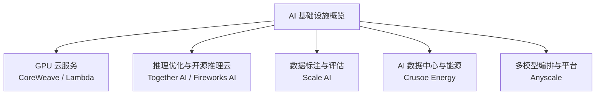
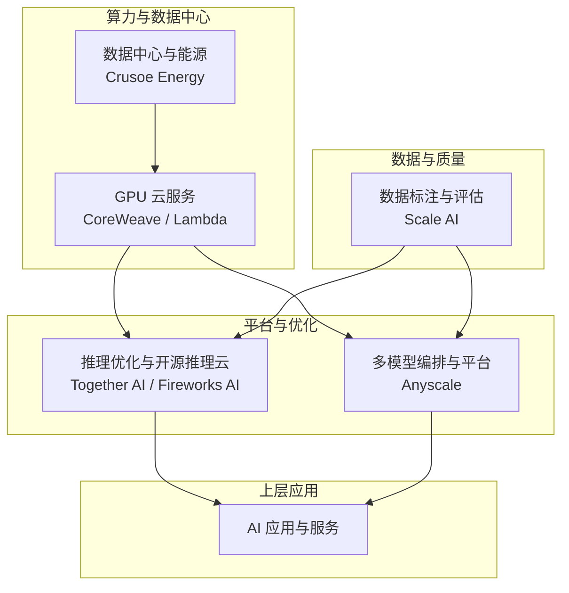
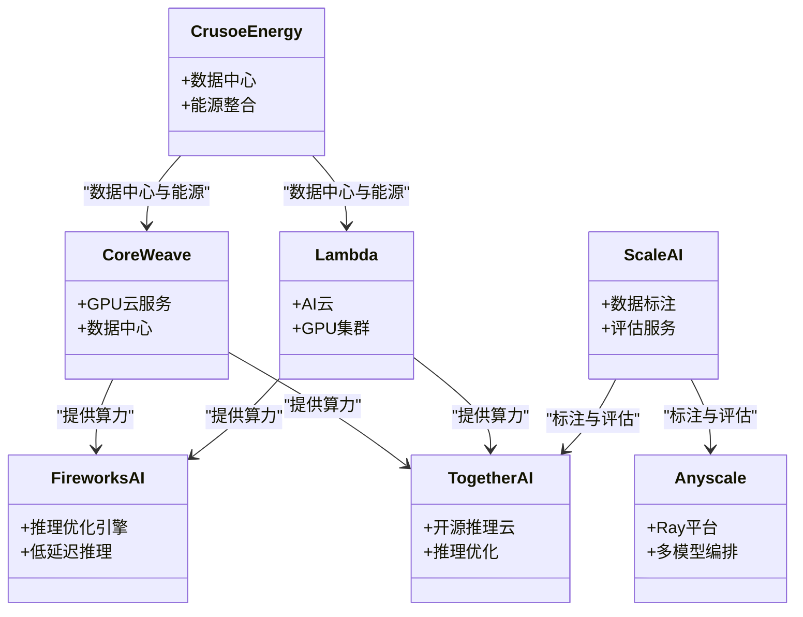
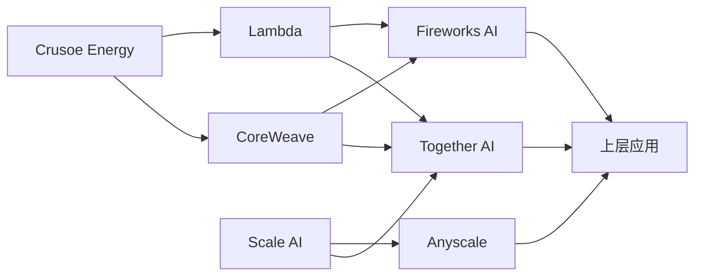

# AI 基础设施

<cite>
**本文引用的文件**
- [README.md](file://README.md)
</cite>

## 目录
1. [简介](#简介)
2. [项目结构](#项目结构)
3. [核心组件](#核心组件)
4. [架构总览](#架构总览)
5. [详细组件分析](#详细组件分析)
6. [依赖关系分析](#依赖关系分析)
7. [性能与成本考量](#性能与成本考量)
8. [故障排查指南](#故障排查指南)
9. [结论](#结论)
10. [附录](#附录)

## 简介
本文件聚焦 AI 基础设施生态，围绕 GPU 云服务、模型训练平台、数据标注服务、推理优化等关键能力，系统梳理 CoreWeave、Lambda、Together AI、Fireworks AI、Crusoe Energy、Anyscale、Scale AI 等提供商的技术服务与资源。文档同时讨论算力供应、成本控制、性能优化、定价模型、容量规划与扩展策略，并解释这些基础设施如何支撑上层应用的快速发展，以及供应链安全与能源可持续性的重要性。内容基于仓库中提供的信息整理而成。

## 项目结构
该仓库以单一 README 为核心，按赛道组织初创公司清单，其中“AI 基础设施”小节集中介绍了 GPU 云、推理优化、数据标注与能源/数据中心等相关企业。整体结构便于快速定位各公司在算力、软件平台与服务形态上的定位。

图表来源
- [README.md:286-323](file://README.md#L286-L323)

章节来源
- [README.md:286-323](file://README.md#L286-L323)

## 核心组件
- GPU 云服务：提供面向 AI 训练与推理的高性能 GPU 集群与弹性算力，典型代表为 CoreWeave、Lambda。
- 推理优化与开源推理云：针对开源模型进行推理加速与低成本部署，典型代表为 Together AI、Fireworks AI。
- 数据标注与评估：为模型训练与评测提供高质量标注与评估服务，典型代表为 Scale AI。
- AI 数据中心与能源：将数据中心与能源结合，提升能效与可持续性，典型代表为 Crusoe Energy。
- 多模型编排与平台：提供 Ray 等开源框架与平台能力，支持多模型编排与规模化运行，典型代表为 Anyscale。

章节来源
- [README.md:286-323](file://README.md#L286-L323)

## 架构总览
下图展示从底层算力到上层应用的关键路径：硬件与数据中心（含能源）→ GPU 云与集群 → 推理优化与平台编排 → 数据标注与评估 → 上层 AI 应用。

图表来源
- [README.md:286-323](file://README.md#L286-L323)

## 详细组件分析

### CoreWeave（GPU 云服务）
- 定位：专为 AI 训练打造的数据中心与 GPU 云服务提供商，强调高性能与可扩展性。
- 价值点：NVIDIA 重仓背书；面向大规模训练与高并发推理的弹性算力供给。
- 适用场景：大模型训练、分布式训练、高吞吐推理服务。

章节来源
- [README.md:286-293](file://README.md#L286-L293)

### Lambda（AI 云/GPU 集群）
- 定位：AI 云与 GPU 集群服务商，提供 HGX H100 等主流 GPU 资源。
- 价值点：作为 NVIDIA HGX H100 的主力提供商之一，满足大规模训练与推理需求。
- 适用场景：需要稳定、高性能 GPU 资源的训练与推理工作负载。

章节来源
- [README.md:294-299](file://README.md#L294-L299)

### Together AI（开源推理云）
- 定位：专注开源模型的推理云，强调速度与成本优势。
- 价值点：在开源模型推理方面具备优化能力，价格低于闭源方案，适合追求性价比的团队。
- 适用场景：开源模型部署、批量推理、成本敏感型生产环境。

章节来源
- [README.md:300-305](file://README.md#L300-L305)

### Fireworks AI（推理优化引擎）
- 定位：AI 推理优化引擎，以速度著称。
- 价值点：为头部 AI 公司提供低延迟、高吞吐的推理加速能力。
- 适用场景：对时延敏感的在线推理、实时交互类应用。

章节来源
- [README.md:306-309](file://README.md#L306-L309)

### Crusoe Energy（AI 数据中心与能源）
- 定位：将数据中心与能源结合，利用天然气废气供电，推动可持续算力。
- 价值点：与 OpenAI 合作建设大型数据中心，兼顾规模与能效。
- 适用场景：需要绿色电力与高可靠性的数据中心部署。

章节来源
- [README.md:310-313](file://README.md#L310-L313)

### Anyscale（Ray 开源 AI 平台）
- 定位：Ray 开源框架背后的公司，提供多模型编排能力。
- 价值点：在多模型编排与分布式执行方面领先，便于构建复杂 AI 流水线。
- 适用场景：多模型协同、批处理与在线推理混合负载、端到端 AI 平台。

章节来源
- [README.md:314-317](file://README.md#L314-L317)

### Scale AI（数据标注与评估）
- 定位：数据标注与评估服务提供商。
- 价值点：政府与企业级数据业务增长显著，保障模型训练与评测质量。
- 适用场景：高质量数据集构建、模型评估基准、合规与安全要求高的项目。

章节来源
- [README.md:318-322](file://README.md#L318-L322)

#### 组件关系图（代码级映射）

图表来源
- [README.md:286-323](file://README.md#L286-L323)

## 依赖关系分析
- 算力依赖：Together AI、Fireworks AI 的推理服务高度依赖 CoreWeave、Lambda 提供的 GPU 资源；Crusoe Energy 通过数据中心与能源整合为上述服务提供底层支撑。
- 数据依赖：Scale AI 为训练与评估提供高质量数据，间接影响推理与平台编排的效果。
- 编排依赖：Anyscale 的多模型编排能力可串联推理优化与数据流程，形成端到端平台。

图表来源
- [README.md:286-323](file://README.md#L286-L323)

章节来源
- [README.md:286-323](file://README.md#L286-L323)

## 性能与成本考量
- 性能优化：
  - 推理优化引擎（Fireworks AI）与开源推理云（Together AI）通过算法与工程优化降低时延、提高吞吐。
  - 多模型编排（Anyscale）支持复杂流水线与并行执行，提升整体效率。
- 成本控制：
  - 开源推理云通常具备更优的成本效益，适合预算敏感场景。
  - 数据中心与能源整合（Crusoe Energy）有助于降低长期运营成本与碳足迹。
- 容量规划与扩展：
  - 选择具备弹性扩容能力的 GPU 云服务（CoreWeave、Lambda），以应对突发流量与训练任务峰值。
  - 结合数据标注与评估（Scale AI）确保在扩量过程中维持数据质量与模型稳定性。

[本节为通用指导，不直接分析具体文件]

## 故障排查指南
- 推理延迟异常：优先检查推理优化层（Fireworks AI、Together AI）的配置与资源配额，确认底层 GPU 资源是否充足（CoreWeave、Lambda）。
- 数据质量问题：使用 Scale AI 的标注与评估工具链进行数据校验与偏差检测，必要时回灌高质量样本。
- 编排瓶颈：借助 Anyscale 的监控与日志能力，定位多模型流水线中的热点节点与资源争用。
- 能源与可靠性：关注 Crusoe Energy 的数据中心可用性指标与能源调度策略，确保高可用与绿色供电。

[本节为通用指导，不直接分析具体文件]

## 结论
AI 基础设施由“算力—平台—数据—能源”四大支柱构成。CoreWeave、Lambda 提供弹性 GPU 算力；Together AI、Fireworks AI 实现推理优化与低成本部署；Anyscale 提供多模型编排能力；Scale AI 保障数据质量；Crusoe Energy 将数据中心与能源结合，提升可持续性与成本效益。这些组件共同支撑上层 AI 应用的快速迭代与规模化落地。

[本节为总结性内容，不直接分析具体文件]

## 附录
- 参考来源：本文件所有关于各公司的技术定位与亮点均来自仓库 README 中的“AI 基础设施”小节。
- 进一步阅读：可根据实际需求深入调研各公司官网与公开资料，获取更详细的定价模型、SLA 与容量规划细节。

[本节为补充说明，不直接分析具体文件]