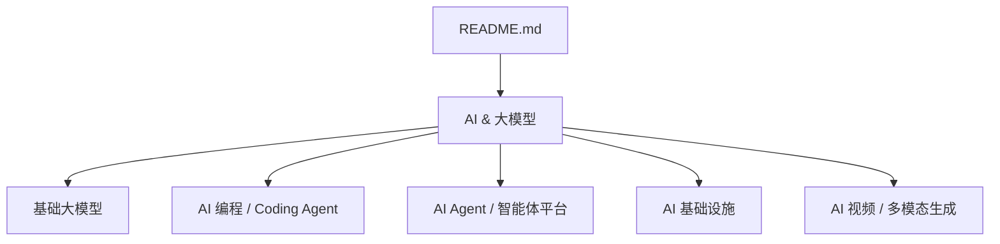
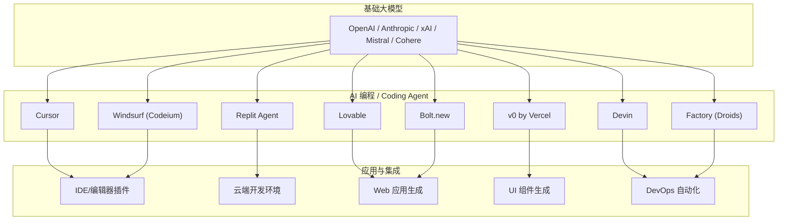
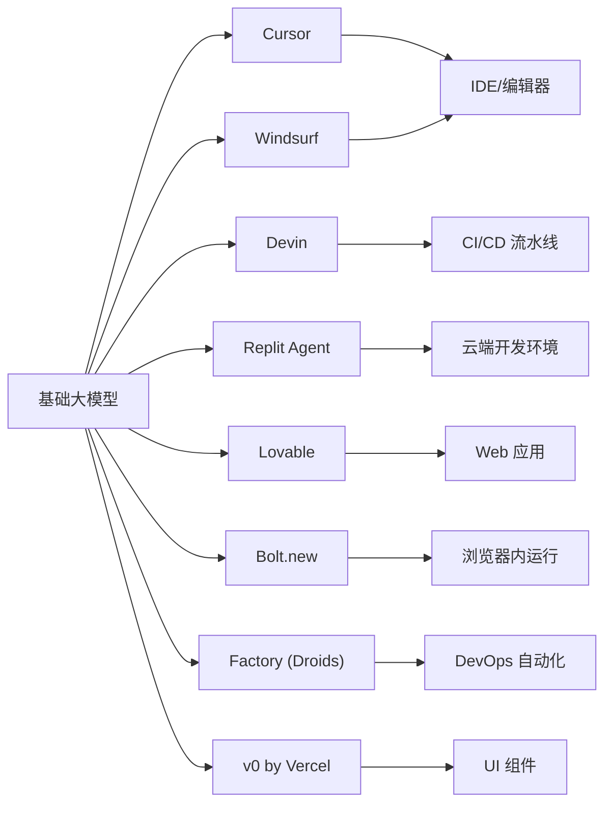

# AI 编程 / Coding Agent

<cite>
**本文引用的文件**
- [README.md](file://README.md)
</cite>

## 目录
1. [简介](#简介)
2. [项目结构](#项目结构)
3. [核心组件](#核心组件)
4. [架构总览](#架构总览)
5. [详细组件分析](#详细组件分析)
6. [依赖关系分析](#依赖关系分析)
7. [性能与工程实践](#性能与工程实践)
8. [故障排查指南](#故障排查指南)
9. [结论](#结论)
10. [附录](#附录)

## 简介
本文件基于仓库中的“AI & 大模型”章节，聚焦“AI 编程 / Coding Agent”赛道，系统梳理 Cursor、Devin、Replit、Lovable、Bolt.new、Codeium（Windsurf）、Factory、v0 by Vercel 等工具的技术特点、功能特性与市场定位。内容涵盖代码生成能力、智能补全、调试辅助、项目理解、工作流差异（对话式编程、自动化开发、代码重构）、集成方式、定价策略与目标用户群体对比，并讨论其对传统 IDE 的影响与未来趋势。

## 项目结构
仓库为单文件 README 清单型文档，按赛道组织公司条目。AI 编程相关条目集中在“AI 编程 / Coding Agent”小节，提供各产品的创始人、成立时间、核心产品、最新融资/估值与亮点信息，便于横向对比与快速检索。

图表来源
- [README.md:157-248](file://README.md#L157-L248)

章节来源
- [README.md:157-248](file://README.md#L157-L248)

## 核心组件
本节对 AI 编程八大代表性产品进行要点提炼，覆盖技术特点、功能特性、市场定位与关键指标。

- Anysphere / Cursor
  - 核心产品：Cursor AI 代码编辑器
  - 市场定位：面向开发者的高效 AI 编码体验，强调在 IDE 内深度上下文感知与协作
  - 关键指标：ARR 高速增长，估值洽谈至 $50B
  - 参考来源
    - [README.md:208-213](file://README.md#L208-L213)

- Cognition AI / Devin
  - 核心产品：Devin（自主 AI 软件工程师）
  - 市场定位：以“自主完成软件工程任务”为目标，强调端到端开发与交付
  - 关键指标：营收快速增长，估值 $26B
  - 参考来源
    - [README.md:214-219](file://README.md#L214-L219)

- Replit
  - 核心产品：Replit Agent（云端 AI 开发环境）
  - 市场定位：从在线 IDE 转型为 AI 驱动的开发平台，Agent 模式为核心
  - 关键指标：Agent 模式获成功，估值 $3B
  - 参考来源
    - [README.md:220-224](file://README.md#L220-L224)

- Lovable
  - 核心产品：AI 全栈 Web 应用生成
  - 市场定位：面向快速构建 Web 应用的 AI 生成平台
  - 关键指标：ARR 突破 $500M，估值 $1.8B
  - 参考来源
    - [README.md:225-230](file://README.md#L225-L230)

- Bolt.new
  - 核心产品：StackBlitz 旗下 AI Web 开发平台
  - 市场定位：浏览器内运行（WebContainers），强调即时可运行的前端/全栈体验
  - 关键指标：估值 $700M
  - 参考来源
    - [README.md:231-235](file://README.md#L231-L235)

- Codeium / Windsurf
  - 核心产品：Windsurf AI IDE
  - 市场定位：AI 增强的 IDE，后被 Cognition 收购整合至 Devin
  - 关键指标：曾估值 $1.25B
  - 参考来源
    - [README.md:236-239](file://README.md#L236-L239)

- Factory
  - 核心产品：AI 软件工程 Agent（Droids）
  - 市场定位：企业 DevOps 场景落地，强调工程化与流程自动化
  - 关键指标：估值 $120M+
  - 参考来源
    - [README.md:240-243](file://README.md#L240-L243)

- v0 by Vercel
  - 核心产品：AI UI 生成器
  - 市场定位：面向前端/UI 的组件级生成，与 Vercel 部署生态深度集成
  - 关键指标：日生成量超百万组件；母公司 Vercel 估值 $9.3B
  - 参考来源
    - [README.md:244-247](file://README.md#L244-L247)

章节来源
- [README.md:208-247](file://README.md#L208-L247)

## 架构总览
下图展示 AI 编程工具在“基础大模型—AI 编程—应用层”的层级关系，以及典型交互路径：用户通过自然语言或编辑界面发起需求，平台调用底层模型与工具链，输出代码、UI 或可运行应用。

图表来源
- [README.md:157-248](file://README.md#L157-L248)

## 详细组件分析
本节针对各工具的工作流、能力边界与集成点进行结构化说明，并结合仓库信息给出对比维度。

### Cursor（Anysphere）
- 技术特点
  - 编辑器内深度上下文感知，结合大模型实现智能补全、代码解释与重构建议
  - 强调团队协作与版本控制集成
- 工作流
  - 对话式编程：在编辑器中通过自然语言描述需求，模型生成/修改代码片段
  - 项目理解：读取当前项目结构与依赖，提供精准建议
- 集成方式
  - 作为 IDE 扩展/独立编辑器使用，与 Git、CI/CD 等工具链集成
- 目标用户
  - 个人开发者与团队，追求高效编码体验
- 市场定位
  - 高增长 SaaS，ARR 增速显著，估值洽谈至 $50B
- 参考来源
  - [README.md:208-213](file://README.md#L208-L213)

### Devin（Cognition AI）
- 技术特点
  - 以“自主软件工程师”为目标，具备端到端任务规划与执行能力
  - 强调自动化开发与交付闭环
- 工作流
  - 自动化开发：接收高层需求，自动拆解任务、编写代码、测试与部署
  - 调试辅助：自动定位问题、提出修复方案并验证
- 集成方式
  - 与企业 DevOps 平台、代码托管与发布流水线集成
- 目标用户
  - 企业研发团队，追求规模化自动化开发
- 市场定位
  - 估值 $26B，营收快速增长
- 参考来源
  - [README.md:214-219](file://README.md#L214-L219)

### Replit Agent
- 技术特点
  - 云端一体化开发环境，内置 AI Agent 能力
  - 支持多语言与实时协作
- 工作流
  - 对话式编程：在云端环境中通过对话驱动代码生成与迭代
  - 项目理解：云端沙箱加载项目上下文，快速原型与演示
- 集成方式
  - 浏览器访问，与云服务、数据库、第三方 API 集成
- 目标用户
  - 初学者、教育场景、快速原型与小型团队
- 市场定位
  - 从在线 IDE 转型 AI 平台，Agent 模式成功，估值 $3B
- 参考来源
  - [README.md:220-224](file://README.md#L220-L224)

### Lovable
- 技术特点
  - AI 全栈 Web 应用生成，强调从需求到可运行应用的端到端产出
- 工作流
  - 对话式编程：输入业务需求，自动生成前后端代码与配置
  - 项目理解：解析需求并映射到框架与组件结构
- 集成方式
  - 与部署平台、数据库与第三方服务集成
- 目标用户
  - 创业者、产品经理与前端/全栈开发者
- 市场定位
  - ARR 突破 $500M，估值 $1.8B
- 参考来源
  - [README.md:225-230](file://README.md#L225-L230)

### Bolt.new
- 技术特点
  - StackBlitz 旗下平台，基于 WebContainers 在浏览器内运行代码
  - 强调即时反馈与可运行性
- 工作流
  - 对话式编程：在浏览器中生成并运行 Web 应用
  - 项目理解：加载依赖与运行时环境，快速迭代
- 集成方式
  - 与前端框架、包管理与部署平台集成
- 目标用户
  - 前端开发者、教学与演示场景
- 市场定位
  - 估值 $700M
- 参考来源
  - [README.md:231-235](file://README.md#L231-L235)

### Codeium / Windsurf
- 技术特点
  - AI 增强的 IDE，提供智能补全、代码解释与重构
  - 被 Cognition 收购后整合至 Devin，形成协同效应
- 工作流
  - 编辑器内增强：在主流 IDE 中嵌入 AI 能力
  - 项目理解：索引代码库，提供跨文件建议
- 集成方式
  - 作为 IDE 插件/扩展，与版本控制系统集成
- 目标用户
  - 专业开发者与团队
- 市场定位
  - 曾估值 $1.25B，现并入 Devin 生态
- 参考来源
  - [README.md:236-239](file://README.md#L236-L239)

### Factory（Droids）
- 技术特点
  - 面向企业 DevOps 的 AI 工程 Agent，强调流程自动化与标准化
- 工作流
  - 自动化开发：编排 CI/CD、测试、发布与运维任务
  - 调试辅助：自动诊断与修复流水线问题
- 集成方式
  - 与企业平台（Jira、GitHub、Kubernetes 等）集成
- 目标用户
  - 企业研发与运维团队
- 市场定位
  - 估值 $120M+
- 参考来源
  - [README.md:240-243](file://README.md#L240-L243)

### v0 by Vercel
- 技术特点
  - AI UI 生成器，专注于组件级 UI 产出
  - 与 Vercel 部署生态深度集成，快速上线
- 工作流
  - 对话式编程：输入 UI 需求，生成组件代码与样式
  - 项目理解：基于设计系统与框架约定生成一致代码
- 集成方式
  - 与 Next.js、Vercel 部署、组件库集成
- 目标用户
  - 前端/UI 开发者与设计团队
- 市场定位
  - 日生成量超百万组件；母公司 Vercel 估值 $9.3B
- 参考来源
  - [README.md:244-247](file://README.md#L244-L247)

章节来源
- [README.md:208-247](file://README.md#L208-L247)

## 依赖关系分析
AI 编程工具普遍依赖基础大模型能力，并在上层提供不同形态的产品化能力（IDE 增强、云端环境、应用生成、UI 生成、DevOps 自动化）。下图展示主要依赖与集成点。

图表来源
- [README.md:157-248](file://README.md#L157-L248)

章节来源
- [README.md:157-248](file://README.md#L157-L248)

## 性能与工程实践
- 代码生成质量与速度
  - 依赖模型能力与上下文窗口；Cursor、Windsurf 在编辑器内提供低延迟补全
  - Devin、Factory 侧重端到端任务，需平衡质量与吞吐
- 项目理解与索引
  - 大型代码库需高效索引与增量更新；IDE 插件与云端环境各有优势
- 调试与测试
  - 自动定位问题与生成测试用例是关键；Devin、Factory 在企业场景中价值显著
- 集成与可扩展性
  - 与版本控制、CI/CD、云平台集成是标配；v0 与 Vercel 生态提升前端效率
- 安全与合规
  - 企业场景需关注代码外泄、许可证与审计；Factory、Devin 更贴近企业治理

[本节为通用指导，不直接分析具体文件]

## 故障排查指南
- 常见问题
  - 生成代码不符合预期：检查提示词与上下文；确认项目结构与依赖已正确加载
  - 调试失败：查看日志与错误堆栈；逐步缩小范围，使用最小可复现示例
  - 集成失败：核对 API 密钥、权限与网络策略；验证与第三方服务的兼容性
- 排错步骤
  - 隔离问题：在独立环境复现
  - 逐步验证：逐层检查模型调用、工具链与部署链路
  - 回归测试：确保修复不影响既有功能
- 参考来源
  - [README.md:208-247](file://README.md#L208-L247)

## 结论
AI 编程工具正在重塑软件开发工作流：从“人写代码”转向“人与 AI 协作”，再到“AI 主导的自动化开发”。Cursor、Windsurf 强化 IDE 体验；Devin、Factory 推动端到端自动化；Replit、Lovable、Bolt.new 降低门槛并加速原型；v0 专注 UI 生成并与部署生态打通。这些工具对传统 IDE 形成冲击，促使 IDE 向“AI 原生”演进，同时催生新的平台与生态。未来，随着模型能力提升与工程化完善，AI 编程将从“辅助”走向“主导”，改变研发组织与生产方式。

[本节为总结性内容，不直接分析具体文件]

## 附录
- 市场与融资概览（节选）
  - Cursor：ARR 高速增长，估值洽谈至 $50B
  - Devin：估值 $26B，营收快速增长
  - Replit：Agent 模式成功，估值 $3B
  - Lovable：ARR 突破 $500M，估值 $1.8B
  - Bolt.new：估值 $700M
  - Windsurf（Codeium）：曾估值 $1.25B，现整合至 Devin
  - Factory：估值 $120M+
  - v0 by Vercel：日生成量超百万组件；母公司 Vercel 估值 $9.3B
- 参考来源
  - [README.md:208-247](file://README.md#L208-L247)