# AI 视频 / 多模态生成

<cite>
**本文引用的文件**
- [README.md](file://README.md)
</cite>

## 目录
1. [引言](#引言)
2. [项目结构](#项目结构)
3. [核心组件](#核心组件)
4. [架构总览](#架构总览)
5. [详细组件分析](#详细组件分析)
6. [依赖关系分析](#依赖关系分析)
7. [性能与质量考量](#性能与质量考量)
8. [故障排查指南](#故障排查指南)
9. [结论](#结论)
10. [附录](#附录)

## 引言
本文件聚焦 AI 视频与多模态生成领域，围绕 Runway、Pika、ElevenLabs、Luma AI、Suno、Stability AI、HeyGen、Synthesia 等公司在视频生成、音频合成、图像创作等方面的技术突破与应用落地进行系统梳理。内容涵盖各公司核心能力、生成质量、控制力、典型应用场景，以及文本到视频、语音克隆、数字人、音乐生成等多模态技术的最新进展。同时提供平台使用方式、API 接口、付费模式与版权政策的参考要点，并讨论多模态 AI 对广告、教育、娱乐等内容创作行业的颠覆性影响与前景。

## 项目结构
本项目仓库以单一文档 README.md 为主，按赛道组织初创公司信息，其中“AI 视频 / 多模态生成”小节集中收录了目标公司的基本信息（创始人、成立时间、核心产品、融资/估值、亮点）。该文档为后续深入分析与扩展提供了权威索引。

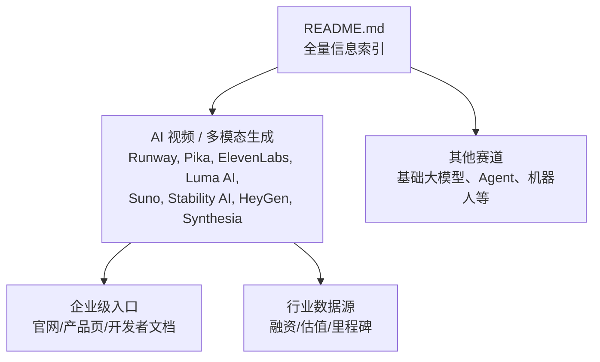

图表来源
- [README.md:325-369](file://README.md#L325-L369)

章节来源
- [README.md:1-100](file://README.md#L1-L100)
- [README.md:325-369](file://README.md#L325-L369)

## 核心组件
本节从“能力—质量—控制—场景”四个维度，概述各公司在多模态生成领域的关键能力与定位。

- Runway
  - 能力：视频生成（Gen-3/4），好莱坞采用率高，与影视公司合作训练专属模型
  - 质量：面向专业影视工作流，强调可控性与一致性
  - 控制：支持提示词、镜头运动、风格化等参数调节
  - 场景：影视预可视化、广告素材、短视频批量生产

- Pika
  - 能力：视频生成（Pika 系列）
  - 质量：产品体验领先，易用性强
  - 控制：交互友好，适合快速原型与创意探索
  - 场景：社交媒体内容、营销短片、创意实验

- ElevenLabs
  - 能力：AI 语音生成、音乐生成
  - 质量：高保真语音与音乐，ARR 高速增长
  - 控制：音色克隆、情感与节奏控制
  - 场景：配音、有声书、播客、音乐制作辅助

- Luma AI
  - 能力：Dream Machine 视频生成，DiT 模型先驱
  - 质量：与 Sora 同级别竞争者
  - 控制：文本到视频、图像到视频，强调物理一致性与长时连贯
  - 场景：广告、电商展示、虚拟制片

- Suno
  - 能力：AI 音乐生成
  - 质量：音乐生成事实标准之一
  - 控制：曲风、歌词、编曲、时长等参数
  - 场景：广告配乐、短视频背景音乐、独立音乐创作

- Stability AI
  - 能力：开源图像与视频生成（Stable Diffusion、Stable Video）
  - 质量：开源生态丰富，社区驱动迭代
  - 控制：开源权重与插件体系，可本地部署与二次开发
  - 场景：创作者工具、企业定制、研究实验

- HeyGen
  - 能力：AI 数字人视频生成
  - 质量：B2B 数字人事实标准，增长迅速
  - 控制：口型同步、多语言、品牌化形象
  - 场景：企业培训、营销视频、客服播报

- Synthesia
  - 能力：AI 数字人视频平台
  - 质量：企业培训视频龙头，ARR 突破 $100M
  - 控制：模板化生产、多语种、合规审核
  - 场景：企业内部培训、合规宣导、全球化内容分发

章节来源
- [README.md:325-369](file://README.md#L325-L369)

## 架构总览
多模态生成的通用架构通常包含以下层次：输入层（文本/图像/音频）、模型层（扩散/Transformer/DiT/多模态对齐）、渲染与后处理层（视频编码、音画同步、质量控制）、应用与服务层（Web/移动端/SDK/API/工作流集成）。不同公司侧重不同环节：例如 Runway/Pika/Luma 偏重视频生成与渲染；ElevenLabs/Suno 偏重音频与音乐；HeyGen/Synthesia 偏重数字人工作流与企业级交付。

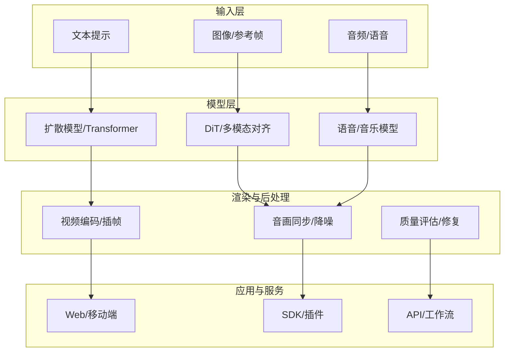

[此图为概念性架构图，不直接映射具体源码文件]

## 详细组件分析

### Runway（视频生成）
- 技术要点：Gen-3/4 视频生成，面向专业影视工作流，强调可控性与一致性；与影视公司合作训练专属模型
- 生成质量：高保真、镜头运动自然、风格可控
- 控制能力：提示词、参考图、镜头参数、风格预设
- 应用场景：影视预可视化、广告素材、短视频批量生产
- 使用方式：Web 平台、插件与工作流集成、企业 API（需参考官方开发者文档）
- 付费模式：订阅制与按量计费（以官方定价为准）
- 版权政策：遵循平台条款，商用需关注授权范围（以官方协议为准）

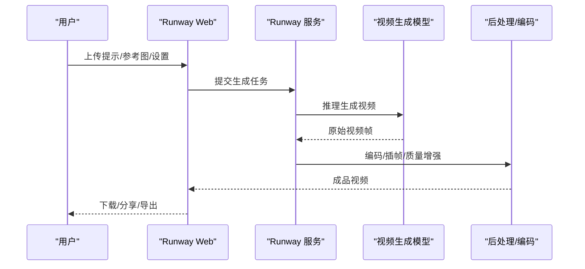

图表来源
- [README.md:327-332](file://README.md#L327-L332)

章节来源
- [README.md:327-332](file://README.md#L327-L332)

### Pika（视频生成）
- 技术要点：Pika 系列视频生成，产品体验领先，易于上手
- 生成质量：创意表达强，适合快速原型
- 控制能力：提示词、风格、时长、分辨率等
- 应用场景：社交媒体内容、营销短片、创意实验
- 使用方式：Web 平台、API（参考官方开发者文档）
- 付费模式：订阅/按量（以官方定价为准）
- 版权政策：遵循平台条款，商用需确认授权范围

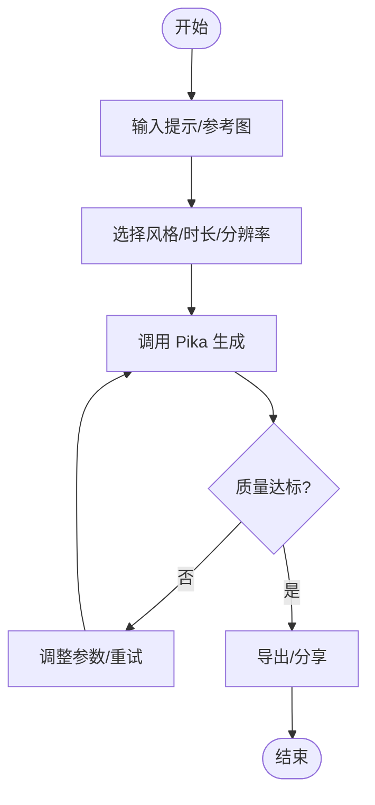

图表来源
- [README.md:333-337](file://README.md#L333-L337)

章节来源
- [README.md:333-337](file://README.md#L333-L337)

### ElevenLabs（语音/音乐）
- 技术要点：AI 语音生成与音乐生成，高保真与情感控制
- 生成质量：语音自然度与音乐表现力强
- 控制能力：音色克隆、情感、节奏、曲风
- 应用场景：配音、有声书、播客、音乐制作辅助
- 使用方式：Web/SDK/API（参考官方开发者文档）
- 付费模式：订阅/按量（以官方定价为准）
- 版权政策：遵循平台条款，商用需确认授权范围

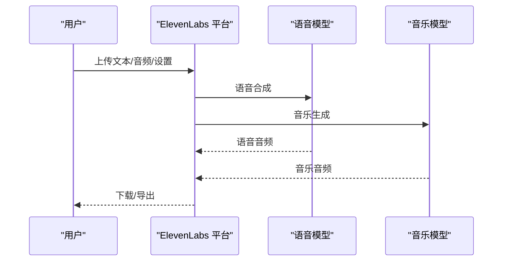

图表来源
- [README.md:339-343](file://README.md#L339-L343)

章节来源
- [README.md:339-343](file://README.md#L339-L343)

### Luma AI（视频生成）
- 技术要点：Dream Machine 视频生成，DiT 模型先驱，与 Sora 竞争
- 生成质量：物理一致性与长时连贯性较强
- 控制能力：文本到视频、图像到视频、镜头控制
- 应用场景：广告、电商展示、虚拟制片
- 使用方式：Web/SDK/API（参考官方开发者文档）
- 付费模式：订阅/按量（以官方定价为准）
- 版权政策：遵循平台条款，商用需确认授权范围

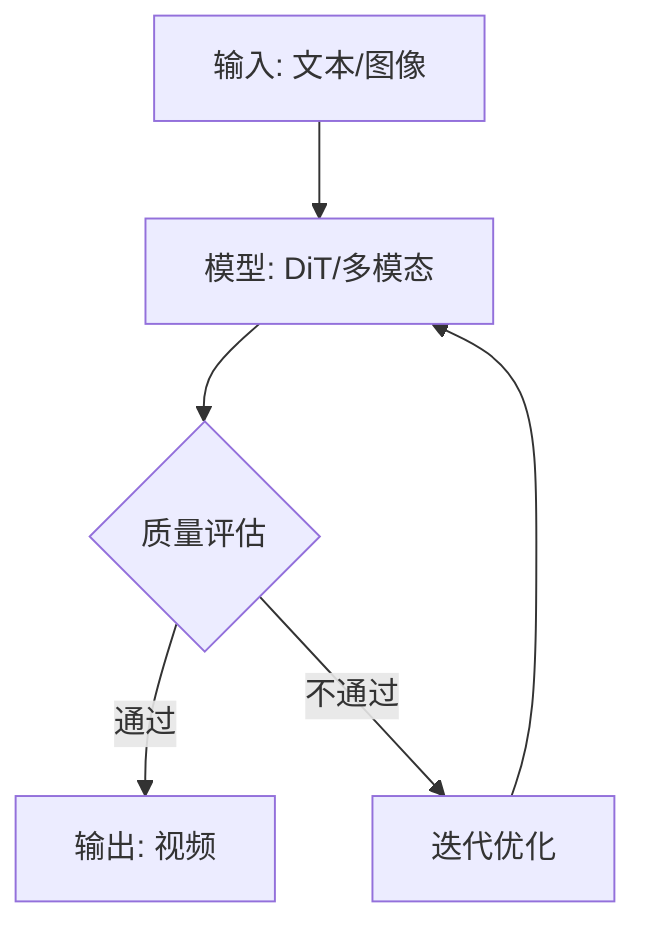

图表来源
- [README.md:345-348](file://README.md#L345-L348)

章节来源
- [README.md:345-348](file://README.md#L345-L348)

### Suno（音乐生成）
- 技术要点：AI 音乐生成，事实标准之一
- 生成质量：旋律、和声、编曲表现优秀
- 控制能力：曲风、歌词、时长、情绪
- 应用场景：广告配乐、短视频背景音乐、独立音乐创作
- 使用方式：Web/SDK/API（参考官方开发者文档）
- 付费模式：订阅/按量（以官方定价为准）
- 版权政策：遵循平台条款，商用需确认授权范围

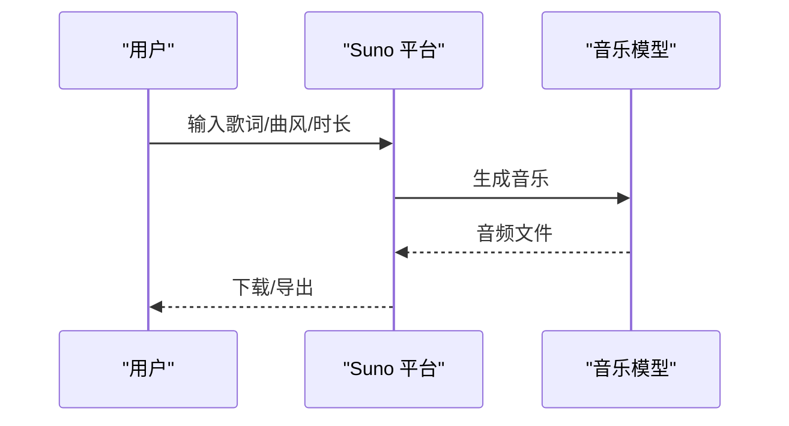

图表来源
- [README.md:350-354](file://README.md#L350-L354)

章节来源
- [README.md:350-354](file://README.md#L350-L354)

### Stability AI（图像/视频开源）
- 技术要点：Stable Diffusion、Stable Video，开源生态强大
- 生成质量：社区驱动迭代，质量持续提升
- 控制能力：开源权重、插件、LoRA、ControlNet 等
- 应用场景：创作者工具、企业定制、研究实验
- 使用方式：本地部署、云端 API、插件生态（参考官方文档）
- 付费模式：开源免费/商业许可（以官方协议为准）
- 版权政策：开源协议与商业许可并存，需遵循相应条款

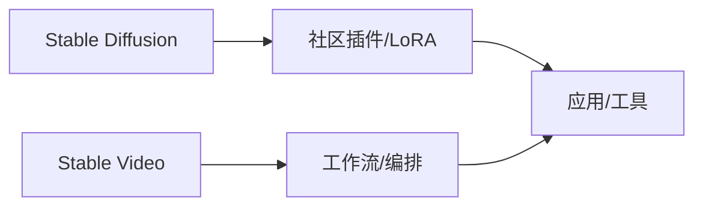

图表来源
- [README.md:356-359](file://README.md#L356-L359)

章节来源
- [README.md:356-359](file://README.md#L356-L359)

### HeyGen（数字人视频）
- 技术要点：AI 数字人视频生成，B2B 事实标准
- 生成质量：口型同步、多语言、品牌化形象
- 控制能力：模板化生产、合规审核、多语种
- 应用场景：企业培训、营销视频、客服播报
- 使用方式：Web/SDK/API（参考官方开发者文档）
- 付费模式：订阅/按量（以官方定价为准）
- 版权政策：遵循平台条款，商用需确认授权范围

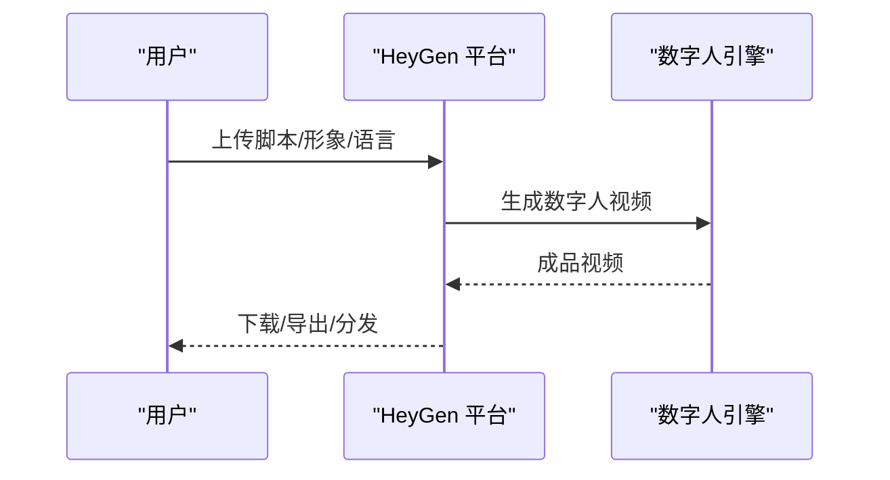

图表来源
- [README.md:361-363](file://README.md#L361-L363)

章节来源
- [README.md:361-363](file://README.md#L361-L363)

### Synthesia（数字人视频平台）
- 技术要点：AI 数字人视频平台，企业培训视频龙头
- 生成质量：模板化、多语种、合规审核
- 控制能力：品牌化形象、流程化生产
- 应用场景：企业内部培训、合规宣导、全球化内容分发
- 使用方式：Web/SDK/API（参考官方开发者文档）
- 付费模式：订阅/按量（以官方定价为准）
- 版权政策：遵循平台条款，商用需确认授权范围

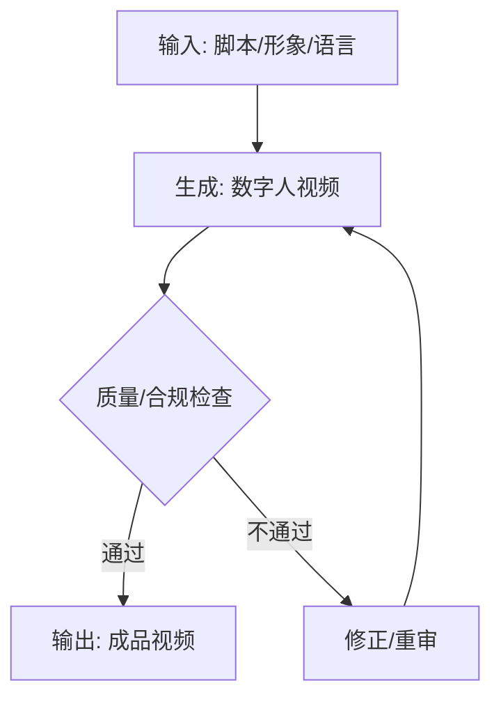

图表来源
- [README.md:365-368](file://README.md#L365-L368)

章节来源
- [README.md:365-368](file://README.md#L365-L368)

## 依赖关系分析
多模态生成平台的依赖关系通常包括：
- 模型依赖：扩散模型、Transformer、DiT、语音/音乐模型
- 基础设施：GPU/算力集群、存储与CDN、推理优化
- 集成依赖：Web/移动端前端、SDK/插件、API 网关、工作流编排
- 业务依赖：版权与合规、内容审核、品牌资产库

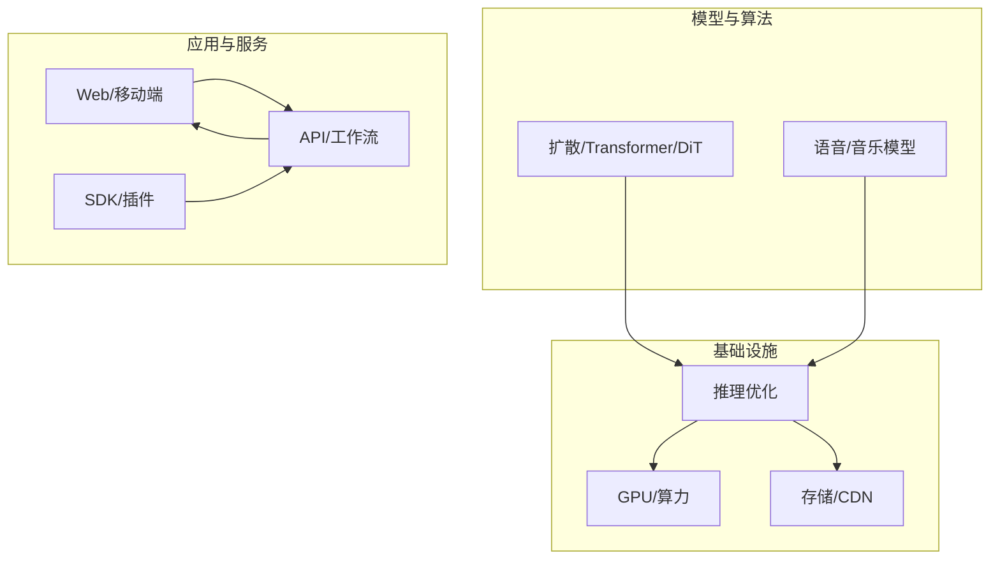

[此图为概念性依赖图，不直接映射具体源码文件]

## 性能与质量考量
- 生成质量：分辨率、帧率、物理一致性、音画同步、噪声与伪影控制
- 控制能力：提示词稳定性、风格迁移、镜头运动、角色一致性
- 性能指标：首帧延迟、端到端时延、并发吞吐、成本/秒
- 优化方向：模型蒸馏、量化、缓存与复用、批处理与流水线并行、边缘推理
- 评估方法：主观评测（专家打分）、客观指标（PSNR/SSIM/FID/ASR/WER）、A/B 测试

[本节为通用指导，不直接分析具体文件]

## 故障排查指南
- 常见问题
  - 生成失败：检查输入格式、提示词有效性、资源配额
  - 质量不稳定：调整参数、增加参考素材、启用后处理
  - 音画不同步：校准时间轴、检查采样率与帧率匹配
  - 版权风险：确认素材来源与授权范围，避免侵权
- 排查步骤
  - 日志采集：记录请求参数、模型版本、错误码
  - 复现验证：最小化用例、隔离变量
  - 回滚策略：切换模型版本或降级方案
  - 监控告警：设置阈值与自动通知

[本节为通用指导，不直接分析具体文件]

## 结论
AI 视频与多模态生成正在重塑内容创作产业链。Runway、Pika、Luma AI 在视频生成方面持续突破；ElevenLabs、Suno 在语音与音乐生成上建立事实标准；Stability AI 以开源生态推动普惠创新；HeyGen、Synthesia 在企业级数字人视频领域实现规模化落地。未来，随着模型能力、控制精度与工程效率的进一步提升，广告、教育、娱乐等行业将迎来更高效、更个性化的内容生产范式。

[本节为总结性内容，不直接分析具体文件]

## 附录
- 使用方式与 API：各公司均提供 Web 平台与开发者文档，建议访问官网获取最新接入指南
- 付费模式：多为订阅制与按量计费，具体以官方定价为准
- 版权政策：遵循平台条款，商用需确认授权范围与使用限制
- 数据来源：本文件基于仓库 README.md 中“AI 视频 / 多模态生成”小节的公开信息进行整理

章节来源
- [README.md:325-369](file://README.md#L325-L369)