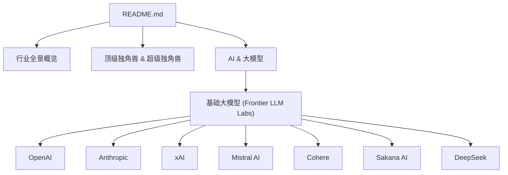
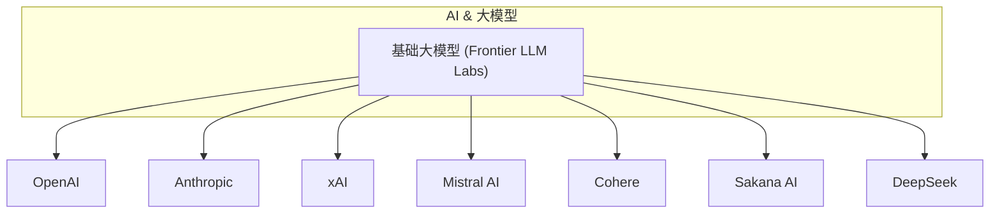
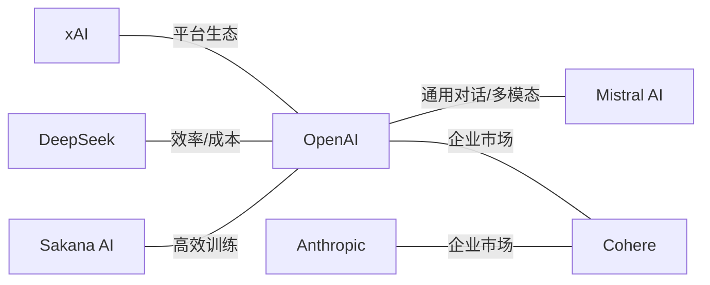

# 基础大模型

<cite>
**本文引用的文件**
- [README.md](file://README.md)
</cite>

## 目录
1. [简介](#简介)
2. [项目结构](#项目结构)
3. [核心组件](#核心组件)
4. [架构总览](#架构总览)
5. [详细组件分析](#详细组件分析)
6. [依赖关系分析](#依赖关系分析)
7. [性能与商业化考量](#性能与商业化考量)
8. [故障排查指南](#故障排查指南)
9. [结论](#结论)
10. [附录](#附录)

## 简介
本文件基于仓库中的“基础大模型”专题内容，系统梳理 OpenAI、Anthropic、xAI、Mistral AI、Cohere、Sakana AI、DeepSeek 等前沿大模型实验室的技术路线、产品矩阵、市场竞争格局与发展里程碑。重点覆盖：
- 各公司定位差异（开源 vs 闭源、安全优先 vs 性能优先）
- 融资规模与估值变化
- 核心模型与产品（如 GPT-5、Claude 4.5、Grok、Mistral Large、Command 系列等）
- 企业应用场景与 API 特点（以仓库信息为依据）
- AGI 竞赛中的角色与竞争态势

## 项目结构
仓库为单一文档型项目，核心内容为一份持续更新的精选初创公司清单，其中“基础大模型”章节集中呈现了目标公司的关键信息，包括创始人、成立时间、核心产品、最新融资与亮点等。

图表来源
- [README.md:157-201](file://README.md#L157-L201)

章节来源
- [README.md:157-201](file://README.md#L157-L201)

## 核心组件
本节聚焦“基础大模型”子项下的七家前沿实验室，提取其关键要素（创始人、成立年份、核心产品、最新融资/估值、亮点），并据此归纳技术路线与商业策略。

- OpenAI
  - 创始人：Sam Altman 等；成立：2015
  - 核心产品：ChatGPT、GPT-5、o3、Sora、Operator
  - 最新融资：2025 年 $110B 轮（$730B 估值）；后续 $852B
  - 亮点：已成为史上最大初创公司之一，估值超越传统科技巨头

- Anthropic
  - 创始人：Dario & Daniela Amodei；成立：2021
  - 核心产品：Claude 4.5 / Opus、Claude Code
  - 最新融资：2026 年 5 月 $65B Series H（$965B 估值）
  - 亮点：以 "AI Safety" 为核心定位；企业市场份额超 OpenAI；ARR 增长最快 AI 公司之一

- xAI
  - 创始人：Elon Musk；成立：2023
  - 核心产品：Grok 系列、Grok Code
  - 亮点：Memphis 超算集群（20 万张 GPU）；X 平台流量入口；与 SpaceX 合并后估值达 $1.58T

- Mistral AI
  - 创始人：Arthur Mensch 等；成立：2023；总部：巴黎
  - 核心产品：Mistral Large、Mistral Small、Le Chat
  - 最新融资：2026 年估值 $13.7B
  - 亮点：欧洲 AI 龙头；开源+商业双轨；多模型路线

- Cohere
  - 创始人：Aidan Gomez 等；成立：2019
  - 核心产品：Command 系列、Embed、North 平台
  - 最新融资：2025 年估值 $6.8B
  - 亮点：Transformer 论文作者创办；专注企业部署；多云中立（AWS/Azure/Oracle）

- Sakana AI
  - 创始人：David Ha、Lionel Jones；成立：2023；总部：东京
  - 核心产品：日语优化大模型、EfficientLLM
  - 最新融资：2025 年 11 月 $135M Series B（$2.65B 估值）
  - 亮点：日本 AI 国家队代表；"模型合并"等高效训练方法研究领先

- DeepSeek
  - 创始人：梁文锋；成立：2023；总部：杭州
  - 核心产品：DeepSeek-V3、DeepSeek-R1、DeepSeek-V4
  - 最新融资：2026 年 5 月首次外部融资，目标从 $300M/$10B 升至 $7B/$50B
  - 亮点：R1 以极低成本震动全球；量化巨头 HighFlyer 背书；人才留存压力驱动首次融资

章节来源
- [README.md:157-201](file://README.md#L157-L201)

## 架构总览
下图展示“基础大模型”板块在公司维度上的组织关系，以及它们与整体“AI & 大模型”分类的隶属关系。

图表来源
- [README.md:157-201](file://README.md#L157-L201)

## 详细组件分析
### OpenAI
- 技术路线与产品矩阵：围绕 GPT-5、o3、Sora、Operator 等构建通用能力与多模态生态，强调 AGI 目标。
- 商业化模式：通过 API 与平台化服务面向企业与开发者，结合硬件与生态合作推进规模化落地。
- 竞争地位：估值与融资规模处于行业前列，成为资本与技术高地。

章节来源
- [README.md:157-166](file://README.md#L157-L166)

### Anthropic
- 技术路线与安全优先：以 "AI Safety" 为核心定位，强调可控性与合规性，契合企业级需求。
- 产品矩阵：Claude 4.5 / Opus、Claude Code 等，覆盖对话、编码与企业场景。
- 商业化表现：企业市场份额超 OpenAI，ARR 高速增长，体现企业市场认可度。

章节来源
- [README.md:167-172](file://README.md#L167-L172)

### xAI
- 基础设施与生态整合：Memphis 超算集群提供算力支撑，结合 X 平台流量入口形成闭环。
- 产品矩阵：Grok 系列、Grok Code，面向通用对话与代码生成。
- 资本与组织：与 SpaceX 合并后实体规模显著扩大，估值跃升。

章节来源
- [README.md:173-177](file://README.md#L173-L177)

### Mistral AI
- 开源+商业双轨：在开源生态中建立影响力，同时推出 Le Chat 等产品实现商业化。
- 多模型路线：Mistral Large、Mistral Small 覆盖不同性能与成本需求。
- 区域优势：欧洲 AI 龙头，具备本地化与合规优势。

章节来源
- [README.md:178-183](file://README.md#L178-L183)

### Cohere
- 企业级定位：专注企业部署，提供 Command 系列、Embed、North 平台，强调多云中立。
- 技术背景：由 Transformer 论文作者创办，具备深厚学术与工程积累。
- 商业化策略：面向企业客户的多云部署方案，降低迁移与锁定风险。

章节来源
- [README.md:184-189](file://README.md#L184-L189)

### Sakana AI
- 研究方向：日语优化大模型、EfficientLLM，关注高效训练方法与领域适配。
- 国家队角色：日本 AI 国家队代表，获得机构投资支持。
- 创新点："模型合并"等高效训练方法研究领先，提升资源利用效率。

章节来源
- [README.md:190-195](file://README.md#L190-L195)

### DeepSeek
- 成本与效率：R1 以极低成本震动全球，体现训练与推理的效率优势。
- 资本与背书：首次外部融资目标大幅上调至 $7B/$50B，获量化巨头 HighFlyer 背书。
- 人才与扩张：人才留存压力驱动融资，推动研发与商业化加速。

章节来源
- [README.md:196-201](file://README.md#L196-L201)

## 依赖关系分析
- 公司与赛道依赖：上述公司均隶属于“AI & 大模型”下的“基础大模型”分类，共享算力、数据与人才等上游资源。
- 生态耦合：部分公司（如 xAI）与平台（X）、硬件（GPU 集群）形成强耦合；企业级公司（如 Cohere）依赖多云基础设施。
- 竞争关系：在通用对话、代码生成、多模态等领域存在直接竞争；在企业市场，Anthropic 与 OpenAI 的竞争尤为突出。

图表来源
- [README.md:157-201](file://README.md#L157-L201)

章节来源
- [README.md:157-201](file://README.md#L157-L201)

## 性能与商业化考量
- 性能维度：通用对话、代码生成、多模态能力是衡量模型竞争力的关键指标；开源与闭源路径各有优劣。
- 商业化维度：企业市场更看重安全性、合规性与可部署性；消费级市场更关注体验与生态。
- 成本与效率：高效训练与推理（如 Sakana AI 的研究）对成本控制至关重要；DeepSeek 的低成本实践具有示范意义。
- 生态与平台：平台化与生态整合（如 xAI 与 X 平台）有助于获取流量与数据反馈。

[本节为概念性讨论，不直接分析具体文件]

## 故障排查指南
- 数据更新：由于本仓库为动态更新的清单，建议定期核对“最新融资”与“估值”等信息的时效性。
- 来源验证：所有条目均来自公开报道与权威来源，建议在引用时附上对应链接或出处。
- 版本差异：不同时间点的融资与估值可能发生变化，请以最新发布为准。

[本节为通用指导，不直接分析具体文件]

## 结论
- 竞争格局：OpenAI、Anthropic、xAI 占据头部位置，Mistral AI、Cohere、Sakana AI、DeepSeek 分别在开源、企业、高效训练与低成本方向形成差异化优势。
- 技术路线：开源与闭源并行，安全优先与性能优先并存；企业市场更重视安全与合规。
- 商业化路径：API 与平台化服务为主，结合生态与平台整合提升竞争力。
- 未来趋势：AGI 竞赛将持续推动技术迭代与资本投入，企业应用与多模态能力将成为关键增长点。

[本节为总结性内容，不直接分析具体文件]

## 附录
- 数据来源：详见仓库“关键数据来源”章节，涵盖 Forbes AI 50、CB Insights、Crunchbase、PitchBook、The Information、TechCrunch、Y Combinator、Sacra、Contrary Research、AI Funding Tracker、New Market Pitch、Dealroom、Recode China AI 等权威来源。

章节来源
- [README.md:870-889](file://README.md#L870-L889)