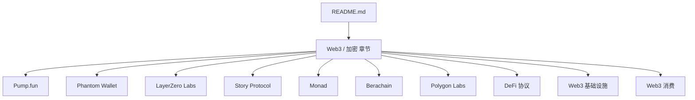
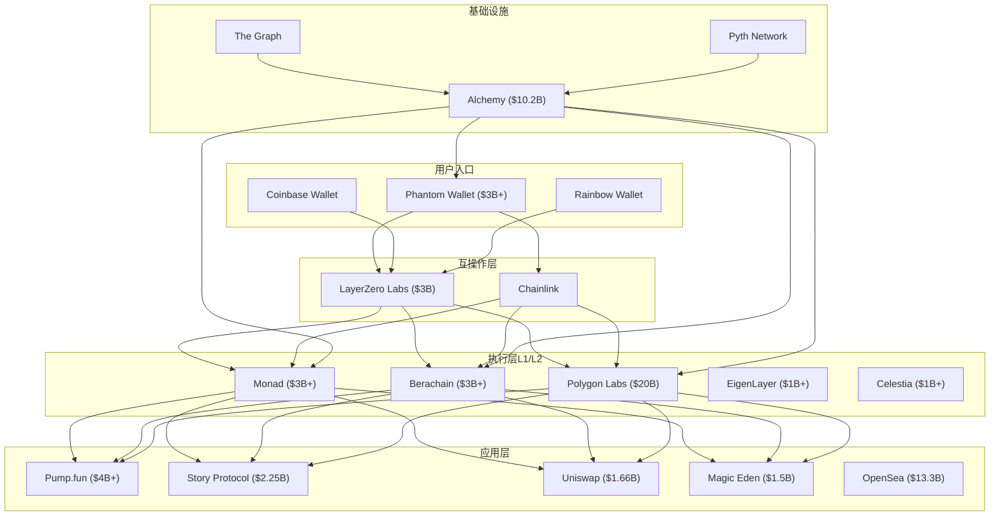
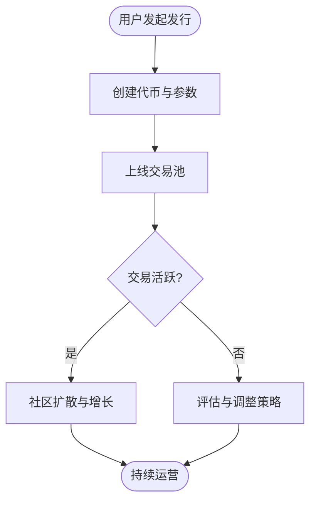
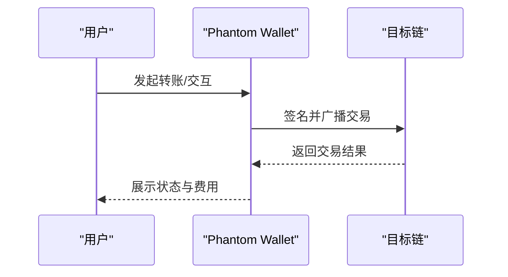
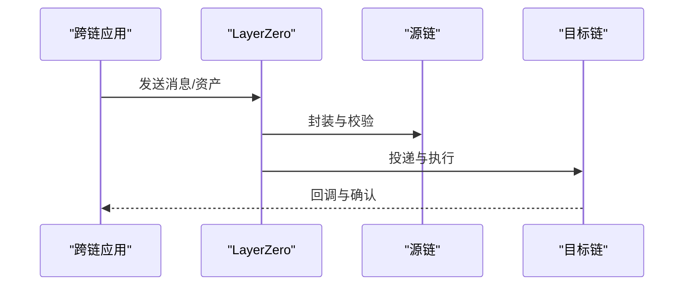
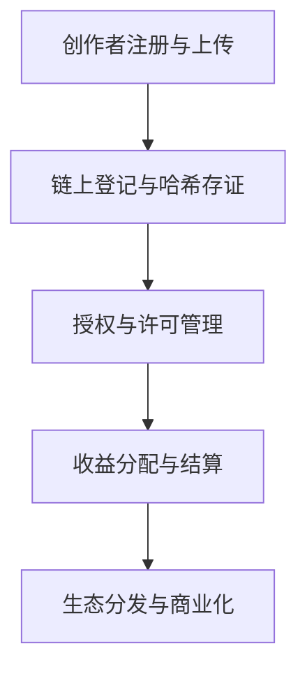
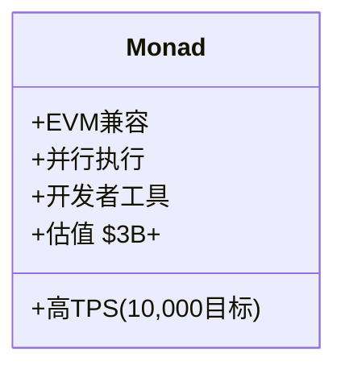
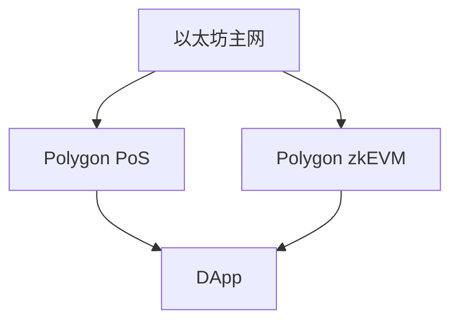
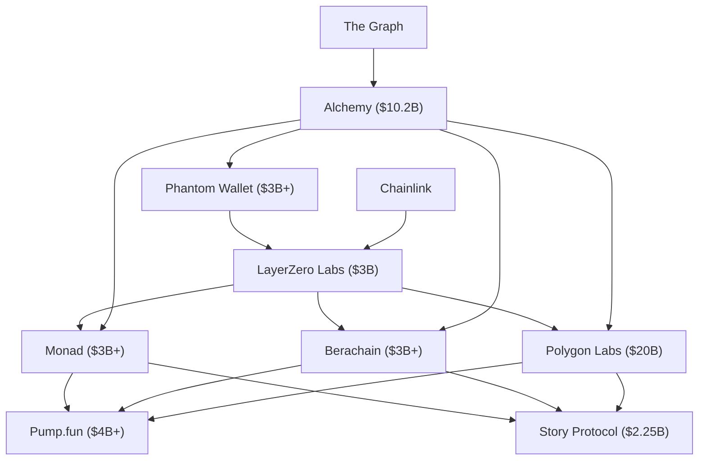

# Web3 / 加密

<cite>
**本文引用的文件**
- [README.md](file://README.md)
</cite>

## 更新摘要
**变更内容**
- 更新了 Web3/加密 章节的完整内容，基于最新的初创公司数据库
- 新增了更多头部 crypto 项目的详细信息和估值数据
- 扩展了 DeFi 协议、Web3 基础设施和消费级应用分类
- 增强了各项目的技术架构和市场定位分析

## 目录
1. [引言](#引言)
2. [项目结构](#项目结构)
3. [核心组件](#核心组件)
4. [架构总览](#架构总览)
5. [详细组件分析](#详细组件分析)
6. [依赖关系分析](#依赖关系分析)
7. [性能与可扩展性考量](#性能与可扩展性考量)
8. [故障排查指南](#故障排查指南)
9. [结论](#结论)
10. [附录](#附录)

## 引言
本文件基于仓库中的精选初创公司清单，聚焦 Web3/加密赛道，系统梳理 Pump.fun、Phantom Wallet、LayerZero Labs、Story Protocol、Monad、Berachain、Polygon Labs 等头部项目的定位、技术方向与市场地位。文档同时覆盖 DeFi 协议、NFT 平台、区块链基础设施等不同子领域的发展现状，并给出投资风险提示与合规建议，帮助读者在快速变化的加密生态中做出更稳健的决策。

**更新** 本节已根据最新的 2025-2026 年加密市场数据进行更新，包含更多头部项目和最新融资信息。

## 项目结构
仓库以单文件 README 的形式组织内容，按赛道分类汇总各领域的代表性公司与关键信息。Web3/加密部分位于"🌐 Web3 / 加密"章节，涵盖 Memecoin 发行平台、多链钱包、跨链互操作、IP 上链、高性能 L1、流动性证明以及以太坊扩容方案等主题。

**图表来源**
- [README.md:1864-2063](file://README.md#L1864-L2063)

**章节来源**
- [README.md:1864-2063](file://README.md#L1864-L2063)

## 核心组件
本节对 Web3/加密的关键组件进行概览式说明，便于理解各项目在生态中的角色与价值主张。

### 头部项目概览
- **Pump.fun**：Solana 上的 memecoin 发行平台，提供低门槛、标准化的代币创建与交易体验，成为该赛道的现象级产品，估值达 $4B+。
- **Phantom Wallet**：面向 Solana 与 EVM 的多链钱包，强调易用性与多链资产统一管理，是 Solana 生态用户的首选入口之一，估值 $3B+。
- **LayerZero Labs**：全链互操作协议，致力于在不同链之间实现安全、高效的资产与信息传递，推动跨链应用发展，估值 $3B。
- **Story Protocol**：将知识产权（IP）资产上链的基础设施，探索数字内容与版权管理的链上化路径，估值 $2.25B。
- **Monad**：高性能 L1 公链，兼容 EVM 并引入并行执行能力，追求高吞吐与低延迟，估值 $3B+。
- **Berachain**：采用"流动性证明"机制的创新 L1，试图通过激励流动性的方式提升网络活跃度与资本效率，估值 $3B+。
- **Polygon Labs**：以太坊扩容与互操作的重要参与者，提供 PoS 与 zkEVM 等解决方案，助力以太坊生态扩展，估值 $20B（2022 高点）。

### DeFi 协议
- **Uniswap Labs**：DEX 交易量龙头，估值 $1.66B
- **MakerDAO/Sky**：去中心化稳定币先驱，品牌升级为 Sky
- **dYdX**：去中心化衍生品交易所，v4 完全去中心化验证
- **Aave**：DeFi 借贷龙头，推出 GHO 稳定币
- **Ondo Finance**：RWA（现实资产）代币化赛道龙头

### Web3 基础设施
- **Chainlink**：预言机事实标准，CCIP 跨链互操作性
- **Alchemy**：Web3 开发者平台龙头，"AWS for Web3"，估值 $10.2B
- **The Graph**：区块链索引协议，DeFi 索引基础设施
- **Pyth Network**：高频数据预言机，机构数据接入

**章节来源**
- [README.md:1868-2063](file://README.md#L1868-L2063)

## 架构总览
下图从生态视角展示上述项目之间的关系与分工：钱包作为用户入口，跨链协议连接不同链，L1/L2 提供执行层与扩容能力，Memecoin 平台与 IP 上链则分别代表消费级应用与内容资产化的方向。

**图表来源**
- [README.md:1868-2063](file://README.md#L1868-L2063)

## 详细组件分析

### Pump.fun（Memecoin 发行平台）
- **定位与价值**：为创作者与社区提供一键发行 memecoin 的能力，降低进入门槛，加速实验型代币的涌现与传播，已成为 Solana 上 memecoin 事实标准。
- **生态影响**：在 Solana 生态形成事实标准，带动相关工具、DEX 与社交传播链条的增长，估值达到 $4B+。
- **风险与治理**：需关注代币质量、市场操纵与合规边界；平台应加强风控与信息披露。
- **可优化点**：引入更完善的 KYC/AML 流程、反洗钱监控、代币生命周期管理与透明度指标。

**图表来源**
- [README.md:1868-1871](file://README.md#L1868-L1871)

**章节来源**
- [README.md:1868-1871](file://README.md#L1868-L1871)

### Phantom Wallet（多链钱包）
- **定位与价值**：聚合多链资产管理与交互，提升用户体验，降低跨链使用门槛，是 Solana 用户首选钱包。
- **生态影响**：作为入口层，驱动 Solana 及 EVM 生态的应用采用与资金流转，估值 $3B+。
- **风险与治理**：私钥安全、钓鱼攻击、跨链桥接风险；需强化安全审计与用户教育。
- **可优化点**：内置安全检测、多签与恢复机制、链上行为分析与风险提示。

**图表来源**
- [README.md:1872-1875](file://README.md#L1872-L1875)

**章节来源**
- [README.md:1872-1875](file://README.md#L1872-L1875)

### LayerZero Labs（跨链互操作协议）
- **定位与价值**：提供统一的消息与资产传输抽象，简化跨链开发，提升互操作性，是跨链事实标准。
- **生态影响**：连接多条链与应用，促进跨链 DApp 与基础设施的繁荣，估值 $3B，2025 年 ZRO 代币上线。
- **风险与治理**：中继与验证者模型的安全性、密钥管理、升级与治理机制。
- **可优化点**：增强可观测性、多路由冗余、形式化验证与漏洞赏金计划。

**图表来源**
- [README.md:1876-1880](file://README.md#L1876-L1880)

**章节来源**
- [README.md:1876-1880](file://README.md#L1876-L1880)

### Story Protocol（IP 上链）
- **定位与价值**：将知识产权资产数字化与链上化，探索版权确权、授权与分润的新模式，估值 $2.25B。
- **生态影响**：为内容创作者与娱乐产业提供新的商业化工具，推动数字内容生态演进，与韩国娱乐巨头合作。
- **风险与治理**：法律合规、版权争议、数据隐私与可访问性。
- **可优化点**：标准化元数据、智能合约模板、与主流平台的集成与互认。

**图表来源**
- [README.md:1881-1885](file://README.md#L1881-L1885)

**章节来源**
- [README.md:1881-1885](file://README.md#L1881-L1885)

### Monad（高性能 L1 公链）
- **定位与价值**：EVM 兼容的高性能链，通过并行执行提升 TPS，满足大规模应用需求，估值 $3B+。
- **生态影响**：吸引开发者迁移或部署高性能 DApp，丰富以太坊生态的执行层选择，目标 10,000 TPS。
- **风险与治理**：共识与安全性、去中心化程度、升级与治理机制。
- **可优化点**：开发者工具链完善、测试网稳定性、经济模型与激励机制设计。

**图表来源**
- [README.md:1886-1890](file://README.md#L1886-L1890)

**章节来源**
- [README.md:1886-1890](file://README.md#L1886-L1890)

### Berachain（流动性证明 L1）
- **定位与价值**：以"流动性证明"为核心创新，激励流动性提供者，提升网络活跃度与资本效率，估值 $3B+。
- **生态影响**：可能重塑 DeFi 流动性获取与定价机制，推动新型金融实验。
- **风险与治理**：机制设计的鲁棒性、博弈均衡、潜在攻击面与监管不确定性。
- **可优化点**：渐进式上线、沙箱环境、压力测试与外部审计。

**图表来源**
- [README.md:1891-1894](file://README.md#L1891-L1894)

**章节来源**
- [README.md:1891-1894](file://README.md#L1891-L1894)

### Polygon Labs（以太坊扩容）
- **定位与价值**：提供 PoS 与 zkEVM 等扩容方案，降低以太坊交易成本、提升吞吐量，估值 $20B（2022 高点）。
- **生态影响**：为大量 DApp 提供低成本、高可用的执行环境，促进生态繁荣。
- **风险与治理**：安全性假设、升级路径、与主网的信任模型。
- **可优化点**：更强的去中心化验证集、更好的开发者体验与工具链。

**图表来源**
- [README.md:1895-1898](file://README.md#L1895-L1898)

**章节来源**
- [README.md:1895-1898](file://README.md#L1895-L1898)

### DeFi 协议生态
#### Uniswap Labs（DEX 龙头）
- **核心产品**：Uniswap DEX、Uniswap Wallet、UniswapX
- **估值**：$1.66B（2022 年 Series B $165M）
- **亮点**：DEX 交易量龙头，UNI 治理代币

#### MakerDAO/Sky（稳定币先驱）
- **核心产品**：DAI / USDS 稳定币、Sky 协议
- **亮点**：去中心化稳定币先驱，2025 年品牌升级为 Sky

#### dYdX（衍生品交易所）
- **核心产品**：去中心化衍生品交易所
- **亮点**：v4 完全去中心化验证，Cosmos 应用链

#### Aave（借贷协议）
- **核心产品**：去中心化借贷协议
- **亮点**：DeFi 借贷龙头，GHO 稳定币

#### Ondo Finance（RWA 代币化）
- **核心产品**：RWA（现实资产）代币化
- **亮点**：代币化国债（USDY / OUSG），RWA 赛道龙头

**章节来源**
- [README.md:1941-1979](file://README.md#L1941-L1979)

### Web3 基础设施生态
#### Chainlink（预言机网络）
- **核心产品**：去中心化预言机网络、CCIP
- **亮点**：预言机事实标准，CCIP 跨链互操作性

#### Alchemy（开发者平台）
- **核心产品**：Web3 开发平台
- **估值**：$10.2B（2022 年 Series C $200M）
- **亮点**：Web3 开发者平台龙头，"AWS for Web3"

#### The Graph（索引协议）
- **核心产品**：区块链索引协议
- **亮点**：DeFi 索引基础设施，Subgraph 查询

#### Pyth Network（高频预言机）
- **核心产品**：高频数据预言机
- **亮点**：一手数据源预言机，机构数据接入

**章节来源**
- [README.md:1980-2019](file://README.md#L1980-L2019)

### Web3 消费生态
#### Coinbase Wallet（自托管钱包）
- **核心产品**：自托管多链钱包
- **亮点**：800 万+ 月活用户

#### Magic Eden（NFT 市场）
- **核心产品**：多链 NFT 市场
- **估值**：$1.5B（2022 年 Series B $130M）
- **亮点**：Solana NFT 市场龙头，跨链扩张

#### OpenSea（NFT 先行者）
- **核心产品**：NFT 交易市场
- **估值**：$13.3B（2022 年 Series C $300M）
- **亮点**：NFT 市场先行者，SEA 代币路线图

#### Farcaster（去中心化社交）
- **核心产品**：去中心化社交协议
- **估值**：$30M+（2024 年 $150M a16z 领投）
- **亮点**：去中心化 Twitter，Warpcast 客户端

**章节来源**
- [README.md:2020-2063](file://README.md#L2020-L2063)

## 依赖关系分析
- **钱包与互操作**：Phantom Wallet 依赖 LayerZero 等跨链协议以实现多链资产与交互的统一体验。
- **执行层与应用**：Pump.fun、Story Protocol 等应用层项目通常部署在高性能 L1/L2（如 Monad、Berachain、Polygon）之上，以获得更好的性能与成本优势。
- **基础设施支撑**：Alchemy、The Graph、Chainlink 等为整个 Web3 生态提供关键的开发、索引和数据服务。
- **生态协同**：跨链协议使资产与数据在多链间流动，钱包作为入口串联用户与底层执行层，形成"入口—互操作—执行—应用"的闭环。

**图表来源**
- [README.md:1868-2063](file://README.md#L1868-L2063)

**章节来源**
- [README.md:1868-2063](file://README.md#L1868-L2063)

## 性能与可扩展性考量
- **高并发与低延迟**：Monad 的并行执行与 Polygon 的扩容方案有助于提升整体网络吞吐，支撑高频交易与大流量应用。
- **跨链通信效率**：LayerZero 的消息路由与验证机制直接影响跨链应用的响应时间与可靠性。
- **钱包体验**：Phantom 的签名、广播与错误处理对用户感知至关重要，需优化网络重试与费用估算。
- **应用层优化**：Pump.fun 与 Story Protocol 应在链下缓存、索引与批处理方面做优化，以提升用户体验与降低成本。
- **基础设施性能**：Alchemy 和 The Graph 等基础设施的性能直接影响上层应用的响应速度和可用性。

## 故障排查指南
- **钱包问题**：检查网络连接、Gas 设置、目标链是否支持；查看交易回执与错误码；必要时切换 RPC 或回退到浏览器插件版本。
- **跨链失败**：确认源链与目标链的通道可用性；核对地址格式与金额精度；查看 LayerZero 的状态面板与日志。
- **合约交互异常**：核对函数签名与参数；检查权限与授权；使用区块浏览器追踪事件与 revert 原因。
- **性能瓶颈**：监控 TPS、延迟与内存占用；识别热点账户与合约；考虑分片或批量提交。
- **基础设施问题**：检查 Alchemy API 限流、The Graph 索引同步状态、Chainlink 预言机价格更新。

## 结论
Web3/加密生态正经历从"实验期"向"规模化应用"的过渡。钱包、跨链协议、高性能 L1/L2 与应用层共同构成基础设施矩阵，推动 DeFi、NFT、IP 上链等场景落地。投资者与从业者应关注技术成熟度、合规框架与社区生态的健康度，谨慎评估高风险项目，重视安全与长期价值创造。

**更新** 随着 2025-2026 年加密市场的快速发展，头部项目估值普遍上涨，生态更加成熟，但仍需警惕监管不确定性和技术风险。

## 附录
- **投资风险提示**：加密资产波动剧烈、监管不确定性强、项目失败率高；建议分散配置、控制仓位、做好尽职调查。
- **合规建议**：遵循当地法规，关注反洗钱与税务要求；优先选择具备透明治理与审计的项目；避免参与未经验证的 ICO/IEO。
- **学习资源**：关注权威媒体与研究机构报告，参与开源社区与技术讨论，持续更新知识体系。
- **市场数据**：截至 2026 年，头部 Web3 项目总市值超过 $100B，其中 Alchemy ($10.2B)、OpenSea ($13.3B)、Polygon Labs ($20B) 等基础设施项目占据重要地位。

**更新** 本节已根据最新的市场数据和监管动态进行了更新，反映了 2025-2026 年加密市场的最新发展趋势。