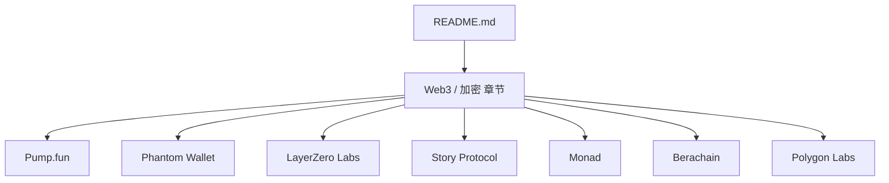
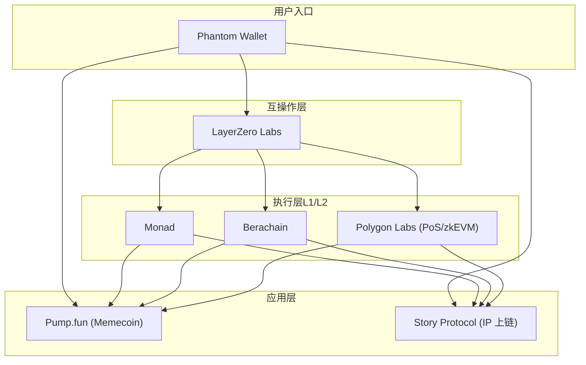
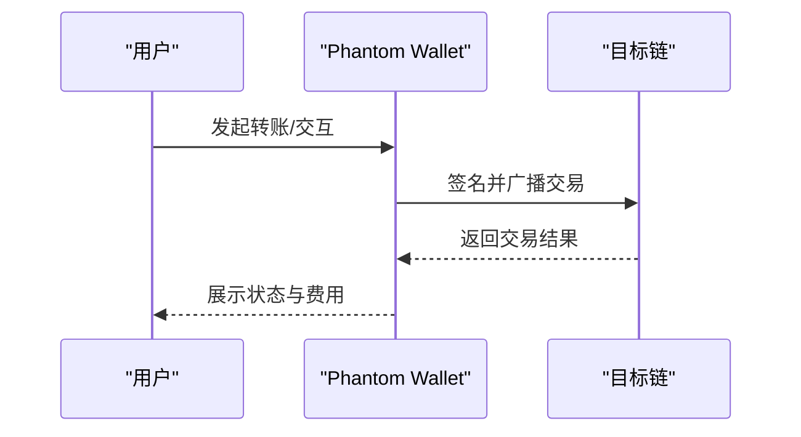
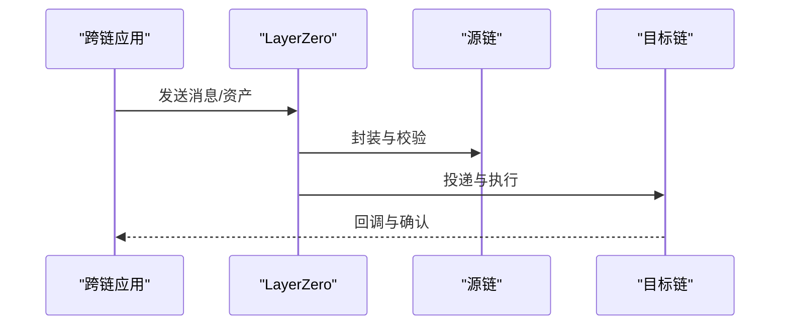
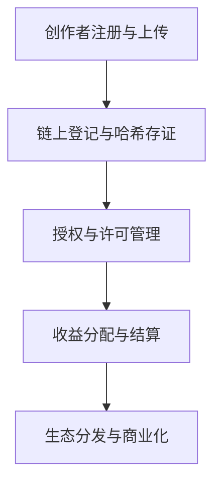
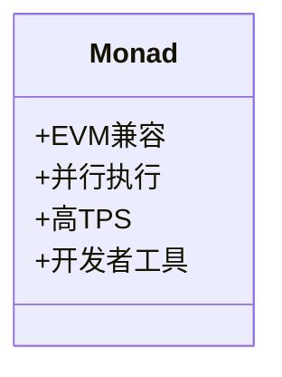
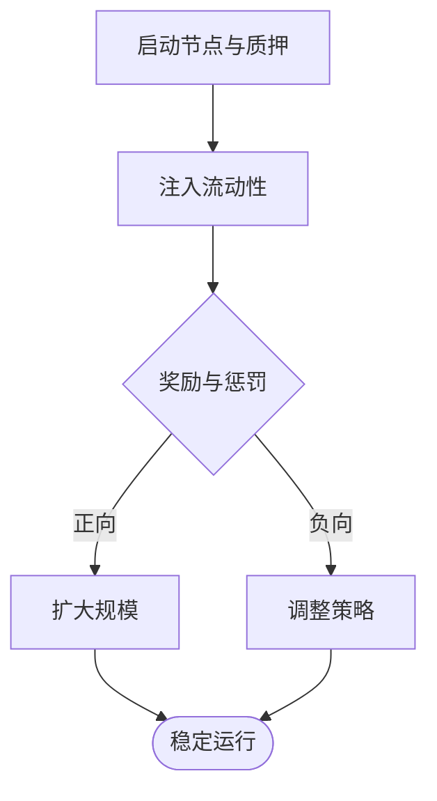
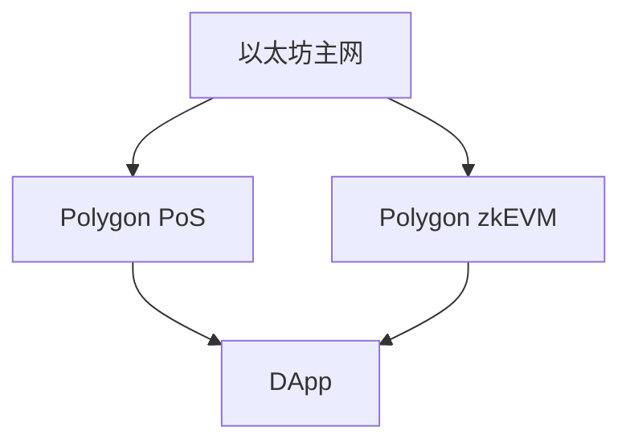
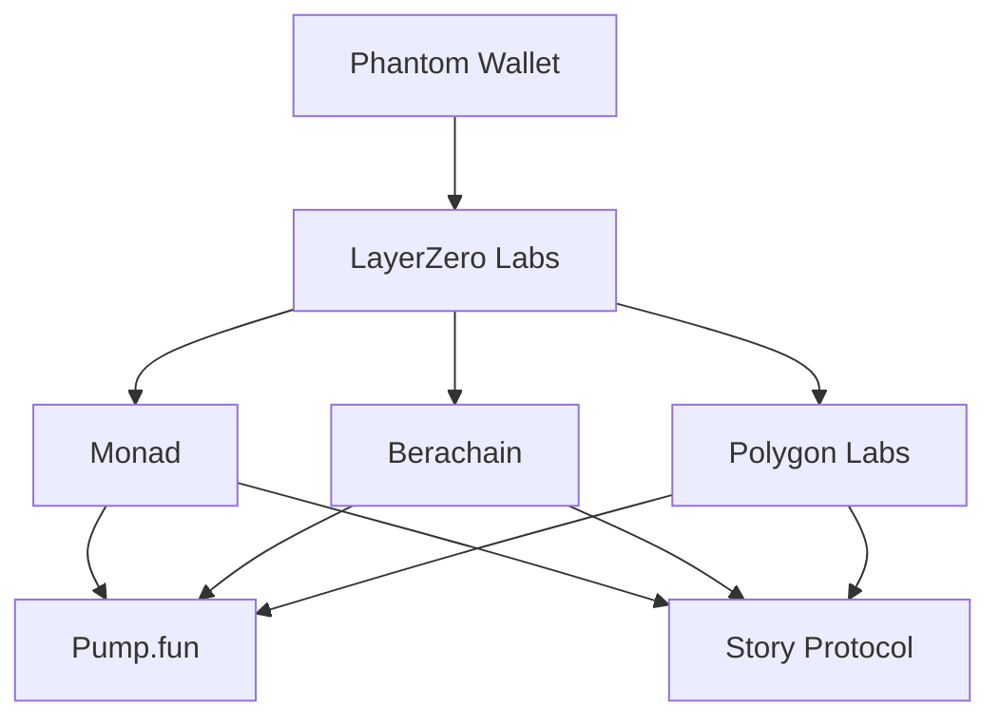

# Web3 / 加密

<cite>
**本文引用的文件**
- [README.md](file://README.md)
</cite>

## 目录
1. [引言](#引言)
2. [项目结构](#项目结构)
3. [核心组件](#核心组件)
4. [架构总览](#架构总览)
5. [详细组件分析](#详细组件分析)
6. [依赖关系分析](#依赖关系分析)
7. [性能与可扩展性考量](#性能与可扩展性考量)
8. [故障排查指南](#故障排查指南)
9. [结论](#结论)
10. [附录](#附录)

## 引言
本文件基于仓库中的精选初创公司清单，聚焦 Web3/加密赛道，系统梳理 Pump.fun、Phantom Wallet、LayerZero Labs、Story Protocol、Monad、Berachain、Polygon Labs 等头部项目的定位、技术方向与市场地位。文档同时覆盖 DeFi 协议、NFT 平台、区块链基础设施等不同子领域的发展现状，并给出投资风险提示与合规建议，帮助读者在快速变化的加密生态中做出更稳健的决策。

## 项目结构
仓库以单文件 README 的形式组织内容，按赛道分类汇总各领域的代表性公司与关键信息。Web3/加密部分位于“🌐 Web3 / 加密”章节，涵盖 Memecoin 发行平台、多链钱包、跨链互操作、IP 上链、高性能 L1、流动性证明以及以太坊扩容方案等主题。

图表来源
- [README.md:771-805](file://README.md#L771-L805)

章节来源
- [README.md:771-805](file://README.md#L771-L805)

## 核心组件
本节对 Web3/加密的关键组件进行概览式说明，便于理解各项目在生态中的角色与价值主张。

- Pump.fun：Solana 上的 memecoin 发行平台，提供低门槛、标准化的代币创建与交易体验，成为该赛道的现象级产品。
- Phantom Wallet：面向 Solana 与 EVM 的多链钱包，强调易用性与多链资产统一管理，是 Solana 生态用户的首选入口之一。
- LayerZero Labs：全链互操作协议，致力于在不同链之间实现安全、高效的资产与信息传递，推动跨链应用发展。
- Story Protocol：将知识产权（IP）资产上链的基础设施，探索数字内容与版权管理的链上化路径。
- Monad：高性能 L1 公链，兼容 EVM 并引入并行执行能力，追求高吞吐与低延迟。
- Berachain：采用“流动性证明”机制的创新 L1，试图通过激励流动性的方式提升网络活跃度与资本效率。
- Polygon Labs：以太坊扩容与互操作的重要参与者，提供 PoS 与 zkEVM 等解决方案，助力以太坊生态扩展。

章节来源
- [README.md:775-805](file://README.md#L775-L805)

## 架构总览
下图从生态视角展示上述项目之间的关系与分工：钱包作为用户入口，跨链协议连接不同链，L1/L2 提供执行层与扩容能力，Memecoin 平台与 IP 上链则分别代表消费级应用与内容资产化的方向。

图表来源
- [README.md:775-805](file://README.md#L775-L805)

## 详细组件分析

### Pump.fun（Memecoin 发行平台）
- 定位与价值：为创作者与社区提供一键发行 memecoin 的能力，降低进入门槛，加速实验型代币的涌现与传播。
- 生态影响：在 Solana 生态形成事实标准，带动相关工具、DEX 与社交传播链条的增长。
- 风险与治理：需关注代币质量、市场操纵与合规边界；平台应加强风控与信息披露。
- 可优化点：引入更完善的 KYC/AML 流程、反洗钱监控、代币生命周期管理与透明度指标。

图表来源
- [README.md:775-777](file://README.md#L775-L777)

章节来源
- [README.md:775-777](file://README.md#L775-L777)

### Phantom Wallet（多链钱包）
- 定位与价值：聚合多链资产管理与交互，提升用户体验，降低跨链使用门槛。
- 生态影响：作为入口层，驱动 Solana 及 EVM 生态的应用采用与资金流转。
- 风险与治理：私钥安全、钓鱼攻击、跨链桥接风险；需强化安全审计与用户教育。
- 可优化点：内置安全检测、多签与恢复机制、链上行为分析与风险提示。

图表来源
- [README.md:779-781](file://README.md#L779-L781)

章节来源
- [README.md:779-781](file://README.md#L779-L781)

### LayerZero Labs（跨链互操作协议）
- 定位与价值：提供统一的消息与资产传输抽象，简化跨链开发，提升互操作性。
- 生态影响：连接多条链与应用，促进跨链 DApp 与基础设施的繁荣。
- 风险与治理：中继与验证者模型的安全性、密钥管理、升级与治理机制。
- 可优化点：增强可观测性、多路由冗余、形式化验证与漏洞赏金计划。

图表来源
- [README.md:783-786](file://README.md#L783-L786)

章节来源
- [README.md:783-786](file://README.md#L783-L786)

### Story Protocol（IP 上链）
- 定位与价值：将知识产权资产数字化与链上化，探索版权确权、授权与分润的新模式。
- 生态影响：为内容创作者与娱乐产业提供新的商业化工具，推动数字内容生态演进。
- 风险与治理：法律合规、版权争议、数据隐私与可访问性。
- 可优化点：标准化元数据、智能合约模板、与主流平台的集成与互认。

图表来源
- [README.md:788-791](file://README.md#L788-L791)

章节来源
- [README.md:788-791](file://README.md#L788-L791)

### Monad（高性能 L1 公链）
- 定位与价值：EVM 兼容的高性能链，通过并行执行提升 TPS，满足大规模应用需求。
- 生态影响：吸引开发者迁移或部署高性能 DApp，丰富以太坊生态的执行层选择。
- 风险与治理：共识与安全性、去中心化程度、升级与治理机制。
- 可优化点：开发者工具链完善、测试网稳定性、经济模型与激励机制设计。

图表来源
- [README.md:793-796](file://README.md#L793-L796)

章节来源
- [README.md:793-796](file://README.md#L793-L796)

### Berachain（流动性证明 L1）
- 定位与价值：以“流动性证明”为核心创新，激励流动性提供者，提升网络活跃度与资本效率。
- 生态影响：可能重塑 DeFi 流动性获取与定价机制，推动新型金融实验。
- 风险与治理：机制设计的鲁棒性、博弈均衡、潜在攻击面与监管不确定性。
- 可优化点：渐进式上线、沙箱环境、压力测试与外部审计。

图表来源
- [README.md:798-800](file://README.md#L798-L800)

章节来源
- [README.md:798-800](file://README.md#L798-L800)

### Polygon Labs（以太坊扩容）
- 定位与价值：提供 PoS 与 zkEVM 等扩容方案，降低以太坊交易成本、提升吞吐量。
- 生态影响：为大量 DApp 提供低成本、高可用的执行环境，促进生态繁荣。
- 风险与治理：安全性假设、升级路径、与主网的信任模型。
- 可优化点：更强的去中心化验证集、更好的开发者体验与工具链。

图表来源
- [README.md:802-804](file://README.md#L802-L804)

章节来源
- [README.md:802-804](file://README.md#L802-L804)

## 依赖关系分析
- 钱包与互操作：Phantom Wallet 依赖 LayerZero 等跨链协议以实现多链资产与交互的统一体验。
- 执行层与应用：Pump.fun、Story Protocol 等应用层项目通常部署在高性能 L1/L2（如 Monad、Berachain、Polygon）之上，以获得更好的性能与成本优势。
- 生态协同：跨链协议使资产与数据在多链间流动，钱包作为入口串联用户与底层执行层，形成“入口—互操作—执行—应用”的闭环。

图表来源
- [README.md:775-805](file://README.md#L775-L805)

章节来源
- [README.md:775-805](file://README.md#L775-L805)

## 性能与可扩展性考量
- 高并发与低延迟：Monad 的并行执行与 Polygon 的扩容方案有助于提升整体网络吞吐，支撑高频交易与大流量应用。
- 跨链通信效率：LayerZero 的消息路由与验证机制直接影响跨链应用的响应时间与可靠性。
- 钱包体验：Phantom 的签名、广播与错误处理对用户感知至关重要，需优化网络重试与费用估算。
- 应用层优化：Pump.fun 与 Story Protocol 应在链下缓存、索引与批处理方面做优化，以提升用户体验与降低成本。

[本节为通用指导，不直接分析具体代码文件]

## 故障排查指南
- 钱包问题：检查网络连接、Gas 设置、目标链是否支持；查看交易回执与错误码；必要时切换 RPC 或回退到浏览器插件版本。
- 跨链失败：确认源链与目标链的通道可用性；核对地址格式与金额精度；查看 LayerZero 的状态面板与日志。
- 合约交互异常：核对函数签名与参数；检查权限与授权；使用区块浏览器追踪事件与 revert 原因。
- 性能瓶颈：监控 TPS、延迟与内存占用；识别热点账户与合约；考虑分片或批量提交。

[本节为通用指导，不直接分析具体代码文件]

## 结论
Web3/加密生态正经历从“实验期”向“规模化应用”的过渡。钱包、跨链协议、高性能 L1/L2 与应用层共同构成基础设施矩阵，推动 DeFi、NFT、IP 上链等场景落地。投资者与从业者应关注技术成熟度、合规框架与社区生态的健康度，谨慎评估高风险项目，重视安全与长期价值创造。

[本节为总结性内容，不直接分析具体代码文件]

## 附录
- 投资风险提示：加密资产波动剧烈、监管不确定性强、项目失败率高；建议分散配置、控制仓位、做好尽职调查。
- 合规建议：遵循当地法规，关注反洗钱与税务要求；优先选择具备透明治理与审计的项目；避免参与未经验证的 ICO/IEO。
- 学习资源：关注权威媒体与研究机构报告，参与开源社区与技术讨论，持续更新知识体系。

[本节为通用指导，不直接分析具体代码文件]