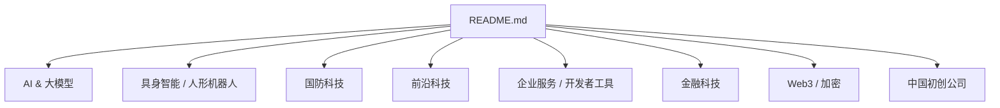
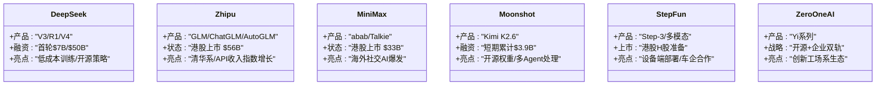
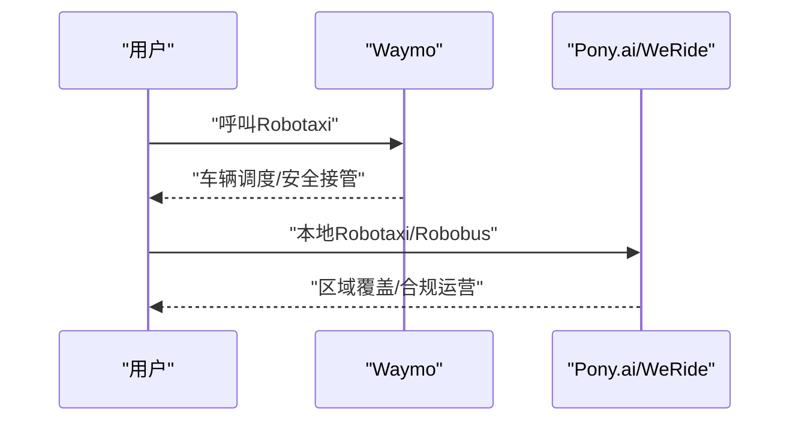
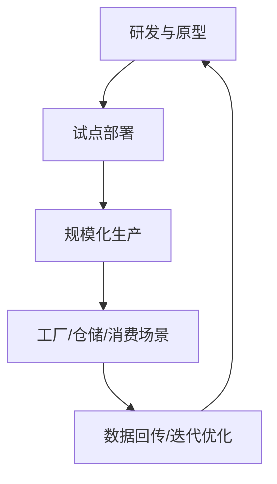
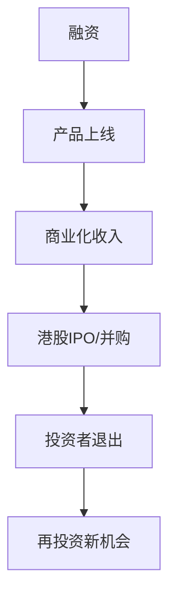
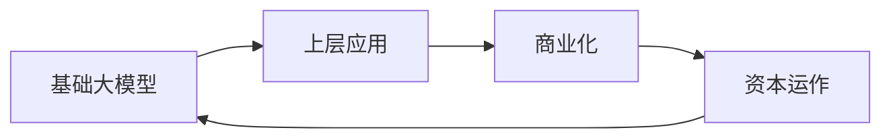

# 中国初创公司

<cite>
**本文引用的文件**
- [README.md](file://README.md)
</cite>

## 更新摘要
**所做更改**
- 更新了AI六小虎章节，增加了DeepSeek、Zhipu、MiniMax等公司的最新IPO和估值信息
- 增强了自动驾驶公司（如Waymo）在中国布局的分析
- 完善了资本市场与退出通道的讨论，特别是港股IPO的影响
- 更新了具身智能与人形机器人领域的中国公司进展

## 目录
1. [引言](#引言)
2. [项目结构](#项目结构)
3. [核心组件](#核心组件)
4. [架构总览](#架构总览)
5. [详细组件分析](#详细组件分析)
6. [依赖关系分析](#依赖关系分析)
7. [性能与规模化考量](#性能与规模化考量)
8. [故障排查与风险应对](#故障排查与风险应对)
9. [结论](#结论)
10. [附录](#附录)

## 引言
本文件聚焦"中国初创公司"，围绕AI六小虎（DeepSeek、Moonshot、Zhipu等）的技术实力与国际竞争力，结合自动驾驶公司（如Waymo）及科技巨头的策略，系统梳理中国初创在全球科技创新中的地位提升路径，并探讨中美科技竞争格局对中国创业生态的影响。同时提供中国市场投资机会与风险考量，帮助读者在复杂环境中做出理性决策。

**更新**：基于最新数据，中国AI六小虎合计估值已超过$200B，其中Zhipu和MiniMax已成功在港股上市，标志着中国AI企业国际化进程的重要里程碑。

## 项目结构
该仓库为一份持续更新的精选初创公司清单，按赛道组织，覆盖AI、具身智能、国防科技、前沿科技、企业服务、金融科技、Web3以及中国初创公司等主题。内容以条目化方式呈现，便于快速检索与横向对比。

图表来源
- [README.md:1-943](file://README.md#L1-L943)

章节来源
- [README.md:1-943](file://README.md#L1-L943)

## 核心组件
- **中国AI六小虎**：DeepSeek、Zhipu（已上市）、MiniMax（已上市）、Moonshot、StepFun、01.AI，合计估值规模显著，代表中国基础模型与多模态能力的头部力量。
- **自动驾驶**：Pony.ai、WeRide等在中国市场推进Robotaxi/Robobus商业化；Waymo作为全球标杆，其技术路线与商业化节奏对行业有示范效应。
- **具身智能与人形机器人**：AgiBot等公司在量产与部署方面进展迅速，体现中国在硬件工程化与供应链整合上的优势。
- **资本市场与退出通道**：港股IPO打开退出渠道，推动VC复苏与资金回流，形成"融资—产品—商业化—退出"的闭环。

**更新**：Zhipu和MiniMax的成功上市为中国AI企业树立了标杆，证明了国际资本市场对中国AI技术的认可。

章节来源
- [README.md:810-867](file://README.md#L810-L867)

## 架构总览
从"技术—产品—商业化—资本"的全链路视角，中国初创公司的演进路径如下：

[此图为概念性流程图，不直接映射具体代码文件]

## 详细组件分析

### AI六小虎：技术实力与国际竞争力

**更新**：以下为公司最新状态和重要里程碑：

- **DeepSeek**：以低成本训练与开源策略著称，首轮融资目标大幅提升至$7B/$50B，显示市场对人才与算力的重视。CEO梁文锋个人投入$3B，背书方为量化巨头HighFlyer。
- **Zhipu（智谱）**：清华系背景，GLM系列与ChatGLM等产品矩阵完善，2026年1月港股上市后市值约$56B，股价飙升600%+，成为中国估值最高的大模型公司。
- **MiniMax**：abab系列与Talkie（海外社交AI）双轮驱动，2026年1月港股首日翻倍，市值$33B+，国际化布局明显。
- **Moonshot**：Kimi K2.6开源权重模型具备国际竞争力，短期累计融资$3.9B，ARR增长迅速，可同时处理300个子Agent。
- **StepFun**：多模态MoE模型与设备端部署能力强，准备港股H股上市，与车企联合开发Agent OS，模型部署在4200万+设备。
- **01.AI**：李开复创办，开源与企业双轨并行，生态合作广泛。

图表来源
- [README.md:814-847](file://README.md#L814-L847)

章节来源
- [README.md:814-847](file://README.md#L814-L847)

### 自动驾驶：Waymo的中国布局与本土玩家

**更新**：随着中国自动驾驶企业的成熟，市场竞争格局正在发生变化：

- **Waymo**：全球领先的Robotaxi服务，周付费乘客量高，技术成熟度与合规经验为行业标杆。
- **Pony.ai**：2026年香港IPO募资$862M，估值$8.5B，展示本地化落地能力与资本市场认可。
- **WeRide**：2026年香港IPO募资$2.4B，估值$4.4B，在Robotaxi/Robobus领域取得重大进展。

图表来源
- [README.md:107-112](file://README.md#L107-L112)
- [README.md:854-861](file://README.md#L854-861)

章节来源
- [README.md:107-112](file://README.md#L107-L112)
- [README.md:854-861](file://README.md#L854-861)

### 具身智能与人形机器人：量产与商用

**更新**：中国公司在人形机器人领域展现出强大的量产能力和成本控制优势：

- **AgiBot**：达成万台下线里程碑，量产节奏领先，体现供应链与工程化能力。2026年3月达成10,000台下线里程碑，3个月内从5,000→10,000台。
- **Unitree**：价格下探与订单落地，推动人形机器人在工业与消费场景渗透。G1售价$13,500、R1仅$4,900，已进入IPO审核。
- **Galbot**：国家资本背景，CATL、Bosch、Toyota、北汽、上汽订单，中国人形机器人新势力。

图表来源
- [README.md:417-431](file://README.md#L417-L431)
- [README.md:863-867](file://README.md#L863-867)

章节来源
- [README.md:417-431](file://README.md#L417-L431)
- [README.md:863-867](file://README.md#L863-867)

### 资本市场与退出通道：港股IPO与VC复苏

**更新**：港股IPO的成功为中国AI企业打开了重要的退出通道：

- **港股IPO**：Zhipu和MiniMax的成功上市带动VC复苏潮，形成"融资—产品—商业化—退出"的正循环。
- **头部公司市值表现强劲**：吸引全球资本关注中国AI与硬科技赛道，中国AI六小虎合计估值>$200B。
- **国际化进程加速**：多家中国企业选择港股上市，表明国际资本市场对中国AI技术的认可。

图表来源
- [README.md:810-867](file://README.md#L810-867)

章节来源
- [README.md:810-867](file://README.md#L810-867)

## 依赖关系分析
- **技术与产品依赖**：基础模型能力是上层应用（Agent、搜索、客服、编程）的前提；多模态能力支撑视频、语音、数字人等应用。
- **商业化依赖**：企业客户与消费者场景驱动收入增长，进而影响融资与估值。
- **资本依赖**：融资节奏与退出通道决定公司扩张速度与生态影响力。

**更新**：随着港股IPO通道的打开，中国AI企业的资本依赖模式正在发生变化，更多企业能够通过公开市场获得资金支持。

图表来源
- [README.md:157-370](file://README.md#L157-L370)
- [README.md:810-867](file://README.md#L810-867)

章节来源
- [README.md:157-370](file://README.md#L157-L370)
- [README.md:810-867](file://README.md#L810-867)

## 性能与规模化考量
- **算力与成本**：基础模型训练与推理对算力需求巨大，需平衡性能与成本，开源与量化技术有助于降低成本。
- **数据与质量**：高质量数据与标注是模型性能的关键，数据治理与安全合规不可忽视。
- **工程化与部署**：设备端部署与云端推理的协同，影响用户体验与成本结构。
- **供应链与制造**：人形机器人等硬件领域，供应链稳定性与成本控制决定量产可行性。

**更新**：中国公司在成本控制方面的优势尤为突出，如Unitree的人形机器人价格远低于国际竞争对手，这得益于完善的供应链体系和规模化生产能力。

[本节为通用指导，不直接分析具体文件]

## 故障排查与风险应对
- **技术风险**：模型幻觉、多模态一致性、实时性与延迟问题，需通过评测与监控体系降低风险。
- **合规风险**：数据安全、隐私保护、跨境数据流动，需建立合规框架与审计机制。
- **市场风险**：竞争加剧、价格战、客户获取成本上升，需差异化定位与生态合作。
- **资本风险**：融资环境波动、估值回调、退出周期拉长，需稳健现金流管理与多元化融资渠道。

**更新**：随着港股IPO的成功，中国AI企业在资本市场的风险管理能力得到验证，但仍需关注国际地缘政治对资本市场的影响。

[本节为通用指导，不直接分析具体文件]

## 结论
中国初创公司在AI与硬科技领域正快速崛起，AI六小虎在基础模型与多模态能力上具备国际竞争力；自动驾驶与具身智能在本土化落地与量产方面展现优势。**最新进展**：Zhipu和MiniMax的成功上市标志着中国AI企业国际化进程的重要里程碑，港股IPO通道的打开为整个行业带来了新的活力。

随着港股IPO打开退出通道，VC生态逐步回暖，中国初创在全球科技创新中的地位持续提升。面对中美科技竞争格局，建议关注技术壁垒、商业化能力与合规体系，把握投资机会的同时做好风险管控。

**更新**：中国AI六小虎合计估值超过$200B，其中两家公司已成功上市，证明了中国AI技术的国际竞争力和商业价值。

[本节为总结性内容，不直接分析具体文件]

## 附录
- **数据来源**：Forbes AI 50、CB Insights、Crunchbase、PitchBook、The Information、TechCrunch、Y Combinator、Sacra、Contrary Research、AI Funding Tracker、New Market Pitch。
- **贡献指南**：欢迎 Fork 并提交 Pull Request，遵循收录标准与排除范围。

**更新**：新增Recode China AI作为专门的中国AI深度报道来源，提供更准确的中国市场信息。

章节来源
- [README.md:870-920](file://README.md#L870-920)