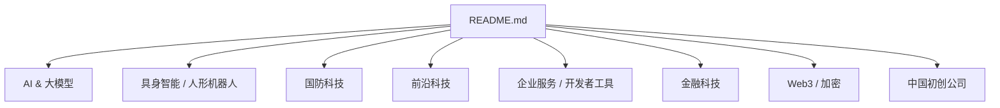
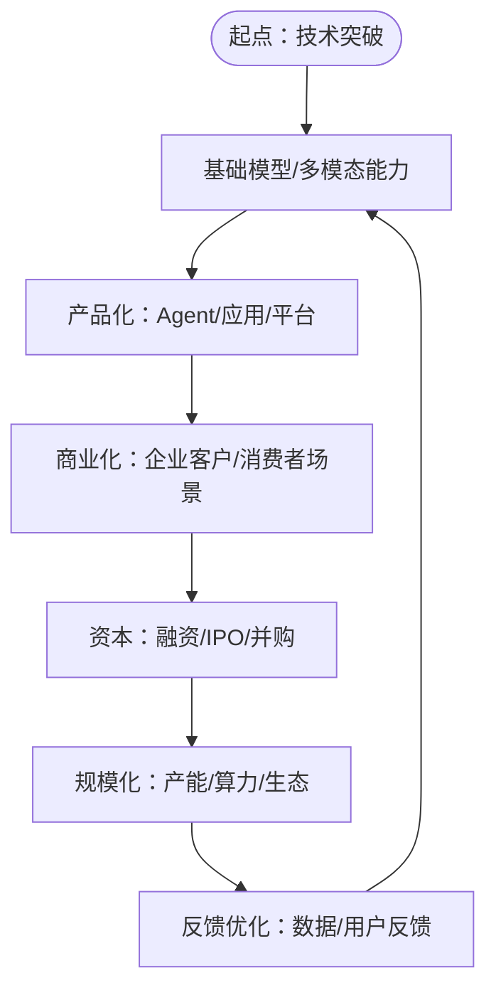
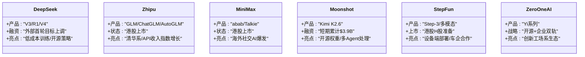
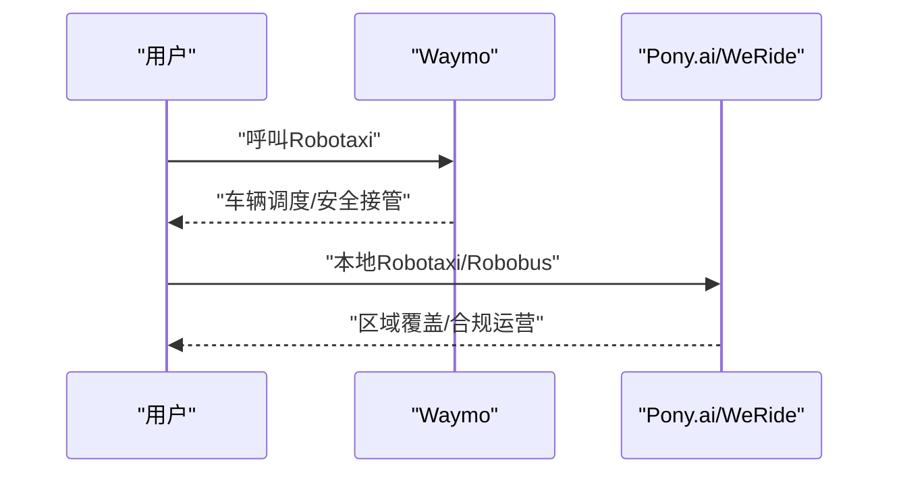
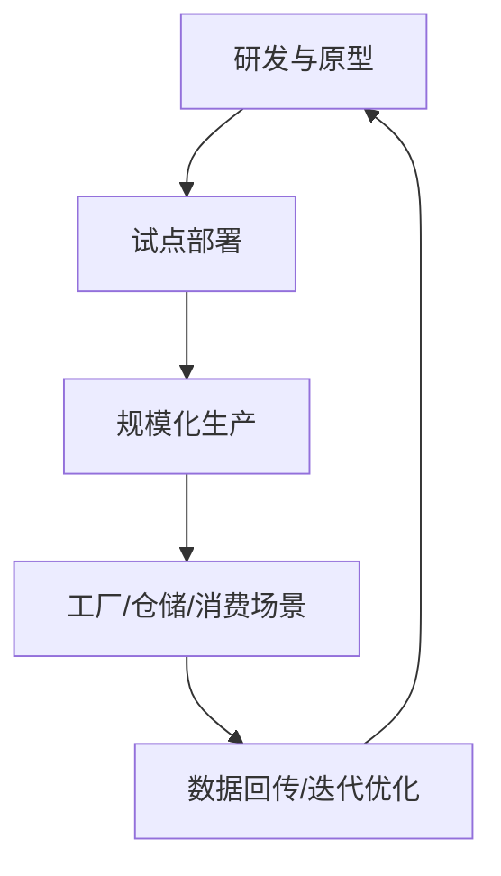
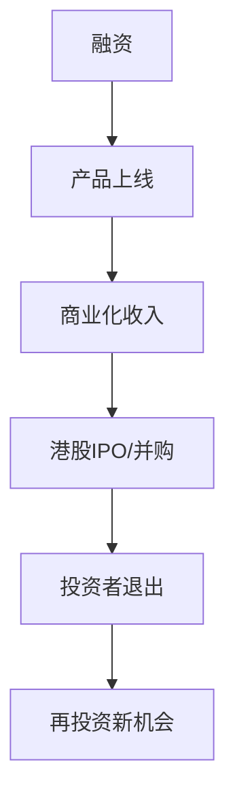
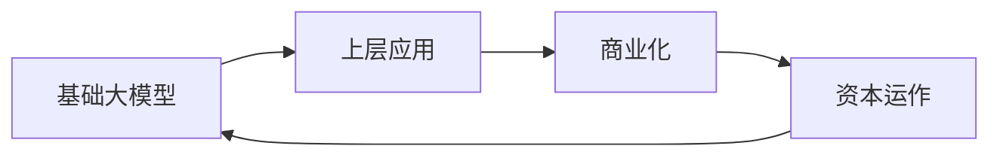

# 中国初创公司

<cite>
**本文引用的文件**
- [README.md](file://README.md)
</cite>

## 目录
1. [引言](#引言)
2. [项目结构](#项目结构)
3. [核心组件](#核心组件)
4. [架构总览](#架构总览)
5. [详细组件分析](#详细组件分析)
6. [依赖关系分析](#依赖关系分析)
7. [性能与规模化考量](#性能与规模化考量)
8. [故障排查与风险应对](#故障排查与风险应对)
9. [结论](#结论)
10. [附录](#附录)

## 引言
本文件聚焦“中国初创公司”，围绕 AI 六小虎（DeepSeek、Moonshot、Zhipu 等）的技术实力与国际竞争力，结合自动驾驶公司（如 Waymo）及科技巨头的策略，系统梳理中国初创在全球科技创新中的地位提升路径，并探讨中美科技竞争格局对中国创业生态的影响。同时提供中国市场投资机会与风险考量，帮助读者在复杂环境中做出理性决策。

## 项目结构
该仓库为一份持续更新的精选初创公司清单，按赛道组织，覆盖 AI、具身智能、国防科技、前沿科技、企业服务、金融科技、Web3 以及中国初创公司等主题。内容以条目化方式呈现，便于快速检索与横向对比。

图表来源
- [README.md:1-943](file://README.md#L1-L943)

章节来源
- [README.md:1-943](file://README.md#L1-L943)

## 核心组件
- 中国 AI 六小虎：DeepSeek、Zhipu（已上市）、MiniMax（已上市）、Moonshot、StepFun、01.AI，合计估值规模显著，代表中国基础模型与多模态能力的头部力量。
- 自动驾驶：Pony.ai、WeRide 等在中国市场推进 Robotaxi/Robobus 商业化；Waymo 作为全球标杆，其技术路线与商业化节奏对行业有示范效应。
- 具身智能与人形机器人：AgiBot 等公司在量产与部署方面进展迅速，体现中国在硬件工程化与供应链整合上的优势。
- 资本市场与退出通道：港股 IPO 打开退出渠道，推动 VC 复苏与资金回流，形成“融资—产品—商业化—退出”的闭环。

章节来源
- [README.md:810-867](file://README.md#L810-L867)

## 架构总览
从“技术—产品—商业化—资本”的全链路视角，中国初创公司的演进路径如下：

[此图为概念性流程图，不直接映射具体代码文件]

## 详细组件分析

### AI 六小虎：技术实力与国际竞争力
- DeepSeek：以低成本训练与开源策略著称，首轮融资目标大幅提升，显示市场对人才与算力的重视。
- Zhipu（智谱）：清华系背景，GLM 系列与 ChatGLM 等产品矩阵完善，港股上市后市值表现强劲。
- MiniMax：abab 系列与 Talkie（海外社交 AI）双轮驱动，港股首日翻倍，国际化布局明显。
- Moonshot：Kimi K2.6 开源权重模型具备国际竞争力，短期累计融资规模可观，ARR 增长迅速。
- StepFun：多模态 MoE 模型与设备端部署能力强，准备港股 H 股上市，与车企联合开发 Agent OS。
- 01.AI：李开复创办，开源与企业双轨并行，生态合作广泛。

图表来源
- [README.md:814-847](file://README.md#L814-L847)

章节来源
- [README.md:814-847](file://README.md#L814-L847)

### 自动驾驶：Waymo 的中国布局与本土玩家
- Waymo：全球领先的 Robotaxi 服务，周付费乘客量高，技术成熟度与合规经验为行业标杆。
- Pony.ai、WeRide：在中国推进 Robotaxi/Robobus 商业化，并完成港股 IPO，展示本地化落地能力与资本市场认可。

图表来源
- [README.md:107-112](file://README.md#L107-L112)
- [README.md:854-861](file://README.md#L854-L861)

章节来源
- [README.md:107-112](file://README.md#L107-L112)
- [README.md:854-861](file://README.md#L854-L861)

### 具身智能与人形机器人：量产与商用
- AgiBot：达成万台下线里程碑，量产节奏领先，体现供应链与工程化能力。
- Unitree、Galbot 等：价格下探与订单落地，推动人形机器人在工业与消费场景渗透。

图表来源
- [README.md:417-431](file://README.md#L417-L431)
- [README.md:863-867](file://README.md#L863-L867)

章节来源
- [README.md:417-431](file://README.md#L417-L431)
- [README.md:863-867](file://README.md#L863-L867)

### 资本市场与退出通道：港股 IPO 与 VC 复苏
- 港股 IPO 打开退出通道，带动 VC 复苏潮，形成“融资—产品—商业化—退出”的正循环。
- 头部公司市值表现强劲，吸引全球资本关注中国 AI 与硬科技赛道。

图表来源
- [README.md:810-867](file://README.md#L810-L867)

章节来源
- [README.md:810-867](file://README.md#L810-L867)

## 依赖关系分析
- 技术与产品依赖：基础模型能力是上层应用（Agent、搜索、客服、编程）的前提；多模态能力支撑视频、语音、数字人等应用。
- 商业化依赖：企业客户与消费者场景驱动收入增长，进而影响融资与估值。
- 资本依赖：融资节奏与退出通道决定公司扩张速度与生态影响力。

图表来源
- [README.md:157-370](file://README.md#L157-L370)
- [README.md:810-867](file://README.md#L810-L867)

章节来源
- [README.md:157-370](file://README.md#L157-L370)
- [README.md:810-867](file://README.md#L810-L867)

## 性能与规模化考量
- 算力与成本：基础模型训练与推理对算力需求巨大，需平衡性能与成本，开源与量化技术有助于降低成本。
- 数据与质量：高质量数据与标注是模型性能的关键，数据治理与安全合规不可忽视。
- 工程化与部署：设备端部署与云端推理的协同，影响用户体验与成本结构。
- 供应链与制造：人形机器人等硬件领域，供应链稳定性与成本控制决定量产可行性。

[本节为通用指导，不直接分析具体文件]

## 故障排查与风险应对
- 技术风险：模型幻觉、多模态一致性、实时性与延迟问题，需通过评测与监控体系降低风险。
- 合规风险：数据安全、隐私保护、跨境数据流动，需建立合规框架与审计机制。
- 市场风险：竞争加剧、价格战、客户获取成本上升，需差异化定位与生态合作。
- 资本风险：融资环境波动、估值回调、退出周期拉长，需稳健现金流管理与多元化融资渠道。

[本节为通用指导，不直接分析具体文件]

## 结论
中国初创公司在 AI 与硬科技领域正快速崛起，AI 六小虎在基础模型与多模态能力上具备国际竞争力；自动驾驶与具身智能在本土化落地与量产方面展现优势。随着港股 IPO 打开退出通道，VC 生态逐步回暖，中国初创在全球科技创新中的地位持续提升。面对中美科技竞争格局，建议关注技术壁垒、商业化能力与合规体系，把握投资机会的同时做好风险管控。

[本节为总结性内容，不直接分析具体文件]

## 附录
- 数据来源：Forbes AI 50、CB Insights、Crunchbase、PitchBook、The Information、TechCrunch、Y Combinator、Sacra、Contrary Research、AI Funding Tracker、New Market Pitch。
- 贡献指南：欢迎 Fork 并提交 Pull Request，遵循收录标准与排除范围。

章节来源
- [README.md:870-920](file://README.md#L870-L920)