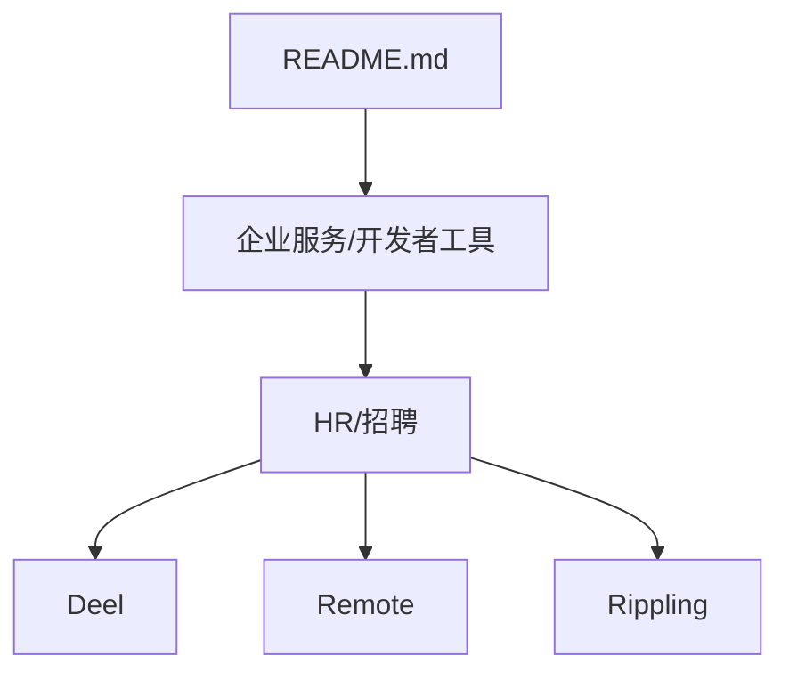
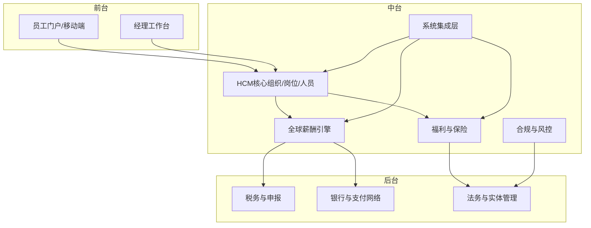
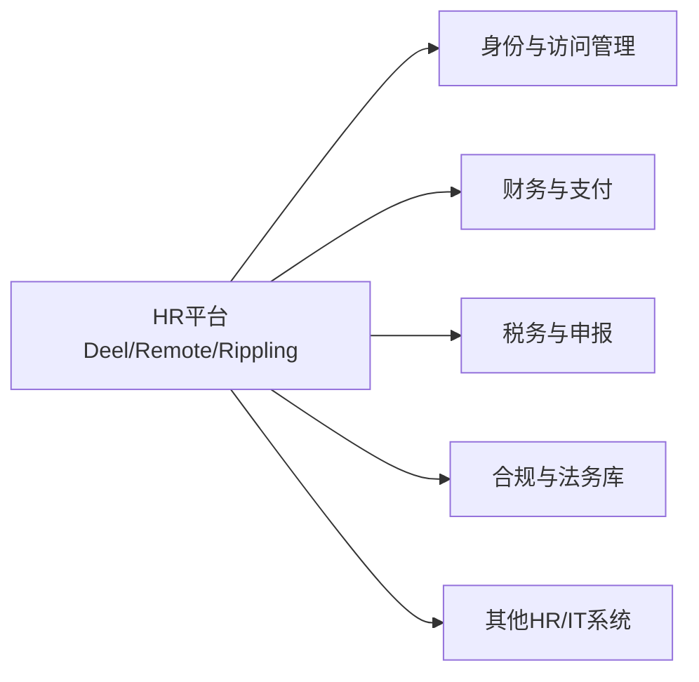

# HR招聘工具

<cite>
**本文引用的文件**
- [README.md](file://README.md)
</cite>

## 目录
1. [引言](#引言)
2. [项目结构](#项目结构)
3. [核心组件](#核心组件)
4. [架构总览](#架构总览)
5. [详细组件分析](#详细组件分析)
6. [依赖关系分析](#依赖关系分析)
7. [性能与可扩展性考量](#性能与可扩展性考量)
8. [故障排查指南](#故障排查指南)
9. [结论](#结论)
10. [附录](#附录)

## 引言
本文件面向企业HR与技术决策者，聚焦Deel、Remote、Rippling等全球人力资源平台在远程雇佣、全球薪酬、员工体验管理等方面的能力与合规要点，并结合后疫情时代远程工作趋势，提供HR技术选型与集成迁移策略。内容基于仓库中关于企业服务/开发者工具下的HR/招聘板块信息，对三家代表性平台进行横向对比与落地建议。

## 项目结构
仓库为一份持续更新的精选初创公司清单，其中“企业服务/开发者工具”章节包含HR/招聘子项，列举了Deel、Remote、Rippling三家公司的基本信息（创始人、成立时间、核心产品、最新融资与亮点）。这些条目构成后续分析的素材基础。

图表来源
- [README.md:679-697](file://README.md#L679-L697)

章节来源
- [README.md:679-697](file://README.md#L679-L697)

## 核心组件
围绕HR招聘与全球化用工，以下三类能力是评估重点：
- 远程雇佣与实体搭建：支持在多国快速设立法律实体或采用EOR（名义雇主）模式完成雇佣合规。
- 全球薪酬与税务：多币种发薪、个税代扣代缴、跨境支付与合规申报。
- 员工体验与管理：入职流程自动化、福利与保险、绩效与考勤、数据隐私与权限治理。

上述能力在Deel、Remote、Rippling的产品定位中均有体现，且均强调覆盖范围广、规模化交付与合规能力。

章节来源
- [README.md:679-697](file://README.md#L679-L697)

## 架构总览
从企业视角看，HR系统通常由“前台员工体验+中台HR业务编排+后台合规与财务结算”组成。下图展示了一个概念性的HR平台架构，便于理解各模块职责与交互。

说明
- 该图为概念性架构图，用于帮助理解HR系统的分层与协作方式，不直接映射到具体代码文件。

## 详细组件分析

### Deel：全球远程雇佣平台
- 定位与能力
  - 全球远程雇佣平台，强调覆盖国家数量与规模化交付能力。
  - 典型能力包括：跨法域实体/EOR支持、全球薪酬发放、合规与税务处理、员工全生命周期管理。
- 适用场景
  - 快速进入新市场、无需自建实体即可雇佣本地员工。
  - 跨国团队统一薪酬与福利发放，降低合规复杂度。
- 选型关注点
  - 覆盖国家与地区清单、本地化合规更新速度。
  - 薪酬计算精度、多币种与汇率管理。
  - 与现有HRIS/ATS/财务系统的集成能力。
- 风险与约束
  - 不同法域劳动法规差异大，需关注合同模板、工时与休假政策本地化。
  - 数据跨境传输与隐私合规要求（如GDPR等）。

章节来源
- [README.md:681-685](file://README.md#L681-L685)

### Remote：全球HR与薪酬
- 定位与能力
  - 全球HR与薪酬平台，强调在多地提供合规的HR服务与薪酬处理能力。
  - 常见能力包括：EOR与实体管理、薪酬与税务、员工体验与自助服务。
- 适用场景
  - 需要一站式HR与薪酬外包，减少内部运营负担。
  - 多国员工统一管理，提升员工体验与合规一致性。
- 选型关注点
  - 本地化服务团队与响应时效。
  - 薪酬周期、发薪日与节假日对齐能力。
  - 报表与审计追踪，满足内控与外部审计需求。
- 风险与约束
  - 第三方依赖带来的服务连续性风险，需制定SLA与应急预案。
  - 多法域税务变更频繁，需具备持续适配能力。

章节来源
- [README.md:687-690](file://README.md#L687-L690)

### Rippling：统一HR/IT/财务平台
- 定位与能力
  - 统一HR、IT与财务平台，强调在企业SaaS整合方面的能力。
  - 典型能力包括：员工主数据管理、设备与账号自动化、薪酬与费用、合规与权限治理。
- 适用场景
  - 大型企业希望以单一平台打通HR、IT与财务流程，减少多系统割裂。
  - 自动化入职/转岗/离职流程，提升效率与准确性。
- 选型关注点
  - 与现有ERP/财务系统、身份与访问管理（IAM）、ATS/HRIS的集成深度。
  - 规则引擎与可配置性，满足复杂组织与流程定制。
  - 安全与合规认证（如SOC 2、ISO 27001等）。
- 风险与约束
  - 平台一体化可能带来供应商锁定风险，需评估迁移成本与退出策略。
  - 大规模部署时的性能与稳定性保障。

章节来源
- [README.md:692-696](file://README.md#L692-L696)

### 横向对比与选型建议
- 覆盖范围与本地化
  - Deel强调覆盖国家数量；Remote强调HR与薪酬的一体化服务；Rippling强调平台整合。
- 合规与税务
  - 三者均需具备多法域合规能力，但实现路径不同：Deel/Remote偏EOR与服务外包，Rippling偏平台化规则与自动化。
- 集成与扩展
  - 若已有成熟HRIS/ERP，优先考虑API开放性与生态集成；若追求端到端替代，可评估Rippling的统一平台方案。
- 员工体验
  - 自助服务、移动端体验、通知与审批流是否顺畅，直接影响采纳率与满意度。

[本节为概念性分析与建议，不直接引用具体代码]

## 依赖关系分析
从企业集成视角，HR平台通常依赖以下外部系统与能力：
- 身份与访问管理（SSO/MFA）
- 财务与支付网络（银行、第三方支付）
- 税务与申报系统（各国税务机关接口或代理）
- 合规与法务库（劳动法、税法、数据隐私法规）
- 其他HR/IT系统（ATS、HRIS、ERP、IAM）

说明
- 该图为概念性依赖图，用于说明HR平台的外部依赖关系，不直接映射到具体代码文件。

## 性能与可扩展性考量
- 并发与吞吐
  - 发薪高峰期（月末/季末）需保证高可用与低延迟，避免批量任务阻塞。
- 数据一致性与幂等
  - 薪酬计算与支付需确保数据一致，关键操作具备幂等与回滚机制。
- 可扩展性
  - 新增法域与税制时，应通过配置化与规则引擎快速扩展，而非硬编码。
- 监控与告警
  - 建立关键指标（成功率、耗时、错误率）监控与告警，保障服务质量。

[本节提供通用指导，不直接分析具体文件]

## 故障排查指南
- 常见问题定位
  - 薪酬计算异常：核对税率表、社保基数、加班与假期规则版本。
  - 支付失败：检查银行账户信息、SWIFT/IBAN校验、外汇额度与制裁名单。
  - 合规报错：确认当地法规更新是否已同步至平台规则库。
- 排障步骤建议
  - 复现问题并收集日志（请求ID、时间戳、输入参数）。
  - 验证上游系统状态（银行、税务、IAM）。
  - 逐步隔离问题域（HR核心、薪酬引擎、集成层）。
- 预防与改进
  - 建立灰度发布与回滚策略。
  - 定期演练灾难恢复与数据修复流程。

[本节提供通用指导，不直接分析具体文件]

## 结论
Deel、Remote、Rippling分别代表了全球HR领域的三种主流路径：EOR与远程雇佣、HR与薪酬一体化服务、统一平台整合。企业在选型时应结合自身规模、法域分布、现有系统生态与合规要求，综合评估覆盖范围、本地化能力、集成深度与员工体验。同时，需重视数据隐私、税务合规与供应商风险管理，制定清晰的集成与迁移策略，确保长期稳定运行。

[本节总结性内容，不直接分析具体文件]

## 附录
- 参考来源
  - 仓库中的“企业服务/开发者工具”章节提供了Deel、Remote、Rippling的基本信息与亮点，作为本次分析的素材基础。

章节来源
- [README.md:679-697](file://README.md#L679-L697)