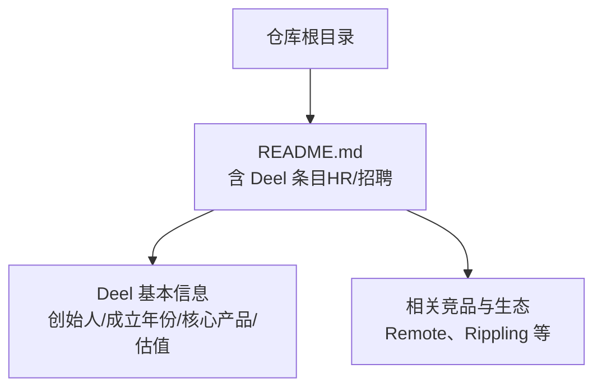
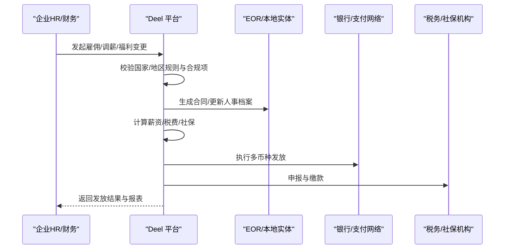
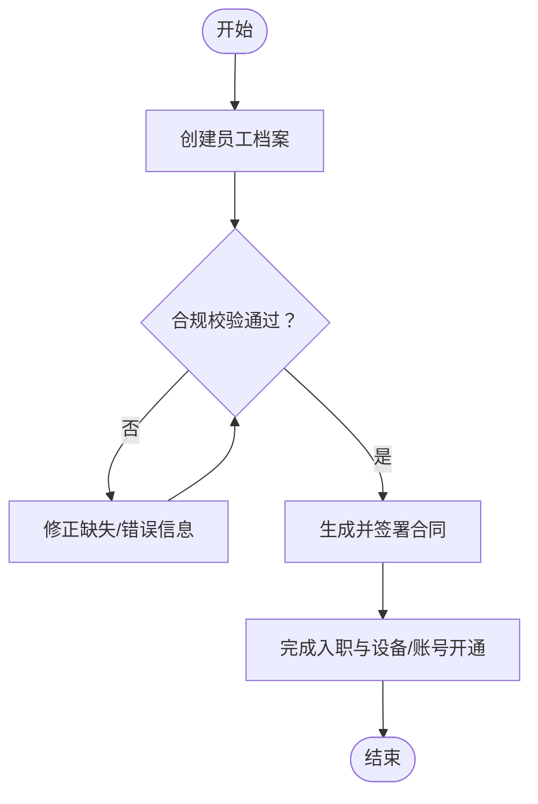
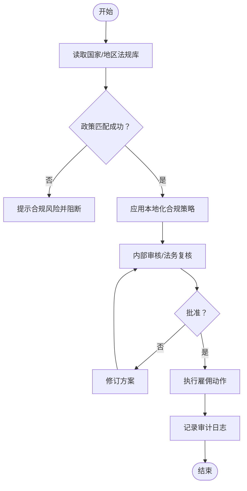
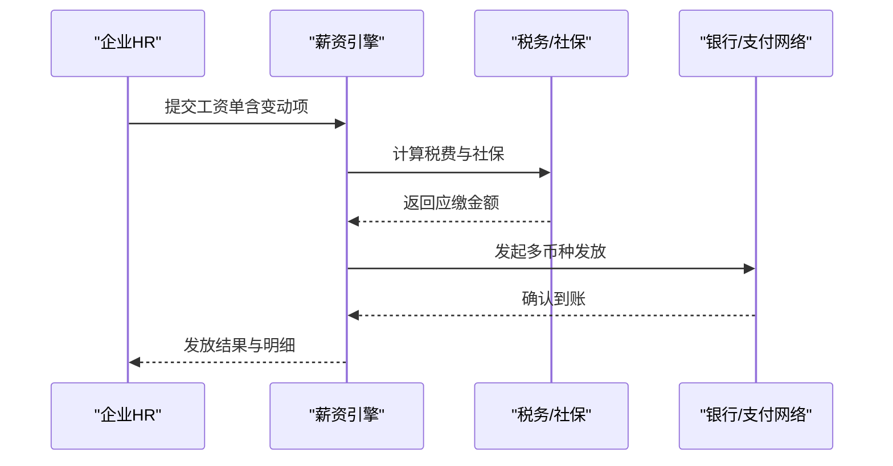
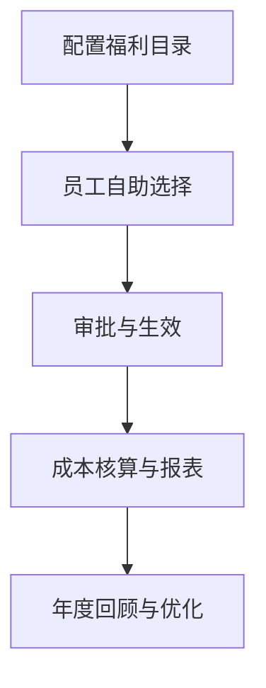
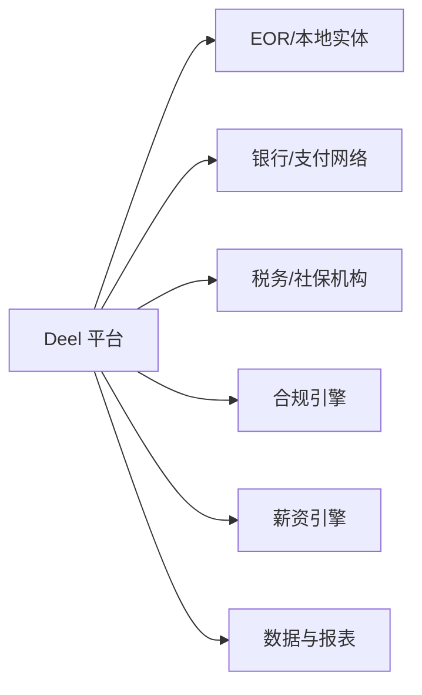

# 全球雇佣平台（Deel）

<cite>
**本文引用的文件**
- [README.md](file://README.md)
</cite>

## 目录
1. [简介](#简介)
2. [项目结构](#项目结构)
3. [核心组件](#核心组件)
4. [架构总览](#架构总览)
5. [详细组件分析](#详细组件分析)
6. [依赖关系分析](#依赖关系分析)
7. [性能与合规考量](#性能与合规考量)
8. [故障排查指南](#故障排查指南)
9. [结论](#结论)
10. [附录：实施与最佳实践](#附录实施与最佳实践)

## 简介
本文件围绕 Deel 作为全球远程雇佣解决方案的核心能力，系统梳理其在跨国员工管理、合规雇佣、薪酬发放与福利管理等方面的价值主张。结合仓库中关于 Deel 的公开信息，说明其覆盖 150+ 国家的本地化能力、多币种支付与税务合规处理，并解释其如何帮助企业降低跨境用工的法律风险、满足劳工法合规与税务要求。同时提供企业采用 Deel 的实施指南（系统集成、数据迁移、员工培训），以及市场定位与竞争优势分析，辅以案例研究与最佳实践建议，帮助读者快速理解并落地使用。

## 项目结构
该仓库为“精选初创公司清单”，其中包含对 Deel 的条目式介绍，涵盖创始人、成立时间、核心产品与最新融资等信息。基于此，本文聚焦 Deel 在 HR/招聘与企业服务领域的定位与能力概览，并结合通用行业知识补充实施与合规要点。

图表来源
- [README.md:726-733](file://README.md#L726-L733)

章节来源
- [README.md:726-733](file://README.md#L726-L733)

## 核心组件
根据仓库中的条目，Deel 的核心定位是“全球远程雇佣平台”，具备以下关键能力方向（基于条目信息与行业共识归纳）：
- 跨国员工管理：支持在不同国家/地区创建与管理雇员或独立承包商，统一组织视图与生命周期管理。
- 合规雇佣：依托本地实体或 EOR（名义雇主）模式，确保劳动合同、工时、休假、解雇流程符合当地劳工法。
- 薪酬发放：多币种薪资计算与发放，对接银行与支付网络，自动化扣税与社保缴纳。
- 福利管理：按国家/地区配置法定与可选福利（医疗保险、养老金、带薪假等），实现集中管理与员工自助。

章节来源
- [README.md:726-733](file://README.md#L726-L733)

## 架构总览
下图展示企业通过 Deel 进行全球雇佣的典型端到端流程：从需求发起、合同与合规校验、薪酬计算与发放，到报表与审计留痕。

[本图为概念性流程图，不直接映射具体源码文件]

## 详细组件分析

### 跨国员工管理
- 目标：统一管理分布在 150+ 国家的员工与承包商，提供统一的入职、转正、调岗、离职流程。
- 关键点：
  - 员工主数据标准化（身份、岗位、工作地、汇报线）。
  - 合同模板与条款按国家/地区动态适配。
  - 权限与审批流与企业现有系统（如 HRIS、SSO）集成。

[本图为概念性流程图，不直接映射具体源码文件]

### 合规雇佣与法律风险控制
- 目标：规避跨境用工的法律风险，确保遵循当地劳动法、最低工资、工时、解雇保护、反歧视等规定。
- 关键点：
  - 以 EOR 或本地实体方式承担雇主责任。
  - 自动化的合规检查（合同条款、工作时间、假期、加班补偿）。
  - 审计与留痕：所有操作可追溯，便于应对监管检查。

[本图为概念性流程图，不直接映射具体源码文件]

### 薪酬发放与多币种支付
- 目标：准确、及时、低成本地完成全球薪资发放，支持多币种结算与汇率风险管理。
- 关键点：
  - 薪资引擎：按国家/地区规则计算基本工资、津贴、加班、奖金、扣款。
  - 税务与社保：自动计算个税、社保、公积金等，并按期申报与缴纳。
  - 支付通道：对接多家银行/支付网络，支持批量发放与实时到账。

[本图为概念性流程图，不直接映射具体源码文件]

### 福利管理
- 目标：集中管理法定与可选福利，提升员工体验与雇主品牌。
- 关键点：
  - 福利目录按国家/地区配置（医疗、养老、带薪假、育儿假、商业保险等）。
  - 员工自助门户：查看、选择与变更福利。
  - 成本核算：将福利成本纳入预算与报表。

[本图为概念性流程图，不直接映射具体源码文件]

## 依赖关系分析
- 外部依赖：
  - 银行与支付网络：用于多币种薪资发放与费用结算。
  - 税务与社保机构：用于税费计算、申报与缴纳。
  - 本地实体/EOR：承担法定雇主责任，签署劳动合同与处理人事事务。
- 内部依赖：
  - 合规引擎：维护各国/地区劳动法规与政策。
  - 薪资引擎：依据规则计算薪资与扣款。
  - 数据与报表：提供审计、合规与财务对账能力。

[本图为概念性架构图，不直接映射具体源码文件]

## 性能与合规考量
- 性能
  - 并发处理：大规模薪资发放需保证高吞吐与低延迟，避免月末高峰拥堵。
  - 幂等与重试：支付与申报接口需具备幂等性与失败重试机制。
  - 数据一致性：跨系统（HRIS、财务、薪资）数据一致性与对账能力。
- 合规
  - 法规更新：建立法规变更监控与自动同步机制。
  - 审计留痕：全链路操作日志与版本控制，满足内外部审计。
  - 隐私与安全：遵循 GDPR、CCPA 等数据保护法规，最小化数据收集与访问控制。

[本节为通用指导，不直接引用具体文件]

## 故障排查指南
- 常见问题
  - 薪资发放失败：检查银行账户信息、SWIFT/BIC、币种与汇率；核对支付通道状态。
  - 税务申报异常：确认税率表、免税额度、预扣比例是否正确；核查申报截止日期。
  - 合规校验失败：检查国家/地区规则是否最新；核对合同条款与工时/假期设置。
- 排查步骤
  - 定位错误码与日志：查看薪资引擎与支付通道的错误详情。
  - 复现与隔离：在测试环境复现问题，逐步缩小范围。
  - 回滚与恢复：必要时回滚到上一稳定版本，优先保障员工薪资按时到账。
  - 复盘与改进：完善规则库与自动化校验，减少人为失误。

[本节为通用指导，不直接引用具体文件]

## 结论
Deel 作为全球远程雇佣平台，为企业提供了覆盖 150+ 国家的本地化能力，帮助企业在合规前提下高效开展跨国雇佣、薪酬发放与福利管理。通过 EOR/本地实体、多币种支付与税务合规处理，显著降低跨境用工的法律与税务风险。结合稳健的系统集成与数据治理能力，企业可在全球化进程中保持敏捷与合规并重。

[本节为总结性内容，不直接引用具体文件]

## 附录：实施与最佳实践

### 企业采用实施指南
- 系统集成
  - 与 HRIS/ATS/财务系统对接：统一主数据、审批流与报表输出。
  - 单点登录与权限管理：与企业 IAM 集成，细粒度权限控制。
  - API 与 Webhook：实现自动化流程与事件驱动集成。
- 数据迁移
  - 数据清洗与映射：统一字段定义与编码，确保历史数据可追溯。
  - 分阶段迁移：先试点后推广，验证数据一致性与业务连续性。
  - 回滚预案：准备数据备份与回滚脚本，降低迁移风险。
- 员工培训
  - 角色分层培训：HR、财务、管理者与员工的差异化培训内容。
  - 自助资源：知识库、FAQ、视频教程与在线客服。
  - 持续运营：定期复盘与优化，收集反馈并迭代。

[本节为通用指导，不直接引用具体文件]

### 市场定位与竞争优势
- 市场定位
  - 面向全球化企业与分布式团队，提供一站式全球雇佣与薪酬解决方案。
  - 强调合规与效率，降低跨国用工复杂度与风险。
- 竞争优势
  - 覆盖范围广：150+ 国家本地化能力，快速扩展新市场。
  - 产品一体化：雇佣、薪酬、福利、合规与报表的统一平台。
  - 生态合作：与银行、支付、税务、EOR 等生态伙伴深度集成。

[本节为通用指导，不直接引用具体文件]

### 案例研究与最佳实践
- 案例研究
  - 某科技公司通过 Deel 在东南亚与欧洲快速组建研发团队，缩短入职周期并降低合规风险。
  - 某零售企业利用 Deel 的福利管理模块，为员工提供本地化健康与养老计划，提升满意度。
- 最佳实践
  - 建立合规基线：明确各国家/地区的最低标准与红线。
  - 自动化优先：尽可能用自动化替代人工操作，减少错误率。
  - 持续监控：关注法规变化与市场动态，及时调整策略。

[本节为通用指导，不直接引用具体文件]