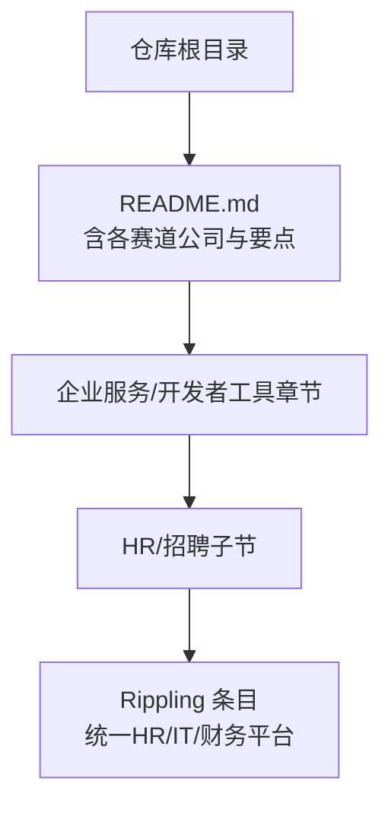
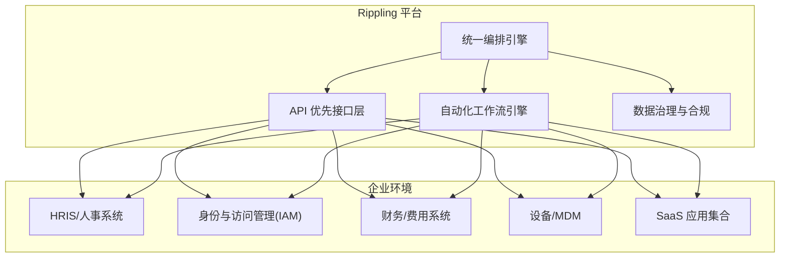
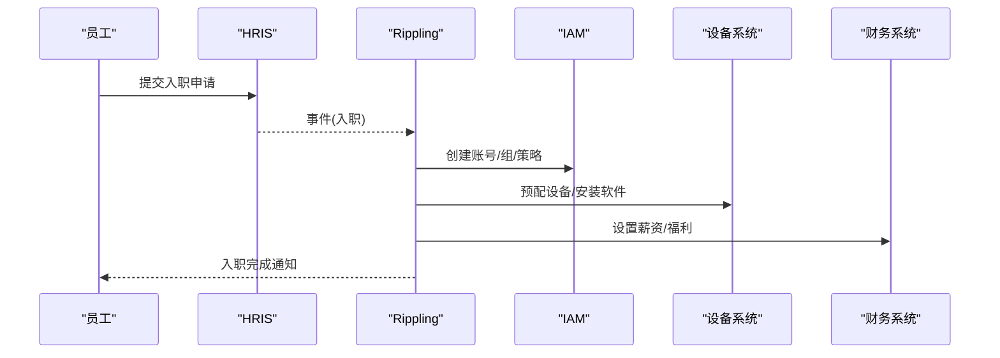
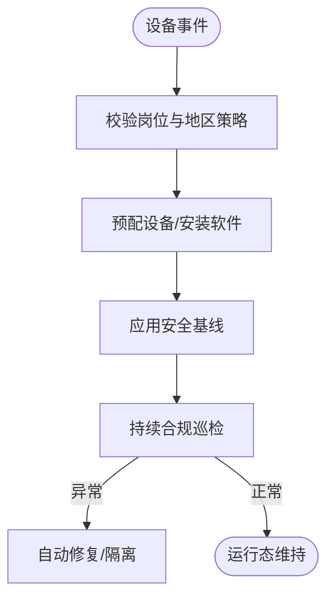
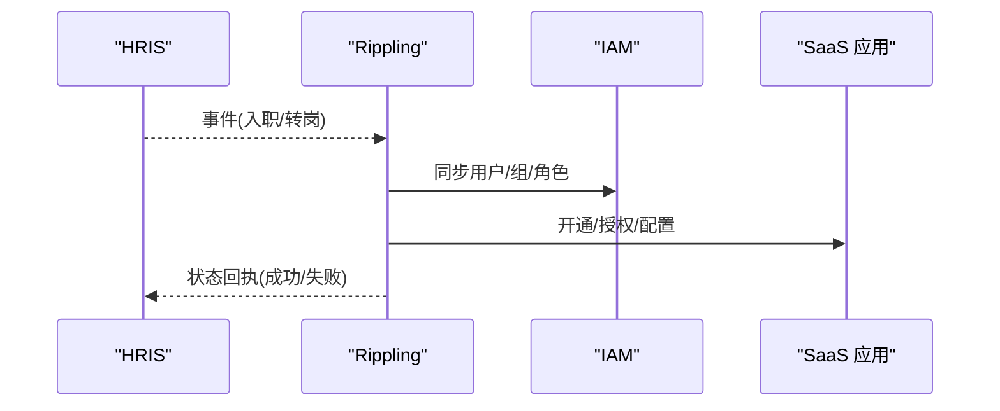
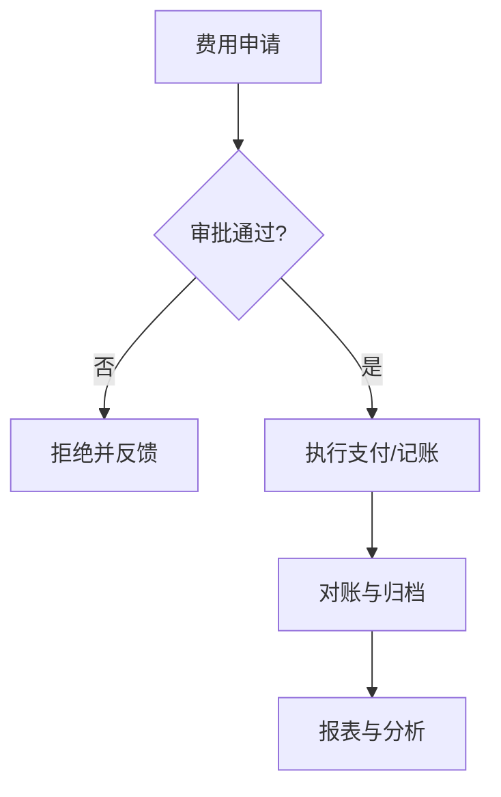
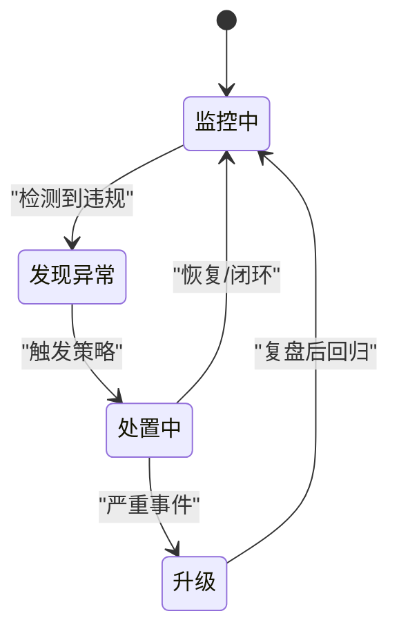
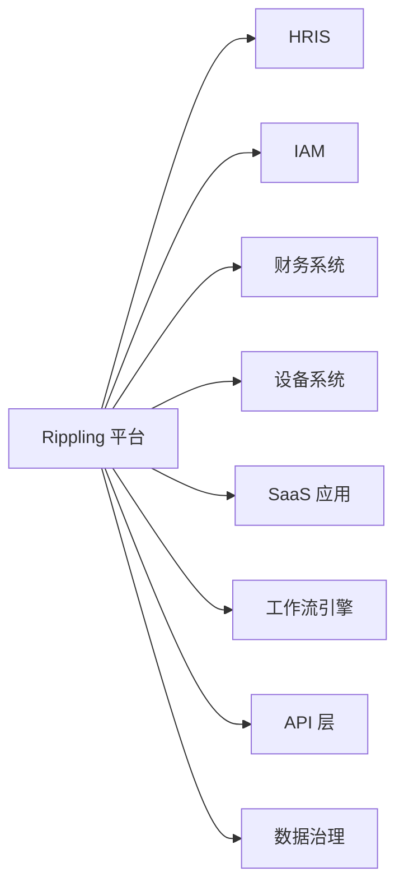

# 统一HR平台（Rippling）

<cite>
**本文引用的文件**
- [README.md](file://README.md)
</cite>

## 目录
1. [引言](#引言)
2. [项目结构](#项目结构)
3. [核心组件](#核心组件)
4. [架构总览](#架构总览)
5. [详细组件分析](#详细组件分析)
6. [依赖关系分析](#依赖关系分析)
7. [性能考量](#性能考量)
8. [故障排查指南](#故障排查指南)
9. [结论](#结论)
10. [附录](#附录)

## 引言
本文件围绕 Rippling 作为企业 SaaS 整合者的价值主张，系统阐述其将 HR、IT、财务等功能集于一体的平台化能力，并基于仓库中关于 Rippling 的条目信息，梳理其在企业数字化转型中的角色：系统整合、数据治理与流程优化。同时提供与其他 HR 系统的集成思路与迁移策略建议，以及采用投资回报分析与实施案例研究的方法论框架，帮助企业在选型与落地时做出科学决策。

## 项目结构
当前仓库为“精选初创公司清单”，其中包含对 Rippling 的简要条目，用于定位其在企业服务/开发者工具赛道的位置与基本事实。该文档将以该条目为基础，结合通用企业 SaaS 实践，构建面向读者的统一 HR 平台知识体系。

图表来源
- [README.md:913-931](file://README.md#L913-L931)

章节来源
- [README.md:913-931](file://README.md#L913-L931)

## 核心组件
根据仓库中对 Rippling 的定位（统一 HR / IT / 财务平台），可将其核心模块抽象为以下关键域：
- 员工生命周期管理：入职、转岗、离职等全链路自动化
- 设备配置：终端设备的发放、配置、回收与合规检查
- 应用部署：SaaS 应用的自动开通、权限分配与审计
- 费用管理：企业开支、报销、预算与合规控制
- 合规监控：访问控制、数据隐私、审计留痕与风险告警

这些模块共同构成“一体化”的企业运营中枢，减少多系统割裂带来的重复劳动与数据不一致问题。

章节来源
- [README.md:926-931](file://README.md#L926-L931)

## 架构总览
Rippling 的平台化设计强调“以 API 为先”和“工作流自动化”。在典型企业中，平台通过标准接口与企业现有系统（如身份提供商、财务系统、设备管理系统、HRIS 等）对接，形成统一的编排层，驱动跨系统的一致动作。

图表来源
- [README.md:926-931](file://README.md#L926-L931)

## 详细组件分析

### 员工生命周期管理
- 目标：实现从候选人到离职的全流程自动化，确保账号、设备、权限、薪酬与福利的一致性。
- 关键能力：
  - 事件驱动的工作流：入职/转岗/离职触发跨系统同步
  - 模板化审批与规则：按岗位、地区、职级差异化处理
  - 审计与合规：操作留痕、权限最小化、敏感变更双人复核
- 与外部系统集成：
  - 与 HRIS 保持主数据一致
  - 与 IAM 联动账号生命周期
  - 与设备系统联动资产发放与回收
  - 与财务系统联动薪资与福利结算

图表来源
- [README.md:926-931](file://README.md#L926-L931)

章节来源
- [README.md:926-931](file://README.md#L926-L931)

### 设备配置
- 目标：标准化设备发放、配置与回收，降低运维成本与安全风险。
- 关键能力：
  - 设备画像与基线配置：OS、安全策略、软件白名单
  - 远程管理与回滚：异常快速修复
  - 合规检查：加密、补丁、越权访问检测
- 集成点：
  - 与 HR 事件联动（入职/调岗/离职）
  - 与 MDM/UEM 协同下发策略
  - 与资产管理台账对齐

图表来源
- [README.md:926-931](file://README.md#L926-L931)

章节来源
- [README.md:926-931](file://README.md#L926-L931)

### 应用部署
- 目标：集中化 SaaS 应用的生命周期管理，确保“谁需要什么、何时需要、如何撤销”。
- 关键能力：
  - 应用目录与模板：一键开通、默认权限与分组
  - 与 IAM 深度集成：SSO、SCIM 同步
  - 使用率与合规报告：闲置清理、越权告警
- 集成点：
  - 与 HR 事件联动（入职/转岗/离职）
  - 与财务系统联动订阅计费与分摊

图表来源
- [README.md:926-931](file://README.md#L926-L931)

章节来源
- [README.md:926-931](file://README.md#L926-L931)

### 费用管理
- 目标：打通预算、采购、报销与支付，提升透明度与合规性。
- 关键能力：
  - 预算与审批流：事前控制、事中拦截、事后审计
  - 发票与对账：自动化采集、匹配与入账
  - 支出洞察：分类、趋势、异常检测
- 集成点：
  - 与财务系统对接总账与科目
  - 与银行/卡组织对接交易流水
  - 与采购系统对接合同与供应商

图表来源
- [README.md:926-931](file://README.md#L926-L931)

章节来源
- [README.md:926-931](file://README.md#L926-L931)

### 合规监控
- 目标：保障数据安全、访问受控、审计可追溯。
- 关键能力：
  - 访问控制矩阵：基于角色/属性的细粒度权限
  - 实时告警：异常登录、越权访问、敏感数据外泄
  - 审计与取证：操作日志、证据链、合规报告
- 集成点：
  - 与 IAM/审计系统对接
  - 与 SIEM/SOAR 联动处置
  - 与法规框架对齐（如隐私法、行业规范）

图表来源
- [README.md:926-931](file://README.md#L926-L931)

章节来源
- [README.md:926-931](file://README.md#L926-L931)

## 依赖关系分析
Rippling 作为“统一编排层”，对外依赖各类企业系统与协议，对内由工作流引擎与 API 层驱动。其耦合度主要体现在：
- 与 HRIS/IAM/财务/设备/应用系统的接口契约
- 工作流规则与策略库的稳定性
- 数据治理模型（主数据、权限模型、审计模型）

图表来源
- [README.md:926-931](file://README.md#L926-L931)

章节来源
- [README.md:926-931](file://README.md#L926-L931)

## 性能考量
- 可扩展性：事件驱动的异步编排，支持高并发入职/离职洪峰
- 可靠性：幂等接口、重试与补偿机制，保证跨系统一致性
- 可观测性：端到端追踪、指标与日志，便于容量规划与故障定位
- 安全性：最小权限、传输加密、敏感数据脱敏与访问审计

[本节为通用指导，不直接分析具体文件]

## 故障排查指南
- 常见问题定位：
  - 事件未触发：检查 HRIS 事件推送与签名校验
  - 权限不足：核对 IAM 角色映射与 SCIM 同步状态
  - 设备下发失败：确认 MDM 在线与策略版本兼容
  - 费用对账差异：核对账单口径、汇率与币种转换
- 排障步骤建议：
  - 从 API 层开始抓包与链路追踪
  - 检查工作流引擎的任务队列与重试次数
  - 核查数据治理模型的字段映射与约束
  - 输出审计日志与合规报告，辅助溯源

[本节为通用指导，不直接分析具体文件]

## 结论
基于仓库中对 Rippling 的定位（统一 HR / IT / 财务平台），其核心价值在于以 API 优先与工作流自动化，打通 HR、IT、财务等多域流程，减少系统孤岛，提升效率与合规水平。在企业数字化转型中，Rippling 可作为“编排中枢”，承担系统整合、数据治理与流程优化的关键角色。

[本节为总结性内容，不直接分析具体文件]

## 附录

### 与其他 HR 系统的集成方案
- 身份与访问：通过 SCIM/SSO 与主流 IAM 集成，实现账号生命周期自动化
- 人事数据：与 HRIS 建立双向同步，确保主数据一致
- 设备与软件：对接 MDM/UEM 与应用商店，实现批量部署与策略下发
- 财务与费用：与 ERP/费用系统对接，实现预算、报销与对账自动化
- 审计与合规：接入 SIEM/SOAR，实现告警联动与处置闭环

[本节为通用指导，不直接分析具体文件]

### 迁移策略
- 评估现状：盘点现有系统、数据质量与接口能力
- 制定蓝图：明确目标架构、数据模型与集成边界
- 分阶段迁移：先 HR 与 IAM，再设备与应用，最后财务与合规
- 并行验证：灰度发布、双写比对、回滚预案
- 培训与赋能：管理员与业务侧培训，建立运维与合规流程

[本节为通用指导，不直接分析具体文件]

### 投资回报分析（ROI）
- 成本节约：减少手工操作、降低错误率与合规风险
- 效率提升：缩短入职/离职周期，提高资源利用率
- 收入影响：加速业务上线，缩短产品交付时间
- 衡量指标：FTE 节省、平均处理时长、错误率、合规通过率、用户满意度

[本节为通用指导，不直接分析具体文件]

### 实施案例研究（方法论）
- 案例背景：行业、规模、痛点与目标
- 实施方案：范围、里程碑、集成点与风险控制
- 成效评估：前后对比、量化指标与定性反馈
- 经验沉淀：最佳实践、反模式与改进建议

[本节为通用指导，不直接分析具体文件]