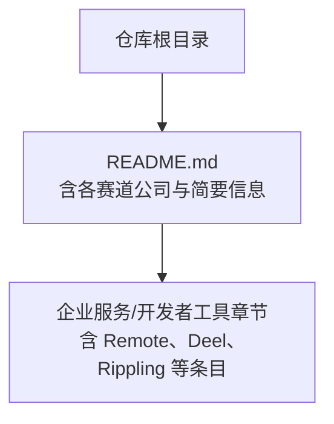
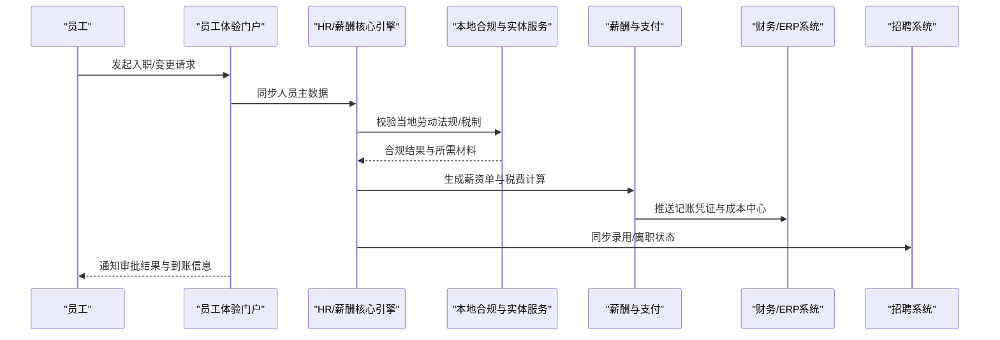
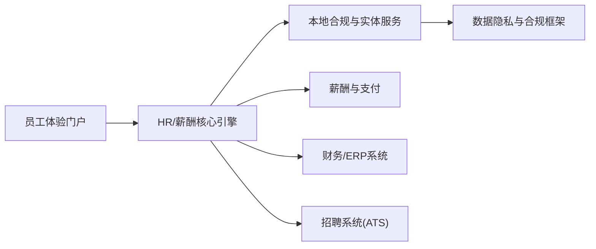

# 远程工作平台（Remote）

<cite>
**本文引用的文件**
- [README.md](file://README.md)
</cite>

## 目录
1. [简介](#简介)
2. [项目结构](#项目结构)
3. [核心组件](#核心组件)
4. [架构总览](#架构总览)
5. [详细组件分析](#详细组件分析)
6. [依赖关系分析](#依赖关系分析)
7. [性能与合规考量](#性能与合规考量)
8. [故障排查指南](#故障排查指南)
9. [结论](#结论)
10. [附录：选型与实施路线图](#附录选型与实施路线图)

## 简介
本文件面向企业决策者、HR/薪酬负责人与IT集成团队，系统化梳理 Remote 作为全球 HR 与薪酬解决方案的能力边界、差异化竞争策略以及与 Deel 的对比要点。内容基于仓库中关于 Remote 的基本信息，并结合行业通用实践进行结构化说明，帮助企业在复杂组织与多法域环境下做出稳健选型与落地规划。

## 项目结构
当前仓库为“精选初创公司清单”，其中包含 Remote 的基础条目，用于定位其在企业服务/开发者工具赛道中的位置与竞争格局。该仓库不直接提供产品源码或配置，因此本文以概念性架构图与流程图为载体，结合仓库中对 Remote 的定位信息进行解读。

图表来源
- [README.md:664-760](file://README.md#L664-L760)

章节来源
- [README.md:664-760](file://README.md#L664-L760)

## 核心组件
根据仓库对 Remote 的条目描述，Remote 的核心能力聚焦于“全球 HR / 薪酬”。围绕这一主线，通常可拆解为以下关键组件（概念层面）：
- 全球雇主实体服务：在多地设立或管理法律实体，支持本地雇佣与用工合规。
- 本地化合规与税务：覆盖劳动法、社保、个税、跨境支付与报表合规。
- 薪酬与福利管理：多币种薪资核算、发放、奖金与福利计划。
- 员工体验平台：入职、合同、考勤、假期、报销、绩效等一体化入口。
- 数据分析与洞察：人力成本、薪酬公平性、合规风险与组织效能指标。
- 系统集成与API：与ATS、HRIS、财务系统对接，支撑自动化流程。

章节来源
- [README.md:725-742](file://README.md#L725-L742)

## 架构总览
下图展示 Remote 在企业级场景下的典型交互与数据流（概念图），涵盖从员工生命周期到薪酬发放、合规上报与系统集成的闭环。

说明
- 该图为概念性流程图，用于帮助理解端到端业务链路；具体实现细节需参考供应商文档与接口规范。

## 详细组件分析
### 与 Deel 的差异化竞争策略
- 市场定位与规模：仓库将 Remote 标注为 Deel 的主要竞争对手之一，体现两者在全球远程雇佣与薪酬领域的直接竞争关系。
- 差异化方向（概念性总结）：
  - 大型企业与复杂组织架构适配：强调对多层级、多法域、多实体的集中治理与审计追踪能力。
  - 本地化合规深度：依托本地团队与实体网络，提供更贴近地方法律与税务实践的落地方案。
  - 集成与扩展性：通过开放API与企业级安全控制，满足与现有HRIS/财务系统的深度集成需求。
  - 数据与分析：提供跨地区薪酬公平性、成本结构与合规风险的可观测性。

章节来源
- [README.md:725-742](file://README.md#L725-L742)

### 全球雇主实体服务
- 作用：在目标国家/地区提供合法雇主身份，处理劳动合同、社保公积金、个税代扣代缴、解雇与争议处理等。
- 价值：降低跨国用工的法律与运营风险，缩短进入新市场的周期。
- 适用场景：海外扩张、区域总部搭建、灵活用工与外包转直聘过渡期。

### 本地化合规团队与支持体系
- 本地化合规：针对各地劳动法、最低工资、加班规则、带薪假、遣散补偿等进行持续跟踪与更新。
- 专业支持：提供法务、税务、薪酬专家咨询，协助应对审计、检查与纠纷。
- 培训与赋能：为企业HR与管理者提供合规操作手册与最佳实践。

### 企业级优势与复杂组织支持
- 多实体治理：支持集团级统一视图与分权分域管理，满足控股公司、事业部、区域公司的差异化诉求。
- 权限与安全：细粒度角色权限、审计日志、数据隔离与加密传输，满足内控与外部审计要求。
- 流程编排：复杂审批流、例外处理与回滚机制，保障大规模变更的安全可控。

### 薪酬管理系统
- 多币种与多税率：自动汇率换算、预扣税与社保计算、年终奖金与股权激励处理。
- 发放与对账：批量发放、失败重试、银行对账与差异处理。
- 成本归集：按部门/项目/成本中心分摊，便于财务核算与管理会计。

### 员工体验平台
- 一站式入口：合同签署、个人信息维护、请假与考勤、报销与补贴、绩效目标对齐。
- 自助服务：常见问题知识库、工单系统与SLA管理，提升员工满意度。
- 移动端与无障碍：支持移动办公与无障碍访问，提升包容性与可及性。

### 数据分析能力
- 指标体系：人均成本、薪酬带宽、地域差异、流失率、合规事件率等。
- 可视化与报告：自定义看板、导出与订阅、合规报表一键生成。
- 预测与预警：异常波动检测、合规风险预警、预算超支提醒。

## 依赖关系分析
- 内部依赖：员工体验门户与HR/薪酬核心引擎紧密耦合；薪酬引擎依赖本地合规规则库与支付通道。
- 外部依赖：财务/ERP系统用于记账与成本归集；招聘系统用于人员流入流出状态同步；银行与第三方支付用于资金结算。
- 合规依赖：各国劳动法、税法、数据隐私法（如GDPR、CCPA）影响数据处理与存储策略。

说明
- 该图为概念性依赖关系图，实际集成点与接口契约需依据供应商文档与组织现状定制。

## 性能与合规考量
- 性能
  - 并发与吞吐：薪酬批次处理需具备高并发能力与失败重试机制。
  - 可扩展性：随组织规模增长，支持横向扩展与弹性资源调度。
  - 可用性：关键路径（入职、发薪、报税）需具备冗余与灾备。
- 合规
  - 数据最小化与目的限定：仅收集必要信息，明确使用范围。
  - 跨境数据传输：遵循目的地与源地的数据出境规则，必要时采用本地化部署或脱敏。
  - 审计与留痕：全链路审计日志，满足内外部审计与监管检查。

## 故障排查指南
- 常见症状
  - 发薪失败：银行拒付、账户信息错误、汇率异常。
  - 合规报错：当地税表版本未更新、社保基数调整未生效。
  - 集成中断：ERP/ATS接口超时、认证失效、字段映射错误。
- 排查步骤
  - 核对基础数据：员工主数据、银行账户、税率与社保参数。
  - 查看日志与告警：定位失败节点与错误码，复现问题路径。
  - 验证第三方状态：银行/支付通道、ERP/ATS服务健康度。
  - 回滚与修复：必要时回滚至上一稳定版本，修正数据后重放。
- 预防措施
  - 变更前灰度发布与回归测试。
  - 建立SOP与演练预案，定期演练应急流程。
  - 监控关键指标：成功率、延迟、错误率与合规事件数。

## 结论
Remote 作为全球 HR 与薪酬解决方案，聚焦于在多法域环境下为企业提供合规、高效且可扩展的用工与薪酬管理能力。与 Deel 的直接竞争体现在市场覆盖、本地化合规深度与企业级集成能力等方面。对于大型企业而言，Remote 的价值在于降低跨国用工风险、提升组织效率与数据透明度，并通过标准化与自动化支撑全球化战略。

## 附录：选型与实施路线图
- 选型评估维度
  - 覆盖国家/地区数量与本地化合规能力
  - 企业级功能：权限、审计、SSO、API与集成生态
  - 数据安全与隐私合规
  - 总拥有成本（TCO）与ROI
  - 供应商服务能力与SLA
- 实施路线图（建议）
  - 阶段一：盘点与蓝图
    - 梳理组织与法域矩阵、现有系统与流程痛点
    - 制定目标架构与集成方案
  - 阶段二：试点与验证
    - 选择1–2个区域/BU进行试点
    - 验证合规、薪酬、集成与用户体验
  - 阶段三：规模化推广
    - 分批次扩面，完善培训与变更管理
    - 建立治理委员会与持续优化机制
  - 阶段四：运营与优化
    - 建立KPI与仪表盘，持续改进
    - 定期合规审查与系统升级