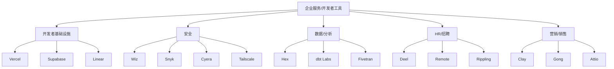
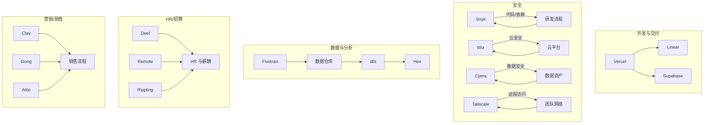
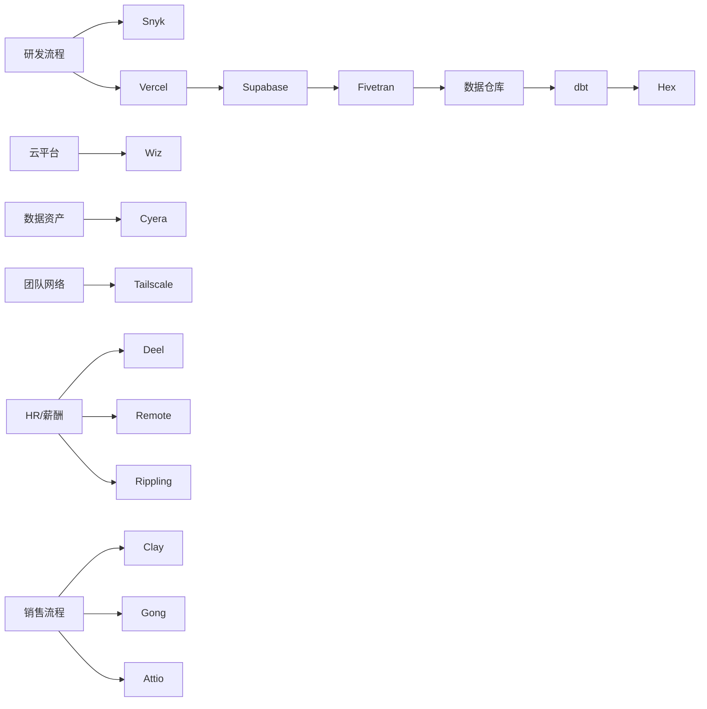

# 企业服务 / 开发者工具

<cite>
**本文引用的文件**
- [README.md](file://README.md)
</cite>

## 目录
1. [引言](#引言)
2. [项目结构](#项目结构)
3. [核心组件](#核心组件)
4. [架构总览](#架构总览)
5. [详细组件分析](#详细组件分析)
6. [依赖关系分析](#依赖关系分析)
7. [性能与规模化考量](#性能与规模化考量)
8. [选型指南与集成建议](#选型指南与集成建议)
9. [故障排查与合规要点](#故障排查与合规要点)
10. [结论](#结论)

## 引言
本文件聚焦“企业服务/开发者工具”子领域，基于仓库中的精选清单，系统梳理开发者基础设施、安全解决方案、数据分析平台、HR招聘工具、营销销售工具等关键赛道。内容涵盖各产品的核心价值主张、目标客户群体、商业模式特征，以及企业 SaaS 市场的竞争格局与发展趋势，并提供选型参考与集成建议，帮助企业在复杂生态中做出更优决策。

## 项目结构
该仓库以单文件 README 组织信息，按赛道分类呈现头部公司与其产品定位、融资与里程碑。与企业服务/开发者工具相关的条目集中在“企业服务/开发者工具”章节，覆盖以下子领域：
- 开发者基础设施：Vercel、Supabase、Linear
- 安全：Wiz、Snyk、Cyera、Tailscale
- 数据与分析：Hex、dbt Labs、Fivetran
- HR/招聘：Deel、Remote、Rippling
- 营销/销售：Clay、Gong、Attio

图表来源
- [README.md:615-710](file://README.md#L615-L710)

章节来源
- [README.md:615-710](file://README.md#L615-L710)

## 核心组件
本节对每个子领域的代表性产品进行价值主张、目标客户与商业模式的提炼，并给出典型使用场景与集成要点。

- 开发者基础设施
  - Vercel：面向前端/全栈的部署与协作平台，强调快速发布与 AI 生成能力（v0），适合现代 Web 应用与组件化开发。目标客户为前端团队、全栈工程师与产品团队；模式以订阅为主，结合用量计费。
  - Supabase：开源后端即服务（Postgres 生态），提供认证、存储、实时等功能，替代传统 Firebase 方案；目标客户为初创与成长期团队；模式含免费层与付费套餐。
  - Linear：高性能项目管理工具，强调速度与体验；目标客户为工程与产品团队；模式为订阅制。

- 安全
  - Wiz：云安全态势管理（CSPM）与云工作负载保护，强调无代理扫描与可视化；目标客户为中大型企业；模式为企业订阅。
  - Snyk：开发者安全平台，覆盖代码、依赖、容器与 IaC；目标客户为研发与安全团队；模式为订阅+用量。
  - Cyera：AI 时代的数据安全态势管理（DSPM），关注数据发现、分类与访问治理；目标客户为数据安全与合规团队；模式为企业订阅。
  - Tailscale：零配置 VPN（WireGuard），简化远程访问与内网互联；目标客户为分布式团队与开发者；模式为订阅。

- 数据与分析
  - Hex：AI 数据协作平台，融合 Notebook 与数据应用，内置 AI 助手；目标客户为数据分析师与业务用户；模式为订阅。
  - dbt Labs：数据转换工具链，推动 Analytics Engineer 实践；目标客户为数据工程与分析团队；模式为开源+企业版订阅。
  - Fivetran：自动化 ELT 数据集成，连接多源数据到仓库；目标客户为数据工程团队；模式为订阅+用量。

- HR/招聘
  - Deel：全球远程雇佣与薪酬合规平台；目标客户为跨国公司与远程团队；模式为企业订阅。
  - Remote：全球 HR/薪酬与合规；目标客户为出海企业与分布式团队；模式为企业订阅。
  - Rippling：统一 HR/IT/财务平台，整合员工生命周期与设备管理；目标客户为中大型企业；模式为企业订阅。

- 营销/销售
  - Clay：AI 驱动的外联与线索拓展平台；目标客户为增长与销售团队；模式为订阅。
  - Gong：对话智能与销售分析，洞察销售过程；目标客户为销售与市场团队；模式为企业订阅。
  - Attio：AI CRM，强调易用性与灵活性；目标客户为中小团队与增长型公司；模式为订阅。

章节来源
- [README.md:615-710](file://README.md#L615-L710)

## 架构总览
下图展示企业在使用上述工具时的常见集成拓扑：前端与部署由 Vercel 承载，后端与数据库通过 Supabase 提供；项目管理用 Linear；安全层面在代码与云端分别引入 Snyk 与 Wiz/Cyera；数据链路通过 Fivetran 采集至仓库，dbt 做转换，Hex 用于分析与协作；HR 与薪酬由 Deel/Remote/Rippling 统一管理；销售与营销由 Clay/Gong/Attio 协同。

图表来源
- [README.md:615-710](file://README.md#L615-L710)

## 详细组件分析

### 开发者基础设施
- Vercel
  - 价值主张：极速部署、前端优先、AI 生成（v0）提升组件产出效率。
  - 目标客户：前端/全栈团队、产品与设计师协作。
  - 商业模式：订阅 + 用量；企业版增强安全与治理。
  - 集成要点：与 CI/CD、域名与监控集成；与 v0 协作提升 UI 产出速度。
- Supabase
  - 价值主张：开源、Postgres 原生、一站式后端能力。
  - 目标客户：初创与成长期团队，追求可移植与可控性。
  - 商业模式：免费层 + 付费套餐；企业级功能按需扩展。
  - 集成要点：与 Vercel 深度集成；与 dbt/Fivetran 配合构建数据链路。
- Linear
  - 价值主张：极致速度与体验的项目管理。
  - 目标客户：工程与产品团队。
  - 商业模式：订阅制。
  - 集成要点：与 GitHub/Slack/CI 集成，形成端到端交付流。

章节来源
- [README.md:615-635](file://README.md#L615-L635)

### 安全解决方案
- Wiz
  - 价值主张：无代理 CSPM，快速发现与修复云风险。
  - 目标客户：中大型企业安全与云团队。
  - 商业模式：企业订阅。
  - 集成要点：对接多云账户；与 SIEM/SOAR 联动。
- Snyk
  - 价值主张：开发者安全左移，覆盖代码、依赖、容器与 IaC。
  - 目标客户：研发与安全团队。
  - 商业模式：订阅 + 用量。
  - 集成要点：嵌入 IDE、CI/CD 与制品库。
- Cyera
  - 价值主张：AI 时代 DSPM，数据发现、分类与访问治理。
  - 目标客户：数据安全与合规团队。
  - 商业模式：企业订阅。
  - 集成要点：对接数据仓库与对象存储；与身份系统联动。
- Tailscale
  - 价值主张：零配置 VPN，简化远程访问。
  - 目标客户：分布式团队与开发者。
  - 商业模式：订阅。
  - 集成要点：与身份提供商（SSO）集成；与防火墙策略协同。

章节来源
- [README.md:636-658](file://README.md#L636-L658)

### 数据分析平台
- Hex
  - 价值主张：Notebook 与数据应用融合，AI 助手提升分析效率。
  - 目标客户：数据分析师与业务用户。
  - 商业模式：订阅。
  - 集成要点：与数据仓库直连；与 BI 工具互补。
- dbt Labs
  - 价值主张：数据转换工程化，推动 Analytics Engineer 实践。
  - 目标客户：数据工程与分析团队。
  - 商业模式：开源 + 企业版订阅。
  - 集成要点：与仓库（Snowflake/BigQuery/Databricks）集成；与 CI/CD 协作。
- Fivetran
  - 价值主张：自动化 ELT，降低数据接入成本。
  - 目标客户：数据工程团队。
  - 商业模式：订阅 + 用量。
  - 集成要点：连接器丰富；与 dbt/Hive/仓库无缝衔接。

章节来源
- [README.md:659-675](file://README.md#L659-L675)

### HR/招聘工具
- Deel
  - 价值主张：全球远程雇佣与薪酬合规。
  - 目标客户：跨国公司与远程团队。
  - 商业模式：企业订阅。
  - 集成要点：与 payroll、税务、福利系统对接。
- Remote
  - 价值主张：全球 HR/薪酬与合规。
  - 目标客户：出海企业与分布式团队。
  - 商业模式：企业订阅。
  - 集成要点：与本地合规机构与银行对接。
- Rippling
  - 价值主张：统一 HR/IT/财务平台，一体化管理。
  - 目标客户：中大型企业。
  - 商业模式：企业订阅。
  - 集成要点：与 SSO、设备管理、财务系统集成。

章节来源
- [README.md:676-694](file://README.md#L676-L694)

### 营销/销售工具
- Clay
  - 价值主张：AI 驱动外联与线索拓展。
  - 目标客户：增长与销售团队。
  - 商业模式：订阅。
  - 集成要点：与 CRM、邮件与营销自动化工具集成。
- Gong
  - 价值主张：对话智能与销售分析，优化转化。
  - 目标客户：销售与市场团队。
  - 商业模式：企业订阅。
  - 集成要点：与电话/会议系统、CRM 集成。
- Attio
  - 价值主张：AI CRM，灵活易用。
  - 目标客户：中小团队与增长型公司。
  - 商业模式：订阅。
  - 集成要点：与邮件、日历、营销工具集成。

章节来源
- [README.md:695-710](file://README.md#L695-L710)

## 依赖关系分析
从企业落地视角看，这些工具之间存在明显的上下游依赖：
- 开发与交付：Vercel 与 Supabase 常组合使用，Linear 贯穿需求到交付。
- 安全：Snyk 在研发阶段前置，Wiz/Cyera 在云端与数据侧保障，Tailscale 保障远程访问安全。
- 数据：Fivetran 负责采集，dbt 负责转换，Hex 用于分析与协作。
- HR：Deel/Remote/Rippling 共同支撑全球化用工与薪酬。
- 营销/销售：Clay/Gong/Attio 形成线索到转化的闭环。

图表来源
- [README.md:615-710](file://README.md#L615-L710)

章节来源
- [README.md:615-710](file://README.md#L615-L710)

## 性能与规模化考量
- 开发与交付
  - Vercel：关注构建缓存、边缘节点与并发限制；合理拆分应用与静态资源以提升首屏性能。
  - Supabase：数据库索引与查询优化、连接池与读写分离策略；结合缓存层降低延迟。
  - Linear：大规模团队需规范工作流与权限模型，避免看板臃肿。
- 安全
  - Snyk：依赖更新频率与告警降噪；将质量门禁纳入 CI。
  - Wiz/Cyera：持续扫描与基线对齐；与变更管理联动减少漂移。
  - Tailscale：最小权限原则与网络分段；结合审计日志。
- 数据与分析
  - Fivetran：连接器选择与增量同步策略；控制失败重试与幂等。
  - dbt：模型分层与测试覆盖率；CI/CD 保证质量。
  - Hex：权限与共享机制；注意数据可见性与计算成本。
- HR/招聘
  - Deel/Remote/Rippling：合规区域覆盖与税率更新；批量操作与审批流设计。
- 营销/销售
  - Clay/Gong/Attio：数据清洗与去重；通话/邮件隐私与合规。

[本节为通用指导，不直接分析具体文件]

## 选型指南与集成建议
- 开发者基础设施
  - 若重视前端体验与发布速度：优先 Vercel；如需强后端能力且希望开源可控：Supabase。
  - 项目管理：Linear 适合追求速度与体验的工程团队。
- 安全
  - 代码与依赖：Snyk；云安全：Wiz；数据安全：Cyera；远程访问：Tailscale。
  - 建议将安全左移至研发流程，并在云端与数据侧建立持续监控。
- 数据与分析
  - 数据采集：Fivetran；转换：dbt；分析与协作：Hex。
  - 建议建立数据契约与测试，确保质量与可维护性。
- HR/招聘
  - 跨国用工与合规：Deel/Remote；一体化平台：Rippling。
  - 建议根据公司规模与地域复杂度选择，并评估本地化合规支持。
- 营销/销售
  - 外联与线索：Clay；销售洞察：Gong；CRM：Attio。
  - 建议打通 CRM 与营销自动化，形成线索到转化的闭环。

[本节为通用指导，不直接分析具体文件]

## 故障排查与合规要点
- 开发与交付
  - 常见问题：构建失败、缓存失效、域名解析问题；建议完善日志与回滚策略。
- 安全
  - 常见问题：误报告警、权限不足、策略漂移；建议建立基线与自动化修复。
  - 合规：关注数据跨境、隐私法规（如 GDPR/CCPA）与审计要求。
- 数据与分析
  - 常见问题：ETL 失败、模型冲突、权限错误；建议加强监控与测试。
  - 合规：数据分级分类、访问控制与脱敏策略。
- HR/招聘
  - 常见问题：薪酬计算错误、合规差异；建议定期审计与培训。
- 营销/销售
  - 常见问题：数据重复、通话录音合规；建议制定数据治理与合规流程。

[本节为通用指导，不直接分析具体文件]

## 结论
企业服务与开发者工具生态正加速演进：AI 驱动的效率提升、安全左移与数据治理成为共识，HR 与营销销售工具也在向智能化与一体化发展。企业在选型时应结合自身规模、技术栈与合规要求，构建“开发—安全—数据—HR—营销/销售”的完整闭环，并通过标准化集成与治理机制实现可持续增长。

[本节为总结性内容，不直接分析具体文件]