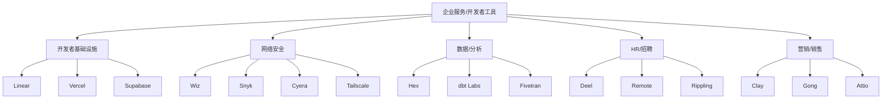
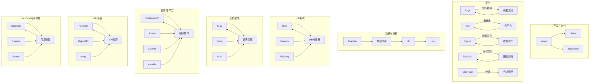
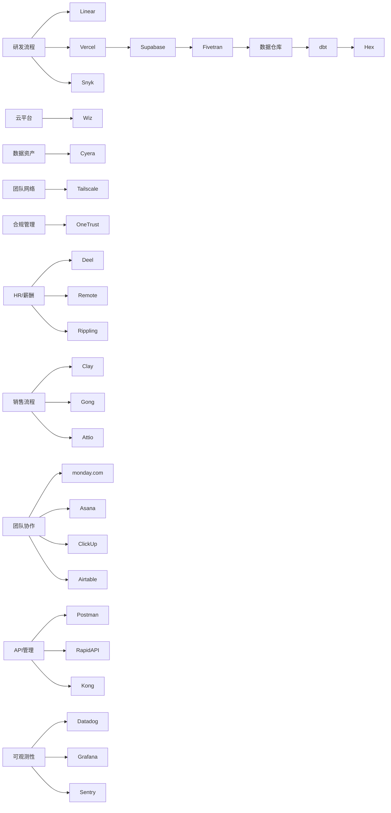

# 企业服务 / 开发者工具

<cite>
**本文引用的文件**
- [README.md](file://README.md)
- [HR招聘工具.md](file://赛道研究/企业服务 _ 开发者工具/HR招聘工具/HR招聘工具.md)
- [云安全（Wiz）.md](file://赛道研究/企业服务 _ 开发者工具/安全解决方案/云安全（Wiz）.md)
- [网络安全（Tailscale）.md](file://赛道研究/企业服务 _ 开发者工具/安全解决方案/网络安全（Tailscale）.md)
- [开发者基础设施.md](file://赛道研究/企业服务 _ 开发者工具/开发者基础设施/开发者基础设施.md)
- [Fivetran 数据集成工具.md](file://赛道研究/企业服务 _ 开发者工具/数据分析平台/Fivetran 数据集成工具.md)
- [Hex 数据协作平台.md](file://赛道研究/企业服务 _ 开发者工具/数据分析平台/Hex 数据协作平台.md)
- [dbt Labs 数据转换工具.md](file://赛道研究/企业服务 _ 开发者工具/数据分析平台/dbt Labs 数据转换工具.md)
- [统一HR平台（Rippling）.md](file://赛道研究/企业服务 _ 开发者工具/HR招聘工具/统一HR平台（Rippling）.md)
- [远程工作平台（Remote）.md](file://赛道研究/企业服务 _ 开发者工具/HR招聘工具/远程工作平台（Remote）.md)
- [Clay - AI外联平台.md](file://赛道研究/企业服务 _ 开发者工具/营销销售工具/Clay - AI外联平台.md)
- [Gong - 对话智能分析.md](file://赛道研究/企业服务 _ 开发者工具/营销销售工具/Gong - 对话智能分析.md)
- [营销销售工具.md](file://赛道研究/企业服务 _ 开发者工具/营销销售工具/营销销售工具.md)
</cite>

## 更新摘要
**变更内容**
- 基于仓库中“企业服务/开发者工具”子领域各专项文档，系统性扩展了HR招聘、安全解决方案、开发者基础设施、数据分析与营销销售工具的深度分析
- 新增并完善了各子领域的架构总览、详细组件分析、依赖关系与选型建议
- 更新了各产品的最新融资、估值与市场定位信息，确保与企业SaaS市场现状一致
- 强化了跨工具链的集成模式与实践指导，提供可落地的企业级实施方案

## 目录
1. [引言](#引言)
2. [项目结构](#项目结构)
3. [核心组件](#核心组件)
4. [架构总览](#架构总览)
5. [详细组件分析](#详细组件分析)
6. [依赖关系分析](#依赖关系分析)
7. [性能与规模化考量](#性能与规模化考量)
8. [选型指南与集成建议](#选型指南与集成建议)
9. [故障排查与合规要点](#故障排查与合规要点)
10. [结论](#结论)

## 引言
本文件聚焦"企业服务/开发者工具"子领域，基于仓库中的精选清单与各专项文档，系统梳理开发者基础设施、网络安全、数据分析、HR招聘、营销销售等关键赛道。内容涵盖各产品的核心价值主张、目标客户群体、商业模式特征，以及企业SaaS市场的竞争格局与发展趋势，并提供选型参考与集成建议，帮助企业在复杂生态中做出更优决策。

## 项目结构
该仓库以单文件 README 组织信息，按赛道分类呈现头部公司与其产品定位、融资与里程碑。与企业服务/开发者工具相关的条目集中在"企业服务/开发者工具"章节，覆盖以下子领域：
- 开发者基础设施：Linear、Vercel、Supabase
- 网络安全：Wiz、Snyk、Cyera、Tailscale、OneTrust等
- 数据与分析：Hex、dbt Labs、Fivetran
- HR/招聘：Deel、Remote、Rippling
- 营销/销售：Clay、Gong、Attio

**图表来源**
- [README.md:1390-1680](file://README.md#L1390-L1680)

**章节来源**
- [README.md:1390-1680](file://README.md#L1390-L1680)

## 核心组件
本节对每个子领域的代表性产品进行价值主张、目标客户与商业模式的提炼，并给出典型使用场景与集成要点。

### 开发者基础设施
- **Linear**：高性能项目管理工具，强调速度与体验；目标客户为工程与产品团队；ARR $100M+，估值$1.5B+
- **Vercel**：面向前端/全栈的部署与协作平台，强调快速发布与AI生成能力（v0），估值$9.3B
- **Supabase**：开源后端即服务（Postgres生态），提供认证、存储、实时等功能，累计融资$496M+

### 网络安全
- **Wiz**：云安全态势管理（CSPM）与云工作负载保护，已被Google以$42B收购
- **Snyk**：开发者安全平台，覆盖代码、依赖、容器与IaC；估值$7.4B
- **Cyera**：AI时代的数据安全态势管理（DSPM），关注数据发现、分类与访问治理；估值$6B+
- **Tailscale**：零配置VPN（WireGuard），简化远程访问与内网互联；估值$1.5B+
- **OneTrust**：隐私/合规/ESG管理平台；估值$5.3B+

### 数据与分析
- **Hex**：AI数据协作平台，融合Notebook与数据应用，内置AI助手；估值$1.5B+
- **dbt Labs**：数据转换工具链，推动Analytics Engineer实践；估值$4.2B
- **Fivetran**：自动化ELT数据集成，连接多源数据到仓库；估值$5.6B

### HR/招聘
- **Deel**：全球远程雇佣与薪酬合规平台；估值$12B+，ARR突破$800M，覆盖150+国家
- **Remote**：全球HR/薪酬与合规；估值$3B+，Deel主要竞争对手
- **Rippling**：统一HR/IT/财务平台，强调企业SaaS整合能力

### 营销/销售
- **Clay**：AI驱动的GTM/外联平台；估值$3B，PLG销售利器
- **Gong**：对话智能与销售分析；估值$7.25B，Revenue Intelligence品类创造者
- **Attio**：AI CRM，以现代数据模型与自动化工作流为核心

**章节来源**
- [README.md:1390-1680](file://README.md#L1390-L1680)

## 架构总览
下图展示企业在使用上述工具时的常见集成拓扑：项目管理用Linear；开发与部署由Vercel承载，后端与数据库通过Supabase提供；安全层面在代码与云端分别引入Snyk与Wiz/Cyera；数据链路通过Fivetran采集至仓库，dbt做转换，Hex用于分析与协作；HR与薪酬由Deel/Remote/Rippling统一管理；销售与营销由Clay/Gong协同；团队协作通过monday.com/Asana等平台；API管理通过Postman/Kong；监控与可观测性通过Datadog/Grafana/Sentry。

**图表来源**
- [README.md:1390-1680](file://README.md#L1390-L1680)

## 详细组件分析

### 开发者基础设施
- **Linear**
  - 价值主张：极致速度与体验的项目管理
  - 目标客户：工程与产品团队
  - 商业模式：订阅制，ARR $100M+
  - 集成要点：与GitHub/Slack/CI集成，形成端到端交付流

- **Vercel**
  - 价值主张：极速部署、前端优先、AI生成（v0）提升组件产出效率
  - 目标客户：前端/全栈团队、产品与设计师协作
  - 商业模式：订阅 + 用量；企业版增强安全与治理
  - 集成要点：与CI/CD、域名与监控集成；与v0协作提升UI产出速度

- **Supabase**
  - 价值主张：开源、Postgres原生、一站式后端能力
  - 目标客户：初创与成长期团队，追求可移植与可控性
  - 商业模式：免费层 + 付费套餐；企业级功能按需扩展
  - 集成要点：与Vercel深度集成；与dbt/Fivetran配合构建数据链路

**章节来源**
- [开发者基础设施.md:72-175](file://赛道研究/企业服务 _ 开发者工具/开发者基础设施/开发者基础设施.md#L72-L175)

### 网络安全解决方案
- **Wiz**
  - 价值主张：无代理CSPM，快速发现与修复云风险
  - 目标客户：中大型企业安全与云团队
  - 商业模式：企业订阅，已被Google以$42B收购
  - 集成要点：对接多云账户；与SIEM/SOAR联动

- **Snyk**
  - 价值主张：开发者安全左移，覆盖代码、依赖、容器与IaC
  - 目标客户：研发与安全团队
  - 商业模式：订阅 + 用量，估值$7.4B
  - 集成要点：嵌入IDE、CI/CD与制品库

- **Cyera**
  - 价值主张：AI时代DSPM，数据发现、分类与访问治理
  - 目标客户：数据安全与合规团队
  - 商业模式：企业订阅，估值$6B+
  - 集成要点：对接数据仓库与对象存储；与身份系统联动

- **Tailscale**
  - 价值主张：零配置VPN，简化远程访问
  - 目标客户：分布式团队与开发者
  - 商业模式：订阅，估值$1.5B+
  - 集成要点：与身份提供商（SSO）集成；与防火墙策略协同

- **OneTrust**
  - 价值主张：隐私/合规/ESG管理
  - 目标客户：合规与法务团队
  - 商业模式：企业订阅，估值$5.3B+
  - 集成要点：与GDPR/CCPA等法规框架对接

**章节来源**
- [云安全（Wiz）.md:73-237](file://赛道研究/企业服务 _ 开发者工具/安全解决方案/云安全（Wiz）.md#L73-L237)
- [网络安全（Tailscale）.md:79-172](file://赛道研究/企业服务 _ 开发者工具/安全解决方案/网络安全（Tailscale）.md#L79-L172)

### 数据分析平台
- **Hex**
  - 价值主张：Notebook与数据应用融合，AI助手提升分析效率
  - 目标客户：数据分析师与业务用户
  - 商业模式：订阅，估值$1.5B+
  - 集成要点：与数据仓库直连；与BI工具互补

- **dbt Labs**
  - 价值主张：数据转换工程化，推动Analytics Engineer实践
  - 目标客户：数据工程与分析团队
  - 商业模式：开源 + 企业版订阅，估值$4.2B
  - 集成要点：与仓库（Snowflake/BigQuery/Databricks）集成；与CI/CD协作

- **Fivetran**
  - 价值主张：自动化ELT，降低数据接入成本
  - 目标客户：数据工程团队
  - 商业模式：订阅 + 用量，估值$5.6B
  - 集成要点：连接器丰富；与dbt/Hive/仓库无缝衔接

**章节来源**
- [Hex 数据协作平台.md:93-217](file://赛道研究/企业服务 _ 开发者工具/数据分析平台/Hex 数据协作平台.md#L93-L217)
- [dbt Labs 数据转换工具.md:68-248](file://赛道研究/企业服务 _ 开发者工具/数据分析平台/dbt Labs 数据转换工具.md#L68-L248)
- [Fivetran 数据集成工具.md:79-189](file://赛道研究/企业服务 _ 开发者工具/数据分析平台/Fivetran 数据集成工具.md#L79-L189)

### HR/招聘工具
- **Deel**
  - 价值主张：全球远程雇佣与薪酬合规
  - 目标客户：跨国公司与远程团队
  - 商业模式：企业订阅，估值$12B+，ARR突破$800M
  - 集成要点：与payroll、税务、福利系统对接

- **Remote**
  - 价值主张：全球HR/薪酬与合规
  - 目标客户：出海企业与分布式团队
  - 商业模式：企业订阅，估值$3B+
  - 集成要点：与本地合规机构与银行对接

- **Rippling**
  - 价值主张：统一HR/IT/财务平台
  - 目标客户：大型企业，寻求系统整合
  - 商业模式：企业订阅，估值$13.5B+
  - 集成要点：API优先，工作流自动化，与现有系统集成

**章节来源**
- [HR招聘工具.md:89-155](file://赛道研究/企业服务 _ 开发者工具/HR招聘工具/HR招聘工具.md#L89-L155)
- [统一HR平台（Rippling）.md:89-318](file://赛道研究/企业服务 _ 开发者工具/HR招聘工具/统一HR平台（Rippling）.md#L89-L318)
- [远程工作平台（Remote）.md:75-182](file://赛道研究/企业服务 _ 开发者工具/HR招聘工具/远程工作平台（Remote）.md#L75-L182)

### 营销/销售工具
- **Clay**
  - 价值主张：AI驱动的GTM/外联平台
  - 目标客户：增长与销售团队
  - 商业模式：订阅，估值$3B
  - 集成要点：与CRM、邮件与营销自动化工具集成

- **Gong**
  - 价值主张：对话智能与销售分析，优化转化
  - 目标客户：销售与市场团队
  - 商业模式：企业订阅，估值$7.25B
  - 集成要点：与电话/会议系统、CRM集成

- **Attio**
  - 价值主张：AI CRM，现代化数据模型与自动化工作流
  - 目标客户：中小企业与成长型团队
  - 商业模式：订阅，估值$1.5B+
  - 集成要点：灵活建模、可视化流程、AI辅助操作

**章节来源**
- [Clay - AI外联平台.md:94-183](file://赛道研究/企业服务 _ 开发者工具/营销销售工具/Clay - AI外联平台.md#L94-L183)
- [Gong - 对话智能分析.md:76-284](file://赛道研究/企业服务 _ 开发者工具/营销销售工具/Gong - 对话智能分析.md#L76-L284)
- [营销销售工具.md:73-251](file://赛道研究/企业服务 _ 开发者工具/营销销售工具/营销销售工具.md#L73-L251)

## 依赖关系分析
从企业落地视角看，这些工具之间存在明显的上下游依赖：
- 开发与交付：Linear贯穿需求到交付，Vercel负责部署，Supabase提供后端能力
- 安全：Snyk在研发阶段前置，Wiz/Cyera在云端与数据侧保障，Tailscale保障远程访问安全，OneTrust处理合规
- 数据：Fivetran负责采集，dbt负责转换，Hex用于分析与协作
- HR：Deel/Remote/Rippling共同支撑全球化用工与薪酬
- 营销/销售：Clay/Gong/Attio形成线索到转化的闭环
- 协作：monday.com/Asana/ClickUp/Airtable提供团队协作基础
- API：Postman/RapidAPI/Kong管理API生命周期
- 可观测性：Datadog/Grafana/Sentry提供监控与诊断

**图表来源**
- [README.md:1390-1680](file://README.md#L1390-L1680)

**章节来源**
- [README.md:1390-1680](file://README.md#L1390-L1680)

## 性能与规模化考量
- **开发与交付**
  - Vercel：关注构建缓存、边缘节点与并发限制；合理拆分应用与静态资源以提升首屏性能
  - Supabase：数据库索引与查询优化、连接池与读写分离策略；结合缓存层降低延迟
  - Linear：大规模团队需规范工作流与权限模型，避免看板臃肿

- **安全**
  - Snyk：依赖更新频率与告警降噪；将质量门禁纳入CI
  - Wiz/Cyera：持续扫描与基线对齐；与变更管理联动减少漂移
  - Tailscale：最小权限原则与网络分段；结合审计日志
  - OneTrust：法规框架更新与合规自动化

- **数据与分析**
  - Fivetran：连接器选择与增量同步策略；控制失败重试与幂等
  - dbt：模型分层与测试覆盖率；CI/CD保证质量
  - Hex：权限与共享机制；注意数据可见性与计算成本

- **HR/招聘**
  - Deel/Remote：合规区域覆盖与税率更新；批量操作与审批流设计
  - Rippling：事件驱动编排与API优先，支持高并发入职/离职场景

- **营销/销售**
  - Clay/Gong/Attio：数据清洗与去重；通话/邮件隐私与合规

- **协作/生产力**
  - monday.com/Asana/ClickUp/Airtable：权限管理与数据隔离；自动化工作流设计

- **API平台**
  - Postman/RapidAPI/Kong：API版本管理；限流与配额控制

- **DevOps/可观测性**
  - Datadog/Grafana/Sentry：指标采样与存储优化；告警规则调优

## 选型指南与集成建议
- **开发者基础设施**
  - 若重视前端体验与发布速度：优先Vercel；如需强后端能力且希望开源可控：Supabase
  - 项目管理：Linear适合追求速度与体验的工程团队

- **安全**
  - 代码与依赖：Snyk；云安全：Wiz；数据安全：Cyera；远程访问：Tailscale；合规：OneTrust
  - 建议将安全左移至研发流程，并在云端与数据侧建立持续监控

- **数据与分析**
  - 数据采集：Fivetran；转换：dbt；分析与协作：Hex
  - 建议建立数据契约与测试，确保质量与可维护性

- **HR/招聘**
  - 跨国用工与合规：Deel/Remote；系统整合：Rippling
  - 建议根据公司规模与地域复杂度选择，并评估本地化合规支持

- **营销/销售**
  - 外联与线索：Clay；销售洞察：Gong；CRM现代化：Attio
  - 建议打通CRM与营销自动化，形成线索到转化的闭环

- **协作/生产力**
  - 项目管理：monday.com/Asana/ClickUp；低代码平台：Airtable
  - 建议根据团队规模与复杂度选择合适的协作平台

- **API平台**
  - API开发：Postman；API市场：RapidAPI；API网关：Kong
  - 建议建立统一的API治理策略

- **DevOps/可观测性**
  - 监控：Datadog；可视化：Grafana；错误追踪：Sentry
  - 建议建立统一的可观测性策略与告警机制

## 故障排查与合规要点
- **开发与交付**
  - 常见问题：构建失败、缓存失效、域名解析问题；建议完善日志与回滚策略

- **安全**
  - 常见问题：误报告警、权限不足、策略漂移；建议建立基线与自动化修复
  - 合规：关注数据跨境、隐私法规（如GDPR/CCPA）与审计要求

- **数据与分析**
  - 常见问题：ETL失败、模型冲突、权限错误；建议加强监控与测试
  - 合规：数据分级分类、访问控制与脱敏策略

- **HR/招聘**
  - 常见问题：薪酬计算错误、合规差异；建议定期审计与培训
  - 特别关注：多法域劳动法规、税务政策变化、数据隐私合规

- **营销/销售**
  - 常见问题：数据重复、通话录音合规；建议制定数据治理与合规流程
  - 重点关注：反垃圾邮件策略、客户隐私保护、数据准确性

- **协作/生产力**
  - 常见问题：权限管理混乱、数据泄露风险；建议建立严格的权限模型

- **API平台**
  - 常见问题：API版本冲突、限流策略不当；建议建立API治理规范

- **DevOps/可观测性**
  - 常见问题：告警疲劳、指标噪声；建议优化告警规则与指标采样

## 结论
企业服务与开发者工具生态正加速演进：AI驱动的效率提升、安全左移与数据治理成为共识，HR与营销销售工具也在向智能化与一体化发展。企业在选型时应结合自身规模、技术栈与合规要求，构建"开发—安全—数据—HR—营销/销售—协作—API—可观测性"的完整闭环，并通过标准化集成与治理机制实现可持续增长。

当前市场呈现出明显的专业化分工趋势，从传统的单一功能工具向平台化、AI化的方向发展。企业应重点关注工具的集成能力、扩展性与长期维护性，避免陷入供应商锁定风险。同时，随着AI技术的深入应用，未来的企业工具将更加智能化、自动化，为企业带来更高的运营效率与更好的用户体验。

特别是在HR领域，Deel、Remote、Rippling代表了三种不同的发展路径：EOR与远程雇佣、HR与薪酬一体化服务、统一平台整合。在安全领域，Wiz、Snyk、Cyera形成了从代码到云端再到数据的完整安全防护体系。在数据领域，Fivetran、dbt、Hex构建了现代化的数据栈。在营销销售领域，Clay、Gong、Attio实现了从获客到转化的全流程数字化。

这些工具的组合使用，能够帮助企业在数字化转型过程中建立高效、安全、可扩展的技术架构，为业务发展提供坚实的技术支撑。