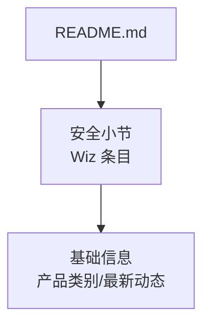
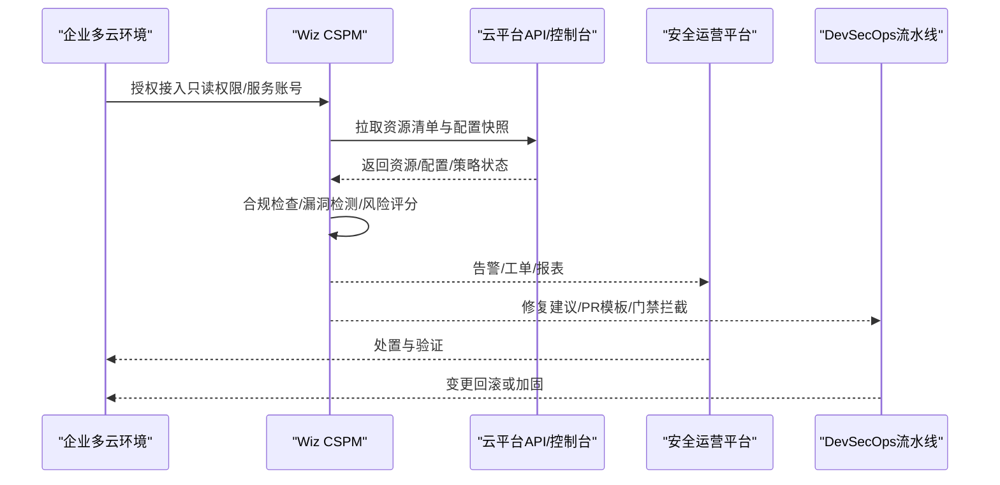
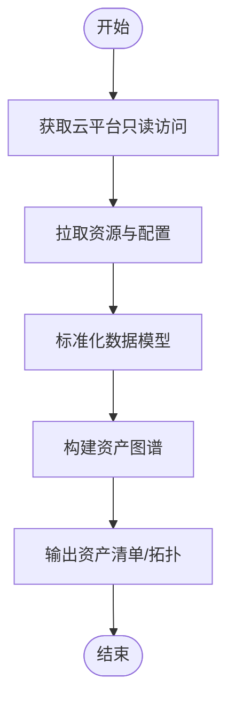
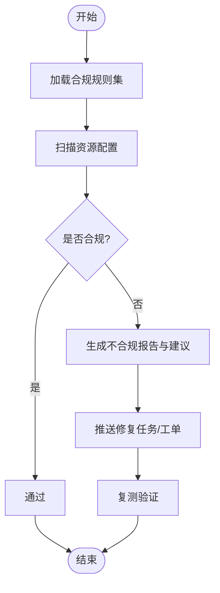
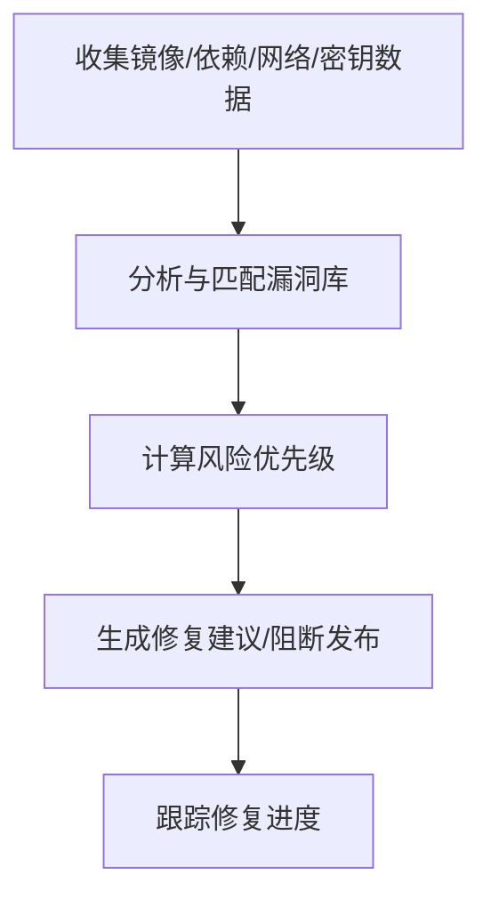
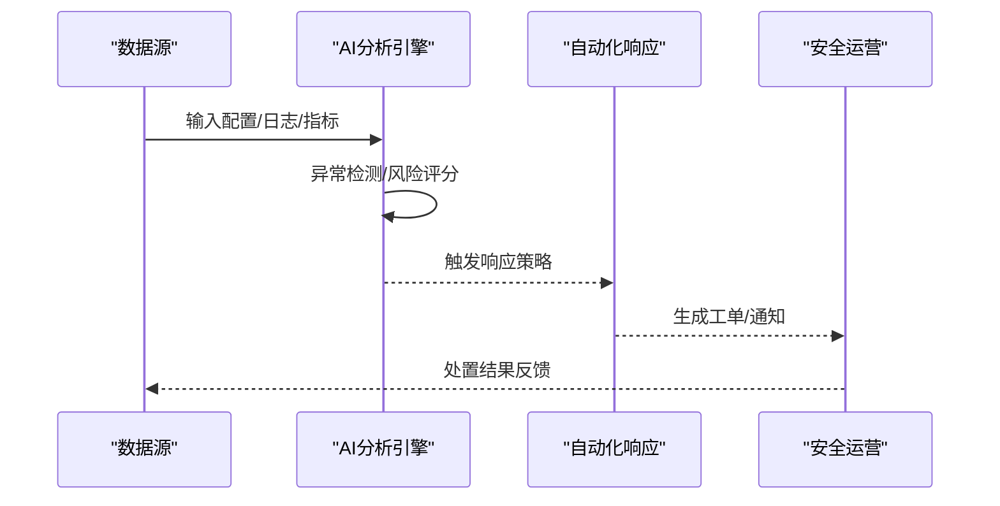
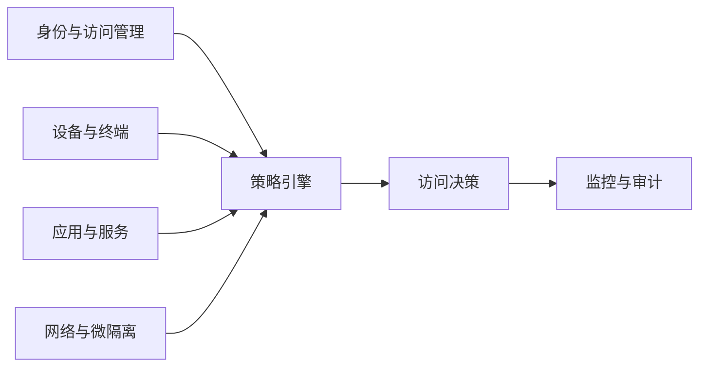
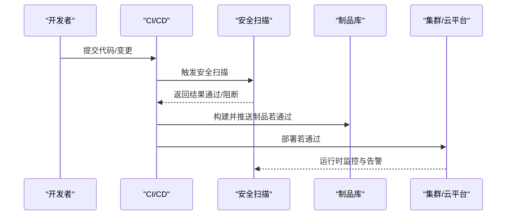
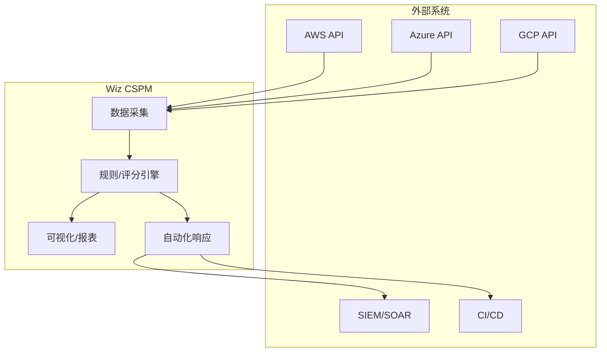

# 云安全（Wiz）

<cite>
**本文引用的文件**
- [README.md](file://README.md)
</cite>

## 目录
1. [简介](#简介)
2. [项目结构](#项目结构)
3. [核心组件](#核心组件)
4. [架构总览](#架构总览)
5. [详细组件分析](#详细组件分析)
6. [依赖关系分析](#依赖关系分析)
7. [性能考量](#性能考量)
8. [故障排除指南](#故障排除指南)
9. [结论](#结论)
10. [附录](#附录)

## 简介
本文件面向企业安全与云架构团队，系统化梳理 Wiz 的云安全态势管理（CSPM）能力与实践要点。内容涵盖多云环境的安全扫描、配置合规检查、漏洞检测与威胁防护；无代理架构的快速部署与全面覆盖；AI 驱动的安全分析（异常检测、风险评分、自动化响应）；在零信任架构中的角色以及与 DevSecOps 的集成方式；并给出主流云平台（AWS、Azure、GCP）的集成思路、部署案例、性能优化建议与故障排除指引。

说明：本仓库为初创公司清单文档，其中对 Wiz 的描述较为简略。本文在严格基于仓库信息的基础上，结合行业通用实践进行扩展性说明，以帮助读者形成可落地的部署与运维方案。

## 项目结构
当前仓库仅包含一份 README 文档，用于汇总各赛道头部初创公司信息。关于 Wiz 的信息集中在“企业服务/开发者工具”下的“安全”小节中，简要介绍了其定位与收购动态。

图表来源
- [README.md:686-693](file://README.md#L686-L693)

章节来源
- [README.md:686-693](file://README.md#L686-L693)

## 核心组件
根据仓库信息，Wiz 的核心产品定位为“云安全态势管理”，并在“安全”小节中被收录。该定位表明其聚焦于多云环境下的安全可见性、风险识别与治理闭环。

- 产品类别：云安全态势管理（CSPM）
- 最新动态：被 Google 以 32B 美元收购，最终含留任奖金合计 42B 美元
- 组织规模：员工约 900 人

章节来源
- [README.md:686-693](file://README.md#L686-L693)

## 架构总览
下图展示 Wiz CSPM 在企业多云环境中的典型交互流程：通过 API/Agentless 方式采集资源与配置，执行合规与漏洞规则，输出风险视图与修复建议，并与工单、CI/CD、SIEM/SOAR 等系统联动，形成持续治理闭环。

图表来源
- [README.md:686-693](file://README.md#L686-L693)

## 详细组件分析

### 多云安全扫描与资产发现
- 目标：快速建立跨 AWS/Azure/GCP 的统一资产视图，识别影子资产、未标记资源、过度授权账户等。
- 方法：通过只读权限或服务账号对接各云平台 API，定期拉取资源拓扑与配置快照，构建统一图谱。
- 价值：缩短排障时间、降低越权风险、提升审计效率。

### 配置合规检查
- 目标：将行业标准（如 CIS、NIST）与企业内部基线转化为规则集，持续评估资源配置是否合规。
- 方法：对存储桶、IAM、网络、数据库、容器镜像等关键资源逐项校验，生成不合规项与修复建议。
- 价值：减少误配导致的泄露与中断风险，满足内外部审计要求。

### 漏洞检测与暴露面收敛
- 目标：识别镜像漏洞、依赖漏洞、密钥泄露、公网暴露端口与服务等。
- 方法：结合镜像扫描、依赖库扫描、网络暴露面探测与敏感数据扫描，聚合风险并关联到具体资源。
- 价值：优先修复高影响漏洞，降低攻击面。

### AI 驱动的安全分析
- 异常检测：基于历史基线与实时指标，识别偏离行为（如异常权限变更、非常规访问路径）。
- 风险评分：综合资产重要性、暴露面、漏洞严重度、业务上下文，给出可操作的风险优先级。
- 自动化响应：与 SOAR/工单系统联动，自动创建修复任务、临时封禁高危入口、通知责任人。

### 零信任架构中的作用
- 最小权限：通过 IAM 策略分析与持续核查，确保“默认拒绝、按需授权”。
- 持续验证：对身份、设备、应用、网络的访问请求进行动态风险评估与策略调整。
- 微隔离：在网络层实现东西向流量细粒度控制，限制横向移动。

### 与 DevSecOps 的集成
- 代码阶段：在 PR 阶段注入安全检查（SAST/DAST/依赖扫描），失败则阻止合并。
- 构建阶段：镜像扫描与签名，禁止不安全镜像进入制品库。
- 运行阶段：运行时安全监控与事件响应，联动 CI/CD 进行回滚或热修复。
- 交付阶段：将安全度量纳入发布门禁与质量看板。

## 依赖关系分析
- 外部依赖：各云平台 API（AWS/Azure/GCP）、第三方漏洞库、合规规则集、SIEM/SOAR、工单系统、CI/CD 平台。
- 内部依赖：数据采集器、规则引擎、风险评分模型、可视化与报表、自动化响应编排。
- 耦合与解耦：通过标准化数据模型与接口抽象，降低与特定云平台的耦合度；通过插件化规则与策略，提高可扩展性。

## 性能考量
- 增量采集：优先采用增量拉取与变更事件订阅，降低全量扫描开销。
- 并行处理：对多租户/多区域资源进行并行扫描与评估，缩短收敛时间。
- 缓存与索引：对资源拓扑与规则结果进行缓存与索引，加速查询与报表生成。
- 阈值与分级：合理设置告警阈值与风险等级，避免告警风暴。
- 容量规划：根据资源规模与扫描频率，预估 CPU/内存/存储需求，预留弹性扩容空间。

## 故障排除指南
- 连接与权限问题
  - 现象：无法拉取资源或频繁鉴权失败
  - 排查：确认服务账号/角色权限范围、网络连通性、API 限流与重试策略
- 数据不一致
  - 现象：资产视图与实际不符
  - 排查：核对采集周期、增量同步机制、资源标签与命名规范一致性
- 规则误报/漏报
  - 现象：大量告警或遗漏高风险项
  - 排查：审查规则版本与基线配置，补充例外白名单，优化评分权重
- 性能瓶颈
  - 现象：扫描耗时过长、报表延迟
  - 排查：启用并行与增量模式、优化索引与缓存、调整并发与批大小
- 自动化响应失效
  - 现象：工单未创建或动作未执行
  - 排查：检查集成凭证、回调地址、幂等性与重试逻辑

## 结论
Wiz 作为云安全态势管理（CSPM）的代表性产品，聚焦多云环境下的安全可见性、风险识别与治理闭环。结合无代理架构、AI 驱动分析与 DevSecOps 集成，可在保障业务连续性的同时，持续提升安全水位。建议在实施过程中，先完成资产盘点与基线对齐，再逐步引入自动化响应与持续改进机制，确保安全投入产出比最大化。

## 附录
- 参考来源：本仓库对 Wiz 的基础信息与最新动态进行了收录，可作为选型与背景了解的重要参考。
- 后续工作：建议结合企业实际环境与合规要求，制定分阶段落地路线图，并配套完善度量指标与复盘机制。

章节来源
- [README.md:686-693](file://README.md#L686-L693)