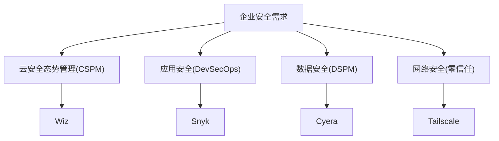
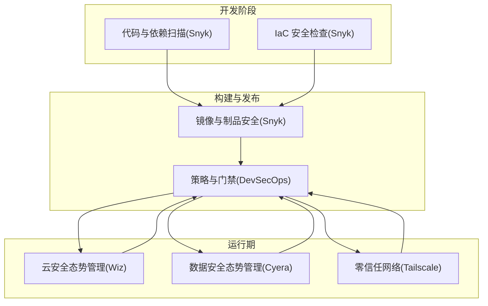
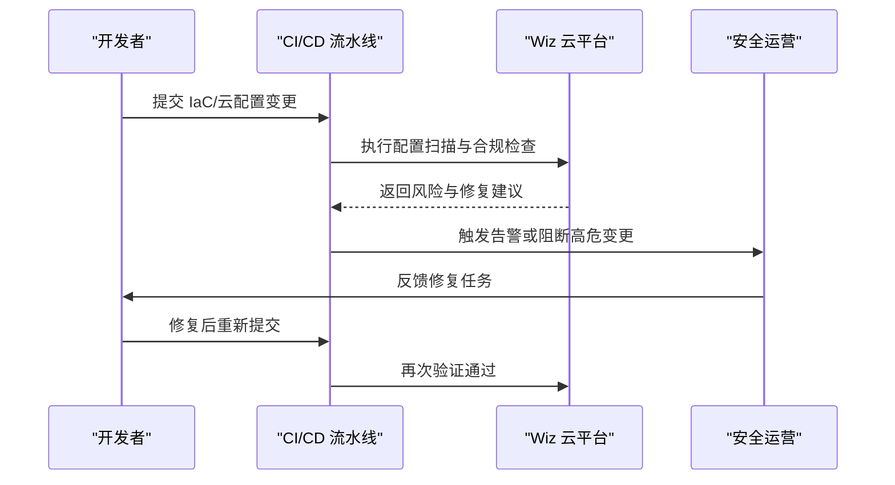
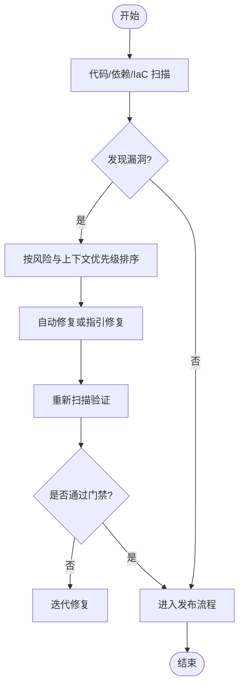
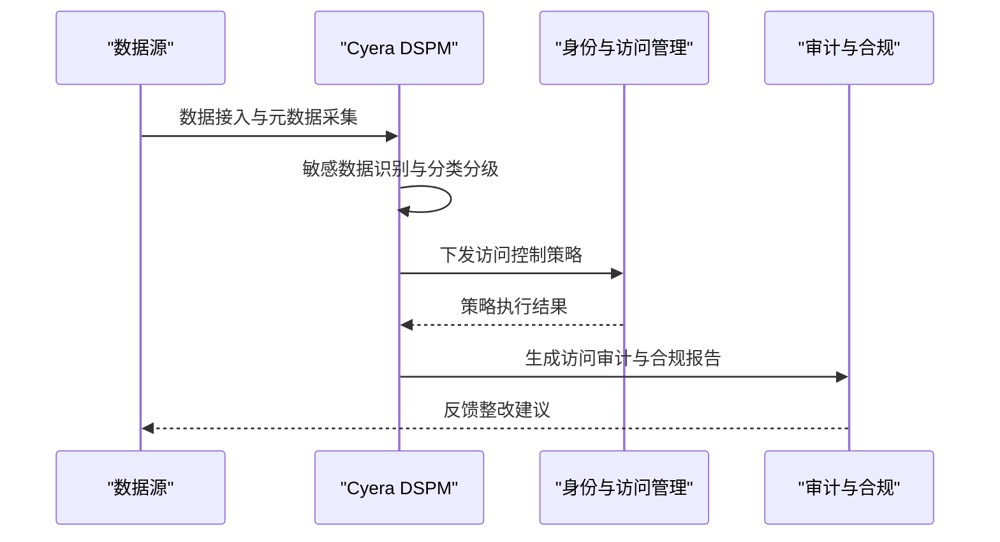
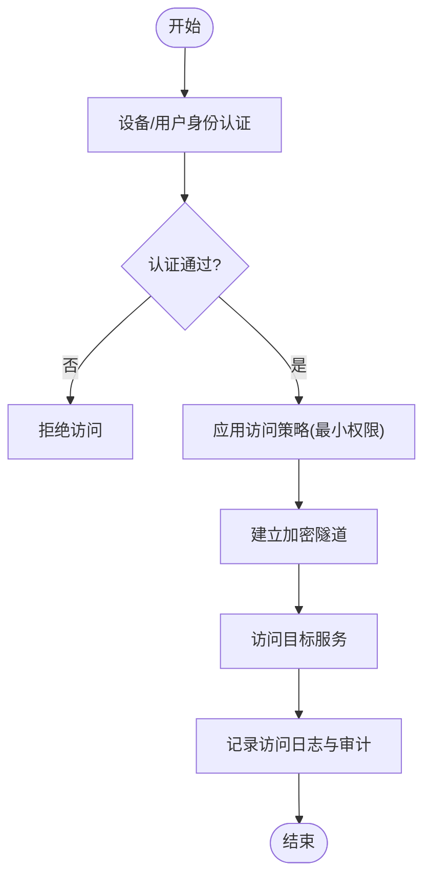
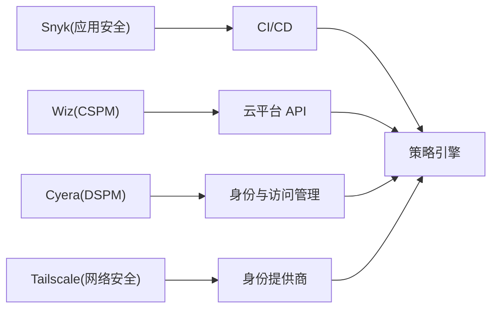

# 安全解决方案

<cite>
**本文引用的文件**
- [README.md](file://README.md)
</cite>

## 目录
1. [引言](#引言)
2. [项目结构](#项目结构)
3. [核心组件](#核心组件)
4. [架构总览](#架构总览)
5. [详细组件分析](#详细组件分析)
6. [依赖关系分析](#依赖关系分析)
7. [性能与可扩展性考量](#性能与可扩展性考量)
8. [故障排查指南](#故障排查指南)
9. [结论](#结论)
10. [附录](#附录)

## 引言
本文件面向企业安全决策者与安全工程团队，聚焦云安全态势管理（CSPM）、应用安全、数据安全、网络安全等关键领域，结合 Wiz、Snyk、Cyera、Tailscale 等代表性产品，系统阐述零信任架构、DevSecOps 流程与安全左移理念。文档同时提供企业安全选型评估框架（合规性、集成能力、成本效益），并讨论 AI 时代的安全挑战与新兴威胁防护方案，辅以部署案例与最佳实践建议，帮助企业在复杂技术生态中做出稳健选择。

## 项目结构
本项目仓库以单一 README 为核心，汇总了多赛道初创公司清单，其中“企业服务/开发者工具”下的“安全”小节提供了 Wiz、Snyk、Cyera、Tailscale 的基础信息，包括产品定位与市场动态。基于该信息，本文围绕四大安全域展开：
- 云安全态势管理（CSPM）：以 Wiz 为代表，聚焦多云环境配置治理与风险可视化。
- 应用安全：以 Snyk 为代表，覆盖代码、依赖、容器与 IaC 的持续安全检测与修复。
- 数据安全：以 Cyera 为代表，面向数据资产发现、分类分级与访问控制治理。
- 网络安全：以 Tailscale 为代表，提供零配置 VPN 与零信任网络接入能力。

图表来源
- [README.md:639-661](file://README.md#L639-L661)

章节来源
- [README.md:639-661](file://README.md#L639-L661)

## 核心组件
- Wiz（云安全态势管理）
  - 产品定位：云安全态势管理，帮助企业统一可视化多云资源与配置风险。
  - 市场动态：被 Google 收购，体现行业整合趋势与企业级落地能力。
- Snyk（开发者安全平台）
  - 产品定位：开发者安全平台，贯穿代码、依赖、容器与基础设施即代码（IaC）。
  - 市场地位：早期代码安全领域的领先者，强调“安全左移”。
- Cyera（AI 数据安全态势管理）
  - 产品定位：AI 驱动的数据安全态势管理，聚焦数据资产发现、分类分级与访问治理。
  - 市场价值：在 AI 时代成为数据安全标杆之一。
- Tailscale（零配置 VPN/零信任网络）
  - 产品定位：基于 WireGuard 的零配置 VPN，简化远程与分布式网络的零信任接入。
  - 用户群体：开发者首选，便于快速构建安全的内部网络。

章节来源
- [README.md:639-661](file://README.md#L639-L661)

## 架构总览
下图展示企业安全总体架构，将 CSPM、应用安全、数据安全与网络安全四个域串联为闭环治理体系，并与 DevSecOps 流程融合，实现从设计到运行期的持续安全。

图表来源
- [README.md:639-661](file://README.md#L639-L661)

## 详细组件分析

### 云安全态势管理（CSPM）— Wiz
- 目标与职责
  - 统一多云资源配置视图，识别错误配置与合规偏差。
  - 提供风险优先级排序与修复建议，支撑安全运营自动化。
- 关键能力
  - 资源发现与映射、配置基线检查、合规规则库、告警与工单联动。
- 与 DevSecOps 的衔接
  - 将云配置检查纳入 CI/CD 门禁，提前拦截高风险变更。
- 典型工作流（序列图）

图表来源
- [README.md:639-661](file://README.md#L639-L661)

章节来源
- [README.md:639-661](file://README.md#L639-L661)

### 应用安全（DevSecOps）— Snyk
- 目标与职责
  - 在开发早期发现并修复漏洞，降低上线风险。
  - 覆盖代码、依赖、容器镜像与 IaC 的全栈安全。
- 关键能力
  - 开源依赖漏洞检测、许可证合规、容器镜像扫描、IaC 配置检查、IDE 集成与修复建议。
- 安全左移实践
  - 在 IDE、PR 审查与 CI 阶段嵌入安全门禁，推动“安全即代码”。
- 典型工作流（流程图）

图表来源
- [README.md:639-661](file://README.md#L639-L661)

章节来源
- [README.md:639-661](file://README.md#L639-L661)

### 数据安全（DSPM）— Cyera
- 目标与职责
  - 全面发现与分类敏感数据，建立访问控制与使用审计机制。
  - 在 AI 时代强化对模型训练数据、向量数据库与数据湖的安全治理。
- 关键能力
  - 数据资产发现、敏感数据识别、分类分级、访问权限治理、异常行为检测。
- 与零信任的结合
  - 基于数据敏感度实施细粒度访问控制，最小权限原则贯穿数据生命周期。
- 典型工作流（序列图）

图表来源
- [README.md:639-661](file://README.md#L639-L661)

章节来源
- [README.md:639-661](file://README.md#L639-L661)

### 网络安全（零信任）— Tailscale
- 目标与职责
  - 以零配置 VPN 为基础，构建零信任网络边界，保障服务间安全通信。
  - 支持设备身份认证、细粒度访问控制与端到端加密。
- 关键能力
  - 设备与用户双向认证、网络拓扑可视化、访问策略编排、日志与审计。
- 与 DevSecOps 的衔接
  - 在 CI/CD 环境中提供安全的临时访问通道，减少长期开放端口带来的风险。
- 典型工作流（流程图）

图表来源
- [README.md:639-661](file://README.md#L639-L661)

章节来源
- [README.md:639-661](file://README.md#L639-L661)

## 依赖关系分析
- 组件耦合与协同
  - Snyk 与 CI/CD 深度集成，形成“安全左移”的关键入口。
  - Wiz 与云平台 API 对接，获取配置与资源状态，驱动风险治理。
  - Cyera 与数据源及 IAM 系统协作，实现数据访问控制与审计闭环。
  - Tailscale 与身份提供商、网络设备联动，构建零信任网络。
- 外部依赖与集成点
  - 云平台（AWS/Azure/GCP）API、代码托管平台（GitHub/GitLab）、CI/CD 系统、身份与访问管理系统、日志与 SIEM 平台。
- 潜在循环依赖
  - 建议在策略层解耦各域能力，避免直接强耦合；通过统一策略引擎与事件总线进行松耦合集成。

图表来源
- [README.md:639-661](file://README.md#L639-L661)

章节来源
- [README.md:639-661](file://README.md#L639-L661)

## 性能与可扩展性考量
- 扫描与检测效率
  - 增量扫描与缓存策略，减少重复计算；并行化处理大规模代码与依赖集。
- 云资源规模
  - 采用分页与增量拉取，避免全量扫描导致的性能瓶颈；按需启用高代价检查。
- 数据处理能力
  - 对海量数据资产进行分层索引与采样分析，提升分类与异常检测速度。
- 网络扩展性
  - 基于 WireGuard 的高并发连接与低延迟特性，支持大规模设备接入；结合边缘节点优化路由。
- 可观测性与容量规划
  - 建立指标与告警体系，监控扫描耗时、失败率与资源占用，指导扩容与优化。

[本节为通用指导，不直接分析具体文件]

## 故障排查指南
- 常见问题定位
  - 扫描失败：检查凭据与权限、网络连通性与 API 限流策略。
  - 误报与漏报：调整规则阈值、更新知识库与依赖版本，结合业务上下文复核。
  - 访问控制冲突：核对策略优先级与继承关系，确保最小权限原则生效。
  - 性能问题：分析慢查询与热点资源，优化索引与缓存策略。
- 排障步骤建议
  - 收集日志与指标，复现问题场景。
  - 隔离变量（关闭非关键集成），逐步缩小范围。
  - 回滚最近变更，验证稳定性。
  - 与供应商支持协作，获取补丁或升级路径。

[本节为通用指导，不直接分析具体文件]

## 结论
通过将 CSPM、应用安全、数据安全与网络安全四域统一到 DevSecOps 流程中，企业可实现从设计到运行期的持续安全治理。Wiz、Snyk、Cyera、Tailscale 分别在不同领域提供关键能力，组合使用可构建覆盖全面的现代安全体系。在 AI 时代，需特别关注数据与模型安全、供应链风险与零信任网络的演进。选型时应综合评估合规要求、集成能力与成本效益，并通过分阶段试点与度量驱动持续优化。

[本节为总结性内容，不直接分析具体文件]

## 附录
- 企业安全选型评估框架
  - 合规性要求：是否符合行业标准与监管要求（如 ISO 27001、SOC 2、GDPR 等）。
  - 集成能力：与现有 CI/CD、云平台、IAM、SIEM 的兼容性与自动化程度。
  - 成本效益：许可模式、运维成本、ROI 与风险降低效果。
  - 可扩展性：支持多云、多租户与大规模资源的治理能力。
  - 安全成熟度：功能完备性、策略灵活性与可观测性。
- AI 时代的安全挑战与防护
  - 模型与数据泄露：加强数据分类分级与访问控制，实施最小权限与审计。
  - 供应链攻击：强化依赖与制品安全，建立可信构建与签名校验。
  - 新型威胁：引入行为分析与异常检测，结合零信任网络限制横向移动。
- 实际部署案例与最佳实践
  - 渐进式落地：先在关键业务试点，再推广至全组织。
  - 策略先行：制定统一安全策略与标准，确保一致执行。
  - 持续改进：建立度量与复盘机制，持续优化规则与流程。

[本节为通用指导，不直接分析具体文件]