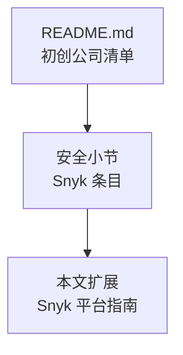
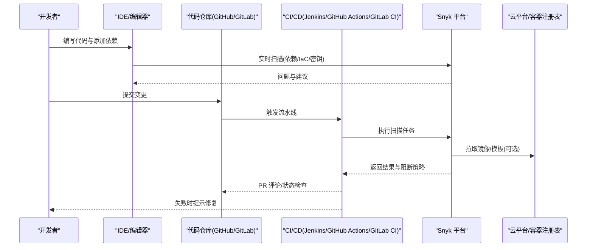
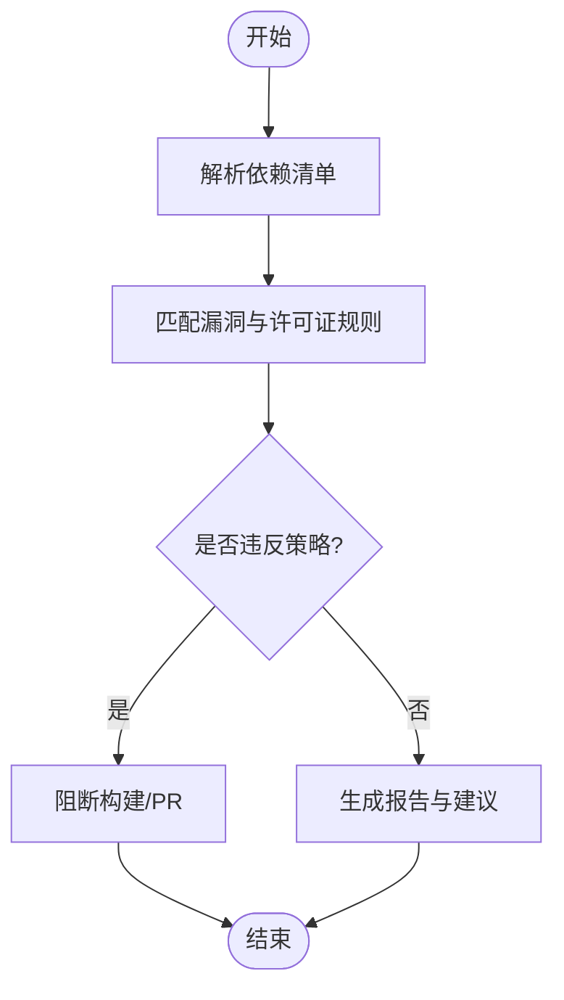
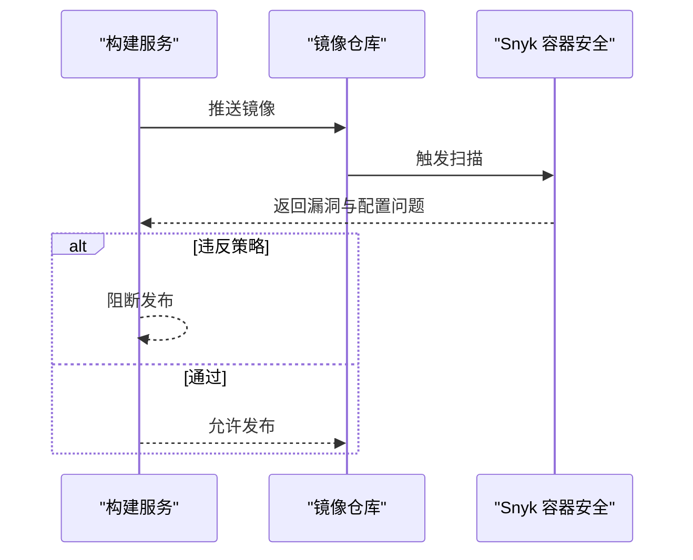
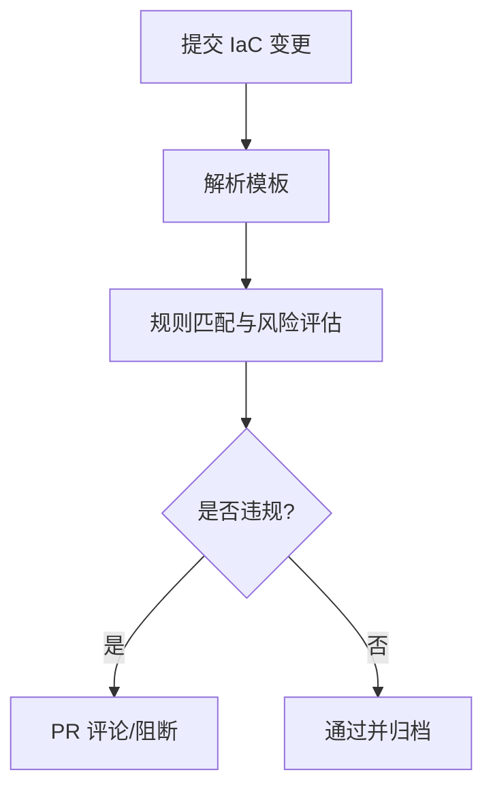
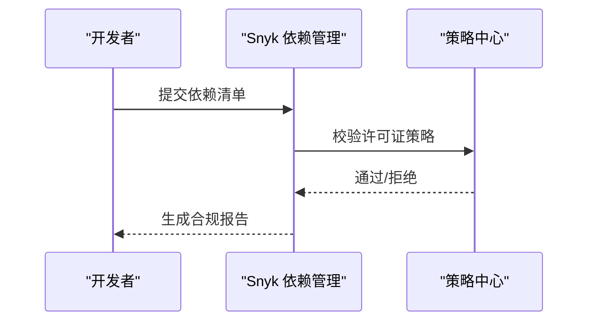
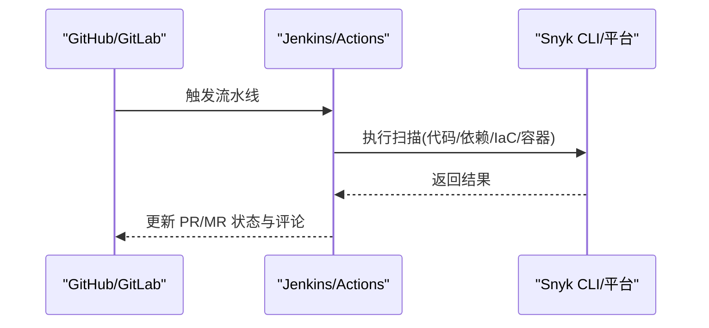
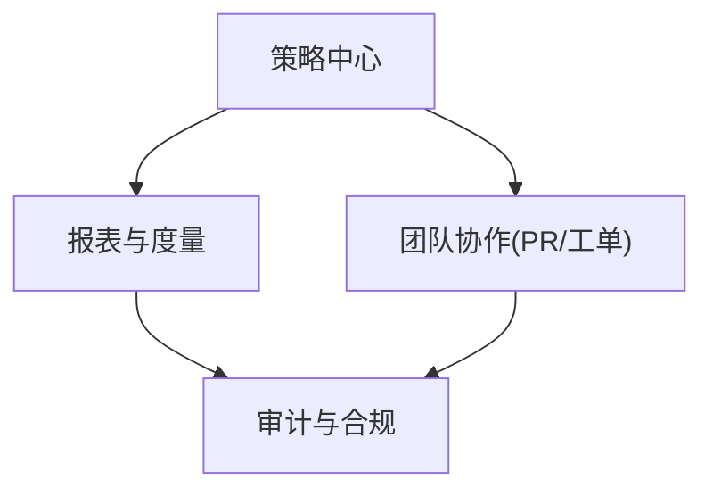
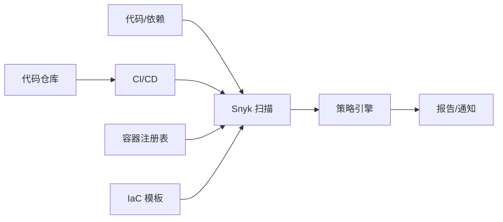

# 应用安全（Snyk）

<cite>
**本文引用的文件**
- [README.md](file://README.md)
</cite>

## 目录
1. [简介](#简介)
2. [项目结构](#项目结构)
3. [核心组件](#核心组件)
4. [架构总览](#架构总览)
5. [详细组件分析](#详细组件分析)
6. [依赖关系分析](#依赖关系分析)
7. [性能考量](#性能考量)
8. [故障排查指南](#故障排查指南)
9. [结论](#结论)
10. [附录](#附录)

## 简介
本文件面向希望在企业中落地“开发者安全平台”的团队，围绕 Snyk 的开发者安全能力进行系统化说明。内容涵盖代码扫描、依赖漏洞检测、容器安全与基础设施即代码（IaC）安全检查；在 CI/CD 中的集成方式；如何在开发早期发现并修复安全问题；开源组件安全管理（许可证合规与供应链安全）；主流语言与框架的集成示例（GitHub、GitLab、Jenkins 等）；企业级功能（策略管理、报告生成、团队协作）；以及实际使用案例、最佳实践与常见问题解决方案。

说明：本仓库为初创公司清单文档，其中包含对 Snyk 的简要条目信息。本文基于该条目并结合通用工程实践进行扩展说明，便于读者理解与应用。

章节来源
- [README.md:686-698](file://README.md#L686-L698)

## 项目结构
当前仓库以单一 README 为主，聚焦于“精选初创公司清单”，并在“安全”小节提及 Snyk 作为开发者安全平台的代表之一。因此，本文档将以此为基础，构建一份可操作的 Snyk 应用安全平台指南，帮助团队快速上手与规模化落地。

[本节为概念性结构说明，不直接映射具体代码文件]

## 核心组件
- 代码安全扫描：静态分析（SAST）、密钥泄露检测、依赖漏洞检测（SCA）。
- 依赖漏洞管理：跟踪第三方库风险、许可证合规、版本升级建议。
- 容器安全：镜像漏洞扫描、配置检查、运行时风险识别。
- IaC 安全：对 Terraform、Kubernetes、CloudFormation 等模板进行合规与安全基线检查。
- 开发与协作：IDE 插件、PR 评论、分支保护、策略与告警、报表与度量。
- 企业能力：策略中心、统一视图、审计与合规报告、多团队协作治理。

章节来源
- [README.md:686-698](file://README.md#L686-L698)

## 架构总览
下图展示 Snyk 在典型研发流水线中的位置与交互关系：从本地开发到 CI/CD，再到云托管的代码仓库与企业控制台。

[本图为概念流程示意，用于帮助理解 Snyk 在流水线中的角色]

## 详细组件分析

### 代码扫描与依赖漏洞检测（SCA/SAST）
- 目标：在编码阶段尽早发现安全缺陷与高风险依赖，减少后期修复成本。
- 关键能力：
  - 依赖项清单解析与漏洞匹配（支持多语言生态）。
  - 许可证合规检查，避免法律与合规风险。
  - 自动修复建议与升级路径。
  - 与 IDE 和 PR 工作流集成，提供即时反馈。
- 数据流：
  - 本地 IDE 扫描 → 推送至仓库 → CI 再次扫描 → 策略校验 → 结果回写 PR。

[流程图用于说明 SC A 的基本处理逻辑]

章节来源
- [README.md:686-698](file://README.md#L686-L698)

### 容器安全
- 目标：确保容器镜像与编排配置符合安全基线，降低部署风险。
- 关键能力：
  - 镜像层漏洞扫描与基础镜像合规检查。
  - 敏感信息与错误配置检测。
  - 与 CI/CD 集成，在构建或发布阶段阻断不安全镜像。
- 数据流：
  - 构建镜像 → 推送前扫描 → 策略校验 → 通过则继续发布。

[序列图用于说明容器扫描在发布前的拦截机制]

### IaC 安全检查
- 目标：在基础设施定义阶段识别不安全配置与合规偏差。
- 关键能力：
  - 对 Terraform/Kubernetes/CloudFormation 等模板进行规则检查。
  - 与 PR 集成，自动标注风险并提供修复建议。
  - 结合企业策略，实现跨环境一致性治理。
- 数据流：
  - 提交 IaC 变更 → CI 扫描 → 策略校验 → PR 评论/阻断。

[流程图用于说明 IaC 检查的关键决策点]

### 许可证合规与供应链安全
- 目标：确保使用的开源组件满足许可证要求，降低法律与声誉风险。
- 关键能力：
  - 许可证类型识别与白名单/黑名单管理。
  - 依赖图谱与上游风险传播分析。
  - 定期复扫与趋势报告，支撑合规审计。
- 数据流：
  - 依赖清单 → 许可证匹配 → 策略校验 → 报告输出。

[序列图用于说明许可证合规的检查闭环]

### 在 CI/CD 中的集成
- GitHub：
  - 使用 Snyk GitHub App 或 Action，在 PR 上自动评论与阻断。
  - 结合分支保护规则，强制通过安全门禁。
- GitLab：
  - 通过 SAST 集成或自定义 Job 调用 Snyk CLI，产出安全报告。
  - 利用 Merge Request 注释与流水线状态控制。
- Jenkins：
  - 在 Pipeline 中嵌入 Snyk CLI 步骤，按阶段执行不同扫描。
  - 结合质量门禁与通知机制，形成完整的安全流水线。

[序列图用于说明多平台 CI/CD 的统一集成模式]

### 企业级功能：策略、报告与团队协作
- 策略管理：
  - 统一制定漏洞阈值、许可证白名单、IaC 基线。
  - 按组织/项目/环境分级策略，支持审批与例外流程。
- 报告与度量：
  - 生成合规报告、趋势指标、技术债看板。
  - 与 SIEM/ITSM/工单系统对接，推动闭环整改。
- 团队协作：
  - 在 PR 中协同修复，分配责任人，追踪修复进度。
  - 提供知识库与最佳实践指引，提升整体安全素养。

[图示用于说明企业能力的联动关系]

## 依赖关系分析
- 内部依赖：
  - 代码/依赖清单 → Snyk 扫描引擎 → 策略引擎 → 报告与通知。
- 外部依赖：
  - 代码仓库（GitHub/GitLab）
  - CI/CD（Jenkins/GitHub Actions/GitLab CI）
  - 容器注册表与云平台（用于镜像与 IaC 扫描）
- 耦合与解耦：
  - 通过 CLI/API 与平台解耦，便于在不同环境中复用。
  - 策略与规则集中管理，降低各项目的维护成本。

[依赖图用于展示主要组件间的关系]

## 性能考量
- 增量扫描：仅对变更部分进行深度分析，缩短流水线时间。
- 缓存与并行：依赖数据库与规则缓存，并行执行多模块扫描。
- 资源隔离：在 CI 中使用轻量容器或沙箱，避免污染宿主环境。
- 限流与重试：对 API 调用进行限流与重试，提高稳定性。
- 结果聚合：合并重复问题，减少噪音，提升可读性与处理效率。

[本节为通用性能优化建议，不直接引用具体文件]

## 故障排查指南
- 扫描失败：
  - 检查网络与凭据（API Token、仓库访问权限）。
  - 确认依赖清单格式与路径正确。
- 误报/漏报：
  - 调整策略阈值与忽略列表。
  - 更新规则与依赖数据库版本。
- 流水线阻塞：
  - 临时放行并创建修复任务，避免影响交付节奏。
  - 定位根因后关闭阻断，持续监控回归。
- 许可证合规：
  - 核对许可证白名单与替换方案。
  - 与法务/采购协作，评估替代组件。

[本节为通用排障建议，不直接引用具体文件]

## 结论
Snyk 作为开发者安全平台，能够在编码、构建、发布与运行全生命周期内提供一致的安全能力。通过策略化治理与自动化集成，团队可以在早期发现并修复安全问题，降低风险与成本。结合许可证合规与供应链安全，企业能够建立可持续的安全工程体系，支撑业务快速发展。

[本节为总结性内容，不直接引用具体文件]

## 附录
- 常见集成要点速览：
  - GitHub：启用 Snyk App/Action，设置 PR 评论与分支保护。
  - GitLab：配置 SAST 或自定义 Job，输出报告并阻断不合格流水线。
  - Jenkins：在 Pipeline 中嵌入 Snyk CLI，分阶段执行扫描与门禁。
- 最佳实践：
  - 以“左移”为原则，优先在 IDE 与 PR 阶段发现问题。
  - 采用渐进式策略，先观察后阻断，逐步收紧标准。
  - 建立修复 SLA 与度量指标，持续改进安全质量。
- 参考来源：
  - 本仓库中对 Snyk 的条目可作为起点，进一步查阅官方文档与产品手册获取最新细节。

章节来源
- [README.md:686-698](file://README.md#L686-L698)