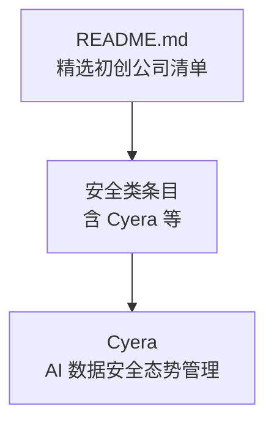
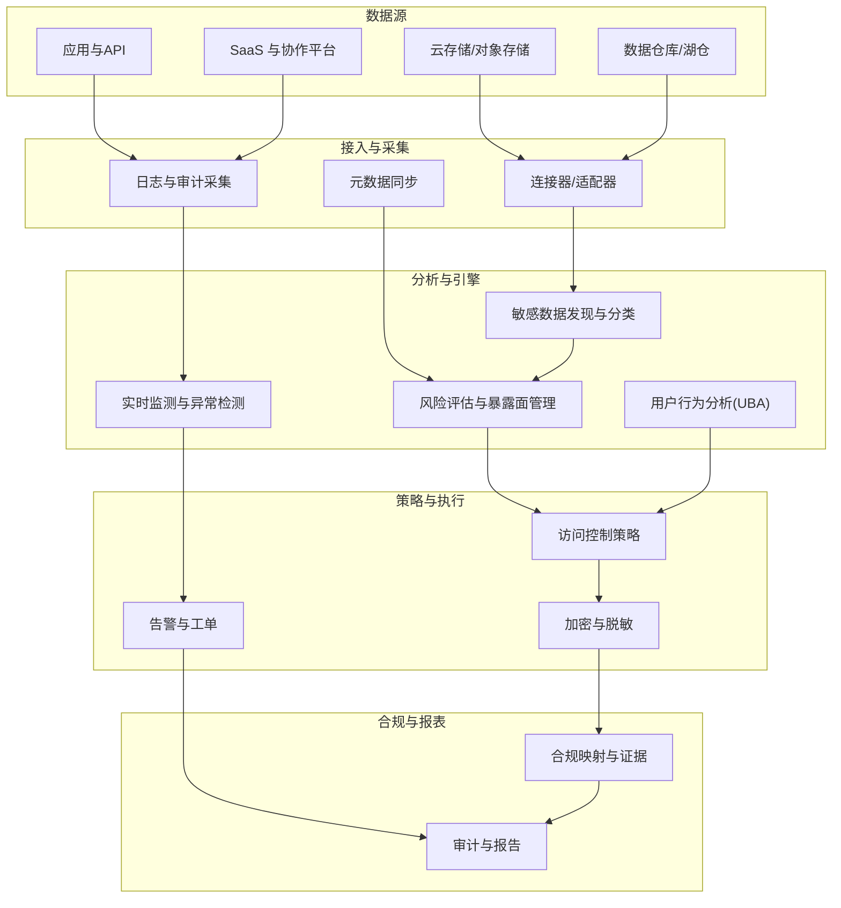
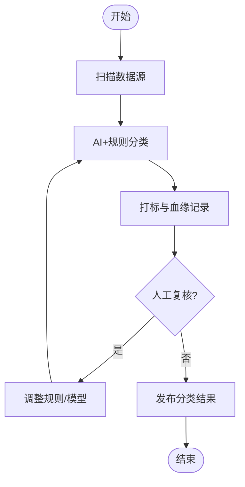
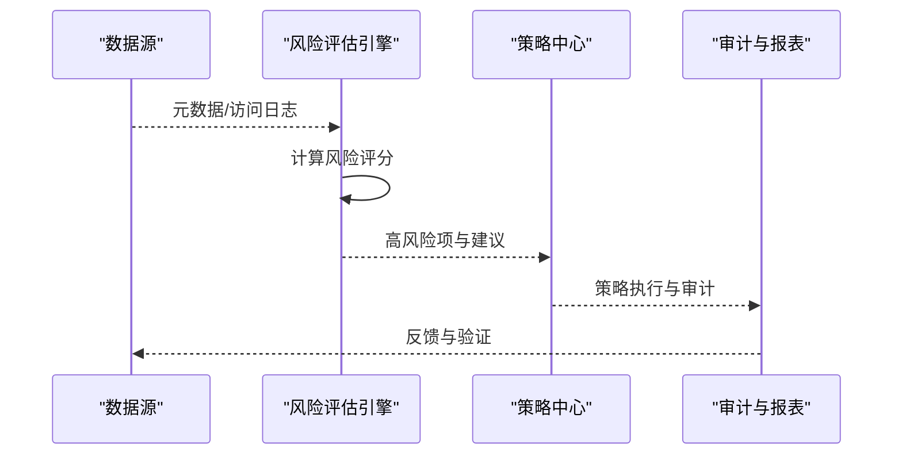
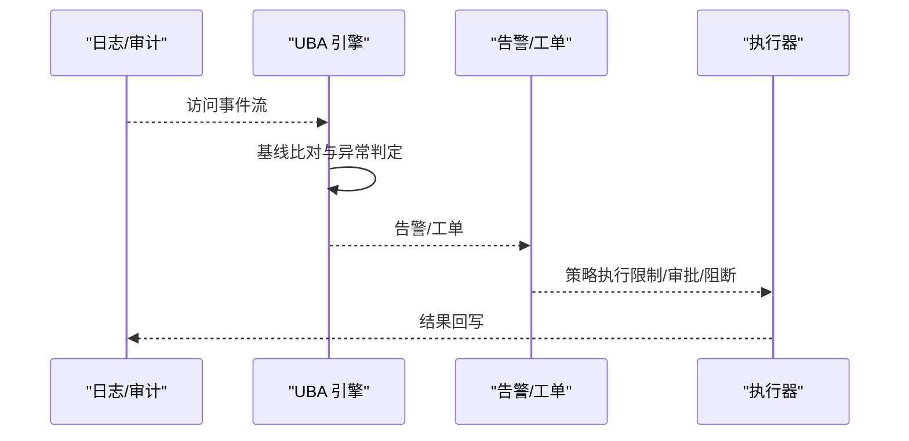
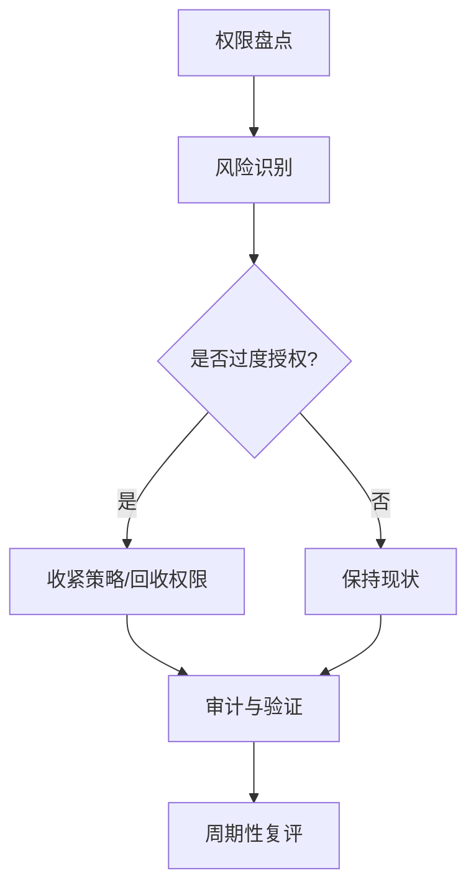
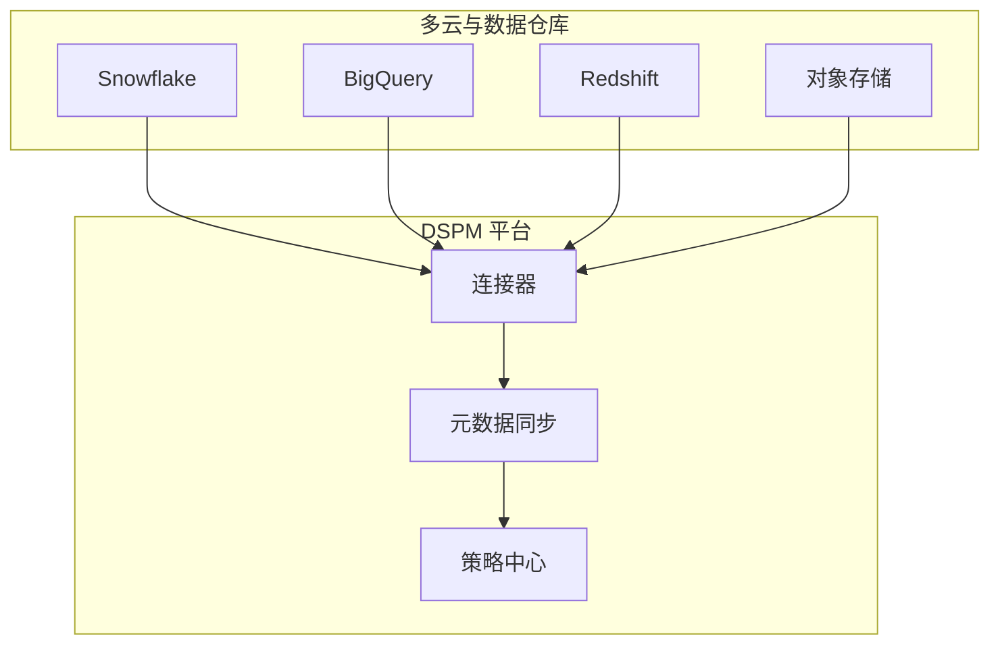
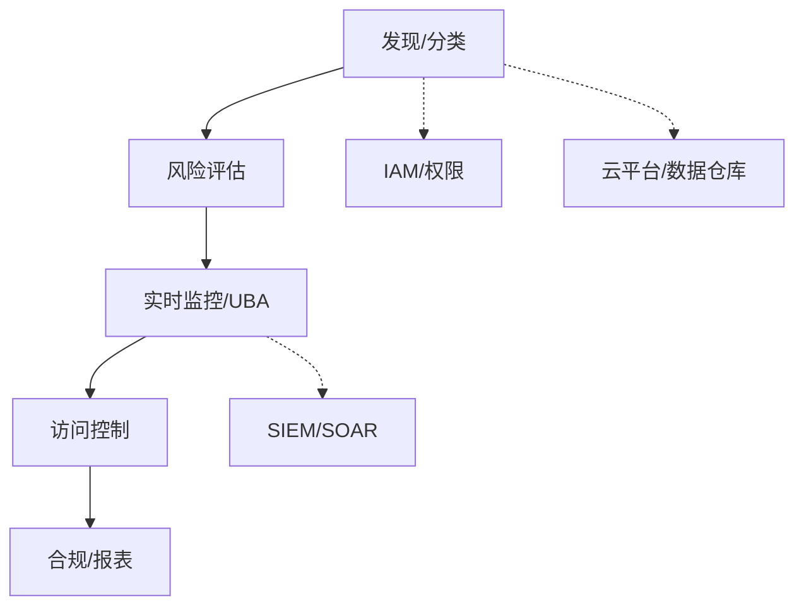

# 数据安全（Cyera）

<cite>
**本文引用的文件**
- [README.md](file://README.md)
</cite>

## 目录
1. [简介](#简介)
2. [项目结构](#项目结构)
3. [核心组件](#核心组件)
4. [架构总览](#架构总览)
5. [详细组件分析](#详细组件分析)
6. [依赖关系分析](#依赖关系分析)
7. [性能与可扩展性](#性能与可扩展性)
8. [故障诊断与排错](#故障诊断与排错)
9. [结论](#结论)
10. [附录](#附录)

## 简介
本文件面向企业安全与数据治理团队，系统化阐述 Cyera 的 AI 驱动的数据安全态势管理（DSPM）能力，包括敏感数据发现、分类与风险评估；多云环境与数据湖中的数据保护；实时数据监控与异常检测（用户行为分析与访问模式识别）；以及与企业级数据治理的落地实践（分类策略、访问控制政策、合规管理）。同时提供与主流云平台和数据仓库（如 Snowflake、BigQuery、Redshift）的集成思路、部署案例参考、性能调优建议与故障诊断方法。

说明：本仓库为“精选初创公司”清单，其中包含对 Cyera 的高层信息。本文在严格遵循仓库内容的前提下，结合行业通用实践给出可操作的实施指南与架构图示，帮助读者将 Cyera 的能力融入企业数据治理与安全体系。

章节来源
- [README.md:886-889](file://README.md#L886-L889)

## 项目结构
当前仓库以单一 README 为主，按赛道组织多家初创公司信息。Cyera 位于“企业服务/开发者工具 - 安全”小节，定位为“AI 数据安全态势管理”，并标注了估值信息。该结构便于快速检索与横向对比，但不包含具体技术实现细节。

图表来源
- [README.md:886-889](file://README.md#L886-L889)

章节来源
- [README.md:886-889](file://README.md#L886-L889)

## 核心组件
围绕 Cyera 的 DSPM 能力，建议从以下维度构建企业方案：
- 敏感数据发现与分类：跨云存储、数据库、数据湖/仓的统一扫描与标签化，支持多模态数据类型与元数据上下文。
- 风险评估与暴露面管理：基于数据敏感度、访问路径、共享范围、外部可见性等维度进行风险评分与可视化。
- 实时数据监控与异常检测：采集访问日志与审计事件，结合用户行为基线与机器学习模型识别异常访问与潜在泄露。
- 访问控制与最小权限：联动身份与权限系统，动态收紧过度授权，自动化执行策略收敛。
- 合规与治理：内置模板化的合规映射（如 GDPR、CCPA、SOX、HIPAA），生成证据与报告，支撑内审与外审。
- 多云与数据湖集成：对接主流云与数据仓库，统一接入与策略下发，保障一致的安全基线。

章节来源
- [README.md:886-889](file://README.md#L886-L889)

## 架构总览
下图展示了一个典型的企业级 DSPM 架构，涵盖数据采集、AI 分析、策略执行与合规输出。该图为概念性示意，用于指导实际部署与集成规划。

[此图为概念性架构示意，不直接映射到具体源码文件]

## 详细组件分析

### 敏感数据发现与分类
- 目标：在多云与数据湖环境中自动识别敏感数据（PII、财务、医疗、知识产权等），并打上分类标签与数据血缘。
- 关键能力：
  - 多源适配：支持对象存储、数据库、数据仓库/湖仓、SaaS 应用与协作平台。
  - 智能分类：结合规则与机器学习，提升准确率与召回率，减少误报。
  - 上下文感知：结合字段名、样例值、业务标签与数据血缘，提高分类可信度。
- 实施要点：
  - 先盘点数据资产与数据流，建立分类分级标准。
  - 分阶段上线扫描任务，优先覆盖高风险区域。
  - 持续迭代分类模型与规则，结合人工复核优化。

[此图为概念性流程示意，不直接映射到具体源码文件]

### 风险评估与暴露面管理
- 目标：量化数据暴露面，识别高风险数据与访问路径，形成风险视图与处置闭环。
- 关键能力：
  - 风险因子：敏感度、共享范围、外部可见性、访问频率、历史事件等。
  - 风险评分：多维度加权计算，支持阈值与告警。
  - 处置建议：自动推荐策略收敛与加固措施。
- 实施要点：
  - 建立风险模型与阈值策略，定期复评。
  - 与变更管理联动，评估变更带来的风险影响。
  - 输出风险热力图与整改计划，跟踪闭环。

[此图为概念性序列示意，不直接映射到具体源码文件]

### 实时数据监控与异常检测（UBA）
- 目标：基于用户行为与访问模式，实时识别异常访问与潜在泄露。
- 关键能力：
  - 行为基线：学习正常访问模式，建立个体与群体基线。
  - 异常检测：基于统计与机器学习识别偏离行为。
  - 响应联动：触发告警、临时阻断或审批流程。
- 实施要点：
  - 充分采集审计日志与访问事件，确保时序与完整性。
  - 设置合理的灵敏度与误报抑制策略。
  - 与 SIEM/SOAR 集成，形成自动化响应。

[此图为概念性序列示意，不直接映射到具体源码文件]

### 访问控制与最小权限
- 目标：确保数据访问遵循最小权限原则，避免过度授权与影子权限。
- 关键能力：
  - 权限盘点：汇总跨系统的权限与角色。
  - 策略收敛：自动识别并收紧过度授权。
  - 动态授权：结合上下文（时间、地点、设备、风险）进行细粒度控制。
- 实施要点：
  - 与 IAM/ABAC/PBAC 集成，统一策略管理。
  - 定期开展权限评审与清理。
  - 与数据分类联动，敏感数据默认更严格策略。

[此图为概念性流程示意，不直接映射到具体源码文件]

### 合规与治理
- 目标：将安全策略与合规要求对齐，自动生成证据与报告，降低审计成本。
- 关键能力：
  - 合规映射：内置常见法规与控制框架。
  - 证据收集：自动抓取配置、策略与审计记录。
  - 报告输出：一键生成审计报告与整改建议。
- 实施要点：
  - 明确合规范围与责任边界。
  - 将合规检查纳入日常巡检与变更流程。
  - 与第三方审计工具对接，提升效率。

[此图为概念性流程图，不直接映射到具体源码文件]

### 多云与数据湖集成（Snowflake、BigQuery、Redshift 等）
- 目标：统一接入多云与数据仓库，实现一致的发现、分类、风控与合规能力。
- 关键能力：
  - 连接器：标准化 API/SDK 与代理方式接入。
  - 元数据同步：拉取表结构、字段、标签与血缘。
  - 策略下发：跨平台统一策略与审计。
- 实施要点：
  - 优先选择有成熟连接器的平台，逐步扩展。
  - 关注性能与带宽，合理调度扫描与同步任务。
  - 建立统一的密钥与凭据管理。

[此图为概念性架构图，不直接映射到具体源码文件]

## 依赖关系分析
- 内部依赖：发现/分类、风险评估、实时监控、访问控制、合规模块之间通过统一的数据模型与策略中心交互，形成闭环。
- 外部依赖：
  - 身份与权限系统（IAM/ABAC/PBAC）
  - 日志与审计系统（SIEM/SOAR）
  - 云平台与数据仓库（Snowflake、BigQuery、Redshift 等）
  - 加密与密钥管理服务（KMS/HSM）
- 耦合与解耦：通过连接器与策略中心解耦各数据源与执行端，提升可扩展性与可维护性。

[此图为概念性依赖图，不直接映射到具体源码文件]

## 性能与可扩展性
- 扫描与同步：
  - 增量同步与并行任务，降低对生产环境的影响。
  - 缓存与索引优化，提升查询与匹配速度。
- 实时监测：
  - 流式处理与窗口聚合，保证低延迟。
  - 自适应阈值与在线学习，降低误报与漏报。
- 资源规划：
  - 根据数据规模与访问频率弹性扩容。
  - 分层存储与冷热分离，降低成本。
- 可靠性：
  - 高可用与容灾设计，关键链路冗余。
  - 幂等与重试机制，保证数据一致性。

[本节为通用性能建议，不直接引用具体源码文件]

## 故障诊断与排错
- 常见问题：
  - 连接器失败：网络连通性、凭据过期、权限不足。
  - 元数据缺失：权限不足、API 限流、字段类型不支持。
  - 误报/漏报：规则与模型需持续调优，结合人工复核。
  - 性能瓶颈：并发过高、IO 阻塞、内存不足。
- 诊断步骤：
  - 查看连接器日志与错误码，定位失败点。
  - 校验凭据与权限，必要时申请最小权限。
  - 抽样验证元数据质量，修正映射与解析逻辑。
  - 压测与资源监控，调整并发与资源配置。
- 恢复策略：
  - 回滚最近变更，逐步恢复服务。
  - 启用降级模式，保障核心功能可用。
  - 更新规则与模型，持续优化效果。

[本节为通用排错建议，不直接引用具体源码文件]

## 结论
Cyera 作为 AI 驱动的 DSPM 新锐，聚焦于敏感数据发现、分类与风险评估，并在多云与数据湖场景中提供统一的数据安全治理能力。结合实时监测与异常检测、访问控制与合规管理，可帮助企业构建端到端的数据安全闭环。建议在实施中采用分阶段推进、持续优化的策略，并与现有 IAM、SIEM/SOAR 及云平台深度集成，最大化安全与合规收益。

[本节为总结性内容，不直接引用具体源码文件]

## 附录
- 术语解释：
  - DSPM：数据安全态势管理
  - UBA：用户行为分析
  - PII：个人身份信息
  - ABAC/PBAC：基于属性/角色的访问控制
- 参考实践：
  - 制定数据分类分级标准与策略
  - 建立风险模型与阈值管理
  - 完善审计与合规证据链
  - 持续优化模型与规则

[本节为补充信息，不直接引用具体源码文件]