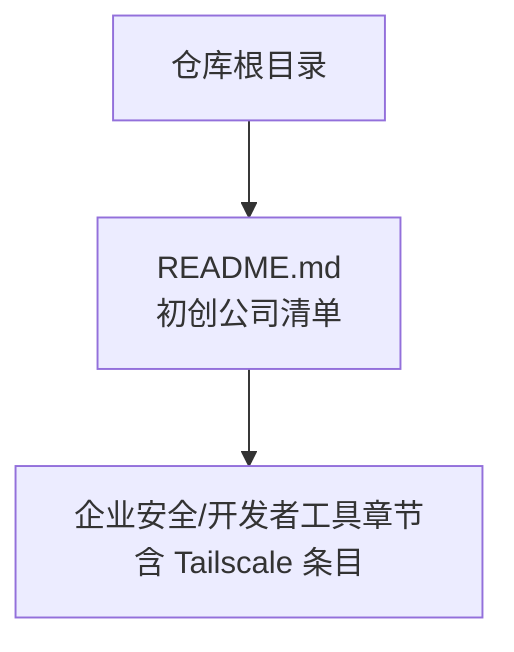
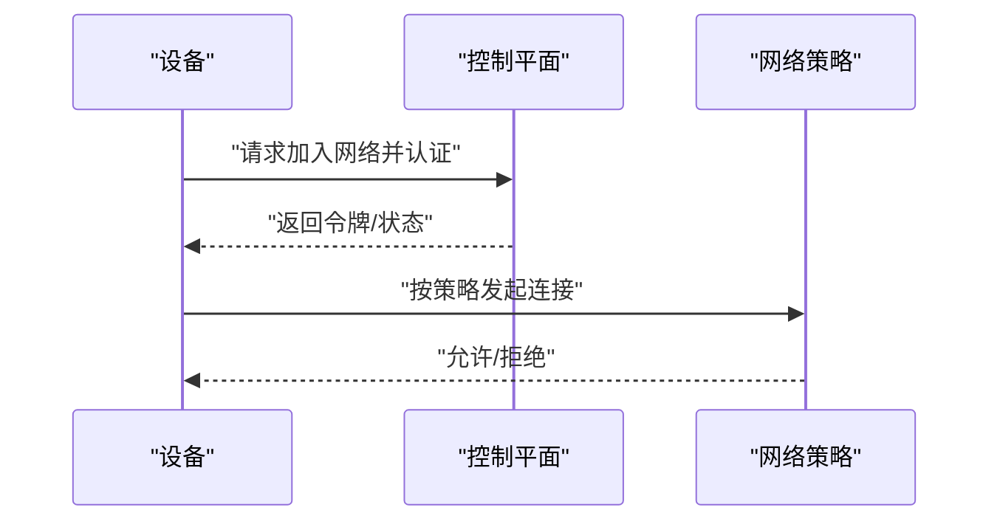
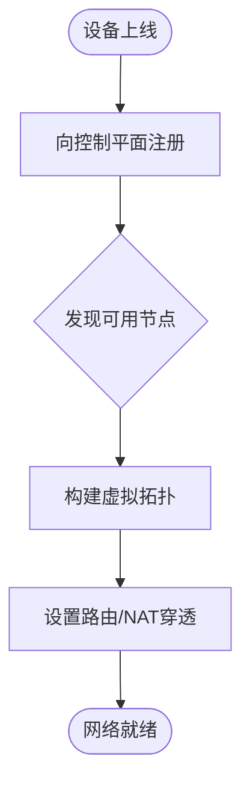
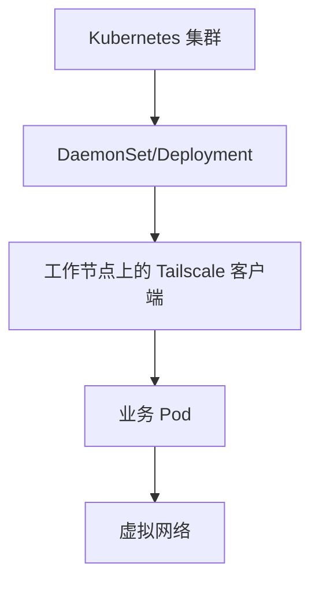
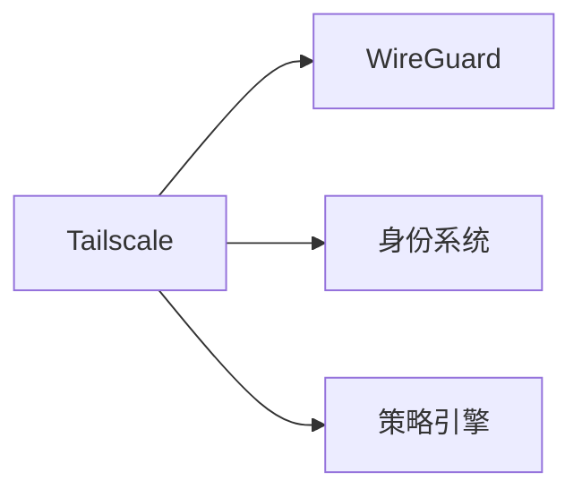

# 网络安全（Tailscale）

<cite>
**本文引用的文件**
- [README.md](file://README.md)
</cite>

## 目录
1. [简介](#简介)
2. [项目结构](#项目结构)
3. [核心组件](#核心组件)
4. [架构总览](#架构总览)
5. [详细组件分析](#详细组件分析)
6. [依赖关系分析](#依赖关系分析)
7. [性能考量](#性能考量)
8. [故障排查指南](#故障排查指南)
9. [结论](#结论)
10. [附录](#附录)

## 简介
本文件面向希望在企业与分布式团队中部署安全、零配置 VPN 的工程师与管理者，围绕 Tailscale 的技术理念与应用实践进行系统化说明。Tailscale 以 WireGuard 为基础，提供“零配置”的网络接入体验，通过身份认证与访问控制实现安全的跨地域连接，适用于远程办公、开发调试、云原生环境等场景。

## 项目结构
当前仓库为初创公司清单文档，其中包含对 Tailscale 的条目性介绍，用于定位其在企业服务与安全领域的价值与定位。该仓库不包含 Tailscale 的代码或配置文件，因此本文档聚焦于概念性架构与实践指导，并结合仓库中对 Tailscale 的描述进行引用。



**图表来源**
- [README.md:852-895](file://README.md#L852-L895)

**章节来源**
- [README.md:852-895](file://README.md#L852-L895)

## 核心组件
基于仓库中对 Tailscale 的条目信息，可提炼出以下关键要点：
- 产品定位：零配置 VPN（WireGuard），强调易用性与安全性
- 目标用户：开发者与企业团队，作为首选的 VPN 解决方案之一
- 技术基础：依托 WireGuard 的高性能加密隧道能力

这些要点构成了后续架构与部署讨论的基础。

**章节来源**
- [README.md:891-894](file://README.md#L891-L894)

## 架构总览
Tailscale 的架构通常包含以下层次（概念性说明）：
- 设备节点：运行在终端、服务器或容器中的客户端，建立加密隧道
- 控制平面：负责身份认证、拓扑发现、策略下发与密钥管理
- 数据平面：基于 WireGuard 的高速加密通道，实现端到端通信
- 访问控制：基于身份与策略的最小权限访问模型

```mermaid
graph TB
subgraph "设备层"
D1["设备A"]
D2["设备B"]
D3["设备C"]
end
subgraph "控制平面"
C["控制服务<br/>认证/拓扑/策略"]
end
subgraph "数据平面"
W["WireGuard 加密隧道"]
end
D1 --> |加入网络| C
D2 --> |加入网络| C
D3 --> |加入网络| C
D1 < --> |加密流量| W
D2 < --> |加密流量| W
D3 < --> |加密流量| W
```

[此图为概念性架构图，不直接映射到具体代码文件]

## 详细组件分析
### 身份认证与访问控制
- 身份认证：设备与用户需通过受控的身份源完成认证，确保只有授权实体可加入网络
- 访问控制：基于角色与策略的细粒度访问控制，限制设备间可达范围与服务暴露面
- 最小权限：默认拒绝所有，按需放行，降低横向移动风险



[此图为概念性流程，不直接映射到具体代码文件]

### 网络拓扑构建
- 自动发现：设备上线后自动注册到控制平面，形成虚拟网络拓扑
- 路由与 NAT 穿透：利用现代网络特性实现跨网段、跨云环境的连通
- 子网路由：可将本地局域网或服务暴露给整个网络，便于调试与协作



[此图为概念性流程，不直接映射到具体代码文件]

### 容器化与云原生集成
- Kubernetes：通过 DaemonSet 或 Deployment 部署节点，结合 NetworkPolicy 实现更细粒度的访问控制
- Docker：在容器内运行客户端，将容器纳入统一虚拟网络，简化跨主机调试
- 云环境：支持主流云平台，便于在多区域、多账号环境下统一管理



[此图为概念性流程图，不直接映射到具体代码文件]

## 依赖关系分析
从仓库内容可知，Tailscale 的核心依赖包括：
- WireGuard：提供高性能、轻量级的加密隧道能力
- 身份系统：用于设备与用户的认证与授权
- 策略引擎：实现访问控制与网络策略管理



[此图为概念性依赖图，不直接映射到具体代码文件]

**章节来源**
- [README.md:891-894](file://README.md#L891-L894)

## 性能考量
- 加密开销：WireGuard 的低开销设计有助于提升吞吐与降低延迟
- 拓扑规模：大规模网络下需关注控制平面的可扩展性与缓存策略
- 带宽优化：合理划分子网与路由，避免不必要的跨域流量
- 资源占用：在容器与边缘设备上注意内存与 CPU 使用率

[本节为通用性能建议，不直接分析具体文件]

## 故障排查指南
- 连接问题：检查设备是否成功认证并加入网络，确认防火墙与 NAT 穿透设置
- 策略问题：核对访问控制策略是否正确生效，是否存在误拦截
- 日志与监控：启用审计日志与网络监控，定位异常连接与错误事件
- 回滚与恢复：在变更策略前备份配置，必要时快速回滚

[本节为通用排障建议，不直接分析具体文件]

## 结论
Tailscale 以“零配置”和“基于 WireGuard 的安全隧道”为核心，为企业与分布式团队提供了简洁而强大的网络连接方案。结合身份认证、访问控制与策略管理，能够在保障安全的前提下显著提升协作效率。对于容器化与云原生环境，Tailscale 能够无缝融入现有基础设施，成为远程办公与跨地域连接的优选方案。

[本节为总结性内容，不直接分析具体文件]

## 附录
- 参考条目：仓库中对 Tailscale 的定位与亮点描述，可作为选型与评估的起点
- 进一步阅读：建议结合官方文档与最佳实践，完善部署与运维流程

[本节为补充信息，不直接分析具体文件]