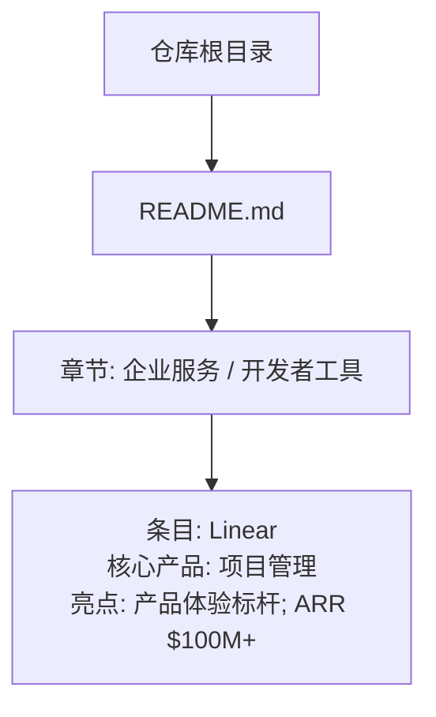
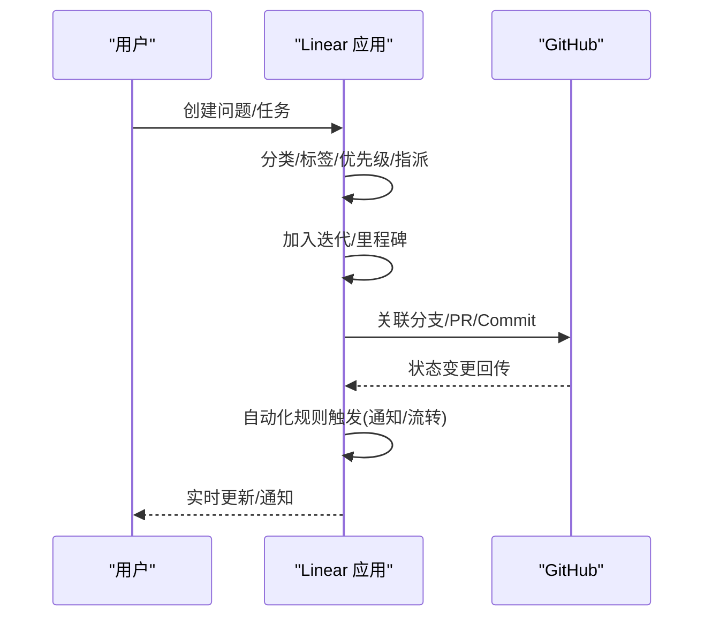
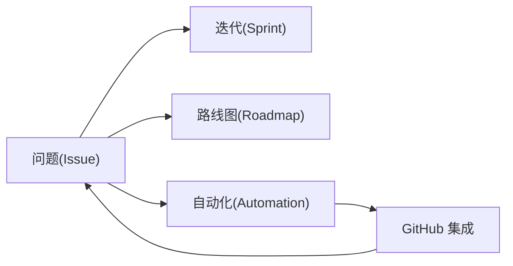

# Linear 项目管理工具

<cite>
**本文引用的文件**
- [README.md](file://README.md)
</cite>

## 目录
1. [简介](#简介)
2. [项目结构](#项目结构)
3. [核心组件](#核心组件)
4. [架构总览](#架构总览)
5. [详细组件分析](#详细组件分析)
6. [依赖关系分析](#依赖关系分析)
7. [性能考量](#性能考量)
8. [故障排查指南](#故障排查指南)
9. [结论](#结论)
10. [附录](#附录)

## 简介
本文件基于仓库中关于 Linear 的公开信息，系统性梳理其作为现代项目管理工具的定位与价值：以极简设计与高性能交互为核心，覆盖问题跟踪、冲刺规划、路线图管理、自动化工作流与 GitHub 集成等关键能力；并从用户体验（键盘优先、流畅动画、实时协作）与商业增长（ARR $100M+）角度解读其成功原因。同时提供团队落地指南（工作流定制、权限管理、第三方集成配置），并与 Jira、Asana 等传统工具进行对比，帮助读者评估适用场景与迁移策略。

## 项目结构
当前仓库为“精选初创公司清单”，Linear 出现在“企业服务/开发者工具”板块，条目包含产品定位与 ARR 亮点。该仓库不包含 Linear 的代码或内部文档，因此本文聚焦于对仓库中已披露信息的结构化解读与扩展性说明。

图表来源
- [README.md:773-793](file://README.md#L773-L793)

章节来源
- [README.md:773-793](file://README.md#L773-L793)

## 核心组件
根据仓库中对 Linear 的描述，可提炼出以下核心要点：
- 产品定位：项目管理工具，面向高效协作与交付
- 设计导向：产品体验标杆，强调简洁与高性能
- 商业指标：ARR $100M+，体现规模化商业化能力

这些要点构成后续深入分析的基石，并用于解释其在设计师与开发者群体中的受欢迎程度。

章节来源
- [README.md:789-793](file://README.md#L789-L793)

## 架构总览
从用户视角看，Linear 的典型使用路径包括：创建问题、组织到迭代/里程碑、在路线图中可视化、通过自动化规则推进流转、与代码仓库（如 GitHub）双向同步。下图展示一个概念化的端到端流程，便于理解各模块如何协同。

说明
- 该图为概念流程图，用于说明典型协作闭环，不直接映射具体源码文件。

## 详细组件分析
本节围绕仓库中提及的 Linear 能力，结合通用实践进行分层解析，帮助读者快速上手与深度使用。

### 问题跟踪（Issue Tracking）
- 目标：将需求、缺陷、改进项统一纳入可追踪的工作项
- 关键点：
  - 字段与视图：标题、描述、优先级、标签、成员、截止日期、附件等
  - 视图模式：列表、看板、时间线、仪表盘
  - 搜索与过滤：按状态、成员、标签、日期范围等多维筛选
- 最佳实践：
  - 建立统一的命名规范与标签体系
  - 明确优先级定义与升级机制
  - 将重复性问题模板化，提升录入效率

### 冲刺规划（Sprint Planning）
- 目标：将工作项按周期（Sprint/Iteration）组织，保障交付节奏
- 关键点：
  - 容量规划：依据成员可用时间与历史速率估算
  - 任务拆解：将大目标拆为可执行的小任务
  - 进度跟踪：每日站会/周回顾，动态调整
- 最佳实践：
  - 固定周期与评审节奏
  - 控制范围，避免中途频繁插入
  - 用燃尽图/累积流图监控健康度

### 路线图管理（Roadmap）
- 目标：对齐长期目标与短期交付，透明化战略执行
- 关键点：
  - 层级结构：主题/特性/里程碑/版本
  - 依赖关系：跨团队依赖与前置条件
  - 发布计划：与业务节奏匹配
- 最佳实践：
  - 定期复盘与更新路线图
  - 将路线图与迭代绑定，确保可执行性
  - 对外共享只读视图，增强透明度

### 自动化工作流（Automation）
- 目标：减少重复操作，提升流转效率
- 关键点：
  - 触发器：状态变更、评论、标签变化、外部事件
  - 动作：自动指派、移动、打标签、发送通知
  - 规则治理：避免过度自动化导致噪音
- 最佳实践：
  - 先小范围试点，逐步推广
  - 记录规则意图与责任人
  - 定期审计规则效果

### GitHub 集成（GitHub Integration）
- 目标：打通代码与任务，实现“代码即进度”
- 关键点：
  - 双向同步：PR/Merge/Commit 与 Issue 状态联动
  - 上下文丰富：在 PR 中引用 Issue，在 Issue 中查看相关代码
  - 权限与安全：最小权限原则，保护敏感仓库
- 最佳实践：
  - 制定分支命名与提交规范
  - 将关键检查（CI/测试）与任务状态挂钩
  - 定期清理僵尸关联

章节来源
- [README.md:789-793](file://README.md#L789-L793)

## 依赖关系分析
- 内部依赖：问题、迭代、路线图、自动化规则之间存在强耦合，需保持一致的数据模型与状态机
- 外部依赖：GitHub 等代码平台是常见集成点，影响数据一致性与延迟
- 风险点：
  - 过度依赖单一集成可能导致单点故障
  - 规则复杂度过高会增加维护成本
  - 权限配置不当可能引发安全与合规风险

说明
- 该图为概念依赖图，用于说明模块间关系，不直接映射具体源码文件。

## 性能考量
- 交互性能：键盘优先、无阻塞编辑、即时反馈，有助于提升专注力与吞吐
- 数据一致性：在高频协作下保证状态同步与冲突解决
- 可扩展性：随着团队规模扩大，保持视图加载与查询响应速度
- 建议：
  - 合理划分视图与索引字段
  - 限制批量操作的规模与频率
  - 对重型计算（如报表）采用异步处理

[本节为通用指导，不直接分析具体文件]

## 故障排查指南
- 常见问题
  - 集成失败：检查 OAuth/Token 权限、网络连通性、Webhook 可达性
  - 状态不同步：确认双向同步开关、重试队列、错误日志
  - 自动化误触发：审查规则优先级与条件，必要时临时关闭
- 排查步骤
  - 复现最小用例，定位触发点
  - 查看集成日志与错误码
  - 逐步放宽/收紧规则，验证假设
  - 回滚至稳定版本或禁用问题规则
- 预防建议
  - 变更前灰度发布
  - 建立规则文档与审批流程
  - 定期演练故障恢复

[本节为通用指导，不直接分析具体文件]

## 结论
Linear 凭借极简设计与高性能交互，成为设计师与开发者的首选项目管理工具之一。其以问题跟踪为基础，串联冲刺规划、路线图管理与自动化工作流，并通过 GitHub 集成形成“代码—任务”闭环。ARR $100M+ 的商业表现印证了产品价值与市场认可。对于追求高效协作与清晰交付的团队，Linear 提供了低摩擦、高透明的协作体验。

[本节为总结性内容，不直接分析具体文件]

## 附录
- 团队采用指南（建议）
  - 工作流定制：从现有流程出发，逐步抽象为标准模板；保留灵活性以适应不同项目
  - 权限管理：基于角色（管理员、成员、访客）的最小权限分配；敏感项目单独隔离
  - 第三方集成：优先选择官方集成（如 GitHub），按需启用 Webhook/回调；做好密钥轮换与审计
- 与传统工具的对比思路
  - 与 Jira：Linear 更强调速度与简洁，适合中小型到中型团队快速迭代；Jira 生态庞大，适合大型复杂流程与重度定制
  - 与 Asana：Linear 更偏工程与研发场景，Asana 更通用且易用；可根据团队类型与偏好选择
- 迁移策略
  - 分阶段迁移：先试点团队，再逐步推广
  - 数据导入：导出旧系统数据，清洗后导入；建立映射表
  - 培训与赋能：提供操作手册与最佳实践；设立内部专家支持

[本节为通用指导，不直接分析具体文件]