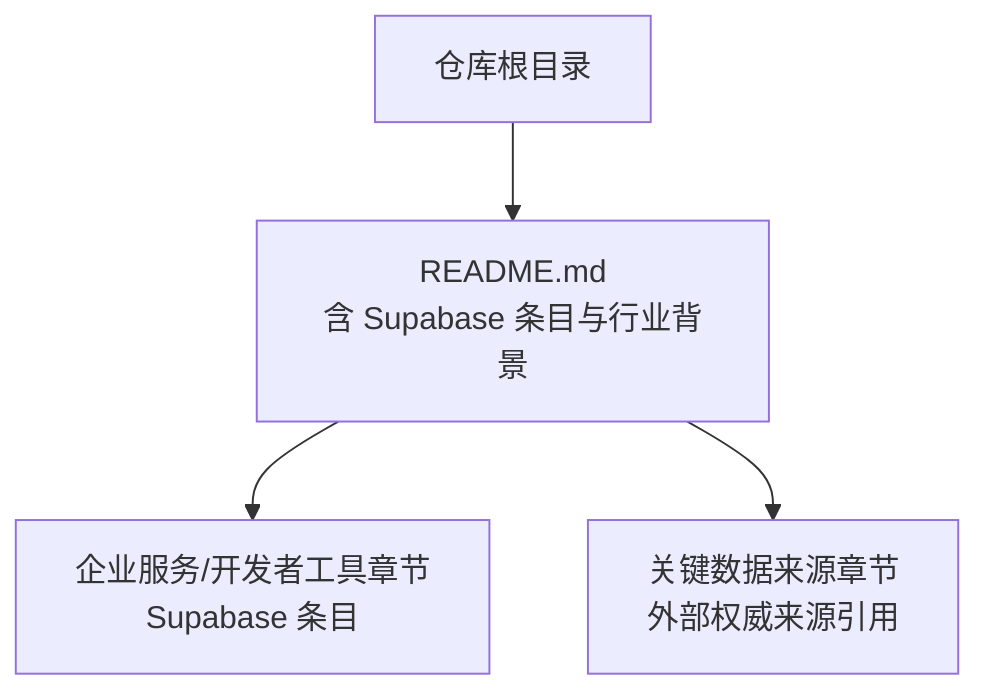
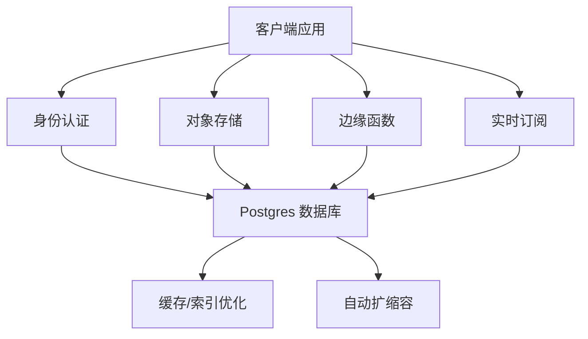
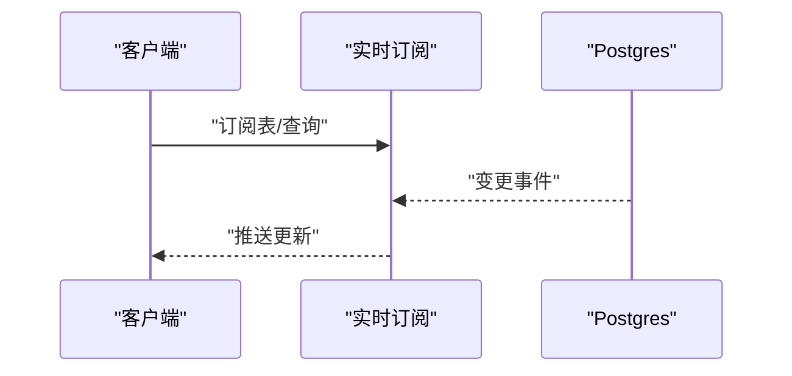
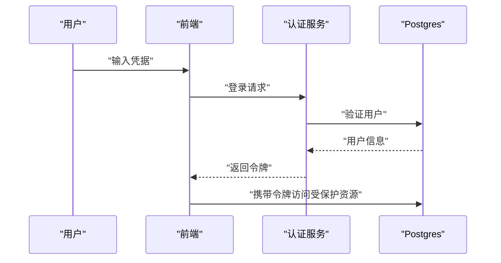
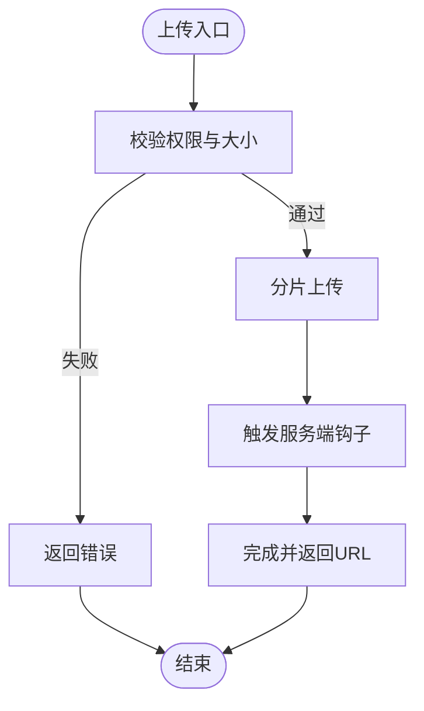
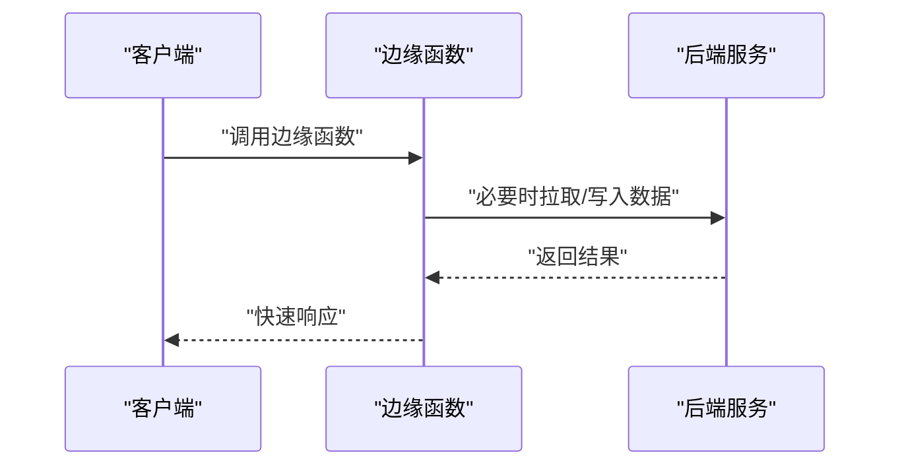
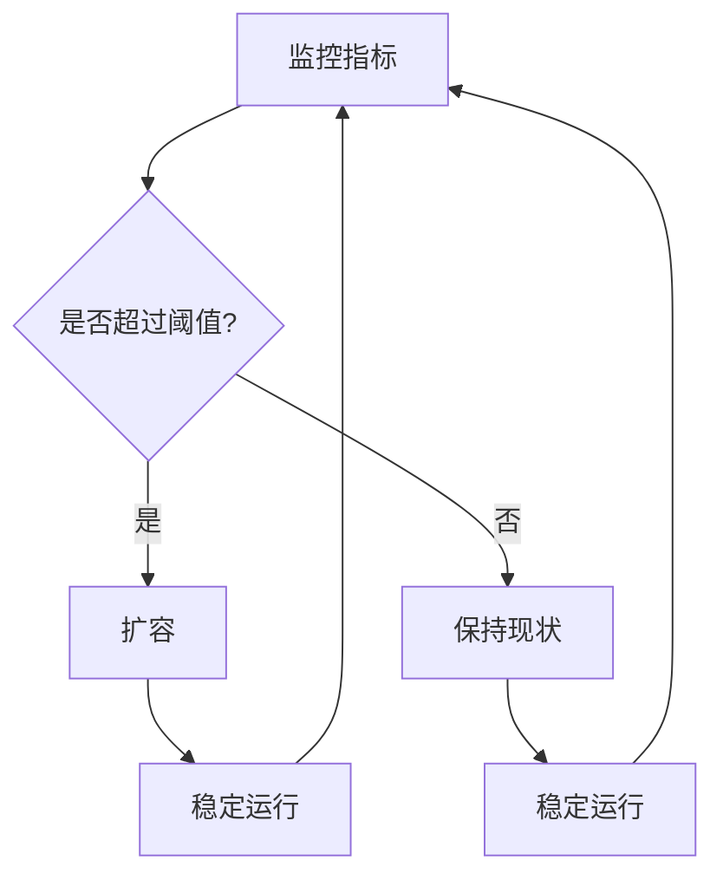
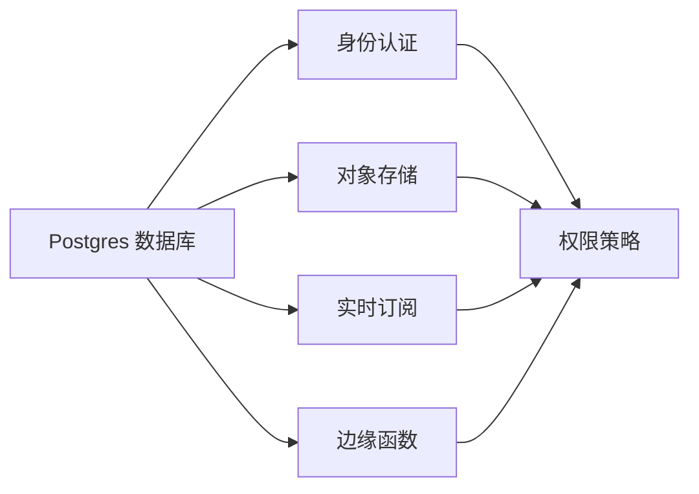

# Supabase 后端即服务

<cite>
**本文引用的文件**
- [README.md](file://README.md)
</cite>

## 目录
1. [引言](#引言)
2. [项目结构](#项目结构)
3. [核心组件](#核心组件)
4. [架构总览](#架构总览)
5. [详细组件分析](#详细组件分析)
6. [依赖关系分析](#依赖关系分析)
7. [性能考量](#性能考量)
8. [故障排查指南](#故障排查指南)
9. [结论](#结论)
10. [附录](#附录)

## 引言
本技术文档聚焦 Supabase 作为开源 Firebase 替代品的产品定位与技术架构，结合“Postgres 数据库复兴”趋势，系统阐述其核心能力：实时数据、身份认证、存储、边缘函数与自动扩缩容机制。同时对比传统 BaaS 的差异（开源优势、数据所有权、可扩展性），并基于仓库信息梳理其在 YC 孵化后的发展路径与估值驱动因素。最后提供从传统后端迁移到 Supabase 的实践建议，涵盖数据模型设计、API 生成与实时功能实现等关键步骤。

## 项目结构
当前仓库为精选初创公司清单，其中包含对 Supabase 的条目式描述，用于支撑本文关于其产品定位、融资里程碑与生态影响力的论述。

图表来源
- [README.md:665-680](file://README.md#L665-L680)
- [README.md:917-935](file://README.md#L917-L935)

章节来源
- [README.md:665-680](file://README.md#L665-L680)
- [README.md:917-935](file://README.md#L917-L935)

## 核心组件
根据仓库中 Supabase 条目的描述，可归纳其核心能力与定位如下：
- 开源 Firebase 替代：强调以 Postgres 为核心的后端能力，面向开发者提供开箱即用的 BaaS 体验。
- 实时数据：通过 Postgres 生态与订阅机制，支持客户端实时同步。
- 身份认证：集成用户管理与鉴权能力，便于前端快速接入。
- 存储：对象存储服务，配合权限策略与 API 访问控制。
- 边缘函数：在靠近用户的边缘节点执行轻量逻辑，降低延迟并增强扩展性。
- 自动扩缩容：平台层负责资源弹性伸缩，保障高并发场景下的稳定性。

上述能力共同构成 Supabase 的“数据库+API+实时+安全+扩展”的一体化后端方案，契合现代应用对快速迭代与低运维成本的需求。

章节来源
- [README.md:675-680](file://README.md#L675-L680)

## 架构总览
Supabase 的技术架构围绕 Postgres 展开，将数据库、认证、存储、函数与实时能力整合为统一的开发体验。下图展示概念性架构与数据流，帮助理解各组件如何协作：

说明
- 客户端通过统一 SDK/API 与认证、存储、边缘函数和实时订阅交互。
- 所有业务数据落库于 Postgres，并通过权限策略与行级安全保证数据安全。
- 自动扩缩容由平台层管理，确保在高负载下稳定运行。

[此图为概念性架构图，不直接映射具体源码文件]

## 详细组件分析

### 实时数据库
- 能力概述：基于 Postgres 的变更捕获与发布订阅机制，实现客户端与服务端之间的实时数据同步。
- 使用模式：前端订阅表或查询结果，服务端变更时即时推送至客户端。
- 典型场景：聊天室、仪表盘、协同编辑、事件驱动工作流。
- 注意事项：合理设计索引与查询，避免大事务导致的推送延迟；利用分页与增量更新提升性能。

[此图为概念性序列图，不直接映射具体源码文件]

### 身份认证
- 能力概述：提供用户注册、登录、第三方登录与权限管理，支持 JWT 令牌与会话管理。
- 使用模式：前端调用认证 API，服务端校验令牌后访问受保护资源。
- 典型场景：多租户 SaaS、内容平台、企业内部系统。
- 注意事项：遵循最小权限原则，结合行级安全与角色策略限制数据访问范围。

[此图为概念性序列图，不直接映射具体源码文件]

### 存储
- 能力概述：对象存储服务，支持分片上传、CDN 加速与细粒度权限控制。
- 使用模式：前端直传对象，服务端通过策略与钩子进行校验与处理。
- 典型场景：头像、文档、媒体资源、用户上传内容。
- 注意事项：设置合理的生命周期与访问策略，防止滥用与越权访问。

[此图为概念性流程图，不直接映射具体源码文件]

### 边缘函数
- 能力概述：在靠近用户的边缘节点执行轻量逻辑，减少往返延迟，提高响应速度。
- 使用模式：定义函数逻辑，部署到边缘网络，通过 API 网关暴露。
- 典型场景：数据预处理、A/B 测试路由、个性化推荐、Webhook 转发。
- 注意事项：控制函数执行时间与资源占用，避免冷启动影响用户体验。

[此图为概念性序列图，不直接映射具体源码文件]

### 自动扩缩容
- 能力概述：平台层根据负载动态调整计算与存储资源，保障高可用与成本效率。
- 使用模式：无需手动干预，监控指标驱动弹性伸缩。
- 典型场景：流量高峰、突发增长、长尾负载。
- 注意事项：合理设置阈值与冷却时间，避免频繁伸缩导致抖动。

[此图为概念性流程图，不直接映射具体源码文件]

## 依赖关系分析
Supabase 的核心依赖围绕 Postgres 生态构建，形成“数据库为中心”的服务组合。下图展示概念性依赖关系：

[此图为概念性依赖图，不直接映射具体源码文件]

## 性能考量
- 查询优化：充分利用索引、物化视图与分区表，减少全表扫描。
- 连接池：合理配置连接池大小，避免连接耗尽。
- 缓存策略：热点数据采用缓存层，减轻数据库压力。
- 实时推送：控制订阅粒度与频率，避免广播风暴。
- 边缘计算：将轻量逻辑下沉到边缘，降低主链路延迟。

[本节提供通用指导，不直接分析具体文件]

## 故障排查指南
- 认证失败：检查令牌有效期、权限策略与跨域配置。
- 实时不同步：确认订阅条件、数据库变更事件与网络连通性。
- 存储上传失败：核对权限策略、文件大小限制与 CDN 状态。
- 边缘函数超时：优化函数逻辑、增加重试与降级策略。
- 扩缩容异常：审查监控指标、阈值设置与资源配额。

[本节提供通用指导，不直接分析具体文件]

## 结论
Supabase 以 Postgres 为核心，将数据库、认证、存储、函数与实时能力整合为一体化后端方案，契合现代应用对快速开发与低运维成本的需求。在“Postgres 复兴”的背景下，Supabase 凭借开源优势、数据所有权与高度可扩展性，成为传统 BaaS 的有力替代。结合仓库中的条目信息，其累计融资规模与行业影响力表明，该产品在 YC 孵化后实现了快速发展，并在企业级市场中占据重要地位。

[本节总结性内容，不直接分析具体文件]

## 附录

### 与传统 BaaS 的差异
- 开源优势：代码透明、社区活跃、可定制性强。
- 数据所有权：数据存储在自有 Postgres 实例，便于迁移与合规。
- 自定义扩展：支持 SQL、插件与自定义函数，满足复杂业务需求。
- 成本可控：按需付费与自托管选项，避免供应商锁定。

[本节提供通用对比，不直接分析具体文件]

### 从传统后端迁移到 Supabase 的实践指南
- 数据模型设计：以关系型建模为主，利用外键与约束保证一致性。
- API 生成：基于数据库 schema 自动生成 REST/GraphQL API，减少样板代码。
- 实时功能实现：通过订阅表或查询结果，实现客户端实时同步。
- 权限与安全：配置行级安全与角色策略，确保数据访问最小化。
- 部署与运维：利用平台自动扩缩容与监控告警，简化运维复杂度。

[本节提供实践建议，不直接分析具体文件]