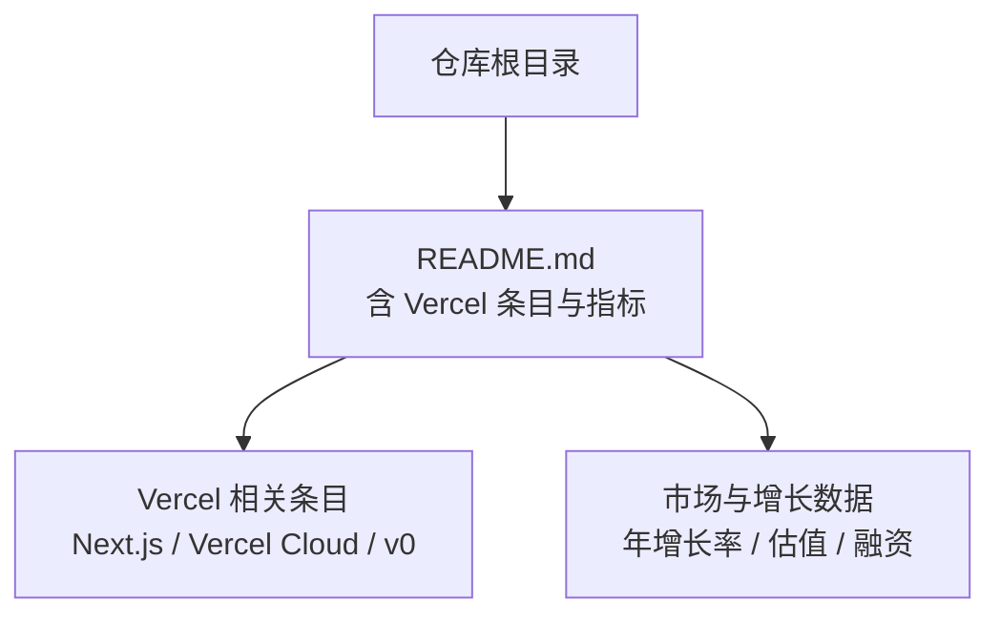
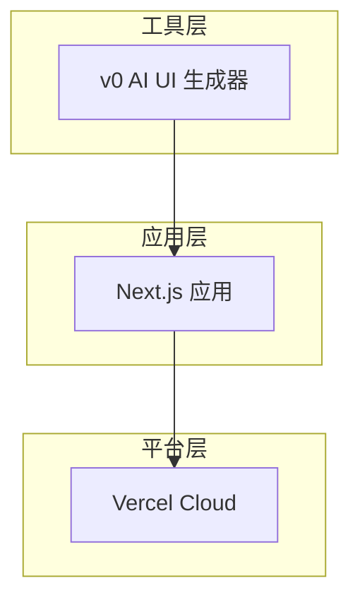
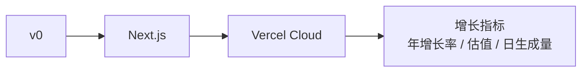

# Vercel 前端部署平台

<cite>
**本文引用的文件**
- [README.md](file://README.md)
</cite>

## 目录
1. [简介](#简介)
2. [项目结构](#项目结构)
3. [核心组件](#核心组件)
4. [架构总览](#架构总览)
5. [详细组件分析](#详细组件分析)
6. [依赖分析](#依赖分析)
7. [性能考量](#性能考量)
8. [故障排查指南](#故障排查指南)
9. [结论](#结论)
10. [附录](#附录)

## 简介
本技术文档聚焦 Vercel 作为现代前端部署平台的整体能力与生态，结合仓库中关于 Vercel 的关键信息，系统阐述其在 Next.js 框架集成、边缘计算、Serverless 函数支持、Git 工作流集成等方面的定位与作用；同时说明 v0 AI UI 生成器与 Vercel 部署的协同关系。文档还梳理了增长与市场表现（如年增长与估值），并给出面向个人开发者、初创公司与企业级团队的使用场景与最佳实践建议。

## 项目结构
当前仓库为“精选初创公司清单”，其中包含对 Vercel 及其产品（Next.js、Vercel Cloud、v0）的条目化描述，以及关键业务指标（如年增长率、日生成量等）。这些内容为本文档提供了事实依据与上下文背景。

图表来源
- [README.md:638-643](file://README.md#L638-L643)

章节来源
- [README.md:638-643](file://README.md#L638-L643)

## 核心组件
基于仓库内容，Vercel 的核心组件包括：
- Next.js：前端框架与全栈能力的基础
- Vercel Cloud：云部署与运行环境
- v0：AI UI 生成器，与 Vercel 部署深度集成

上述组件在仓库中被并列列出，体现 Vercel 以“框架 + 云平台 + AI 工具”的一体化策略。

章节来源
- [README.md:638-643](file://README.md#L638-L643)

## 架构总览
从仓库提供的信息出发，可将 Vercel 的技术生态抽象为三层：
- 应用层：由 Next.js 驱动的前端/全栈应用
- 平台层：Vercel Cloud 提供构建、部署、运行与分发能力
- 工具层：v0 通过 AI 生成 UI 组件并与部署链路无缝衔接

图表来源
- [README.md:638-643](file://README.md#L638-L643)

## 详细组件分析

### Next.js 框架集成
- 角色定位：作为 Vercel 生态中的前端/全栈框架，Next.js 与 Vercel Cloud 形成紧密耦合，便于快速开发与部署。
- 价值点：结合仓库中对 Vercel 的定位，Next.js 是承载应用逻辑与页面渲染的核心载体。

章节来源
- [README.md:638-643](file://README.md#L638-L643)

### Vercel Cloud 云平台
- 角色定位：提供构建、部署、运行与分发的云端服务，支撑 Next.js 应用的发布与运维。
- 价值点：仓库将 Vercel Cloud 列为核心产品之一，表明其在全栈交付链中的关键地位。

章节来源
- [README.md:638-643](file://README.md#L638-L643)

### v0 AI UI 生成器
- 角色定位：AI 驱动的 UI 组件生成工具，提升前端开发效率。
- 与部署集成：仓库明确指出“与 Vercel 部署深度集成”，意味着生成的 UI 可直接进入 Vercel 的构建与发布流程。
- 规模指标：日生成组件量超百万，体现高吞吐与规模化使用。

章节来源
- [README.md:260-263](file://README.md#L260-L263)
- [README.md:638-643](file://README.md#L638-L643)

### 增长与市场表现
- 年增长率：仓库记录 Vercel 年增长 82%，反映平台的高速扩张。
- 估值与融资：2025 年 9 月 Series F $300M，估值 $9.3B，体现资本市场认可。
- 产品规模：v0 日生成组件 100 万+，体现工具侧的高频使用与生态渗透。

章节来源
- [README.md:638-643](file://README.md#L638-L643)

## 依赖分析
从仓库条目可见，Vercel 的生态围绕 Next.js 与 v0 展开，三者形成“框架—平台—工具”的闭环：
- Next.js 应用依赖 Vercel Cloud 进行构建与部署
- v0 生成的 UI 组件可被 Next.js 应用直接消费，并通过 Vercel Cloud 发布
- 增长指标（年增长率、估值、日生成量）共同构成生态健康度的观测维度

图表来源
- [README.md:638-643](file://README.md#L638-L643)

章节来源
- [README.md:638-643](file://README.md#L638-L643)

## 性能考量
- 构建与部署：依托 Vercel Cloud 的自动化流水线，Next.js 应用可实现快速迭代与稳定发布。
- 生成规模：v0 日生成组件量达百万级，要求平台具备高并发处理能力与可靠的资源调度。
- 增长验证：82% 的年增长率与 $9.3B 估值，间接反映平台在高负载下的稳定性与可扩展性。

[本节为通用性能讨论，不直接分析具体代码文件]

## 故障排查指南
- 若出现构建失败或部署异常，优先检查 Next.js 配置与依赖版本是否与 Vercel Cloud 兼容。
- 若 v0 生成的组件无法正确渲染，确认组件是否遵循 Next.js 的模块约定与导入路径。
- 关注平台公告与版本更新日志，确保与最新运行时特性保持一致。

[本节为通用排障建议，不直接分析具体代码文件]

## 结论
仓库中的 Vercel 条目清晰呈现了其“Next.js + Vercel Cloud + v0”的一体化布局，并以显著的增长指标（年增长率 82%、$9.3B 估值、v0 日生成百万组件）佐证其市场地位与产品力。对于不同规模的团队，可据此制定相应的采用策略：个人开发者利用 v0 加速原型与上线；初创公司以 Next.js 快速构建 MVP 并通过 Vercel Cloud 持续迭代；企业级应用则借助平台能力实现稳定、可观测、可扩展的前端交付体系。

[本节为总结性内容，不直接分析具体代码文件]

## 附录
- 数据来源：本文件所有关于 Vercel 的事实性信息均来源于仓库 README 中的条目化记录。
- 扩展阅读：如需了解更深入的实现细节（如边缘计算、Serverless 函数、增量构建优化、全球 CDN 分发、Git 工作流集成等），建议参考 Vercel 官方文档与技术博客，并结合实际项目落地验证。

[本节为补充说明，不直接分析具体代码文件]