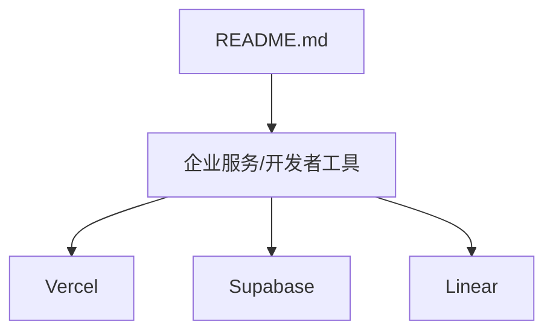
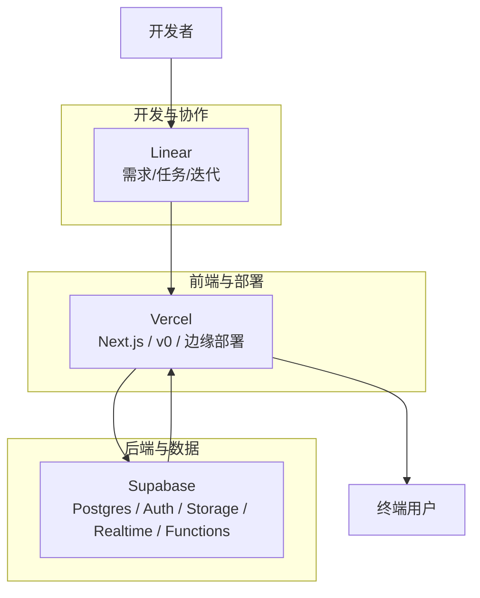
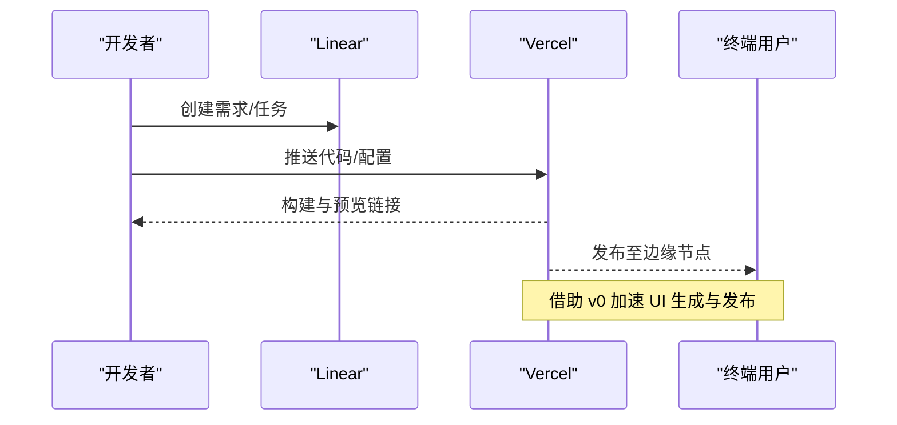
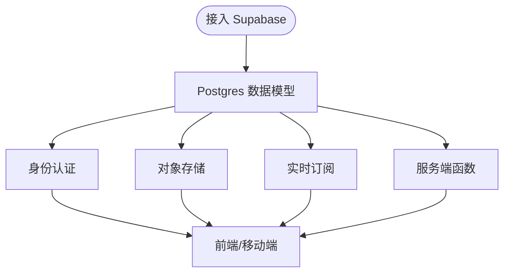
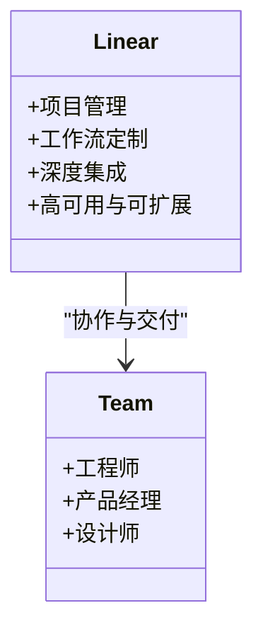
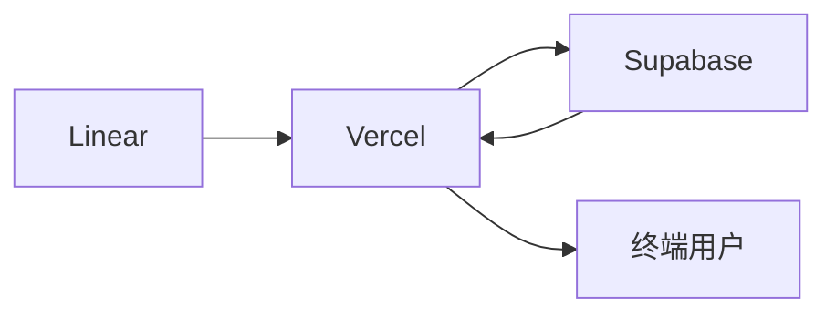

# 开发者基础设施

<cite>
**本文引用的文件**
- [README.md](file://README.md)
</cite>

## 目录
1. [引言](#引言)
2. [项目结构](#项目结构)
3. [核心组件](#核心组件)
4. [架构总览](#架构总览)
5. [详细组件分析](#详细组件分析)
6. [依赖关系分析](#依赖关系分析)
7. [性能考量](#性能考量)
8. [故障排查指南](#故障排查指南)
9. [结论](#结论)
10. [附录](#附录)

## 引言
本文件聚焦现代开发工作流中的三大关键产品：Vercel、Supabase、Linear。它们分别覆盖前端部署与全栈体验、后端即服务（BaaS）与数据平台、以及工程团队的项目管理与协作。文档基于仓库中“企业服务/开发者工具”板块的公开信息，系统梳理各产品的技术定位、核心价值主张、目标用户、功能特性、定价与企业级能力、在现代开发流程中的集成方式，并给出选型建议与发展趋势分析。

## 项目结构
该仓库以 README 为核心内容载体，按赛道组织初创公司清单。其中“企业服务/开发者工具”小节包含 Vercel、Supabase、Linear 等条目，提供估值、融资、核心产品与亮点等信息，作为本文分析的权威来源。

图表来源
- [README.md:618-638](file://README.md#L618-L638)

章节来源
- [README.md:618-638](file://README.md#L618-L638)

## 核心组件
- Vercel：面向 Next.js 与前端生态的云平台，强调极速部署、边缘渲染、AI 生成 UI（v0）与持续交付体验。
- Supabase：开源 Firebase 替代方案，围绕 Postgres 构建 BaaS，提供认证、存储、实时、函数等能力，强调可移植性与企业可控性。
- Linear：以极致体验为核心的项目管理工具，强调速度、可定制工作流、深度集成与高内聚的团队协同。

章节来源
- [README.md:622-638](file://README.md#L622-L638)

## 架构总览
下图展示三者如何嵌入现代 Web/全栈应用的生命周期：从代码到上线、从数据到访问控制、从需求到交付闭环。

图表来源
- [README.md:622-638](file://README.md#L622-L638)

## 详细组件分析

### Vercel 分析
- 技术定位与价值主张
  - 以 Next.js 为中心的前端与全栈部署平台，强调“从提交到上线”的极简体验与高性能边缘网络。
  - 通过 v0 将 AI 生成 UI 与部署链路打通，提升设计与工程效率。
- 目标用户
  - 前端/全栈工程师、产品团队、创业公司与企业前端团队。
- 功能特性（基于仓库信息）
  - Next.js 原生支持与优化；Vercel Cloud 部署；v0 日生成量巨大，体现规模化 AI 辅助设计能力。
- 定价模式与企业级能力
  - 仓库未披露具体定价与企业版细节；通常按用量与团队协作层级划分，适合从小型团队到大规模生产环境演进。
- 在现代开发工作流中的作用
  - 代码推送触发自动构建与预览；结合 v0 快速产出 UI 组件并一键发布；配合 CI/CD 实现多环境管理。
- 选型建议
  - 若团队以 React/Next.js 为主、重视部署速度与 DX，优先选择 Vercel；如需更细粒度云资源控制，可评估混合策略。

图表来源
- [README.md:622-638](file://README.md#L622-L638)

章节来源
- [README.md:622-638](file://README.md#L622-L638)

### Supabase 分析
- 技术定位与价值主张
  - 以 Postgres 为核心的开源 BaaS，提供认证、存储、实时、函数等能力，强调可移植、可审计、可自托管的企业友好特性。
- 目标用户
  - 需要快速搭建后端能力的团队、希望避免厂商锁定或追求数据主权的企业。
- 功能特性（基于仓库信息）
  - 围绕 Postgres 生态的 BaaS；在开发者社区保持领先，被广泛采用。
- 定价模式与企业级能力
  - 仓库未披露具体定价与企业版细节；通常按数据库实例、请求量与存储计费，并提供企业级支持选项。
- 在现代开发工作流中的作用
  - 为前端提供开箱即用的 API（Auth、Storage、Realtime），减少后端样板代码；便于与 Vercel 等前端平台无缝集成。
- 选型建议
  - 若团队偏好 SQL、重视数据可移植性与合规，Supabase 是首选；若已有成熟后端体系，可按需接入其部分能力。

图表来源
- [README.md:628-633](file://README.md#L628-L633)

章节来源
- [README.md:628-633](file://README.md#L628-L633)

### Linear 分析
- 技术定位与价值主张
  - 以极致体验与高效协作为核心的项目管理工具，强调速度、可定制工作流与深度集成。
- 目标用户
  - 工程团队、产品经理、设计师及跨职能协作团队。
- 功能特性（基于仓库信息）
  - 项目管理；ARR 规模与口碑表明其在产品体验与增长上的成功。
- 定价模式与企业级能力
  - 仓库未披露具体定价与企业版细节；通常按席位与高级功能分层，满足中小团队到企业级需求。
- 在现代开发工作流中的作用
  - 作为需求与迭代的单一事实源，与版本管理、CI/CD、监控等工具链集成，驱动端到端交付。
- 选型建议
  - 若团队重视交付节奏与体验一致性，Linear 能显著提升协作效率；若需复杂审批与强合规流程，可评估企业级方案或补充系统。

图表来源
- [README.md:634-638](file://README.md#L634-L638)

章节来源
- [README.md:634-638](file://README.md#L634-L638)

## 依赖关系分析
三者构成“协作—前端—数据”的闭环：
- Linear 驱动需求与迭代，确保团队对齐目标与优先级。
- Vercel 承载前端与全栈应用的构建、预览与发布，保障用户体验与性能。
- Supabase 提供数据层与后端能力，支撑业务逻辑与用户交互。

图表来源
- [README.md:622-638](file://README.md#L622-L638)

章节来源
- [README.md:622-638](file://README.md#L622-L638)

## 性能考量
- Vercel
  - 边缘网络与按需构建有助于降低首屏延迟与冷启动时间；v0 的规模化生成能力可缩短 UI 产出周期。
- Supabase
  - 基于 Postgres 的查询与索引优化、连接池与缓存策略影响吞吐与时延；合理的数据建模与权限控制对性能与安全至关重要。
- Linear
  - 轻量化的交互与高效的搜索/过滤提升日常协作效率；与外部系统的集成应避免阻塞主线程。

[本节为通用指导，不直接分析具体文件]

## 故障排查指南
- Vercel
  - 构建失败：检查依赖安装、环境变量与 Next.js 配置；查看构建日志定位错误。
  - 运行时异常：利用预览环境与 Source Maps 快速复现问题；关注边缘节点日志。
- Supabase
  - 鉴权失败：核对角色与行级安全策略；确认客户端密钥与作用域。
  - 实时订阅断开：检查网络与心跳机制；验证表结构与权限。
- Linear
  - 同步异常：确认与 Git/CI/监控等工具的集成状态；检查 Webhook 与权限。

[本节为通用指导，不直接分析具体文件]

## 结论
- Vercel、Supabase、Linear 共同构成了现代开发工作流的关键支柱：前者提升前端与全栈交付效率，中间者提供可移植的后端能力，后者保障团队协作与交付节奏。
- 对于不同规模团队：
  - 小型/创业团队：三件套组合可快速验证想法并上线。
  - 中型团队：应引入企业级能力（如 SSO、审计、SLA）以满足合规与稳定性要求。
  - 大型企业：可在统一平台基础上进行本地化部署与私有化扩展，平衡创新与治理。
- 发展趋势：Serverless/边缘计算、Postgres 复兴、项目管理工具现代化将持续推动开发效率与体验升级。

[本节为总结性内容，不直接分析具体文件]

## 附录
- 数据来源与背景
  - 本文关于三家公司的基本信息（估值、融资、核心产品与亮点）均来源于仓库“企业服务/开发者工具”板块。
- 参考条目路径
  - Vercel：[README.md:622-627](file://README.md#L622-L627)
  - Supabase：[README.md:628-633](file://README.md#L628-L633)
  - Linear：[README.md:634-638](file://README.md#L634-L638)

章节来源
- [README.md:622-638](file://README.md#L622-L638)