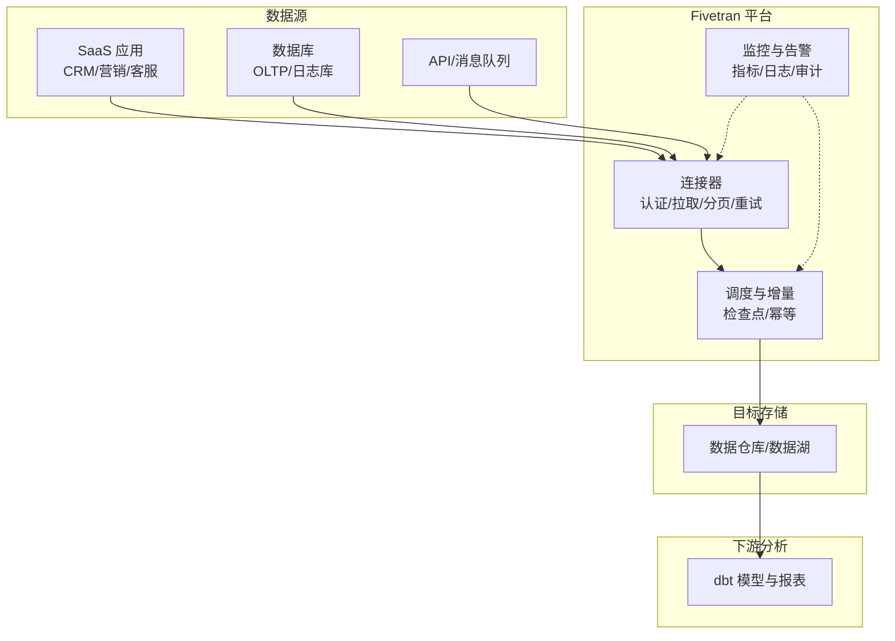

# Fivetran 数据集成工具

<cite>
**本文引用的文件**
- [README.md](file://README.md)
</cite>

## 目录
1. [简介](#简介)
2. [项目结构](#项目结构)
3. [核心组件](#核心组件)
4. [架构总览](#架构总览)
5. [详细组件分析](#详细组件分析)
6. [依赖关系分析](#依赖关系分析)
7. [性能与成本优化](#性能与成本优化)
8. [故障排除指南](#故障排除指南)
9. [结论](#结论)
10. [附录：配置示例与最佳实践](#附录配置示例与最佳实践)

## 简介
本文件面向希望理解并落地 Fivetran 数据集成能力的工程师、数据团队与企业决策者。内容覆盖 ELT 自动化、增量同步、模式变更处理、连接器生态（SaaS/数据库/API）、管道管理、监控告警与错误处理，以及在现代数据栈中与 dbt 的协作方式。同时提供企业级安全、成本优化与故障排除建议，帮助读者在真实业务场景中高效使用 Fivetran。

## 项目结构
当前仓库为“Awesome Startups”清单型文档，其中包含对 Fivetran 的条目性介绍。基于该仓库可确认的关键事实：
- Fivetran 定位为“自动化数据集成”，并以“ELT 自动化标杆”被收录。
- 其估值信息出现在企业服务/开发者工具章节中，体现其在数据基础设施领域的市场地位。

这些背景信息有助于理解 Fivetran 在现代数据栈中的定位：作为数据摄取层的核心组件，将多源数据以 ELT 方式稳定、可靠地进入目标数据仓库或数据湖，供下游分析与建模使用。

**章节来源**
- [README.md:904-912](file://README.md#L904-L912)

## 核心组件
围绕 Fivetran 的数据集成能力，可将系统拆分为以下关键组件（概念层面）：
- 连接器（Connectors）：对接 300+ 数据源（SaaS 应用、数据库、API 等），负责认证、拉取、分页、重试与限流控制。
- 调度与编排（Scheduler & Orchestration）：按策略触发全量/增量同步，维护检查点，保障幂等与一致性。
- 转换与加载（Transform & Load）：将原始数据写入目标存储（如数据仓库/数据湖），保持模式兼容与演进。
- 监控与可观测性（Monitoring & Observability）：采集运行指标、日志、事件，支持告警与审计。
- 管理与治理（Management & Governance）：连接配置、权限、密钥管理、访问控制、合规审计。
- 与下游协作（Downstream Integration）：与 dbt 等工具协同，完成模型化与报表构建。

说明：上述组件为通用架构抽象，用于解释 Fivetran 在企业数据栈中的作用与交互方式。

[本节为概念性概述，不直接分析具体代码文件]

## 架构总览
下图展示了 Fivetran 在现代数据栈中的典型位置与数据流向：上游多源通过 Fivetran 连接器抽取，经调度与增量机制写入目标存储；下游由 dbt 进行转换与建模，形成可复用的数据资产。

[本图为概念性架构图，未映射到具体源码文件，故不提供图示来源]

## 详细组件分析

### 连接器与数据源生态
- 类型覆盖：SaaS 应用（如 CRM、营销、客服）、数据库（关系型/NoSQL）、API（REST/GraphQL/Webhook）等。
- 能力要点：
  - 认证与安全：OAuth、API Key、证书、IP 白名单等。
  - 稳定性：自动重试、退避、断点续传、幂等写入。
  - 增量同步：基于时间戳、游标、事件流等方式减少重复拉取。
  - 模式变更：自动检测字段新增/删除/类型变化，适配目标表结构。
- 规模与可靠性：面向企业级 SLA，具备高可用与容错设计。

[本节为通用技术说明，不直接分析具体代码文件]

### 调度与增量同步
- 调度策略：定时/事件驱动，支持失败重试、并发控制、资源配额。
- 增量机制：记录上次同步位点，仅拉取新增/变更数据，降低带宽与计算开销。
- 幂等与一致性：确保重复执行不会导致数据重复或不一致。
- 检查点与回滚：失败时可从最近检查点恢复，缩短恢复时间。

[本节为通用技术说明，不直接分析具体代码文件]

### 模式变更处理
- 自动探测：识别字段新增、删除、类型变更。
- 兼容策略：默认向后兼容（如新增列允许为空），必要时升级目标表结构。
- 通知与审批：重大变更可触发通知或人工审批流程，避免破坏下游查询。
- 版本化：保留历史模式快照，便于回溯与问题定位。

[本节为通用技术说明，不直接分析具体代码文件]

### 管道管理、监控告警与错误处理
- 管道管理：可视化创建/编辑/启停管道，参数化配置，环境隔离。
- 监控指标：成功率、延迟、吞吐、错误率、资源使用率。
- 告警策略：阈值告警、异常模式检测、多渠道通知（邮件/IM/电话）。
- 错误处理：分类错误（网络/认证/限流/数据格式），自动重试与降级策略，人工介入入口。
- 审计与合规：操作日志、访问审计、数据血缘追踪。

[本节为通用技术说明，不直接分析具体代码文件]

### 与现代数据栈及 dbt 的协作
- 角色分工：Fivetran 负责“提取与加载”（EL），dbt 负责“转换”（T）。
- 数据契约：上游以标准化命名与类型输出，下游以 dbt 模型消费，保证可维护性与可测试性。
- 工作流：Fivetran 持续将增量数据写入目标存储；dbt 定时或事件触发执行转换，产出分析模型与报表。
- 质量保障：结合 dbt 的测试与文档能力，提升数据可信度与可发现性。

[本节为通用技术说明，不直接分析具体代码文件]

## 依赖关系分析
- 外部依赖：
  - 数据源系统：SaaS、数据库、API 提供方，需满足认证与访问要求。
  - 目标存储：数据仓库/数据湖，需具备足够的容量与并发能力。
  - 安全与合规：身份认证、加密传输、访问控制、审计日志。
- 内部耦合：
  - 连接器与调度模块松耦合，通过统一接口交换元数据与状态。
  - 监控与告警独立于核心流水线，便于扩展与替换。
- 风险点：
  - 上游限流/不稳定可能导致同步延迟或失败。
  - 模式频繁变更可能引发兼容性问题。
  - 目标存储容量与性能瓶颈影响整体吞吐。

[本节为通用技术说明，不直接分析具体代码文件]

## 性能与成本优化
- 增量优先：尽量使用增量同步，减少重复数据量与传输成本。
- 批大小与并发：根据源端与目标端能力调优批次大小与并发度，平衡吞吐与资源占用。
- 压缩与编码：选择合适的数据格式与压缩策略，降低存储与传输成本。
- 分区与索引：合理分区与索引设计，提升查询性能与成本效益。
- 监控与告警：建立关键指标看板与阈值告警，及时发现问题并优化。
- 容量规划：预测增长趋势，提前扩容或调整策略，避免突发瓶颈。

[本节为通用技术说明，不直接分析具体代码文件]

## 故障排除指南
- 常见问题：
  - 认证失败：检查凭据有效期、权限范围、IP 白名单。
  - 限流/超时：调整重试策略与间隔，避开高峰时段。
  - 模式不匹配：启用模式变更检测，必要时手动干预或回滚。
  - 目标存储不可用：检查连接、权限、容量与网络连通性。
- 诊断步骤：
  - 查看管道运行日志与错误码，定位失败阶段。
  - 核对源端与目标端的元数据与权限。
  - 验证增量位点与检查点是否有效。
  - 临时降级：切换至较小批次或更低并发，观察是否改善。
- 恢复策略：
  - 修复后重放失败任务，利用检查点快速恢复。
  - 必要时重建管道或重置位点，确保数据一致性。

[本节为通用技术说明，不直接分析具体代码文件]

## 结论
Fivetran 作为 ELT 自动化标杆，在现代数据栈中承担关键的数据摄取职责。通过强大的连接器生态、稳定的增量同步、完善的监控与错误处理，以及与 dbt 的无缝协作，帮助企业构建高质量、可维护的数据管道。结合企业级安全与成本优化策略，可在复杂业务场景下实现高效、可靠的数据集成与分析。

[本节为总结性内容，不直接分析具体代码文件]

## 附录：配置示例与最佳实践
以下为常见业务系统的连接设置思路与最佳实践（概念性指导）：
- Salesforce：
  - 认证：OAuth 或 API Key，配置回调域与权限范围。
  - 增量：启用对象级增量同步，关注变更时间戳与软删除。
  - 模式：关注字段类型变更与弃用字段处理。
- HubSpot：
  - 认证：API Key 或 OAuth，限制访问范围。
  - 增量：基于更新时间与事件流，减少重复拉取。
  - 模式：自定义属性变更需评估兼容性。
- Google Analytics：
  - 认证：服务账号或 OAuth，注意数据隐私与合规。
  - 增量：按日期维度拉取，避免重复与遗漏。
  - 模式：事件与维度变更需跟踪与适配。

提示：以上为通用配置思路，实际实施需依据各平台最新 API 规范与 Fivetran 官方文档进行调整。

[本节为通用技术说明，不直接分析具体代码文件]