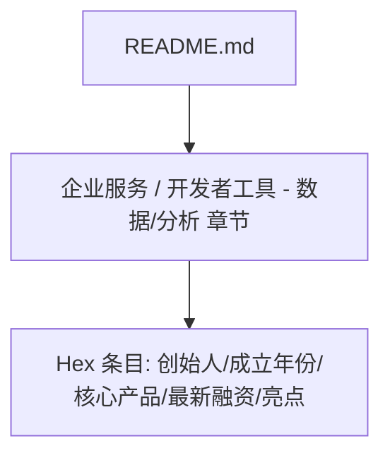
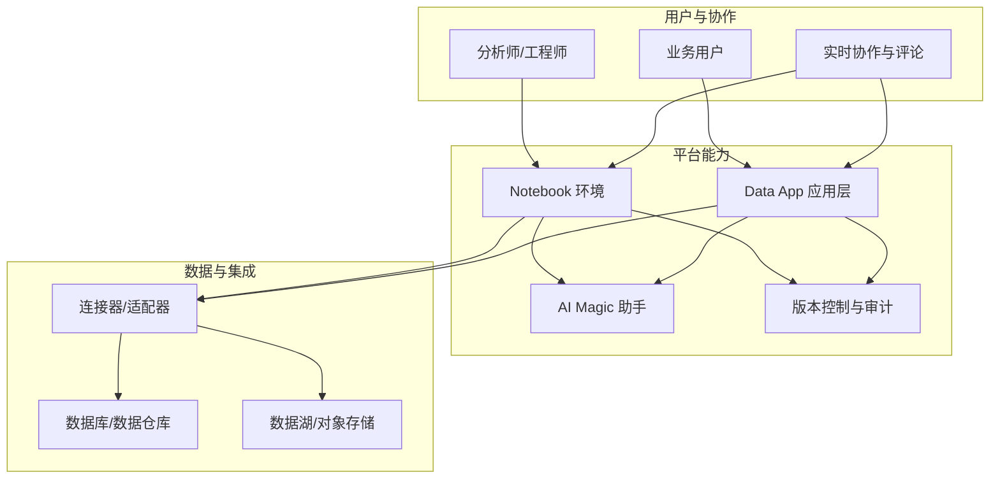
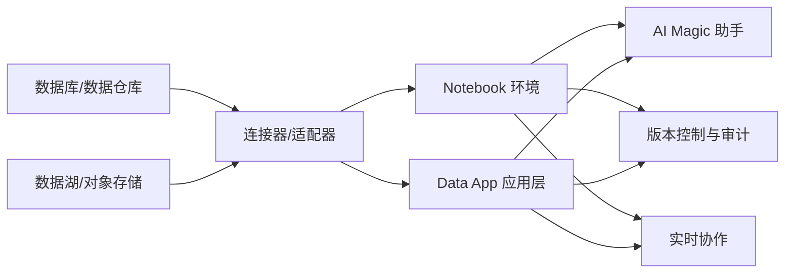

# Hex 数据协作平台

<cite>
**本文引用的文件**
- [README.md](file://README.md)
</cite>

## 目录
1. [简介](#简介)
2. [项目结构](#项目结构)
3. [核心组件](#核心组件)
4. [架构总览](#架构总览)
5. [详细组件分析](#详细组件分析)
6. [依赖关系分析](#依赖关系分析)
7. [性能考量](#性能考量)
8. [故障排查指南](#故障排查指南)
9. [结论](#结论)
10. [附录](#附录)

## 简介
本文件基于仓库内容，系统性梳理并解读 Hex 作为 AI 驱动的数据协作平台在企业数据分析中的定位与价值。重点围绕以下主题展开：
- Notebook + Data app 融合架构：将交互式分析与可复用应用结合，提升从探索到交付的闭环效率。
- AI Magic 助手：以自然语言与智能辅助加速数据清洗、建模、可视化与报告生成。
- 实时协作能力：支持多人协同编辑、评论与版本化，降低沟通成本。
- 云原生与多数据库连接：弹性扩展、统一接入多种数据源，适配企业现有数据生态。
- 版本控制与团队协作：通过变更追踪、分支/合并等机制保障可复现与合规。
- 与传统 BI 的区别与优势：强调“代码+协作+AI”的一体化体验，兼顾灵活性与治理。
- Analytics Engineer 工作流与数据民主化：赋能业务人员自助分析，同时保持工程化质量。

## 项目结构
该仓库为精选初创公司清单，其中包含对 Hex 的条目信息（产品定位、融资与亮点）。本节聚焦仓库中关于 Hex 的信息来源与上下文组织方式，便于后续深入分析时进行溯源。

图表来源
- [README.md:709-716](file://README.md#L709-L716)

章节来源
- [README.md:709-716](file://README.md#L709-L716)

## 核心组件
根据仓库中对 Hex 的描述，其核心组件与能力包括：
- Notebook + Data app 融合：将交互式 Notebook 与可发布的数据应用结合，实现从探索到产品化的无缝衔接。
- AI Magic 助手：提供智能辅助能力，覆盖数据准备、查询优化、可视化建议与报告生成等环节。
- 实时协作：支持多人在线协作、评论与共享，提升团队效率。
- 多数据库连接：对接多种数据源，满足企业异构数据环境需求。
- 版本控制与协作机制：通过版本化管理确保可追溯与可复现。

章节来源
- [README.md:709-716](file://README.md#L709-L716)

## 架构总览
下图展示 Hex 在企业数据分析中的典型架构视图，体现其与数据源、协作与应用的交互关系。该图为概念性示意，用于帮助理解整体流程。

[此图为概念性架构图，不直接映射具体源码文件]

## 详细组件分析

### Notebook + Data app 融合
- 目标：将“探索式分析”与“可复用应用”合二为一，缩短从洞察到决策的路径。
- 关键要点：
  - Notebook 用于数据探索、建模与可视化原型；Data app 用于封装逻辑、参数化与对外发布。
  - 通过统一的运行时与权限模型，保证分析资产的可维护性与可治理。
- 适用场景：
  - 数据探索与假设验证
  - 指标看板与业务报表自动化
  - 面向业务的自助分析门户

[本节为概念性说明，不直接分析具体文件]

### AI Magic 助手
- 目标：以 AI 增强数据工作流，降低门槛、提高效率。
- 关键要点：
  - 自然语言转查询/脚本、自动补全与错误诊断。
  - 可视化建议与模板推荐，加速报告产出。
  - 在 Notebook 与 Data app 中均提供辅助能力，贯穿端到端流程。
- 适用场景：
  - 快速构建 ETL/ELT 流程
  - 自动生成可视化与解释性文案
  - 协助非技术用户完成复杂分析任务

[本节为概念性说明，不直接分析具体文件]

### 实时协作与版本控制
- 目标：提升团队协作效率与资产可追溯性。
- 关键要点：
  - 多人在线编辑、评论与审批流。
  - 版本化记录变更历史，支持回滚与对比。
  - 与 CI/CD 或数据流水线集成，保障质量与合规。
- 适用场景：
  - 跨部门协作的数据项目
  - 需要审计与合规的企业环境
  - 持续交付的分析与报表服务

[本节为概念性说明，不直接分析具体文件]

### 多数据库连接与云原生
- 目标：统一接入企业异构数据源，并提供弹性可扩展的运行环境。
- 关键要点：
  - 支持主流数据库与数据仓库，提供标准化连接器。
  - 云原生部署，按需扩缩容，保障高可用与安全性。
  - 与身份认证、权限管理、网络策略等企业安全体系集成。
- 适用场景：
  - 混合多云/私有云部署
  - 大规模数据访问与并发分析
  - 严格的安全与合规要求

[本节为概念性说明，不直接分析具体文件]

### 与传统 BI 的区别与优势
- 区别：
  - 传统 BI 偏重固定报表与拖拽式可视化；Hex 强调 Notebook + Data app 的代码化与可复用性。
  - Hex 内置 AI 助手与实时协作，提升迭代速度与知识沉淀。
- 优势：
  - 更强的灵活性：支持复杂计算、机器学习与自定义逻辑。
  - 更好的可维护性：版本化、模块化与可测试性。
  - 更高的协作效率：在线协作、评论与共享。

[本节为概念性说明，不直接分析具体文件]

### Analytics Engineer 工作流与数据民主化
- 角色定位：
  - 在数据管道、建模与可视化之间搭建桥梁，推动高质量、可复用的数据产品。
- 工作流：
  - 使用 Notebook 进行数据探索与建模，封装为 Data app 供业务消费。
  - 借助 AI Magic 助手提升效率，利用版本控制保障质量与合规。
- 数据民主化：
  - 让业务人员也能参与分析，同时通过工程化手段确保一致性与可信度。

[本节为概念性说明，不直接分析具体文件]

## 依赖关系分析
下图展示 Hex 与企业数据生态的典型依赖关系，包括数据源、连接器、协作与发布链路。该图为概念性示意，用于理解整体依赖。

[此图为概念性依赖图，不直接映射具体源码文件]

## 性能考量
- 资源隔离与弹性伸缩：按任务粒度分配计算资源，避免相互干扰。
- 缓存与物化：对常用查询结果与中间数据进行缓存，提升响应速度。
- 并行与批处理：合理拆分任务，充分利用集群并行能力。
- 监控与告警：建立性能基线与异常告警，及时定位瓶颈。

[本节为通用性能建议，不直接分析具体文件]

## 故障排查指南
- 常见问题：
  - 连接失败：检查网络策略、凭据与权限配置。
  - 查询超时：优化 SQL/脚本、增加索引或调整资源配额。
  - 协作冲突：合并冲突解决、锁定与分支策略。
  - 权限问题：最小权限原则、细粒度访问控制。
- 排障步骤：
  - 查看日志与审计记录，定位错误源头。
  - 复现实验环境，逐步缩小问题范围。
  - 使用版本回滚与对比，确认变更影响。
  - 与数据源团队协同，排除外部依赖问题。

[本节为通用排障建议，不直接分析具体文件]

## 结论
Hex 通过将 Notebook 与 Data app 融合、引入 AI Magic 助手与实时协作能力，为企业数据分析提供了高效、可复用且可治理的平台。相比传统 BI，Hex 更强调代码化、协作化与智能化，有助于 Analytics Engineer 在工程化与数据民主化之间取得平衡，推动从数据到价值的更快转化。

## 附录
- 参考来源：
  - 仓库中对 Hex 的条目信息（产品定位、融资与亮点）用于支撑本文对 Hex 能力的概述与讨论。

章节来源
- [README.md:709-716](file://README.md#L709-L716)