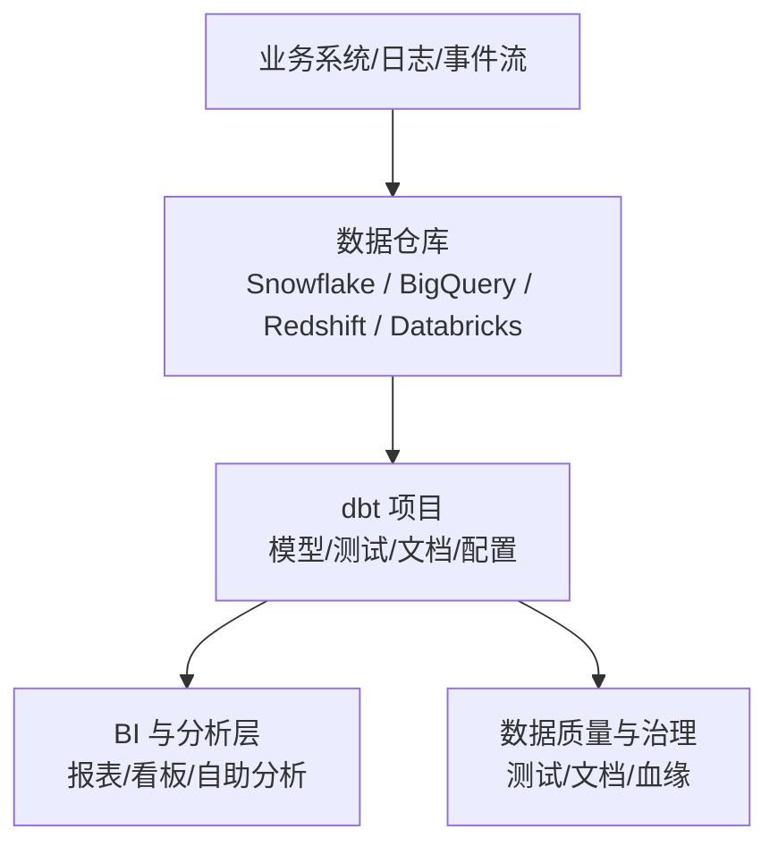
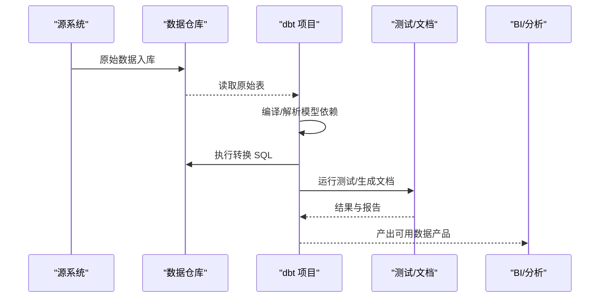
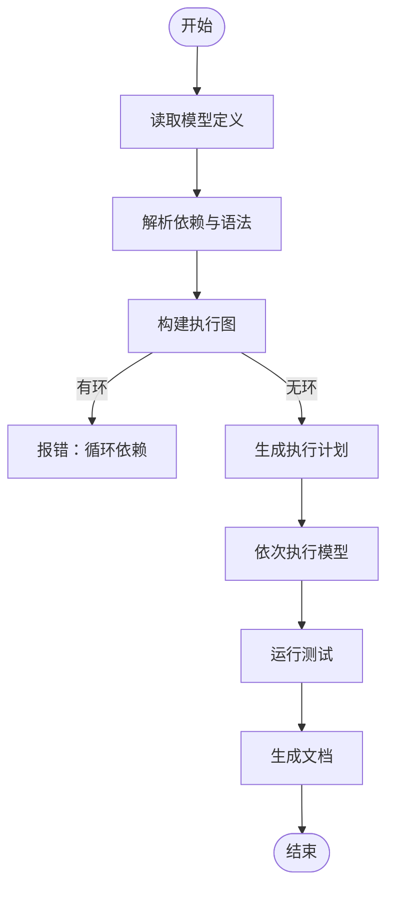
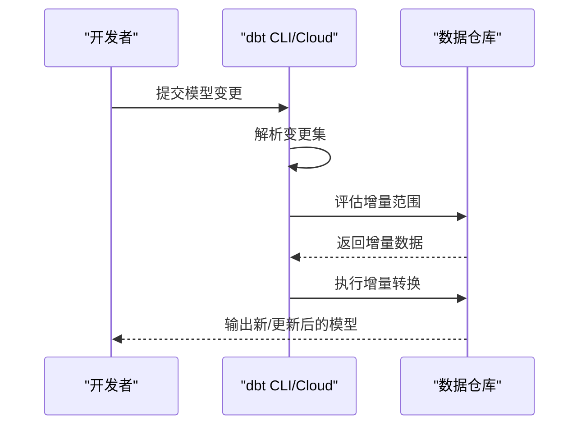
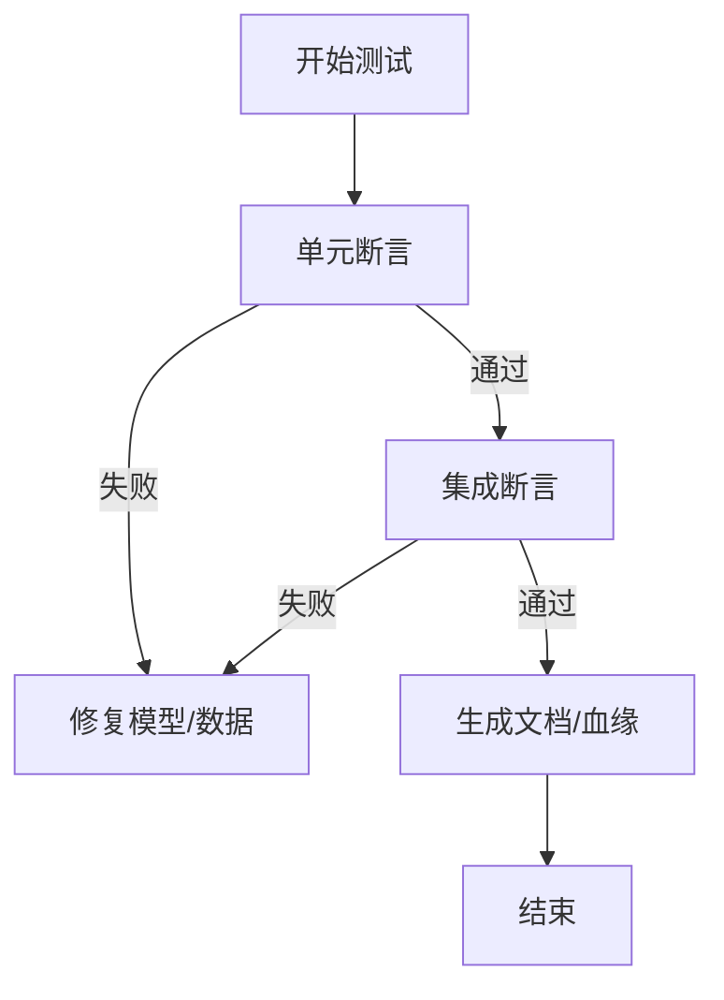
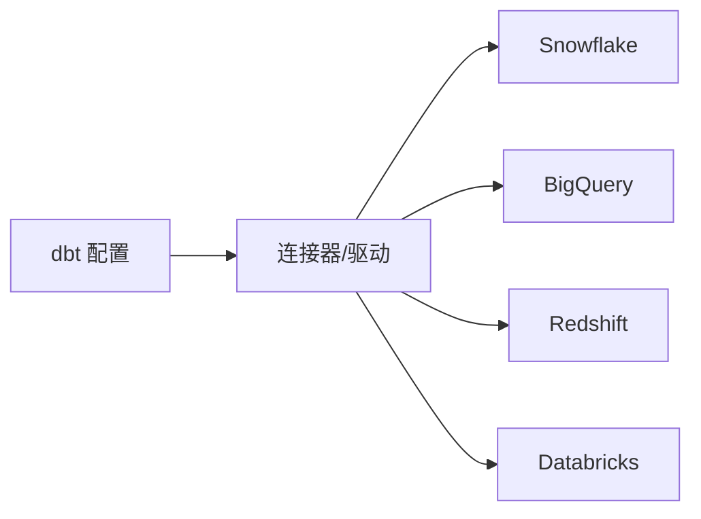
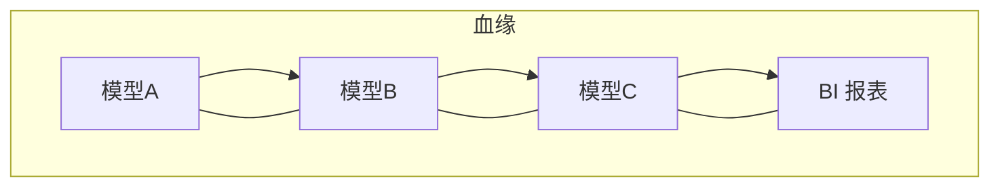
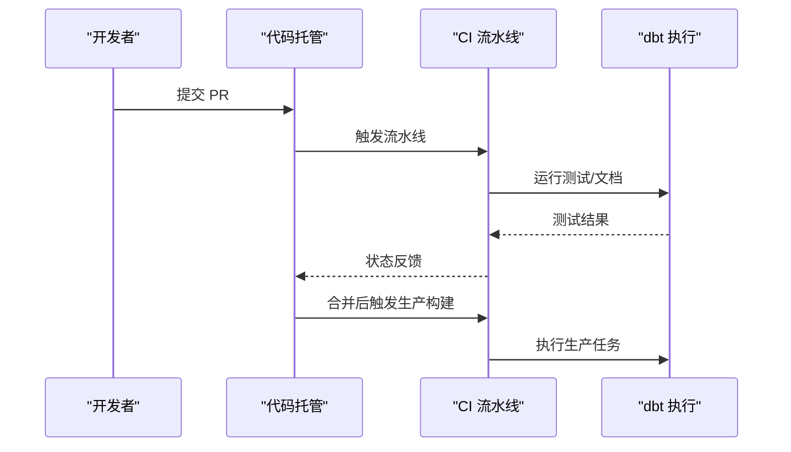
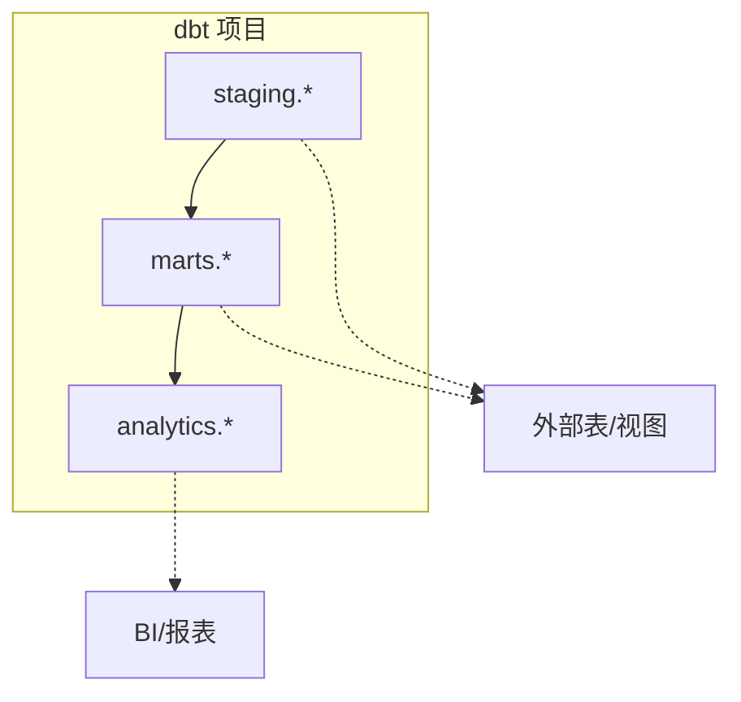

# dbt Labs 数据转换工具

<cite>
**本文引用的文件**
- [README.md](file://README.md)
</cite>

## 目录
1. [简介](#简介)
2. [项目结构](#项目结构)
3. [核心组件](#核心组件)
4. [架构总览](#架构总览)
5. [详细组件分析](#详细组件分析)
6. [依赖关系分析](#依赖关系分析)
7. [性能考量](#性能考量)
8. [故障排查指南](#故障排查指南)
9. [结论](#结论)
10. [附录](#附录)

## 简介
本文件面向希望系统化掌握 dbt（data build tool）的工程师与数据团队，围绕“SQL-first 开发范式、ELT 架构中的定位、模型开发与测试、文档自动生成、数据血缘追踪、CI/CD 集成、企业级部署与性能优化”等主题展开。dbt 将 SQL 作为一等公民，通过可版本化、可测试、可文档化的方式组织数据转换逻辑，使 Analytics Engineer 能够在现代数据栈中高效协作与交付高质量数据产品。

## 项目结构
当前仓库为初创公司清单集合，其中包含对 dbt Labs 的条目性介绍，用于理解其在现代数据栈生态中的位置与价值。基于该信息，本节聚焦 dbt 在企业数据工程中的角色与影响。

[本图为概念性示意，不直接映射具体源码文件]

## 核心组件
- SQL-first 建模：以 SQL 为核心表达数据转换逻辑，配合 Jinja 模板实现参数化与复用。
- 数据管道编排：通过模型间的引用关系自动构建执行图，保证依赖顺序与增量更新。
- 测试与文档：内置断言式测试与文档生成，提升数据可信度与可发现性。
- 数据血缘：自动解析模型依赖，提供端到端血缘可视化。
- 多引擎适配：与主流云数据仓库深度集成，支持跨平台一致的开发体验。
- CI/CD 集成：在持续集成环境中运行测试与文档构建，保障变更质量。

**章节来源**
- [README.md:716-719](file://README.md#L716-L719)

## 架构总览
下图展示 dbt 在现代 ELT 架构中的典型位置：数据先入仓（Extract & Load），再通过 dbt 进行 Transform，最终服务于 BI 与分析。

[本图为概念性流程示意，不直接映射具体源码文件]

## 详细组件分析

### 1) SQL-first 建模与项目结构
- 模型组织：按主题域划分模型目录，使用命名约定表达层次（如 staging、marts）。
- 依赖管理：通过引用其他模型或表定义依赖关系，dbt 自动构建 DAG 并调度执行。
- 参数化与复用：利用变量、宏与片段减少重复代码，提高可维护性。
- 环境隔离：通过配置文件区分 dev/test/prod 环境，确保一致性。

[本图为概念性流程图，不直接映射具体源码文件]

### 2) 数据管道编排与增量处理
- 增量策略：结合时间戳或流水号字段，仅重算受影响部分，降低计算成本。
- 物化策略：根据查询频率与数据规模选择 table/view/incremental/materialized view。
- 任务编排：dbt 内部基于依赖关系自动编排；可与 Airflow/dbt Cloud 等外部编排器协同。

[本图为概念性序列图，不直接映射具体源码文件]

### 3) 测试与数据质量验证
- 单元测试：针对单模型的列存在性、唯一性、非空、取值范围等断言。
- 集成测试：跨模型关联一致性、聚合校验、业务规则断言。
- 文档与血缘：自动生成数据字典与依赖图，便于审计与排障。

[本图为概念性流程图，不直接映射具体源码文件]

### 4) 与数据仓库的集成（Snowflake/BigQuery/Redshift/Databricks）
- 连接与权限：通过连接器配置账户、角色与权限，最小权限原则。
- 引擎特性：充分利用目标仓库的物化视图、分区、索引、并行能力。
- 成本与性能：合理选择物化策略、分区键与并发度，控制计算与存储成本。

[本图为概念性架构图，不直接映射具体源码文件]

### 5) 数据血缘追踪与可观测性
- 自动血缘：从 SQL 引用关系推导上下游依赖，形成完整血缘图。
- 变更影响：在发布前评估变更对下游的影响范围。
- 监控告警：结合仓库元数据与日志，设置关键指标与异常告警。

[本图为概念性血缘示意，不直接映射具体源码文件]

### 6) CI/CD 集成与发布流程
- 预合并检查：在 PR 阶段运行 lint、测试与文档构建。
- 自动化发布：主分支合并后触发生产环境构建与部署。
- 回滚策略：基于版本化模型与快照，快速回滚到稳定版本。

[本图为概念性序列图，不直接映射具体源码文件]

### 7) Analytics Engineer 的角色与工作方式
- 职责边界：专注于数据仓库内的建模、测试、文档与数据产品交付。
- 协作模式：与数据工程师（ETL/管道）、分析师（BI/洞察）紧密协作。
- 标准化实践：统一命名、分层建模、测试覆盖、文档完备，提升团队效率。

[本节为通用方法论说明，不直接分析具体文件]

## 依赖关系分析
- 内聚与耦合：模型间通过显式引用建立依赖，保持高内聚低耦合。
- 外部依赖：连接器、仓库特性、环境变量与密钥管理。
- 风险点：循环依赖、隐式全局变量、未受控的硬编码。

[本图为概念性依赖示意，不直接映射具体源码文件]

## 性能考量
- 物化策略选择：频繁查询且数据量大时采用物化表或物化视图；中间层尽量用视图。
- 增量更新：基于时间窗口或流水号增量计算，避免全量重算。
- 分区与聚类：按业务维度分区，必要时启用聚簇/排序键以提升查询性能。
- 资源与并发：合理设置并发度与资源队列，避免热点竞争。
- 成本治理：监控计算与存储增长，定期清理无用对象与历史数据。

[本节为通用性能建议，不直接分析具体文件]

## 故障排查指南
- 常见错误
  - 循环依赖：检查模型引用是否成环，修正依赖方向。
  - 权限不足：确认连接器角色具备读写目标对象的权限。
  - 数据类型不匹配：统一上游 schema 与类型，或在模型中进行显式转换。
  - 增量失效：核对增量键与过滤条件，确保只重算必要数据。
- 诊断步骤
  - 查看执行日志与仓库查询历史，定位慢查询与失败语句。
  - 使用血缘图回溯问题源头，缩小影响范围。
  - 逐步禁用测试与模型，二分法定位根因。
- 预防措施
  - 强化测试覆盖率与回归用例。
  - 引入代码审查与静态检查。
  - 建立发布前演练与回滚预案。

[本节为通用排障建议，不直接分析具体源码文件]

## 结论
dbt 以 SQL-first 的方式将数据转换过程工程化，结合测试、文档与血缘追踪，显著提升了数据产品的质量与可维护性。在现代 ELT 架构中，dbt 充当“转换层”的核心，与数据仓库及 BI 工具无缝衔接，赋能 Analytics Engineer 在复杂数据环境中高效交付可靠的数据产品。企业可通过合理的物化策略、增量更新、CI/CD 与成本治理，实现规模化与高性能的数据工程体系。

## 附录
- 术语速查
  - ELT：先 Extract 与 Load 到数据仓库，再进行 Transform。
  - 物化：将查询结果持久化为表或视图，加速后续访问。
  - 增量：仅处理新增或变更的数据，降低计算开销。
  - 血缘：描述数据从源到目标的流转路径与依赖关系。
- 参考与实践
  - 分层建模：staging → marts → analytics，清晰职责边界。
  - 测试先行：为关键模型编写断言，纳入 CI 强制门禁。
  - 文档即资产：自动生成数据字典与血缘，支撑审计与协作。

[本节为补充说明，不直接分析具体文件]