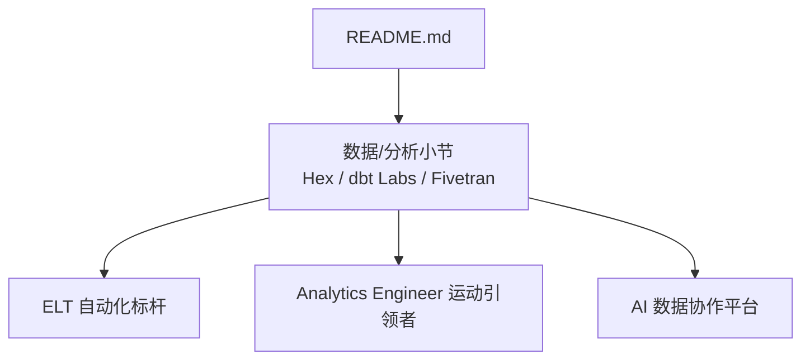
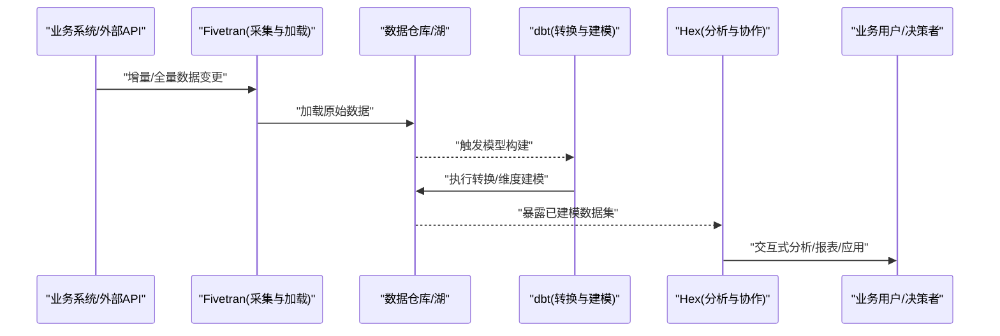
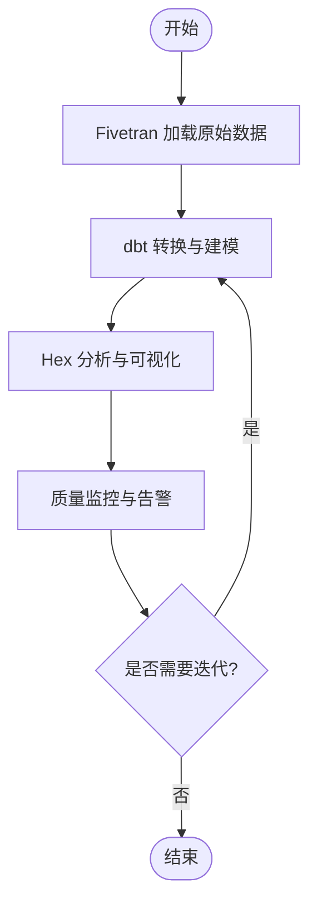
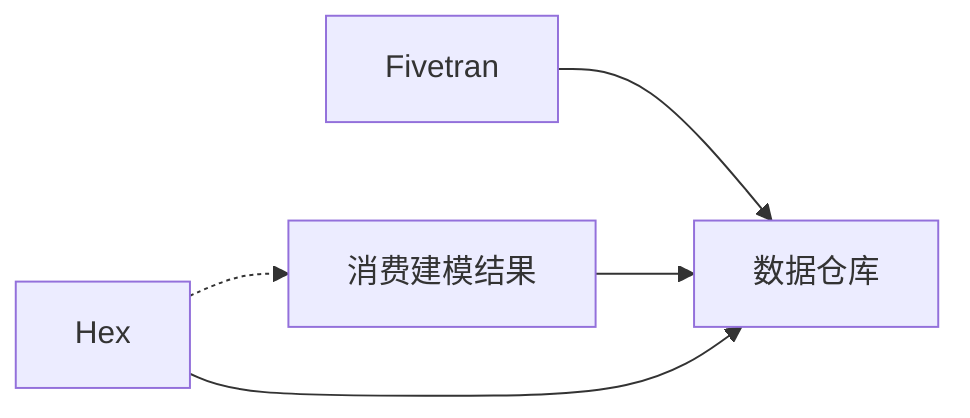

# 数据分析平台

<cite>
**本文引用的文件**
- [README.md](file://README.md)
</cite>

## 目录
1. [引言](#引言)
2. [项目结构](#项目结构)
3. [核心组件](#核心组件)
4. [架构总览](#架构总览)
5. [详细组件分析](#详细组件分析)
6. [依赖关系分析](#依赖关系分析)
7. [性能考量](#性能考量)
8. [故障排查指南](#故障排查指南)
9. [结论](#结论)
10. [附录](#附录)

## 引言
本文件围绕现代数据栈的协作关系展开，聚焦数据采集（Fivetran）、数据转换（dbt）与数据分析（Hex）三者的协同方式，并结合仓库中提供的企业级信息，梳理 ELT vs ETL 的选择、实时数据处理、AI 增强的数据分析能力、数据治理/质量/安全方案，以及 Analytics Engineer 角色崛起和数据民主化趋势。同时给出面向企业的数据平台架构设计与实施要点，帮助读者在真实业务场景中落地。

## 项目结构
该仓库以 Markdown 文档形式组织，核心为一份综合性的初创公司清单，其中“数据/分析”小节明确列出了 Hex、dbt Labs、Fivetran 三家企业在现代数据栈中的定位与价值主张，为本主题提供了权威背景与参考坐标。

图表来源
- [README.md:662-678](file://README.md#L662-L678)

章节来源
- [README.md:662-678](file://README.md#L662-L678)

## 核心组件
- Fivetran：自动化数据集成，强调 ELT 自动化标杆，负责将多源数据高效采集并加载至目标数据仓库/湖。
- dbt Labs：提供数据转换工具链，推动 Analytics Engineer 运动，使数据工程师与分析师能在数据仓库内完成可版本化、可测试、可复用的转换逻辑。
- Hex：AI 数据协作平台，融合 Notebook 与 Data App，内置 AI Magic 助手，提升分析与协作效率，支持从探索到产品化的端到端体验。

章节来源
- [README.md:662-678](file://README.md#L662-L678)

## 架构总览
现代数据栈通常采用 ELT 模式：先 Load 原始数据到云数仓，再 Transform 建模，最后通过 BI/分析工具消费。Fivetran 承担“自动采集+加载”，dbt 负责“转换建模”，Hex 作为“分析协作与应用发布”的前端层。

图表来源
- [README.md:662-678](file://README.md#L662-L678)

## 详细组件分析

### Fivetran：自动化数据集成（ELT 的“Load”）
- 职责边界
  - 对接多种 SaaS/数据库/消息队列等数据源，实现高可用、可扩展的数据采集。
  - 将原始数据按 schema 映射加载到目标存储，便于后续转换。
- 设计要点
  - 增量同步与断点续传，降低对源系统的压力。
  - 元数据驱动的配置管理，减少手工维护成本。
  - 与云数仓深度集成，利用其弹性计算与存储能力。
- 适用场景
  - 多源异构数据的统一入仓；合规审计要求下的可追溯加载。
- 风险与对策
  - 源系统变更导致映射失效：需建立监控告警与回归测试。
  - 数据量激增：结合分区/分桶策略与资源配额管理。

章节来源
- [README.md:675-678](file://README.md#L675-L678)

### dbt Labs：数据转换与建模（ELT 的“Transform”）
- 职责边界
  - 在数据仓库内定义可版本化、可测试、可文档化的转换逻辑。
  - 通过 DAG 管理依赖，保证数据管道的一致性与可观测性。
- 设计要点
  - 分层建模（ODS/DWD/DWS/ADS），支撑指标口径一致。
  - 单元测试与契约测试，保障数据质量。
  - 与 CI/CD 集成，实现自动化发布与回滚。
- 适用场景
  - 复杂指标体系、跨部门共享数据资产、强治理要求的团队。
- 风险与对策
  - 模型膨胀与维护成本高：强化模块化与复用。
  - 运行失败影响下游：完善重试、补偿与通知机制。

章节来源
- [README.md:670-674](file://README.md#L670-L674)

### Hex：AI 增强的数据分析与协作（消费与交付）
- 职责边界
  - 提供 Notebook + Data App 的一体化环境，支持从探索到产品化的全流程。
  - 内置 AI Magic 助手，辅助生成查询、解释结果、编写可视化与代码。
- 设计要点
  - 与数据仓库直连，直接消费 dbt 产出的建模结果。
  - 权限与访问控制，确保数据安全与合规。
  - 协作与分享机制，促进数据民主化。
- 适用场景
  - 自助式分析、指标看板、数据产品化、跨团队协作。
- 风险与对策
  - 过度依赖 AI 生成内容：需人工复核与规范约束。
  - 性能瓶颈：优化查询与缓存策略，合理划分计算资源。

章节来源
- [README.md:664-669](file://README.md#L664-L669)

### 三者协作关系与数据流
- 数据流向
  - Fivetran 将源系统数据加载到数仓；dbt 基于原始数据构建中间层与指标层；Hex 消费建模后的数据进行分析与展示。
- 关键接口
  - Fivetran → 数仓：表/视图结构与增量标记。
  - dbt → 数仓：物化视图/表与索引策略。
  - Hex → 数仓：只读连接与查询优化。
- 治理与质量
  - 在 dbt 层定义数据质量规则；在 Hex 层进行可视化校验与异常预警。

图表来源
- [README.md:662-678](file://README.md#L662-L678)

## 依赖关系分析
- 组件耦合
  - Fivetran 与数仓：强依赖目标存储的写入能力与权限。
  - dbt 与数仓：强依赖 SQL 方言、物化能力与资源配额。
  - Hex 与数仓：只读依赖，关注查询性能与并发。
- 间接依赖
  - 身份认证与密钥管理（云厂商 IAM、KMS）。
  - 监控与日志（数仓审计日志、dbt 运行日志、Hex 访问日志）。
- 潜在循环
  - 应避免在 Hex 中反向写回数仓造成循环依赖；如需回写，应通过专用通道或任务编排。

图表来源
- [README.md:662-678](file://README.md#L662-L678)

章节来源
- [README.md:662-678](file://README.md#L662-L678)

## 性能考量
- 采集阶段（Fivetran）
  - 使用增量同步与批大小调优，避免源系统抖动。
  - 针对热点表设置合适的刷新频率与并行度。
- 转换阶段（dbt）
  - 分层建模减少重复计算；合理使用物化策略（临时表/视图/表）。
  - 利用分区、聚簇与索引提升查询性能。
- 分析阶段（Hex）
  - 预聚合与缓存；限制大查询范围；使用只读副本降低主库压力。
  - 对高频报表启用定时刷新与结果缓存。

[本节为通用指导，不直接分析具体文件]

## 故障排查指南
- 常见问题定位
  - 采集失败：检查源系统连通性、权限与限流；查看 Fivetran 任务日志。
  - 转换失败：核对 dbt 模型语法、依赖与数据质量规则；查看运行日志与失败行。
  - 分析异常：确认 Hex 连接配置、权限与查询计划；必要时下钻到数仓执行计划。
- 建议措施
  - 建立端到端监控：采集延迟、转换成功率、查询耗时与错误率。
  - 制定回滚与补偿流程：保留历史版本，支持快速恢复。
  - 加强数据质量门禁：在 dbt 层加入断言与阈值告警。

[本节为通用指导，不直接分析具体文件]

## 结论
现代数据栈以 ELT 为核心范式，Fivetran 负责自动化采集与加载，dbt 负责可维护的转换与建模，Hex 提供 AI 增强的分析与协作能力。三者协同形成从数据入仓到洞察交付的闭环。在企业实践中，应重视数据治理、质量与安全，借助 Analytics Engineer 的角色推动数据民主化，并通过合理的架构与工程实践保障平台的稳定性与可扩展性。

[本节为总结性内容，不直接分析具体文件]

## 附录
- 术语速查
  - ELT：先加载后转换，充分利用云数仓的计算与存储弹性。
  - ETL：传统先转换后加载，适用于强约束或边缘场景。
  - 数据民主化：让非技术用户也能便捷获取与分析数据。
  - Analytics Engineer：桥接数据工程与数据分析，专注于数据仓库内的建模与指标体系。
- 扩展阅读方向
  - 实时数据处理：流式采集与近实时分析的结合。
  - 数据治理框架：主数据、元数据、血缘与权限管控。
  - 企业级平台：多云/混合部署、成本优化与容量规划。

[本节为概念性补充，不直接分析具体文件]