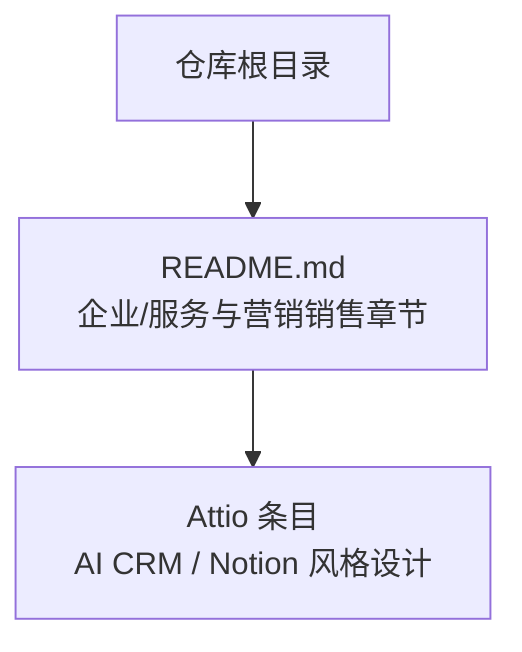
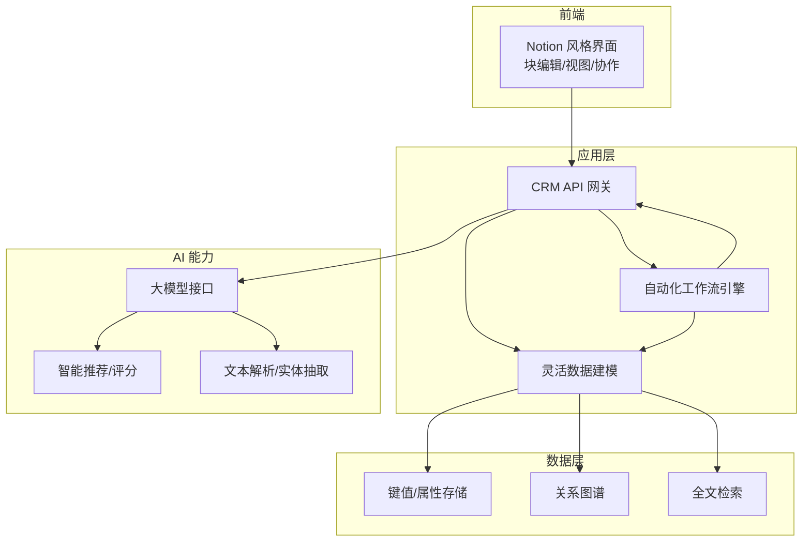
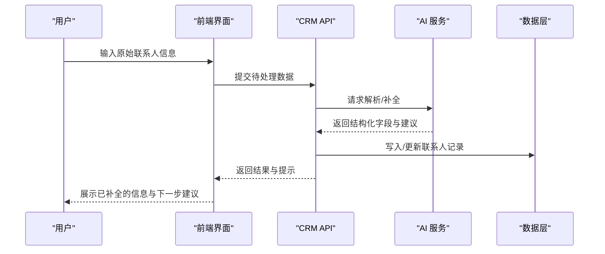

# Attio - AI CRM 平台

<cite>
**本文引用的文件**
- [README.md](file://README.md)
</cite>

## 目录
1. [简介](#简介)
2. [项目结构](#项目结构)
3. [核心组件](#核心组件)
4. [架构总览](#架构总览)
5. [详细组件分析](#详细组件分析)
6. [依赖关系分析](#依赖关系分析)
7. [性能考量](#性能考量)
8. [故障排查指南](#故障排查指南)
9. [结论](#结论)
10. [附录](#附录)

## 简介
本文件基于仓库中的公开信息，围绕 Attio 作为“AI CRM”的定位与“欧洲 CRM 新锐”的背景进行系统性梳理。根据仓库内容，Attio 的核心亮点包括：AI 驱动的 CRM、Notion 风格的用户界面设计。文档在此基础上，结合现代 CRM 的通用实践，给出架构思路、数据建模、协作与智能推荐等维度的说明，并提供迁移指南、最佳实践与集成方案，帮助读者理解如何在现代销售流程中高效使用 Attio。

## 项目结构
当前仓库为初创公司清单型文档仓库，包含一份主 README，其中在“营销/销售”分类下收录了 Attio 条目，标注其为核心产品“AI CRM”，并强调“欧洲 CRM 新锐；Notion 风格设计”。因此，本文档以该条目为依据展开，不引入仓库之外的具体实现细节。

图表来源
- [README.md:932-948](file://README.md#L932-L948)

章节来源
- [README.md:932-948](file://README.md#L932-L948)

## 核心组件
基于仓库中对 Attio 的描述，可归纳出以下关键能力方向（概念性说明，非代码级实现）：
- AI 驱动的联系人管理：通过 AI 辅助完成联系人信息的补全、画像构建、线索评分与智能推荐。
- Notion 风格的用户界面：以块状编辑、灵活视图与低门槛配置提升易用性与灵活性。
- 现代化 CRM 架构：面向灵活的数据建模、实时协作与可扩展的自动化工作流。

章节来源
- [README.md:932-948](file://README.md#L932-L948)

## 架构总览
下图展示了一个符合仓库描述的“AI CRM”概念架构，涵盖前端交互、数据层、AI 能力与自动化编排等模块。该图为概念图，用于帮助理解整体思路，并非对应仓库中的具体代码文件。

[此图为概念性架构图，未直接映射到仓库中的具体文件，故不提供图表来源]

## 详细组件分析
### 用户界面与交互（Notion 风格）
- 设计理念：以“块”为单位组织内容，支持富文本、表格、看板、时间线等多视图切换，降低学习成本，提升信息组织效率。
- 协作体验：支持多人实时编辑与评论，便于销售团队协同维护客户信息。
- 可视化：通过灵活的视图与过滤条件，快速定位目标客群与跟进状态。

[本节为概念性说明，不涉及具体代码文件]

### 数据建模与关系
- 灵活数据建模：允许自定义实体（如公司、联系人、交易）、字段类型与关联关系，适配不同业务场景。
- 关系图谱：将实体间的关系显式化，支撑更精准的洞察与推荐。
- 索引与检索：对关键字段建立索引，提供高效的查询与搜索能力。

[本节为概念性说明，不涉及具体代码文件]

### AI 驱动的能力
- 联系人画像与补全：利用自然语言处理与大模型能力，从邮件、备注、通话记录等来源提取结构化信息，自动补全缺失字段。
- 智能推荐与线索评分：基于历史转化数据与行为特征，生成优先级排序与下一步行动建议。
- 自动化工作流：将重复性任务（如录入、提醒、分派）自动化，减少人工操作，提高一致性。

[本节为概念性说明，不涉及具体代码文件]

### 自动化工作流
- 触发器：事件驱动（新联系人创建、状态变更、外部系统回调）。
- 动作：更新字段、发送通知、创建任务、调用外部 API。
- 编排：可视化编排与版本控制，便于团队协作与回滚。

[本节为概念性说明，不涉及具体代码文件]

#### 序列图：典型“AI 联系人补全”流程（概念）

[此图为概念流程图，未直接映射到仓库中的具体文件，故不提供图表来源]

章节来源
- [README.md:932-948](file://README.md#L932-L948)

## 依赖关系分析
- 对外部系统的依赖：邮件、日历、会议、电话、营销工具、ERP/财务系统等，通常通过 API 或 Webhook 集成。
- 内部依赖：前端与后端 API 解耦；AI 服务与数据层通过标准化接口交互；工作流引擎与数据模型紧密耦合。
- 风险点：第三方 API 稳定性、数据隐私合规、模型幻觉与偏差控制。

[本节为通用架构讨论，不涉及具体代码文件]

## 性能考量
- 响应时延：AI 推理与批量数据处理需考虑缓存与异步化，避免阻塞主流程。
- 扩展性：读写分离、分库分表、消息队列削峰填谷。
- 可用性：多可用区部署、灰度发布与回滚机制。
- 成本优化：模型选择与量化、冷热数据分层存储、按需扩缩容。

[本节为通用性能建议，不涉及具体代码文件]

## 故障排查指南
- 常见问题定位：
  - 数据同步失败：检查外部系统 API 限流、鉴权与网络连通性。
  - AI 输出异常：核对输入质量、Prompt 设计与模型版本；增加校验与兜底逻辑。
  - 工作流执行错误：查看触发条件、权限与依赖资源是否就绪。
- 监控与告警：
  - 关键指标：请求量、错误率、延迟、AI 置信度分布、数据一致性。
  - 日志与追踪：端到端 TraceID，便于跨服务定位问题。
- 恢复策略：
  - 降级与熔断：在外部依赖不可用时启用本地缓存或只读模式。
  - 回滚与补偿：工作流幂等设计，支持重试与补偿事务。

[本节为通用运维建议，不涉及具体代码文件]

## 结论
根据仓库中的公开信息，Attio 定位为“AI CRM”，并以 Notion 风格设计作为差异化特色。结合现代 CRM 的通用实践，可在灵活数据建模、实时协作与智能推荐等方面形成完整解决方案。对于希望从传统 CRM 迁移的团队，建议优先评估数据模型映射、自动化工作流重构与 AI 能力接入路径，逐步实现平滑过渡与价值释放。

[本节为总结性内容，不涉及具体代码文件]

## 附录
### 与传统 CRM 的区别（概念性对比）
- 数据建模：传统 CRM 多为固定表单与强约束；Attio 强调灵活建模与低门槛配置。
- 协作方式：传统 CRM 偏重记录与审批；Attio 强调实时协作与可视化视图。
- 智能化程度：传统 CRM 侧重流程固化；Attio 借助 AI 实现智能补全、推荐与自动化。

[本节为概念性说明，不涉及具体代码文件]

### 迁移指南（从传统 CRM 到 Attio）
- 评估阶段：盘点现有数据模型、字段与关系；识别需要保留的业务规则与自动化。
- 设计阶段：定义新的实体与字段映射；规划视图与工作流。
- 实施阶段：分批导入数据；搭建自动化工作流；对接必要的外部系统。
- 验证与上线：进行数据一致性校验；灰度发布与回滚演练；培训与推广。
- 持续优化：收集使用反馈，迭代模型与流程；引入更多 AI 能力。

[本节为通用迁移方法论，不涉及具体代码文件]

### 最佳实践
- 数据治理：统一命名规范、必填字段与校验规则；定期清洗与去重。
- 权限与安全：最小权限原则；敏感数据加密与访问审计。
- 自动化优先：将重复性工作自动化，减少人为错误。
- 度量与复盘：设定关键指标（转化率、跟进时效、线索质量），持续优化。

[本节为通用最佳实践，不涉及具体代码文件]

### 集成方案（示例）
- 邮件与日历：自动抓取往来邮件与日程，更新联系人活动轨迹。
- 会议与通话：录音转写与摘要，自动回填至 CRM。
- 营销工具：线索从广告/落地页流入 CRM，自动打分与分配。
- ERP/财务：订单与回款状态同步，闭环销售到交付。

[本节为通用集成思路，不涉及具体代码文件]