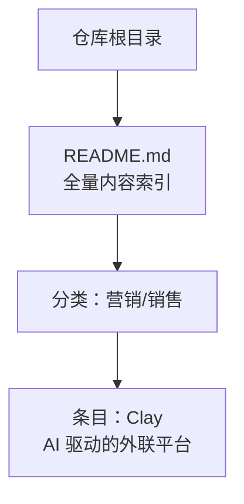
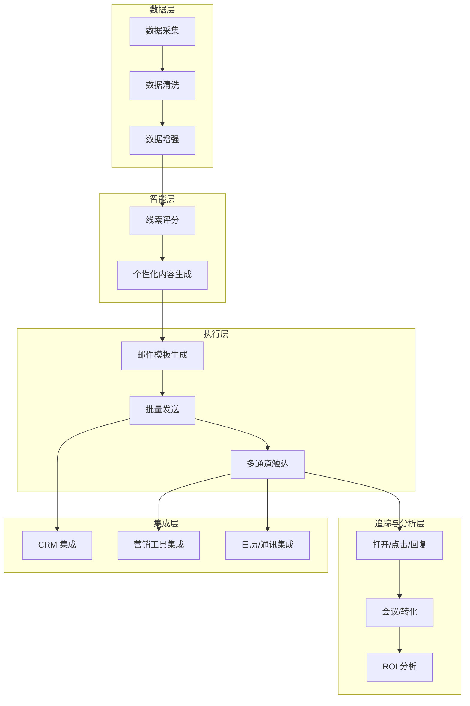
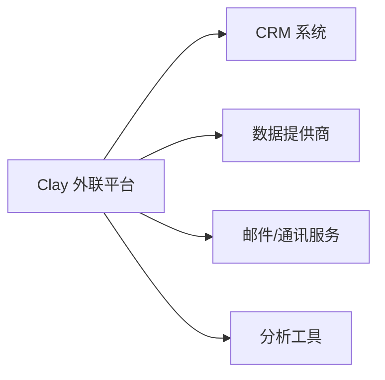

# Clay - AI外联平台

<cite>
**本文引用的文件**
- [README.md](file://README.md)
</cite>

## 目录
1. [简介](#简介)
2. [项目结构](#项目结构)
3. [核心组件](#核心组件)
4. [架构总览](#架构总览)
5. [详细组件分析](#详细组件分析)
6. [依赖关系分析](#依赖关系分析)
7. [性能考量](#性能考量)
8. [故障排查指南](#故障排查指南)
9. [结论](#结论)
10. [附录](#附录)

## 简介
本文件基于仓库中的公开信息，系统化梳理 Clay 作为“AI 驱动的外联平台”的定位与价值：它被归类为营销/销售领域的企业级工具，强调以产品驱动增长（PLG）的方式提升销售团队的生产力与转化率。根据仓库记录，Clay 的核心产品为“AI 驱动的外联平台”，并在 2025 年完成 Series C 融资，估值达到 $3B，同时具备 ARR 四倍增长的亮点表现。本节旨在帮助读者快速理解 Clay 在现代销售漏斗中的作用、技术能力边界以及与 CRM/销售工具的集成方式。

## 项目结构
该仓库是一份持续更新的精选初创公司清单，按赛道组织并包含关键指标、融资信息与亮点说明。Clay 出现在“营销/销售”子类目中，条目提供了公司背景、产品定位与最新融资情况，便于横向对比与生态定位。

图表来源
- [README.md:745-752](file://README.md#L745-L752)

章节来源
- [README.md:745-752](file://README.md#L745-L752)

## 核心组件
基于仓库中对 Clay 的条目信息，可归纳其核心价值点如下：
- 产品定位：AI 驱动的外联平台，聚焦于通过自动化与智能化手段提升外联效率与质量。
- 增长模式：PLG（产品驱动增长），强调以产品体验驱动用户自增长与规模化转化。
- 业务成果：ARR 四倍增长，体现产品在商业化与规模化方面的强劲势头。
- 市场地位：在营销/销售领域与企业级 SaaS 生态中占据重要位置，适合与销售流程、CRM 系统深度集成。

章节来源
- [README.md:745-752](file://README.md#L745-L752)

## 架构总览
从仓库信息出发，可将 Clay 的技术架构抽象为以下层次（概念性示意）：
- 数据层：线索与联系人数据的采集、清洗与增强（如公司信息、联系方式、社交资料等）。
- 智能层：AI 驱动的个性化内容生成、线索评分与优先级排序。
- 执行层：邮件模板生成、批量发送、A/B 测试与多通道触达（邮件、社媒等）。
- 追踪与分析层：打开率、点击率、回复率、会议预约、成交转化等指标的采集与分析。
- 集成层：与 CRM（如 Salesforce、HubSpot）、营销自动化工具、日历与通讯工具的 API 集成。

[此图为概念性架构图，不直接映射具体源码文件]

## 详细组件分析
### 数据收集与增强
- 目标：构建高质量、可操作的线索数据库，覆盖基础信息、职业轨迹、社交信号与技术栈等维度。
- 方法：结合公开数据源、API 接入与第三方数据提供商；进行去重、补全与标准化。
- 输出：结构化线索档案，支持后续评分与个性化外联。

章节来源
- [README.md:745-752](file://README.md#L745-L752)

### 线索评分与优先级
- 目标：识别高意向线索，优化外联资源分配。
- 方法：基于行为信号、公司画像、历史转化数据与模型预测进行打分与分层。
- 输出：线索优先级队列，指导外联节奏与策略。

章节来源
- [README.md:745-752](file://README.md#L745-L752)

### 邮件模板生成与个性化
- 目标：提升打开率与回复率，实现“千人千面”的外联内容。
- 方法：利用 AI 生成个性化文案，结合变量替换与上下文感知；支持 A/B 测试与迭代优化。
- 输出：可配置的邮件模板库与动态内容引擎。

章节来源
- [README.md:745-752](file://README.md#L745-L752)

### 响应跟踪与归因
- 目标：闭环衡量外联效果，支撑 ROI 分析与策略调优。
- 方法：埋点与事件上报，统计打开、点击、回复、会议、转化等指标；建立归因模型。
- 输出：可视化报表与洞察报告，指导投放与话术优化。

章节来源
- [README.md:745-752](file://README.md#L745-L752)

### 与 CRM 及销售工具的集成
- 目标：打通销售工作流，避免数据孤岛。
- 方法：通过 API 与 Webhook 对接主流 CRM（Salesforce、HubSpot 等）、营销自动化平台与日历工具；同步线索、活动与转化数据。
- 输出：统一的数据视图与自动化流转。

章节来源
- [README.md:745-752](file://README.md#L745-L752)

### 使用案例（示例场景）
- 案例一：SaaS 企业通过 Clay 自动化外联，将线索评分与个性化邮件结合，显著提升回复率与会议预约数。
- 案例二：B2B 服务商利用数据增强与多通道触达，缩短销售周期并提高转化率。
- 案例三：成长型团队借助 PLG 模式，以内生增长驱动获客，降低对传统冷启动的依赖。

[以上案例为概念性说明，用于展示典型用法与价值]

## 依赖关系分析
从仓库条目可知，Clay 属于营销/销售类企业工具，通常依赖以下外部系统与数据源：
- CRM 系统：用于线索管理、客户生命周期与转化归因。
- 数据提供商：用于企业信息、联系人数据与社交信号的获取与更新。
- 邮件与通讯服务：用于外联触达与消息投递。
- 分析工具：用于指标采集、报表生成与 ROI 评估。

[此图为概念性依赖图，不直接映射具体源码文件]

## 性能考量
- 可扩展性：外联流程需支持大规模并发与异步处理，确保在高吞吐下稳定运行。
- 数据质量：数据清洗与增强的准确性直接影响外联效果，需建立数据校验与回滚机制。
- 模型性能：AI 生成的内容与评分模型需在延迟与准确率之间取得平衡，必要时引入缓存与批处理。
- 监控告警：对关键指标（发送成功率、打开率、回复率、错误率）进行实时监控与告警。

[本节提供通用性能建议，不直接引用具体代码]

## 故障排查指南
- 数据异常：检查数据源接口可用性、字段映射与去重逻辑；核对清洗规则与补全策略。
- 发送失败：验证邮件服务配置、域名信誉与反垃圾策略；查看重试与退避机制。
- 指标偏差：确认埋点是否正确上报、事件定义是否一致；核查归因模型与窗口设置。
- 集成问题：核对 API 密钥、权限范围与回调地址；检查数据同步频率与冲突处理。

[本节提供通用排障思路，不直接引用具体代码]

## 结论
Clay 作为 AI 驱动的外联平台，在营销/销售领域中以 PLG 模式推动规模化增长。其核心价值在于通过数据增强、智能评分、个性化内容生成与闭环追踪，提升外联效率与转化率。结合与 CRM 及销售工具的深度集成，Clay 能够在现代销售漏斗中发挥关键作用，助力企业实现更高生产力与更优 ROI。

## 附录
- 关键信息来源：仓库 README 中关于 Clay 的条目，包括产品定位、融资与增长亮点。
- 参考方向：在实际落地时，建议结合企业现有 CRM 与工作流，制定数据治理、模型训练与指标体系，确保外联流程的可控性与可度量性。

章节来源
- [README.md:745-752](file://README.md#L745-L752)