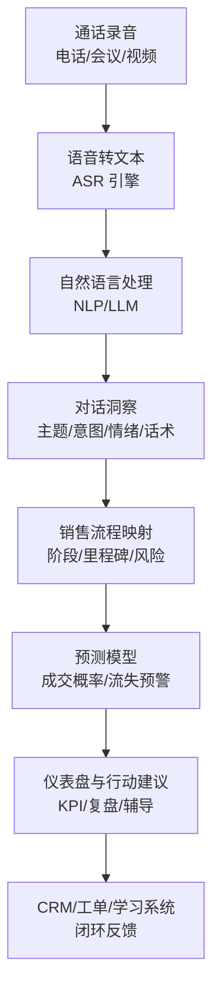
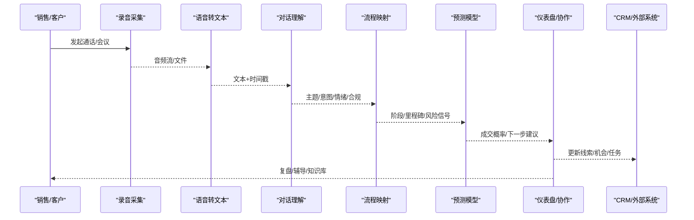
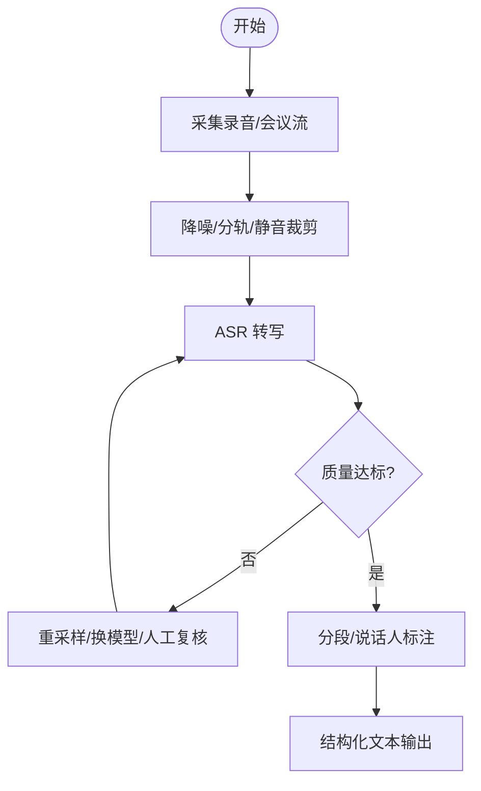
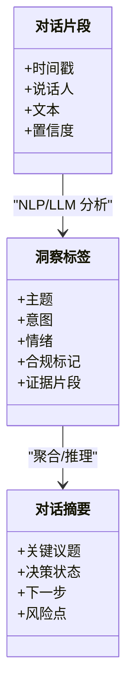
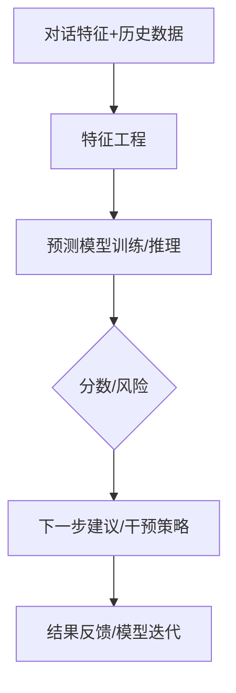
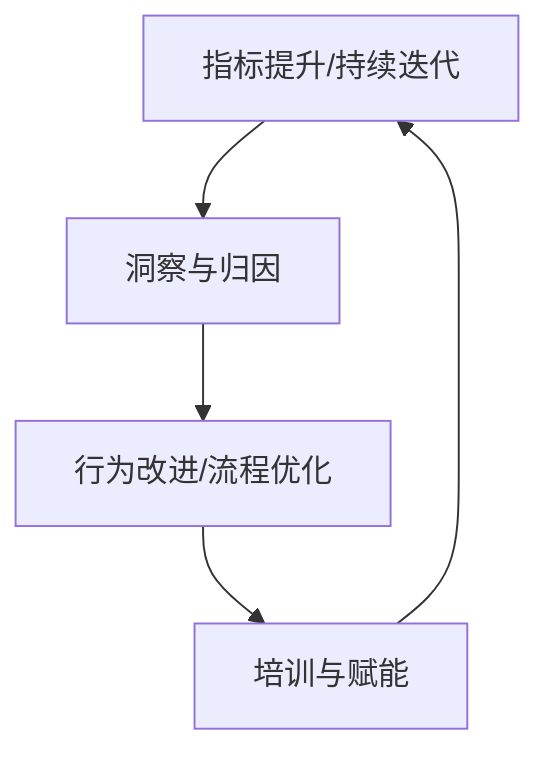

# Gong - 对话智能分析

<cite>
**本文引用的文件**
- [README.md](file://README.md)
</cite>

## 目录
1. [简介](#简介)
2. [项目结构](#项目结构)
3. [核心组件](#核心组件)
4. [架构总览](#架构总览)
5. [详细组件分析](#详细组件分析)
6. [依赖分析](#依赖分析)
7. [性能考量](#性能考量)
8. [故障排查指南](#故障排查指南)
9. [结论](#结论)
10. [附录](#附录)

## 简介
本文件围绕“Revenue Intelligence（收入智能）”概念，系统化阐述 Gong 对话智能分析平台在通话录音分析、销售对话洞察与预测性分析方面的实现思路与方法论。内容涵盖：AI 如何识别销售模式、客户情绪分析与成交概率预测；销售漏斗优化方法论（关键指标监控、销售行为分析、团队协作改进）；企业落地应用场景与实施指南；以及效果评估方法。文档旨在帮助非技术读者理解 Gong 的价值主张与落地路径，同时为技术与产品团队提供可操作的参考框架。

## 项目结构
当前仓库为精选初创公司清单，其中包含对 Gong 的条目式介绍，定位其为“对话智能/销售分析”领域的 Revenue Intelligence 品类创造者。基于该信息，本文将构建一个面向 Revenue Intelligence 的概念化系统视图，用于说明 Gong 的典型能力边界与数据流，便于后续在企业中规划与评估。

[本图为概念性架构图，不直接对应具体代码文件]

## 核心组件
- 通话录音采集与接入：支持多通道录音接入（电话、视频会议、在线会议等），统一入库并建立会话元数据索引。
- 语音转文本（ASR）：将音频转为结构化文本，支持多语种、多方言与行业术语适配。
- 对话理解与分析（NLP/LLM）：提取主题、意图、关键议题、情绪信号、合规要点与竞品提及等。
- 销售流程映射：将对话片段映射到销售阶段与关键里程碑（需求确认、方案演示、报价谈判、签约等）。
- 预测与预警：基于历史成交数据与对话特征，输出成交概率、赢单风险、下一步最佳行动建议。
- 可视化与协同：生成可操作的分析报告、复盘模板、教练提示与团队共享洞察。
- 系统集成：与 CRM、工单、学习平台对接，形成“洞察—行动—反馈”的闭环。

**章节来源**
- [README.md:752-754](file://README.md#L752-L754)

## 架构总览
下图展示 Revenue Intelligence 的核心数据流与控制流，体现从原始录音到可执行洞察的端到端过程。

[本图为概念性流程图，不直接对应具体代码文件]

## 详细组件分析

### 通话录音分析（ASR + 质量控制）
- 目标：将多源录音转化为高质量文本，确保时间对齐、说话人分离、噪声抑制与术语识别。
- 关键点：
  - 多通道接入与格式兼容
  - 说话人分离与角色标注（销售/客户/旁听）
  - 领域词典与术语增强（行业词汇、产品名、竞品名）
  - 质量门控（置信度阈值、转写回退策略）
- 产出：带时间戳的结构化文本，供下游 NLP 使用。

[本图为概念性流程图，不直接对应具体代码文件]

### 销售对话洞察（NLP/LLM）
- 目标：从对话中提取业务语义，包括主题、意图、关键问题、异议、承诺与下一步。
- 关键点：
  - 主题聚类与关键词抽取
  - 意图识别（需求探询、价值呈现、竞争对比、价格谈判、决策推进）
  - 情绪分析（积极/消极/中立强度）
  - 合规与风险提示（承诺过度、敏感词、隐私信息）
- 产出：对话级与会话级的标签、摘要与证据片段。

[本图为概念性类图，不直接对应具体代码文件]

### 预测性分析（成交概率与流失预警）
- 目标：结合历史成交数据与对话特征，预测赢单概率、识别流失风险、推荐最佳下一步。
- 关键点：
  - 特征工程：对话长度、提问比例、竞品提及、情绪波动、承诺兑现率、阶段停留时长等
  - 模型选择：分类/回归模型或时序模型，结合业务规则进行校准
  - 可解释性：提供影响因子与证据片段，辅助销售与管理者决策
- 产出：机会级预测分数、风险等级与行动建议。

[本图为概念性流程图，不直接对应具体代码文件]

### 销售漏斗优化方法论
- 关键指标监控：
  - 转化率：各阶段转化、平均周期、赢单率
  - 对话质量：有效提问占比、价值陈述清晰度、异议处理效率
  - 情绪趋势：客户情绪变化与阶段推进的相关性
  - 合规与风险：承诺偏差、敏感话题暴露
- 销售行为分析：
  - 优秀实践萃取：高赢单对话的模式与话术
  - 短板诊断：低效环节与常见误区
  - 个性化辅导：针对个人/团队的改进建议
- 团队协作改进：
  - 知识沉淀：标准话术库、FAQ、案例库
  - 协同机制：跨部门复盘、售前/售后联动
  - 培训体系：基于真实对话的实战演练

[本图为概念性流程图，不直接对应具体代码文件]

### 实际应用场景
- 场景一：新销售快速上手
  - 通过优秀对话范本与实时提示，缩短学习曲线，提高首单成功率。
- 场景二：复杂交易推进
  - 利用情绪与意图分析，识别关键决策人与阻力点，制定针对性策略。
- 场景三：团队复盘与教练
  - 基于对话证据进行一对一辅导，聚焦改进点与最佳实践复制。
- 场景四：市场与产品反馈
  - 从竞品提及与痛点中提炼产品改进方向，反哺产品路线图。

[本节为概念性内容，不直接分析具体文件]

### 实施指南
- 数据接入：
  - 明确录音来源与权限，完成系统对接与数据治理
  - 建立元数据标准（客户、机会、阶段、负责人等）
- 模型与规则：
  - 初始化领域词典与术语表
  - 配置质量门控与回退策略
  - 设定预测模型基线与校准阈值
- 流程与组织：
  - 定义销售阶段与里程碑
  - 建立复盘与辅导机制
  - 与 CRM/工单/学习系统打通
- 变更管理：
  - 试点先行，逐步推广
  - 收集反馈，持续优化模型与流程

[本节为概念性内容，不直接分析具体文件]

### 效果评估方法
- 业务指标：
  - 赢单率提升、平均成交周期缩短、客单价增长
  - 销售活动效率（通话量、跟进频次、转化率）
- 对话质量：
  - 有效提问占比、价值陈述清晰度、异议处理成功率
  - 情绪正向变化与阶段推进相关性
- 预测准确性：
  - 成交概率预测的准确率/召回率/校准度
  - 流失预警的提前期与命中率
- 组织效能：
  - 培训覆盖率、辅导完成率、知识复用率
  - 团队一致性（话术与流程遵循度）

[本节为概念性内容，不直接分析具体文件]

## 依赖分析
- 内部依赖：
  - ASR 与 NLP/LLM 模块之间的接口契约（文本、时间戳、置信度）
  - 预测模型与业务规则的耦合度（可解释性与可调整性）
  - 仪表盘与 CRM/外部系统的集成稳定性
- 外部依赖：
  - 第三方 ASR/NLP/LLM 服务（可用性、成本、合规）
  - CRM/工单/学习平台的数据同步与权限控制
- 风险与缓解：
  - 数据质量不稳定：设置质量门控与人工复核
  - 模型漂移：定期再训练与监控
  - 集成失败：降级策略与重试机制

[本节为概念性内容，不直接分析具体文件]

## 性能考量
- 吞吐与延迟：
  - 批处理与流式处理结合，平衡实时性与成本
  - 缓存热点对话与洞察结果，减少重复计算
- 资源与成本：
  - 按需启用高精度模型，常规场景使用轻量模型
  - 压缩存储与索引优化，降低存储与检索成本
- 可扩展性：
  - 微服务化拆分，独立扩缩容
  - 多租户隔离与配额管理

[本节为概念性内容，不直接分析具体文件]

## 故障排查指南
- 常见问题：
  - 转写质量差：检查音频质量、说话人分离、领域词典覆盖
  - 洞察不准确：核对标签定义、规则与模型版本
  - 预测偏差：审视特征工程与样本分布，重新校准阈值
  - 集成异常：验证 API 连通性、权限与数据映射
- 排障步骤：
  - 定位问题链路（采集→转写→分析→预测→展示）
  - 抽样回放与对比实验
  - 回滚至稳定版本并逐步升级
  - 记录根因与修复措施，纳入知识库

[本节为概念性内容，不直接分析具体文件]

## 结论
Gong 作为 Revenue Intelligence 品类创造者，通过对话智能将“不可见”的销售过程转化为“可度量、可优化”的业务资产。借助 ASR、NLP/LLM 与预测模型，企业可实现销售对话的深度洞察、成交概率预测与销售漏斗的系统优化。结合科学的实施方法与效果评估，企业能够持续提升销售绩效与客户体验，形成以数据驱动的持续增长飞轮。

[本节为总结性内容，不直接分析具体文件]

## 附录
- 术语表：
  - Revenue Intelligence：收入智能，通过对销售互动数据的采集与分析，驱动收入增长
  - ASR：自动语音识别
  - NLP/LLM：自然语言处理/大语言模型
  - 销售漏斗：从线索到成交的阶段化流程
- 参考来源：
  - 本仓库中对 Gong 的定位与亮点描述，用于支撑 Revenue Intelligence 的概念与实践框架

**章节来源**
- [README.md:752-754](file://README.md#L752-L754)