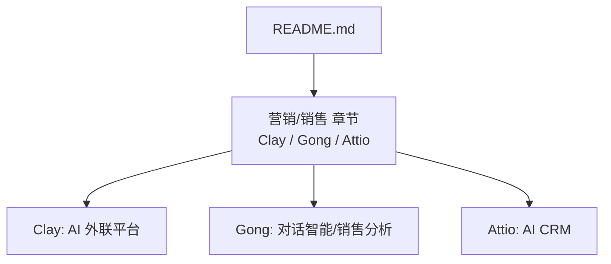
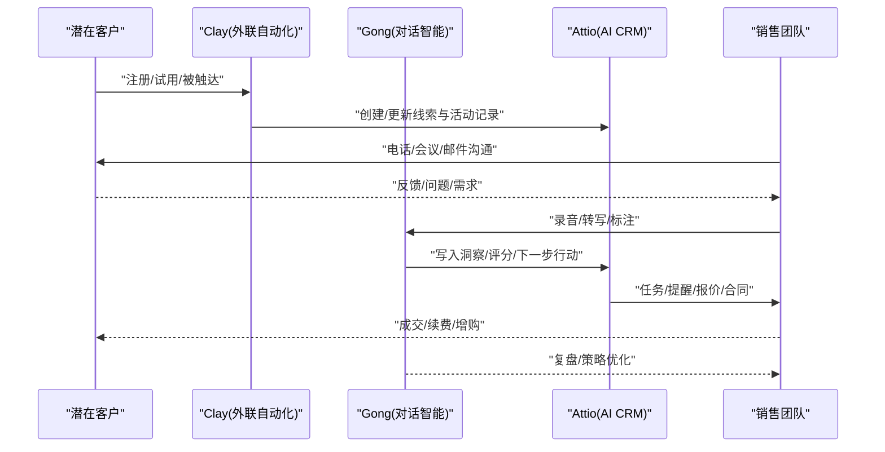
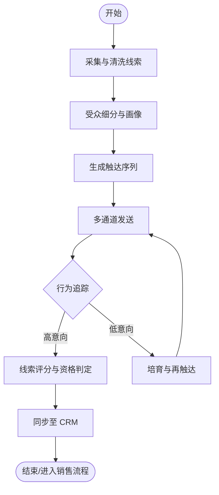
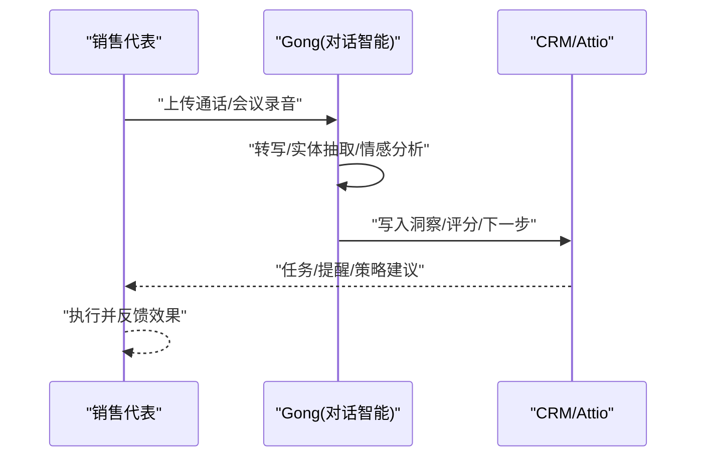
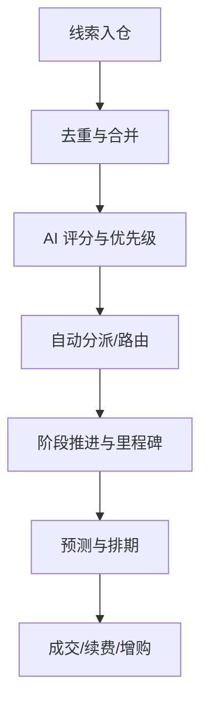
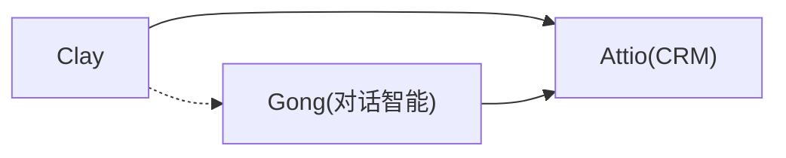

# 营销销售工具

<cite>
**本文引用的文件**
- [README.md](file://README.md)
</cite>

## 目录
1. [引言](#引言)
2. [项目结构](#项目结构)
3. [核心组件](#核心组件)
4. [架构总览](#架构总览)
5. [详细组件分析](#详细组件分析)
6. [依赖分析](#依赖分析)
7. [性能考量](#性能考量)
8. [故障排查指南](#故障排查指南)
9. [结论](#结论)
10. [附录](#附录)

## 引言
本文件聚焦于以 Clay、Gong、Attio 为代表的增长型营销与销售工具，围绕 AI 驱动的外联自动化、对话智能分析与 CRM 现代化展开，系统阐述 Revenue Intelligence（收入智能）理念与销售漏斗优化方法，并给出在 PLG（产品驱动增长）模式下的工具链搭建指南。同时梳理销售技术最新趋势：AI 销售助手、预测性分析与个性化营销，并提供实际使用案例与 ROI 分析方法，帮助团队构建可度量、可复用的增长引擎。

## 项目结构
本项目为一份持续更新的“精选初创公司清单”，其中“企业服务/开发者工具”板块包含营销与销售相关条目，涵盖 Clay、Gong、Attio 等关键工具的基本信息与定位，作为本技术文档的事实来源。

图表来源
- [README.md:698-713](file://README.md#L698-L713)

章节来源
- [README.md:698-713](file://README.md#L698-L713)

## 核心组件
本节基于仓库内容，提炼三类核心组件的职责与能力边界：
- Clay：AI 驱动的外联平台，强调 PLG 销售利器与规模化触达能力。
- Gong：对话智能与销售分析，开创 Revenue Intelligence 品类，沉淀通话洞察与策略建议。
- Attio：AI CRM，以现代数据模型与自动化工作流为核心，提升线索到成交的转化效率。

章节来源
- [README.md:700-713](file://README.md#L700-L713)

## 架构总览
下图展示以“线索获取—互动—转化—复盘”为主线的端到端流程，体现 Clay、Gong、Attio 在增长闭环中的角色分工与协作关系。

图表来源
- [README.md:700-713](file://README.md#L700-L713)

## 详细组件分析

### Clay：AI 驱动的外联自动化
- 定位与价值
  - 以 AI 为核心的外联平台，支持大规模、个性化的线索触达与跟进，助力 PLG 场景下的自获客与扩量。
  - 通过自动化编排与智能内容生成，缩短冷启动周期，提高首次触达转化率。
- 典型流程
  - 数据采集与清洗 → 受众细分与画像 → 多通道触达（邮件/社媒/IM）→ 行为追踪与再触达 → 线索入库 CRM。
- 关键能力
  - 智能模板与个性化变量注入；A/B 测试与自动调优；多渠道编排与节奏控制；与 CRM/CDP 集成。
- 指标与优化
  - 关注打开率、回复率、预约率、MQL 转化率；结合 A/B 与归因分析持续迭代。

图表来源
- [README.md:700-704](file://README.md#L700-L704)

章节来源
- [README.md:700-704](file://README.md#L700-L704)

### Gong：对话智能与 Revenue Intelligence
- 定位与价值
  - 通过录音转写、语义分析与模型洞察，沉淀“对话即资产”，赋能销售策略制定与教练式辅导。
  - 开创 Revenue Intelligence 品类，将客户互动转化为可度量的增长信号。
- 典型流程
  - 通话/会议录制 → 自动转写与实体抽取 → 主题/情绪/意图识别 → 指标看板与预警 → 策略下发与复盘。
- 关键能力
  - 话术合规检测、竞品提及识别、异议处理建议、赢单/输单因素分析、最佳实践沉淀。
- 指标与优化
  - 关注 Win Rate、Deal Size、Sales Cycle、Talk-to-Listen Ratio、Coachability；用 A/B 对比验证策略有效性。

图表来源
- [README.md:706-708](file://README.md#L706-L708)

章节来源
- [README.md:706-708](file://README.md#L706-L708)

### Attio：AI CRM 现代化
- 定位与价值
  - 以现代数据模型和自动化工作流为核心的 CRM，强调灵活建模、可视化流程与 AI 辅助操作，提升线索到成交的效率。
- 典型流程
  - 线索录入与去重 → 自动化打分与分派 → 阶段推进与里程碑管理 → 合同/回款跟踪 → 复盘与预测。
- 关键能力
  - 自定义对象与字段、自动化规则、视图与仪表盘、与外部系统 API 集成、AI 辅助填写与建议。
- 指标与优化
  - 关注 Pipeline 健康度、Stage 转化率、平均停留时间、预测准确率；通过流程治理与数据质量保障提升可预测性。

图表来源
- [README.md:710-712](file://README.md#L710-L712)

章节来源
- [README.md:710-712](file://README.md#L710-L712)

## 依赖分析
- 组件耦合
  - Clay 与 Attio：外联结果需回流 CRM，形成统一线索视图与活动历史。
  - Gong 与 Attio：对话洞察与评分应写入 CRM，驱动下一步动作与预测。
  - Clay 与 Gong：外联触达后的首次沟通可通过 Gong 沉淀策略与话术。
- 数据流
  - 线索数据从 Clay 流入 Attio；通话数据经 Gong 处理后回流 Attio；三者共同构成“触达—沟通—转化—复盘”的数据闭环。
- 风险与约束
  - 数据一致性、隐私合规、API 限流与失败重试、模型漂移与评估机制。

图表来源
- [README.md:700-713](file://README.md#L700-L713)

章节来源
- [README.md:700-713](file://README.md#L700-L713)

## 性能考量
- 外联规模与速率控制：合理设置发送频率与冷却时间，避免触发反垃圾策略。
- 对话处理吞吐：批量转写与异步分析，结合缓存与增量更新降低延迟。
- CRM 写入批量化：批量写入与幂等键设计，减少重复与冲突。
- 监控与告警：对关键链路（发送、转写、写入）建立 SLO 与错误率阈值。

[本节为通用指导，不直接分析具体文件]

## 故障排查指南
- 常见问题定位
  - 外联未送达：检查域名信誉、SPF/DKIM/DMARC、收件箱策略与黑名单。
  - 对话未识别：确认音频质量、语言/口音配置、领域词典与关键词库。
  - CRM 不同步：核对 API Key、权限范围、字段映射与去重规则。
- 诊断步骤
  - 日志采集与链路追踪；抽样回放关键事件；灰度发布与回滚策略。
- 恢复与预防
  - 降级策略（如切换供应商）、重试与补偿、定期演练与容量压测。

[本节为通用指导，不直接分析具体文件]

## 结论
Clay、Gong、Attio 分别在外联自动化、对话智能与 CRM 现代化方面提供关键能力，三者协同可构建以 Revenue Intelligence 为核心的增长闭环。在 PLG 模式下，借助 AI 驱动的规模化触达、可量化的对话洞察与灵活的 CRM 工作流，企业能够显著提升线索转化效率与可预测性。配合科学的指标体系与 ROI 分析方法，团队可实现可持续的增长飞轮。

[本节为总结性内容，不直接分析具体文件]

## 附录

### Revenue Intelligence 概念与方法论
- 定义：将客户互动（通话、邮件、会议、聊天）转化为结构化数据与分析，驱动销售策略、教练与资源配置。
- 方法论要点
  - 全量采集与标准化；主题/意图/情绪建模；赢输因子归因；策略下发与闭环验证。
- 落地路径
  - 先打通数据源与 CRM；再引入洞察与评分；最后实现自动化策略与预测。

[本节为通用指导，不直接分析具体文件]

### 销售漏斗优化与 PLG 工具链搭建
- 漏斗阶段与指标
  - 曝光—点击—注册—激活—付费—留存—增购；各阶段设定转化率与流失原因分析。
- PLG 工具链建议
  - 获客：Clay（外联自动化）+ 官网/着陆页 + 试用/免费增值。
  - 转化：Gong（对话智能）+ 在线演示/会话录制 + 自助上手。
  - 运营：Attio（AI CRM）+ 自动化工作流 + 数据看板。
- 关键实践
  - 以实验驱动（A/B 测试、多臂老虎机）；以数据为准（统一指标口径）；以自动化提效（减少手工流转）。

[本节为通用指导，不直接分析具体文件]

### 实际使用案例与 ROI 分析方法
- 案例一：SaaS 企业外联与转化
  - 目标：提升 MQL 转化率与缩短 Sales Cycle。
  - 方案：Clay 多通道触达 + Gong 首通对话分析 + Attio 自动化分派。
  - 指标：打开率、回复率、预约率、MQL→SQL 转化率、Win Rate。
  - ROI 估算：增量 ARR ÷ 工具与运营成本；按渠道与阶段拆解贡献。
- 案例二：对话智能驱动的策略迭代
  - 目标：提升赢单率与客单价。
  - 方案：Gong 提取异议与竞品提及，Attio 生成改进任务，Clay 调整话术与素材。
  - 指标：Talk-to-Listen Ratio、Coachability、Deal Size、Forecast Accuracy。
  - ROI 估算：赢单提升带来的 ARR 增量与成本节约。

[本节为通用指导，不直接分析具体文件]

### 销售技术趋势速览
- AI 销售助手：自动生成跟进计划、话术建议、会议纪要与下一步行动。
- 预测性分析：基于历史对话与管线数据的赢单概率、流失风险与资源排程。
- 个性化营销：基于用户行为与对话语义的动态内容与触达策略。

[本节为通用指导，不直接分析具体文件]