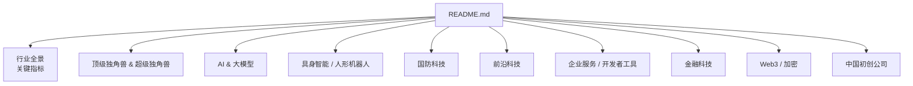
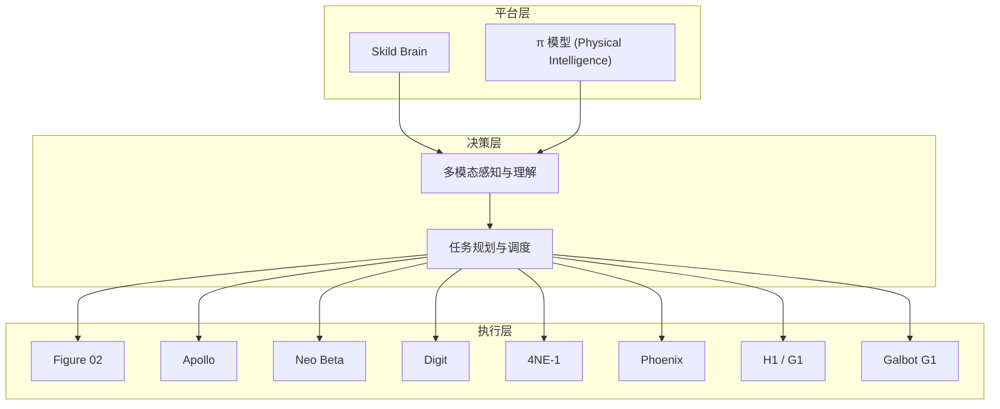
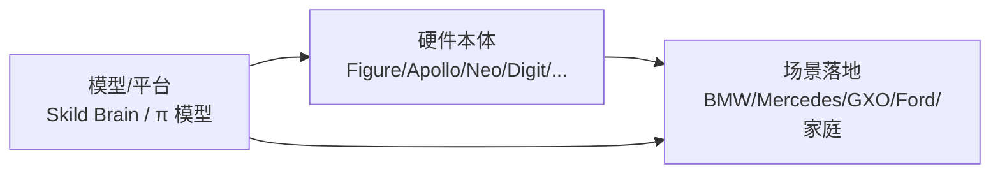

# 具身智能 / 人形机器人

<cite>
**本文引用的文件**
- [README.md](file://README.md)
</cite>

## 目录
1. [引言](#引言)
2. [项目结构](#项目结构)
3. [核心组件](#核心组件)
4. [架构总览](#架构总览)
5. [详细组件分析](#详细组件分析)
6. [依赖关系分析](#依赖关系分析)
7. [性能与产业化考量](#性能与产业化考量)
8. [故障排查指南](#故障排查指南)
9. [结论](#结论)
10. [附录：技术对比与投资参考](#附录技术对比与投资参考)

## 引言
本文件聚焦 2025–2026 年最具颠覆性的赛道之一——具身智能与人形机器人，梳理该领域 $14B+ 资本涌入的产业现状，系统盘点 Figure AI、Skild AI、Physical Intelligence、1X Technologies、Apptronik、NEURA Robotics、Agility Robotics、Sanctuary AI、Unitree Robotics、Galbot 等领先公司的技术特点、产品形态、应用场景与商业进展，并给出产业化进程判断、未来趋势研判以及技术与投资参考。

## 项目结构
本项目为一份持续更新的精选初创公司清单，按热门赛道组织，其中“具身智能/人形机器人”作为独立赛道章节，集中呈现头部公司与关键指标。

图表来源
- [README.md:1-45](file://README.md#L1-L45)

章节来源
- [README.md:1-45](file://README.md#L1-L45)

## 核心组件
本节提炼“具身智能/人形机器人”赛道的关键要素：资本规模、代表公司、产品形态与应用场景。

- 资本规模：2025 年具身智能融资达 $14B+，标志该赛道进入规模化投入阶段。
- 代表公司与估值（节选）：
  - Figure AI：$48B，Figure 02 已在 BMW 工厂商用部署，集成 OpenAI 模型。
  - Skild AI：$14B，发布通用机器人“大脑”（Skild Brain），跨硬件平台部署。
  - Physical Intelligence：$5.6B，推出机器人基础模型 π（pi）。
  - 1X Technologies：$1B+，Neo Beta 家用机器人，OPENAI 早期投资。
  - Apptronik：$1.5B，Apollo 人形机器人，与 Google DeepMind 合作并在 Mercedes-Benz 工厂测试。
  - NEURA Robotics：$1.2B+，4NE-1 人形机器人，专注工业场景。
  - Agility Robotics：$1B+，Digit 双足机器人，与 Amazon GXO 合作、Ford 测试。
  - Sanctuary AI：$140M+，Phoenix 人形机器人，Carbon 控制系统。
  - Unitree Robotics：$1.7B（估），H1/G1 人形机器人，消费级定价策略。
  - Galbot：$1B+，Galbot G1，北京大学孵化。

- 产品形态与应用场景：
  - 工业制造：BMW、Mercedes-Benz、Amazon GXO、Ford 等场景的搬运、装配、质检。
  - 仓储物流：仓库分拣、托盘搬运、柔性产线协作。
  - 家庭与服务：家务辅助、陪伴、教育娱乐（如 1X Neo Beta）。
  - 科研与平台：机器人基础模型与通用“大脑”，跨硬件适配。

章节来源
- [README.md:371-430](file://README.md#L371-L430)

## 架构总览
从产业视角看，具身智能/人形机器人由“感知—决策—执行—平台”四层构成，对应到各公司可理解为：
- 感知层：视觉、力觉、多模态传感器融合（各硬件公司差异较大）。
- 决策层：机器人基础模型/通用大脑（如 Skild Brain、Physical Intelligence 的 π 模型）。
- 执行层：本体设计与运动控制（Figure 02、Apollo、Neo Beta、Digit、4NE-1、Phoenix、H1/G1、Galbot G1）。
- 平台层：跨硬件部署、仿真训练、数据闭环（平台型公司更强调）。

图表来源
- [README.md:371-430](file://README.md#L371-L430)

## 详细组件分析
### Figure AI
- 技术特点：将大模型能力与机器人执行结合，强调在真实工厂环境中的稳定运行。
- 产品形态：Figure 02 人形机器人。
- 应用场景：汽车制造（BMW 工厂）、复杂装配与物料搬运。
- 商业进展：2025 年 Series C $1B+，估值攀升至 $48B；已实现商用部署。

章节来源
- [README.md:375-380](file://README.md#L375-L380)

### Skild AI
- 技术特点：提供通用机器人“大脑”，支持跨硬件平台部署，降低适配成本。
- 产品形态：Skild Brain（模型/平台）。
- 应用场景：多厂商机器人统一控制与任务编排。
- 商业进展：2026 年 1 月 Series C $1.4B，估值 $14B（软银领投）。

章节来源
- [README.md:381-387](file://README.md#L381-L387)

### Physical Intelligence
- 技术特点：推出机器人基础模型 π（pi），推动“机器人 GPT 时刻”。
- 产品形态：π 模型（基础模型）。
- 应用场景：通用任务学习、跨场景迁移。
- 商业进展：2025 年融资 $400M，估值 $5.6B，获 Jeff Bezos、OpenAI 等投资。

章节来源
- [README.md:388-393](file://README.md#L388-L393)

### 1X Technologies
- 技术特点：面向家庭的机器人产品，注重易用性与安全性。
- 产品形态：Neo Beta 人形机器人。
- 应用场景：家庭服务、陪伴、教育。
- 商业进展：2025 年拟融资 $1B（估值 $10B），OPENAI 早期投资。

章节来源
- [README.md:394-399](file://README.md#L394-L399)

### Apptronik
- 技术特点：与 Google DeepMind 合作，强化感知与决策能力。
- 产品形态：Apollo 人形机器人。
- 应用场景：汽车制造（Mercedes-Benz 工厂测试）、工业协作。
- 商业进展：2025 年 Series A $350M，估值 $1.5B（Google 参投）。

章节来源
- [README.md:400-405](file://README.md#L400-L405)

### NEURA Robotics
- 技术特点：欧洲人形机器人代表，聚焦工业场景落地。
- 产品形态：4NE-1 人形机器人。
- 应用场景：工业制造、重载搬运。
- 商业进展：2025 年 Series B $1.2B+。

章节来源
- [README.md:406-411](file://README.md#L406-L411)

### Agility Robotics
- 技术特点：双足机器人 Digit，强调在仓库环境中的高可靠性。
- 产品形态：Digit 双足机器人。
- 应用场景：仓储物流（Amazon GXO）、汽车制造（Ford 测试）。
- 商业进展：$1B+ 估值，推进大规模部署。

章节来源
- [README.md:412-415](file://README.md#L412-L415)

### Sanctuary AI
- 技术特点：Phoenix 人形机器人，采用 Carbon 控制系统。
- 产品形态：Phoenix 人形机器人。
- 应用场景：研究与开发、特定工业场景。
- 商业进展：$140M+ 估值，加拿大 BC 省总部。

章节来源
- [README.md:416-419](file://README.md#L416-L419)

### Unitree Robotics
- 技术特点：消费级人形机器人路线，强调性价比与可及性。
- 产品形态：H1、G1 人形机器人。
- 应用场景：教育、研发、消费级市场。
- 商业进展：$1.7B（估），G1 售价 $16,000。

章节来源
- [README.md:420-424](file://README.md#L420-L424)

### Galbot
- 技术特点：中国人形机器人新势力，依托高校资源进行研发。
- 产品形态：Galbot G1。
- 应用场景：教育与研发、潜在工业应用。
- 商业进展：$1B+ 估值，北京大学孵化。

章节来源
- [README.md:425-429](file://README.md#L425-L429)

## 依赖关系分析
- 平台与模型对硬件的解耦：Skild Brain、π 模型等平台化方案可降低硬件适配成本，提升生态协同效率。
- 大厂合作与生态绑定：Figure 与 OpenAI 模型集成、Apptronik 与 Google DeepMind 合作，体现“模型—硬件—场景”的强耦合趋势。
- 供应链与制造能力：人形机器人量产需要精密机械、传感器、算力与软件栈的协同，具备全栈能力的公司将更具优势。

图表来源
- [README.md:371-430](file://README.md#L371-L430)

章节来源
- [README.md:371-430](file://README.md#L371-L430)

## 性能与产业化考量
- 商业化节奏：从 Demo 走向商用部署（如 BMW 工厂、GXO 仓库），验证了稳定性与经济性。
- 成本与定价：消费级产品（如 Unitree G1）以更低价格打开市场，推动普及。
- 生态与标准：平台化“大脑”有助于统一接口与数据格式，加速规模化复制。
- 风险与挑战：安全合规、长尾场景泛化、供应链瓶颈、人才竞争。

[本节为一般性讨论，不直接分析具体文件]

## 故障排查指南
- 部署问题：确认模型与硬件版本匹配，检查传感器标定与通信链路。
- 性能问题：评估任务复杂度与算力配置，优化感知—决策—执行的延迟。
- 业务问题：明确场景边界与验收标准，分阶段迭代与灰度上线。

[本节为一般性指导，不直接分析具体文件]

## 结论
2025–2026 年具身智能/人形机器人赛道迎来 $14B+ 资本涌入，头部公司通过“模型—硬件—场景”一体化布局加速产业化。平台化“大脑”与消费级产品的并行发展，将推动从工业到家庭的广泛落地。未来需关注标准化、安全性与供应链能力，把握“Fewer deals, bigger checks”的资本趋势，优先选择具备全栈能力与明确商业化路径的公司。

[本节为总结性内容，不直接分析具体文件]

## 附录：技术对比与投资参考
- 技术路线对比：
  - 平台化 vs 垂直化：Skild、Physical Intelligence 偏向平台化；Figure、Apptronik、Agility 等侧重垂直场景。
  - 消费级 vs 工业级：Unitree 走消费级路线；NEURA、Apptronik 等聚焦工业。
- 投资参考要点：
  - 商业化进度：是否已有客户与部署案例（如 BMW、Mercedes、GXO）。
  - 生态绑定：是否与主流模型/云平台深度整合（如 OpenAI、Google DeepMind）。
  - 成本与定价：消费级定价策略与工业级 ROI 测算。
  - 团队与资金：核心团队背景与融资规模（如 Skild $14B、Figure $48B）。

[本节为概念性内容，不直接分析具体文件]