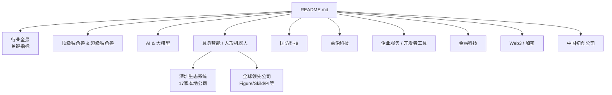
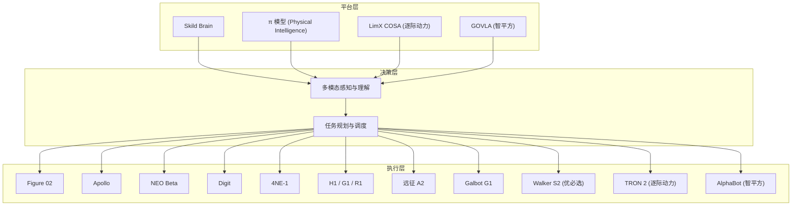
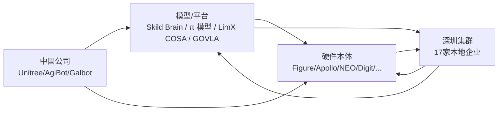

# 具身智能 / 人形机器人

<cite>
**本文引用的文件**
- [README.md](file://README.md)
- [深圳具身智能与机器人公司.md](file://深圳创业圈/本地公司/深圳具身智能与机器人公司.md)
- [深圳具身智能岗位汇总.md](file://深圳求职/具身智能岗位/深圳具身智能岗位汇总.md)
</cite>

## 更新摘要
**所做更改**
- 大幅增强了深圳具身智能生态系统的覆盖，新增17家深圳本地机器人公司详细分析
- 完善了全球领先公司与深圳本土企业的对比分析
- 增加了深圳"机器人谷"产业集群的完整图谱
- 更新了最新融资信息和估值数据（截至2026年9月）
- 强化了产业化进程和未来趋势分析，特别关注中国速度

## 目录
1. [引言](#引言)
2. [项目结构](#项目结构)
3. [核心组件](#核心组件)
4. [架构总览](#架构总览)
5. [详细组件分析](#详细组件分析)
6. [深圳生态系统深度分析](#深圳生态系统深度分析)
7. [依赖关系分析](#依赖关系分析)
8. [性能与产业化考量](#性能与产业化考量)
9. [故障排查指南](#故障排查指南)
10. [结论](#结论)
11. [附录：技术对比与投资参考](#附录技术对比与投资参考)

## 引言
本文件聚焦 2025–2026 年最具颠覆性的赛道之一——具身智能与人形机器人，梳理该领域 $14B+ 资本涌入的产业现状。不仅系统盘点 Figure AI、Skild AI、Physical Intelligence、NEURA Robotics 等全球领先公司，更深入分析深圳"机器人谷"聚集的优必选、逐际动力、智平方、自变量机器人等17家本地企业，全面呈现中美竞争格局与产业化进程。

## 项目结构
本项目为一份持续更新的精选初创公司清单，按热门赛道组织，其中"具身智能/人形机器人"作为独立赛道章节，集中呈现头部公司与关键指标，并特别强化深圳本地生态系统的覆盖。

图表来源
- [README.md:1-80](file://README.md#L1-L80)

章节来源
- [README.md:1-80](file://README.md#L1-L80)

## 核心组件
本节提炼"具身智能/人形机器人"赛道的关键要素：资本规模、代表公司、产品形态与应用场景。

- **资本规模**：2025 年具身智能融资达 $14B+，标志该赛道进入规模化投入阶段。
- **全球代表公司与估值（节选）**：
  - **Figure AI**：$48B，Figure 02 已在 BMW 工厂商用部署，集成 OpenAI 模型。
  - **Skild AI**：$14B，发布通用机器人"大脑"（Skild Brain），跨硬件平台部署。
  - **Physical Intelligence**：$5.6B，推出机器人基础模型 π（pi）。
  - **NEURA Robotics**：$7B，4NE-1 人形机器人，欧洲最强全栈人形公司。
  - **1X Technologies**：$1B+，NEO Beta 家用机器人，OPENAI 早期投资。
  - **Apptronik**：$5B，Apollo 人形机器人，与 Google DeepMind 合作并在 Mercedes-Benz 工厂测试。
  - **Agility Robotics**：$1B+，Digit 双足机器人，与 Amazon GXO 合作、Ford 测试。
  - **Unitree Robotics**：IPO 进行中，H1/G1/R1 人形机器人，消费级定价策略。
  - **AgiBot / 智元机器人**：量产先锋，远征 A2 人形机器人，2026 年 3 月达成 10,000 台下线里程碑。
  - **Galbot**：$2.8B（估），Galbot G1，国家资本背景，CATL、Bosch、Toyota、北汽、上汽订单。

- **深圳本地代表公司（新增）**：
  - **优必选 UBTECH**：港股上市，Walker S2 工业人形机器人，订单破万台。
  - **逐际动力 LimX Dynamics**：Pre-IPO 近 2 亿美元，LimX COSA 具身智能体 OS。
  - **智平方 AI² Robotics**：深圳首家百亿具身独角兽，GOVLA 开源模型。
  - **自变量机器人 X-Square**：WALL-B 世界统一模型，估值超200亿元。
  - **众擎机器人 EngineAI**：T800 全尺寸人形机器人，产业资本豪华阵容。
  - **星尘智能 Astribot**：绳驱 AI 机器人，腾讯 Robotics X 原班团队。
  - **帕西尼感知 Paxini**：触觉传感器+数据工厂，京东战略领投。
  - **普渡科技 Pudu**：商用服务机器人领导者，累计出货12万+台。

- **产品形态与应用场景**：
  - **工业制造**：BMW、Mercedes-Benz、Amazon GXO、Ford 等场景的搬运、装配、质检。
  - **仓储物流**：仓库分拣、托盘搬运、柔性产线协作。
  - **家庭与服务**：家务辅助、陪伴、教育娱乐（如 1X NEO Beta）。
  - **科研与平台**：机器人基础模型与通用"大脑"，跨硬件适配。

章节来源
- [README.md:937-997](file://README.md#L937-L997)

## 架构总览
从产业视角看，具身智能/人形机器人由"感知—决策—执行—平台"四层构成，对应到各公司可理解为：
- **感知层**：视觉、力觉、多模态传感器融合（各硬件公司差异较大）。
- **决策层**：机器人基础模型/通用大脑（如 Skild Brain、Physical Intelligence 的 π 模型）。
- **执行层**：本体设计与运动控制（Figure 02、Apollo、NEO Beta、Digit、4NE-1、Phoenix、H1/G1/R1、Galbot G1）。
- **平台层**：跨硬件部署、仿真训练、数据闭环（平台型公司更强调）。

图表来源
- [README.md:937-997](file://README.md#L937-L997)

## 详细组件分析
### Figure AI
- **技术特点**：将大模型能力与机器人执行结合，强调在真实工厂环境中的稳定运行。
- **产品形态**：Figure 02 人形机器人。
- **应用场景**：汽车制造（BMW 工厂）、复杂装配与物料搬运。
- **商业进展**：2025 年 Series C $1B+，估值攀升至 $48B；已实现商用部署。

章节来源
- [README.md:941-946](file://README.md#L941-L946)

### Skild AI
- **技术特点**：提供通用机器人"大脑"，支持跨硬件平台部署，降低适配成本。
- **产品形态**：Skild Brain（模型/平台）。
- **应用场景**：多厂商机器人统一控制与任务编排。
- **商业进展**：2026 年 1 月 Series C $1.4B，估值 $14B（软银领投）。

章节来源
- [README.md:947-953](file://README.md#L947-L953)

### Physical Intelligence
- **技术特点**：推出机器人基础模型 π（pi），推动"机器人 GPT 时刻"。
- **产品形态**：π 模型（基础模型）。
- **应用场景**：通用任务学习、跨场景迁移。
- **商业进展**：2025 年融资 $600M，估值 $5.6B，获 Jeff Bezos、OpenAI 等投资。

章节来源
- [README.md:954-959](file://README.md#L954-L959)

### NEURA Robotics
- **技术特点**：欧洲最强全栈人形公司，聚焦工业场景落地。
- **产品形态**：4NE-1 人形机器人。
- **应用场景**：工业制造、重载搬运。
- **商业进展**：2026 年 6 月 $1.4B（$7B 估值；Bosch、Schaeffler、Amazon、NVIDIA、Qualcomm 参投），目标 2030 年百万台规模。

章节来源
- [README.md:960-965](file://README.md#L960-L965)

### 1X Technologies
- **技术特点**：面向家庭的机器人产品，注重易用性与安全性。
- **产品形态**：NEO Beta 家用人形机器人。
- **应用场景**：家庭服务、陪伴、教育。
- **商业进展**：2025 年拟融资 $1B（估值 $10B），OPENAI 早期投资；NEO 预售 $20,000 / 月租 $499。

章节来源
- [README.md:966-971](file://README.md#L966-L971)

### Apptronik
- **技术特点**：与 Google DeepMind 合作，强化感知与决策能力。
- **产品形态**：Apollo 人形机器人。
- **应用场景**：汽车制造（Mercedes-Benz 工厂测试）、工业协作。
- **商业进展**：2026 年 2 月 Series A 延长 $935M+（$5B 估值，Google、Mercedes-Benz 参投）。

章节来源
- [README.md:972-977](file://README.md#L972-L977)

### Agility Robotics
- **技术特点**：双足机器人 Digit，强调在仓库环境中的高可靠性。
- **产品形态**：Digit 双足机器人。
- **应用场景**：仓储物流（Amazon GXO）、汽车制造（Ford 测试）。
- **商业进展**：GXO 仓库已搬运超 10 万 totes（最可量化的人形机器人商用数据）；Amazon 测试。

章节来源
- [README.md:978-981](file://README.md#L978-L981)

### Unitree Robotics
- **技术特点**：消费级人形机器人路线，强调性价比与可及性。
- **产品形态**：H1、G1、R1 人形机器人。
- **应用场景**：教育、研发、消费级市场。
- **商业进展**：IPO 进行中；2025 年营收 RMB 17 亿（同比 4 倍）；G1 售价 $13,500、R1 仅 $4,900；以低价颠覆市场。

章节来源
- [README.md:982-986](file://README.md#L982-L986)

### AgiBot / 智元机器人
- **技术特点**：全球最快量产节奏的中国力量。
- **产品形态**：远征 A2 人形机器人。
- **应用场景**：工业制造、大规模生产应用。
- **商业进展**：2026 年 3 月达成 10,000 台下线里程碑；被严重低估的中国力量。

章节来源
- [README.md:987-991](file://README.md#L987-L991)

### Galbot
- **技术特点**：中国人形机器人新势力，依托国家资本进行研发。
- **产品形态**：Galbot G1。
- **应用场景**：教育与研发、潜在工业应用。
- **商业进展**：2026 年 3 月 RMB 25 亿（估值 RMB 200 亿+）；国家资本背景；CATL、Bosch、Toyota、北汽、上汽订单。

章节来源
- [README.md:992-997](file://README.md#L992-L997)

## 深圳生态系统深度分析

### 深圳"机器人谷"产业集群概览
深圳作为中国具身智能创业最集中的城市，已形成完整的产业链生态。2025 年深圳机器人产业增加值达 55.59 亿元，同比增长 31.4%，聚集了优必选、越疆科技、普渡科技等上市龙头企业，以及上百家支撑机器人产业链的经营主体。

### 第一梯队：百亿估值/已上市企业

#### 优必选 UBTECH 🌟
- **成立时间**：2012 年
- **上市状态**：2023 年港交所上市（"人形机器人第一股"）
- **核心产品**：Walker S2 工业人形机器人（自主热插拔换电）、超仿生机器人（2026.6 发布，订单破万台）
- **商业模式**：全球最成熟的人形机器人商业化路径——工业、教育/科研、超仿生机器人三线布局
- **优势**："人形机器人第一股"品牌效应，12 年技术积累，已实现万台级订单
- **劣势**：上市公司信息披露要求限制战略灵活性，持续亏损待盈利证明

#### 智平方 AI² Robotics 🔥
- **成立时间**：2023 年
- **估值**：>100 亿元（深圳首个百亿具身独角兽）
- **核心产品**：AlphaBot 系列通用人形机器人 + GOVLA 0.5 开源模型
- **商业模式**：工业端交付 + 商业服务端"智魔方" + 技术输出三轨并行
- **优势**：快慢系统融合的 GOVLA 模型技术领先，已有标杆客户订单
- **劣势**：成立时间短，商业服务场景盈利模型待验证

#### 自变量机器人 X Square Robot 🔥🌟
- **成立时间**：2023 年 12 月
- **估值**：>200 亿元（大湾区标杆）
- **核心产品**：WALL-B 世界统一模型（全球首个）、Wall-A 具身智能大模型
- **商业模式**：定位"物理世界的 OpenAI"，以具身智能基础模型为核心
- **优势**：阿里云战略投资，WALL-B 全球首个世界统一模型，成立不到两年 8 轮融资
- **劣势**：成立时间极短，基础模型路线烧钱速度快

### 第二梯队：高速成长期企业

#### 逐际动力 LimX Dynamics 🔥
- **成立时间**：2022 年
- **最新融资**：2026.7 Pre-IPO 近 2 亿美元；半年累计 4 亿美元
- **估值**：≈150 亿元
- **核心产品**：全尺寸人形机器人 LimX Oli/Luna、多形态机器人 TRON 系列、LimX COSA 具身智能体 OS
- **商业模式**：主机厂模式——研发+制造+销售，同步输出具身智能 OS 系统
- **优势**：技术壁垒高，京东战略协同获得物流场景天然通道
- **劣势**：尚未 IPO，人形机器人规模化量产仍在爬坡期

#### 众擎机器人 EngineAI
- **成立时间**：2023 年
- **最新融资**：2026.5 B+ 轮；2026.4 B 轮 2 亿美元（≈14 亿元）
- **估值**：>100 亿元
- **核心产品**：T800 全尺寸通用人形机器人
- **商业模式**：通用人形机器人研发+规模化发售，发起全球首届人形机器人自由格斗联赛
- **优势**：产业资本豪华阵容（京东+宁德时代+小鹏+立讯精密），T800 已启动规模发售
- **劣势**：成立时间短，百亿估值对应实际营收规模待确认

#### 星尘智能 Astribot — 绳驱 AI 机器人 🔥
- **成立时间**：2022 年底
- **最新融资**：B 轮系列超 10 亿元（3 个月内连续 3 轮）
- **估值**：突破百亿元（独角兽）
- **核心产品**：Astribot S1 全能型 AI 机器人（全球首个且唯一量产绳驱 AI 机器人）
- **商业模式**：软硬件一体化架构，将"AI 智能"与"最强操作"深度耦合
- **优势**：绳驱技术全球唯一量产，腾讯 Robotics X 原班团队
- **劣势**：绳驱技术路线尚未大规模验证

### 第三梯队：潜力企业与细分领域龙头

#### 帕西尼感知科技 PaXini
- **核心产品**：高精度触觉传感器、多模态具身智能训练数据工厂
- **商业模式**：具身智能"感知层"核心供应商，年产近 2 亿条多模态训练数据
- **优势**：触觉传感器是机器人"最后一公里"感知能力，技术壁垒高
- **劣势**：传感器市场体量相对有限，数据工厂重资产投入回报周期长

#### 普渡科技 Pudu Robotics
- **出货量**：累计 >12 万台
- **核心产品**：商用配送机器人、商用清洁机器人、工业配送机器人
- **商业模式**：全球商用服务机器人领导者，海外营收占比 >80%
- **优势**：全球化布局成熟，产品成熟度高，客户基础广泛
- **劣势**：赛道竞争加剧，汇率与地缘风险

#### 乐聚机器人 LeJu Robot
- **成立时间**：2016 年
- **最新融资**：2025.10 Pre-IPO 近 15 亿元
- **核心产品**：高端智能人形机器人（教育/科研/展示/服务多场景）
- **商业模式**：国家级专精特新"小巨人"企业，高端人形机器人研发+制造+销售
- **优势**：成立最早技术积累深厚，创业板 IPO 推进中
- **劣势**：相比优必选商业化规模较小

### 新兴企业与特殊案例

#### 数字华夏
- **成立时间**：2024 年 3 月
- **核心产品**："夏澜"仿人人形机器人（R03 新一代）、"夏起"通用人用机器人系列
- **商业模式**：面向政务/金融/电力/国央企等公共服务场景的仿人人形机器人解决方案
- **优势**：仿人外形在公共服务场景更具亲和力，已实现商业交付和营收
- **劣势**：场景相对垂直，扩展性有限

#### 诺因智能 KNOWIN
- **成立时间**：2025 年 6 月
- **创始人**：李银川（前华为诺亚方舟实验室生成式大模型负责人）
- **核心产品**：家用等身机器人（智能家务机器人+具身机器人全流程自研）
- **商业模式**：消费级家庭场景，打造具备"感知-决策-执行"闭环的家庭智能机器人
- **优势**：家庭场景市场空间巨大，消费级产品一旦爆量增长惊人
- **劣势**：家庭机器人技术难度极高，消费级定价与成本矛盾

**章节来源**
- [深圳具身智能与机器人公司.md:1-449](file://深圳创业圈/本地公司/深圳具身智能与机器人公司.md#L1-L449)

## 依赖关系分析
- **平台与模型对硬件的解耦**：Skild Brain、π 模型等平台化方案可降低硬件适配成本，提升生态协同效率。
- **大厂合作与生态绑定**：Figure 与 OpenAI 模型集成、Apptronik 与 Google DeepMind 合作，体现"模型—硬件—场景"的强耦合趋势。
- **供应链与制造能力**：人形机器人量产需要精密机械、传感器、算力与软件栈的协同，具备全栈能力的公司将更具优势。
- **中国市场崛起**：Unitree、AgiBot、Galbot 等中国公司凭借成本优势和快速迭代能力，正在重塑全球竞争格局。
- **深圳集群效应**：深圳已形成从传感器、算法、本体制造到应用落地的完整产业链，成为具身智能创新策源地。

图表来源
- [README.md:937-997](file://README.md#L937-L997)

## 性能与产业化考量
- **商业化节奏**：从 Demo 走向商用部署（如 BMW 工厂、GXO 仓库），验证了稳定性与经济性。
- **成本与定价**：消费级产品（如 Unitree G1、R1）以更低价格打开市场，推动普及。
- **生态与标准**：平台化"大脑"有助于统一接口与数据格式，加速规模化复制。
- **风险与挑战**：安全合规、长尾场景泛化、供应链瓶颈、人才竞争。
- **中国速度**：AgiBot 等中国公司展现出惊人的量产速度，2026 年 3 月即达成 10,000 台下线里程碑。
- **深圳速度**：深圳企业融资节奏极快，如自变量机器人成立不到两年完成 8 轮融资，众擎机器人 2.5 年完成 9 轮融资。

## 故障排查指南
- **部署问题**：确认模型与硬件版本匹配，检查传感器标定与通信链路。
- **性能问题**：评估任务复杂度与算力配置，优化感知—决策—执行的延迟。
- **业务问题**：明确场景边界与验收标准，分阶段迭代与灰度上线。

## 结论
2025–2026 年具身智能/人形机器人赛道迎来 $14B+ 资本涌入，头部公司通过"模型—硬件—场景"一体化布局加速产业化。平台化"大脑"与消费级产品的并行发展，将推动从工业到家庭的广泛落地。Figure AI ($48B)、Skild AI ($14B) 等美国公司引领技术创新，而 Unitree、AgiBot、Galbot 等中国公司凭借成本优势和快速迭代能力正在重塑全球竞争格局。

**特别值得关注的是深圳生态系统的爆发式增长**：深圳已形成包含优必选、逐际动力、智平方、自变量机器人等17家企业的完整产业集群，涵盖从传感器、算法、本体制造到应用落地的全产业链。深圳"机器人谷"2025年产业增加值达55.59亿元，同比增长31.4%，成为中国具身智能创新的策源地。

未来需关注标准化、安全性与供应链能力，把握"Fewer deals, bigger checks"的资本趋势，优先选择具备全栈能力与明确商业化路径的公司。深圳企业在融资速度、量产能力和成本控制方面展现出独特的竞争优势，有望在全球竞争中占据重要地位。

## 附录：技术对比与投资参考
- **技术路线对比**：
  - **平台化 vs 垂直化**：Skild、Physical Intelligence 偏向平台化；Figure、Apptronik、Agility 等侧重垂直场景。
  - **消费级 vs 工业级**：Unitree 走消费级路线；NEURA、Apptronik 等聚焦工业。
  - **中美竞争格局**：美国公司在基础模型和高端制造方面领先，中国公司在量产速度和成本控制方面具有优势。
  - **深圳特色**：深圳企业更注重商业化落地和快速迭代，形成"技术+制造+应用"的完整生态。

- **投资参考要点**：
  - **商业化进度**：是否已有客户与部署案例（如 BMW、Mercedes、GXO）。
  - **生态绑定**：是否与主流模型/云平台深度整合（如 OpenAI、Google DeepMind）。
  - **成本与定价**：消费级定价策略与工业级 ROI 测算。
  - **团队与资金**：核心团队背景与融资规模（如 Skild $14B、Figure $48B、NEURA $7B）。
  - **量产能力**：是否具备规模化生产能力（如 AgiBot 10,000 台里程碑）。
  - **深圳集群优势**：是否位于深圳"机器人谷"，享受产业链协同红利。

- **深圳投资机会**：
  - **第一梯队**：优必选（已上市）、智平方（百亿独角兽）、自变量机器人（估值200亿+）
  - **成长期**：逐际动力（Pre-IPO）、众擎机器人（产业资本加持）、星尘智能（腾讯系）
  - **细分龙头**：帕西尼感知（传感器）、普渡科技（商用服务机器人）
  - **新兴潜力**：数字华夏（公共服务）、诺因智能（家庭场景）

[本节为概念性内容，不直接分析具体文件]