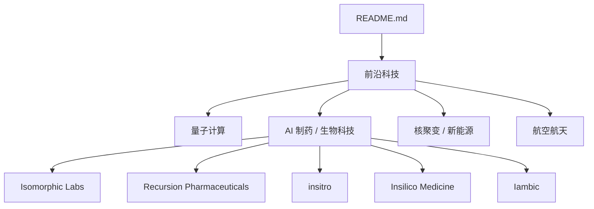
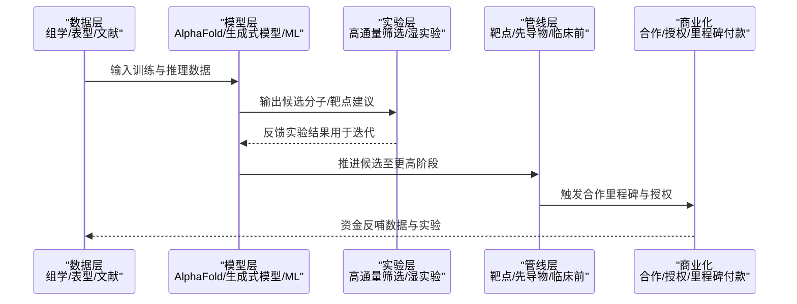
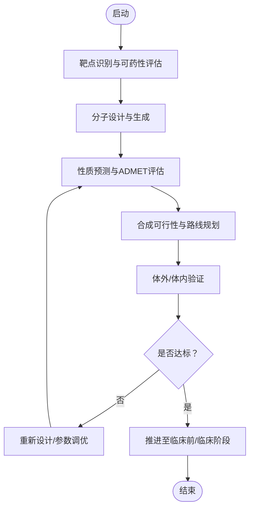
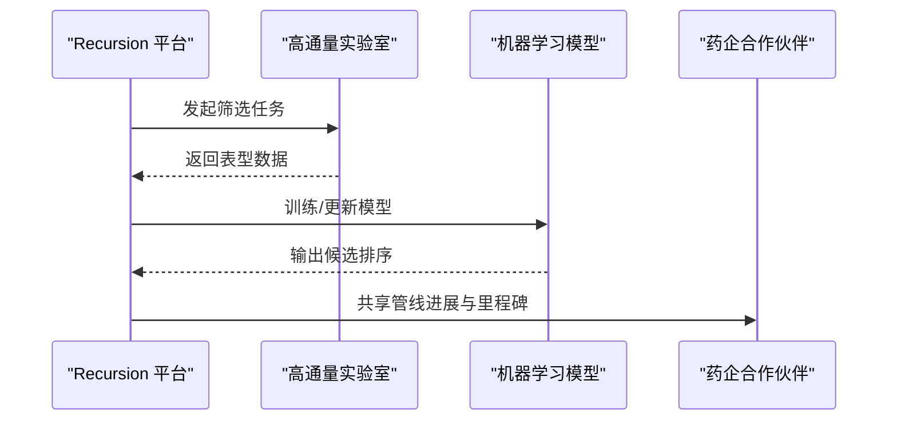
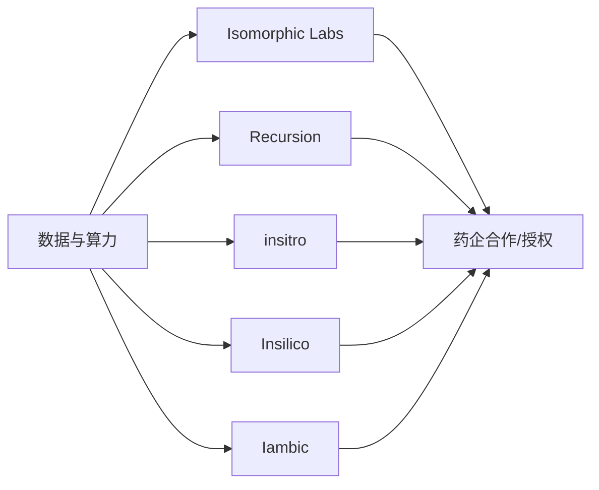

# AI 制药 / 生物科技

<cite>
**本文引用的文件**
- [README.md](file://README.md)
</cite>

## 目录
1. [引言](#引言)
2. [项目结构](#项目结构)
3. [核心组件](#核心组件)
4. [架构总览](#架构总览)
5. [详细组件分析](#详细组件分析)
6. [依赖关系分析](#依赖关系分析)
7. [性能与商业化考量](#性能与商业化考量)
8. [故障排查与合规要点](#故障排查与合规要点)
9. [结论](#结论)
10. [附录](#附录)

## 引言
本文件聚焦 AI 制药与生物科技赛道，系统梳理 Isomorphic Labs、Recursion Pharmaceuticals、insitro、Insilico Medicine、Iambic 等代表性公司及其在药物发现、临床试验优化、靶点识别等环节的应用价值与市场前景。内容基于仓库中的“AI 制药/生物科技”条目进行归纳与扩展说明，帮助读者快速理解该赛道的技术路径、产业生态与商业趋势。

## 项目结构
本项目为单一文档型仓库，README.md 按赛道组织初创公司清单，其中“前沿科技 > AI 制药/生物科技”小节集中呈现了目标公司的基本信息（总部、成立年份、母公司/创始人、核心产品、最新融资与亮点）。本节仅对现有内容进行结构化解读，不引入外部信息。

图表来源
- [README.md:528-554](file://README.md#L528-L554)

章节来源
- [README.md:528-554](file://README.md#L528-L554)

## 核心组件
围绕 AI 制药/生物科技，以下为公司级“组件”，每个组件包含其技术定位、关键能力与商业化进展的要点概述：

- Isomorphic Labs（Alphabet 子公司）
  - 技术定位：以 AlphaFold 为核心的蛋白质结构预测平台，驱动药物研发全流程加速
  - 关键能力：结构生物学数据化、分子设计、靶点验证、候选化合物筛选
  - 商业化：多笔数十亿美元级别合作推进管线落地

- Recursion Pharmaceuticals
  - 技术定位：AI + 高通量实验的药物发现平台
  - 关键能力：大规模表型筛选、数据闭环、机器学习模型迭代
  - 商业化：与大型药企建立联合开发与合作网络

- insitro
  - 技术定位：机器学习驱动的药物发现
  - 关键能力：疾病建模、多组学数据整合、临床前决策支持
  - 商业化：与多家大型药企开展合作

- Insilico Medicine
  - 技术定位：AI 药物发现 + 长寿研究
  - 关键能力：生成式分子设计、靶点发现、管线推进
  - 商业化：与 Eli Lilly 达成史上最大规模 AI 制药合作之一

- Iambic
  - 技术定位：AI 药物发现平台
  - 关键能力：性质预测模型（如 Illusion）、分子生成与优化
  - 商业化：面向药企与生物科技公司提供平台服务

章节来源
- [README.md:530-553](file://README.md#L530-L553)

## 架构总览
从端到端视角看，AI 制药平台通常由“数据—模型—实验—管线”构成闭环。下图展示各公司在该链条中的角色与协作方式（概念性示意，非代码映射）：

[无图表来源，因为该图为概念性流程示意]

## 详细组件分析

### Isomorphic Labs（Alphabet 子公司）
- 技术路径：以 AlphaFold 为代表的结构预测为核心，结合生成式设计与自动化实验，缩短从靶点到候选分子的周期
- 应用价值：提升靶点可药性评估、分子生成质量与合成可行性；降低早期失败率
- 市场表现：获得头部药企深度合作，推动管线进入中后期

[无图表来源，因为该图为通用算法流程图示]

章节来源
- [README.md:530-534](file://README.md#L530-L534)

### Recursion Pharmaceuticals
- 技术路径：将高通量实验产生的海量表型数据与机器学习模型结合，形成“数据—模型—实验”的持续迭代闭环
- 应用价值：加速候选分子筛选、提高命中率和成功率；支持多疾病领域并行探索
- 市场表现：与 NVIDIA 等基础设施厂商及大型药企建立合作生态

[无图表来源，因为该图为概念性交互示意]

章节来源
- [README.md:536-539](file://README.md#L536-L539)

### insitro
- 技术路径：以机器学习为核心，构建疾病相关的数据模型，辅助靶点选择与候选分子优化
- 应用价值：在多组学与临床前数据基础上提升决策准确性，减少试错成本
- 市场表现：与多家大型药企开展合作，覆盖多种适应症

章节来源
- [README.md:541-544](file://README.md#L541-L544)

### Insilico Medicine
- 技术路径：AI 药物发现与长寿研究双轮驱动，强调生成式模型与端到端管线推进
- 应用价值：显著缩短从靶点到候选分子的时间，提升管线效率
- 市场表现：与 Eli Lilly 达成高额合作，体现行业认可度

章节来源
- [README.md:546-549](file://README.md#L546-L549)

### Iambic
- 技术路径：以 Illusion 等模型为代表，专注于药物性质预测与分子生成优化
- 应用价值：提高候选分子的质量与可开发性，降低后续失败风险
- 市场表现：面向药企与生物技术公司提供平台能力

章节来源
- [README.md:551-553](file://README.md#L551-L553)

## 依赖关系分析
- 内部依赖：各公司均依赖高质量数据（组学、表型、文献）、算力与模型能力，以及实验验证闭环
- 外部依赖：与大型药企的合作、基础设施提供商（GPU/云平台）、监管与合规环境
- 协同模式：平台型公司与传统药企形成互补——前者提供技术与速度，后者提供管线资源与商业化能力

[无图表来源，因为该图为概念性依赖示意]

章节来源
- [README.md:530-553](file://README.md#L530-L553)

## 性能与商业化考量
- 性能维度：模型精度、数据质量、实验通量与迭代速度共同决定整体效率
- 商业化维度：里程碑付款、授权收入、联合开发协议（Co-development）与自有管线推进
- 风险控制：早期失败率高，需通过数据闭环与多模态证据降低不确定性

[本节为通用指导，不直接分析具体文件]

## 故障排查与合规要点
- 数据治理：确保数据来源合法、标注一致、隐私保护到位
- 模型可解释性：在监管与药企合作中，需具备一定程度的可解释性与验证报告
- 实验可重复性：标准化流程与记录，保证跨团队与跨机构的可复现性
- 合规与伦理：遵循各国药品监管要求与生物安全规范

[本节为通用指导，不直接分析具体文件]

## 结论
AI 制药/生物科技正在重塑药物研发范式：以数据与模型为核心，结合高通量实验与工程化平台，显著缩短研发周期、降低成本并提高成功率。Isomorphic Labs、Recursion、insitro、Insilico Medicine、Iambic 等公司分别在结构预测、数据闭环、机器学习建模、生成式设计等方面形成差异化优势，并通过与大型药企的深度合作实现商业化落地。未来，随着数据规模扩大、模型能力提升与监管框架完善，该赛道将持续吸引资本与技术投入，成为生物医药创新的重要引擎。

[本节为总结性内容，不直接分析具体文件]

## 附录
- 参考来源：本文件所有公司信息与要点均来自 README.md 的“AI 制药/生物科技”小节
- 进一步阅读：可结合仓库其他赛道的公司清单，了解 AI 制药上下游生态（如 AI 基础设施、数据标注、云服务等）

[本节为补充信息，不直接分析具体文件]