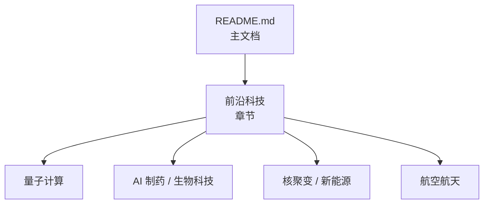
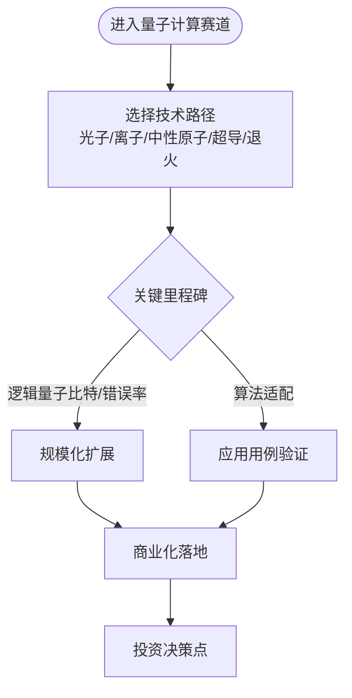
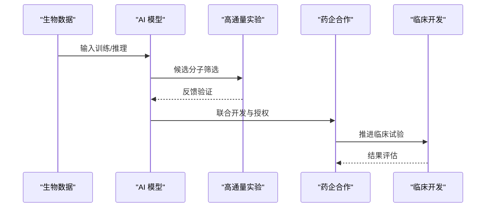
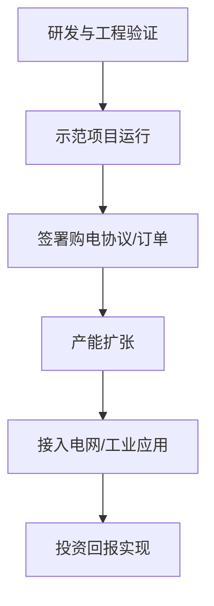
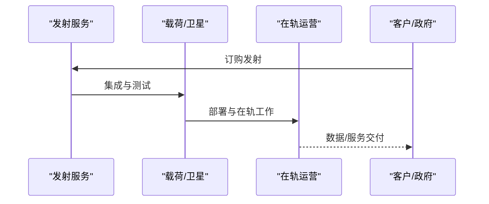
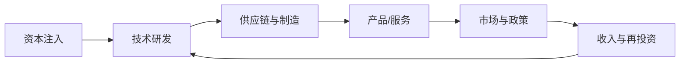

# 前沿科技

<cite>
**本文引用的文件**
- [README.md](file://README.md)
</cite>

## 目录
1. [引言](#引言)
2. [项目结构](#项目结构)
3. [核心组件](#核心组件)
4. [架构总览](#架构总览)
5. [详细组件分析](#详细组件分析)
6. [依赖关系分析](#依赖关系分析)
7. [性能与商业化考量](#性能与商业化考量)
8. [故障排查指南](#故障排查指南)
9. [结论](#结论)
10. [附录](#附录)

## 引言
本文件基于仓库中的精选初创公司清单，聚焦“前沿科技”四大赛道：量子计算、AI 制药/生物科技、核聚变/新能源、航空航天。内容涵盖各技术成熟度、商业化前景与投资机会，并以可视化图表呈现关键流程与关系，帮助读者快速把握行业格局与趋势。

## 项目结构
该仓库以单文件 README 为核心，按赛道组织前沿科技公司条目，包含公司名称、产品、融资与亮点等结构化信息，便于检索与对比。

**图示来源**
- [README.md:488-613](file://README.md#L488-L613)

**章节来源**
- [README.md:488-613](file://README.md#L488-L613)

## 核心组件
本节对四个前沿赛道的代表性公司进行要点梳理，并给出成熟度与商业化判断依据（来自文档中的里程碑、合作与融资信息）。

- 量子计算
  - PsiQuantum：光子路线，百万级量子比特目标；大额私募融资，制造合作推进。
  - Quantinuum：离子阱逻辑量子比特领先，多轮大额融资。
  - IonQ：已上市，产品线覆盖中端到高性能系统。
  - QuEra Computing：中性原子路线，估值快速攀升。
  - Atom Computing：中性原子铷体系，实现千比特级里程碑。
  - Rigetti Computing：超导全栈上市公司。
  - D-Wave Systems：量子退火商业化较早，专注优化问题。

- AI 制药 / 生物科技
  - Isomorphic Labs：AlphaFold 驱动平台，与头部药企达成数十亿美元合作。
  - Recursion Pharmaceuticals：AI+高通量实验，与 NVIDIA/Roche 等合作。
  - insitro：机器学习驱动药物发现，多家大型药企合作。
  - Insilico Medicine：AI 药物发现与长寿研究，创纪录的巨额合作。
  - Iambic：AI 药物发现平台，模型在性质预测上表现领先。

- 核聚变 / 新能源
  - Commonwealth Fusion Systems：高温超导托卡马克 SPARC，累计融资领先，演示目标明确。
  - Helion Energy：脉冲磁惯性聚变，PPA 与商用发电时间表。
  - TAE Technologies：FRC 聚变路线，与 Google 合作，设定商用目标。
  - Form Energy：长时储能（铁-空气电池），电力公司签约推进。
  - Boston Metal：绿色钢铁电解技术，模块化方案助力重工业脱碳。

- 航空航天
  - Relativity Space：3D 打印火箭，可回收型号推进。
  - Rocket Lab：小卫星发射与中型火箭 Neutron 布局。
  - Planet Labs：卫星星座与地球观测数据服务。
  - Firefly Aerospace：登月任务成功，载荷与着陆器能力验证。
  - Axiom Space：商业空间站模块与国际合作。
  - Sierra Space：太空飞机与充气舱段，多项 NASA 合同。

**章节来源**
- [README.md:492-522](file://README.md#L492-L522)
- [README.md:527-551](file://README.md#L527-L551)
- [README.md:556-580](file://README.md#L556-L580)
- [README.md:587-612](file://README.md#L587-L612)

## 架构总览
以下图展示“前沿科技”四大子赛道与公司间的关系，以及它们共同的技术/资本驱动因素。

```mermaid
graph TB
subgraph "量子计算"
Q1["PsiQuantum"]
Q2["Quantinuum"]
Q3["IonQ"]
Q4["QuEra Computing"]
Q5["Atom Computing"]
Q6["Rigetti Computing"]
Q7["D-Wave Systems"]
end
subgraph "AI 制药 / 生物科技"
P1["Isomorphic Labs"]
P2["Recursion Pharmaceuticals"]
P3["insitro"]
P4["Insilico Medicine"]
P5["Iambic"]
end
subgraph "核聚变 / 新能源"
E1["Commonwealth Fusion Systems"]
E2["Helion Energy"]
E3["TAE Technologies"]
E4["Form Energy"]
E5["Boston Metal"]
end
subgraph "航空航天"
S1["Relativity Space"]
S2["Rocket Lab"]
S3["Planet Labs"]
S4["Firefly Aerospace"]
S5["Axiom Space"]
S6["Sierra Space"]
end
Capital["资本与政策驱动"]
Tech["工程与科学突破"]
Market["商业化落地"]
Capital --> Q1
Capital --> P1
Capital --> E1
Capital --> S1
Tech --> Q2
Tech --> P2
Tech --> E2
Tech --> S2
Market --> Q3
Market --> P3
Market --> E3
Market --> S3
```

**图示来源**
- [README.md:492-612](file://README.md#L492-L612)

## 详细组件分析

### 量子计算：技术路径与商业化节奏
- 技术路径
  - 光子学（PsiQuantum）：强调大规模集成与制造合作，目标百万量子比特。
  - 离子阱（Quantinuum、IonQ）：高保真度与纠错进展，逻辑量子比特路线推进。
  - 中性原子（QuEra、Atom Computing）：可扩展性与操控精度提升，千比特级里程碑。
  - 超导（Rigetti）：全栈生态与云服务结合。
  - 退火（D-Wave）：面向组合优化问题的早期商业化。

- 商业化与投资机会
  - 资金密集、研发周期长，但头部公司通过大额融资与产业合作加速工程化。
  - 关注逻辑量子比特数量、错误率与算法适配度指标。
  - 投资窗口：具备清晰工程路线图、强制造/供应链能力的团队。

**图示来源**
- [README.md:492-522](file://README.md#L492-L522)

**章节来源**
- [README.md:492-522](file://README.md#L492-L522)

### AI 制药 / 生物科技：从数据到管线
- 技术路径
  - AlphaFold 驱动的结构预测（Isomorphic Labs）。
  - AI+高通量实验闭环（Recursion、insitro）。
  - 生成式模型与性质预测（Insilico、Iambic）。

- 商业化与投资机会
  - 与大型药企的战略合作是重要里程碑（数十亿美元级别）。
  - 关注管线推进速度、临床转化效率与数据资产质量。
  - 投资窗口：具备端到端平台能力与真实世界数据的团队。

**图示来源**
- [README.md:527-551](file://README.md#L527-L551)

**章节来源**
- [README.md:527-551](file://README.md#L527-L551)

### 核聚变 / 新能源：从示范到电网
- 技术路径
  - 聚变：高温超导托卡马克（CFS）、脉冲磁惯性（Helion）、FRC（TAE）。
  - 储能：长时储能（Form Energy）。
  - 工业脱碳：绿色钢铁电解（Boston Metal）。

- 商业化与投资机会
  - 聚变公司设定明确的演示/商用时间表，并与能源企业签订 PPA。
  - 储能与工业脱碳更贴近当前电网与制造业需求，订单可见性更强。
  - 投资窗口：工程验证进度、供应链与合规许可、客户签约情况。

**图示来源**
- [README.md:556-580](file://README.md#L556-L580)

**章节来源**
- [README.md:556-580](file://README.md#L556-L580)

### 航空航天：从发射到在轨服务
- 技术路径
  - 可回收火箭与 3D 打印（Relativity Space）。
  - 小卫星发射与中型火箭（Rocket Lab）。
  - 卫星星座与数据服务（Planet Labs）。
  - 登月载荷与着陆器（Firefly Aerospace）。
  - 商业空间站与模块（Axiom Space、Sierra Space）。

- 商业化与投资机会
  - 发射频次、可靠性与成本是关键竞争维度。
  - 在轨服务、卫星数据订阅与政府合同提供稳定现金流。
  - 投资窗口：交付记录、合同储备与供应链韧性。

**图示来源**
- [README.md:587-612](file://README.md#L587-L612)

**章节来源**
- [README.md:587-612](file://README.md#L587-L612)

## 依赖关系分析
- 资本依赖：前沿科技普遍需要长期、大额的资本投入，头部公司通过多轮融资与战略投资维持研发与工程化。
- 技术与生态依赖：量子计算依赖材料、控制电子学与算法生态；AI 制药依赖数据与算力；聚变/新能源依赖工程材料与供应链；航空航天依赖精密制造与认证体系。
- 市场与政策依赖：政府合同、PPA、监管许可与标准制定对商业化进程影响显著。

[此图为概念性示意，不直接映射具体源码文件]

## 性能与商业化考量
- 量子计算：关注逻辑量子比特数、错误率下降曲线与算法适配案例；商业化优先场景为特定优化与模拟问题。
- AI 制药：关注管线推进速度、合作金额与临床阶段；数据质量与可重复性是核心竞争力。
- 核聚变/新能源：关注示范项目运行时间、PPA 规模与单位成本；储能与工业脱碳更易短期变现。
- 航空航天：关注发射成功率、单位发射成本与在轨服务收入；政府合同与商业卫星订单是重要指标。

[本节为通用指导，不直接分析具体文件]

## 故障排查指南
- 数据更新滞后：建议定期核对权威来源（如 Forbes AI 50、CB Insights、Crunchbase、PitchBook 等）。
- 信息不可验证：仅收录有公开报道或官方信息的公司，避免“PPT 公司”。
- 贡献规范：遵循贡献指南格式，确保条目完整一致。

**章节来源**
- [README.md:867-916](file://README.md#L867-L916)

## 结论
前沿科技四大赛道均处于高速演进期：量子计算在工程化与算法适配上取得阶段性突破；AI 制药借助数据与模型加速管线推进；核聚变与新能源在示范与订单层面逐步兑现；航空航天在发射频率与在轨服务上持续放量。投资应聚焦具备清晰里程碑、强工程能力与明确商业化路径的团队。

[本节为总结性内容，不直接分析具体文件]

## 附录
- 数据来源与参考：Forbes AI 50、CB Insights、Crunchbase、PitchBook、The Information、TechCrunch、Y Combinator、Sacra、Contrary Research、AI Funding Tracker、New Market Pitch。
- 贡献方式：遵循仓库贡献指南，提交 Pull Request 完善条目。

**章节来源**
- [README.md:867-916](file://README.md#L867-L916)