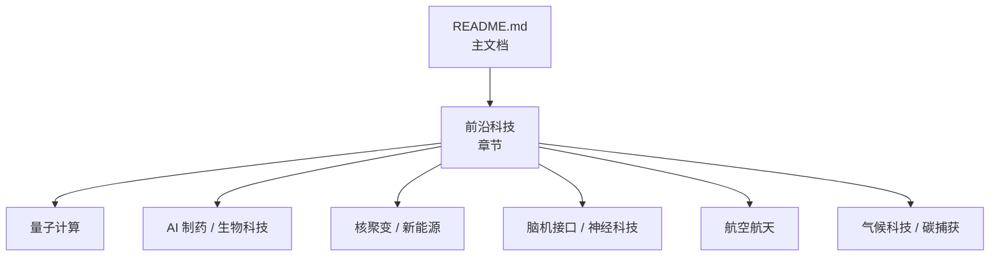
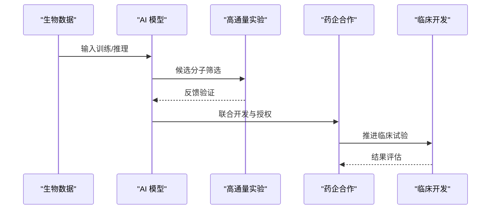
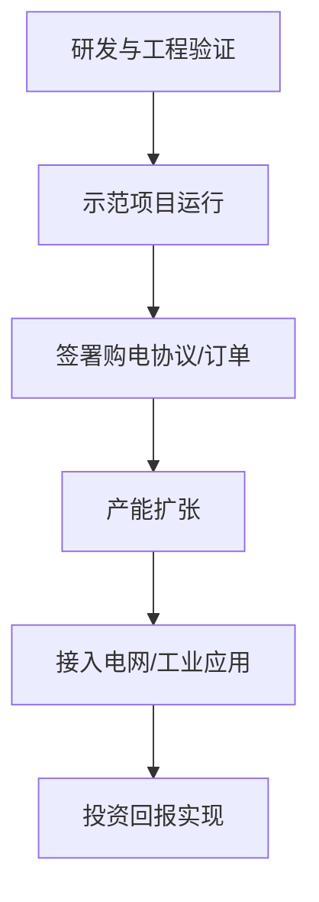
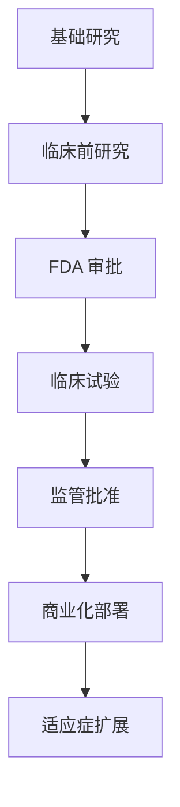
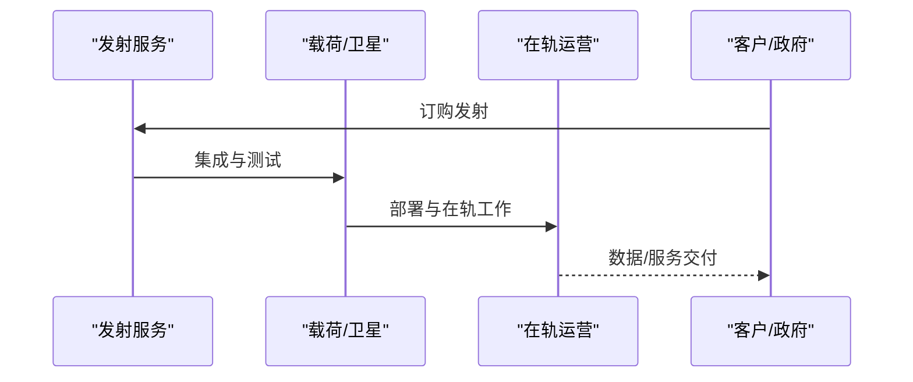
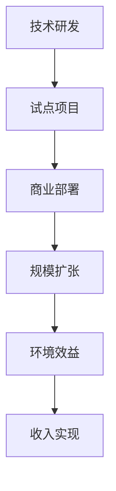
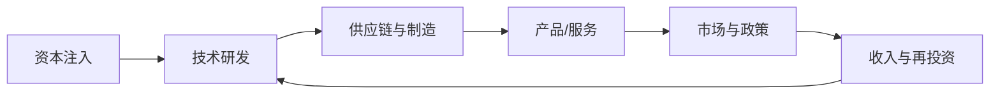

# 前沿科技

<cite>
**本文引用的文件**
- [README.md](file://README.md)
</cite>

## 更新摘要
**所做更改**
- 增强了量子计算、AI 制药/生物科技、核聚变/新能源、脑机接口/神经科技、航空航天和气候科技/碳捕获章节
- 添加了详细的公司覆盖范围和最新融资信息
- 更新了技术成熟度和商业化前景分析
- 增加了脑机接口和气候科技两个新赛道

## 目录
1. [引言](#引言)
2. [项目结构](#项目结构)
3. [核心组件](#核心组件)
4. [架构总览](#架构总览)
5. [详细组件分析](#详细组件分析)
6. [依赖关系分析](#依赖关系分析)
7. [性能与商业化考量](#性能与商业化考量)
8. [故障排查指南](#故障排查指南)
9. [结论](#结论)
10. [附录](#附录)

## 引言
本文件基于仓库中的精选初创公司清单，聚焦"前沿科技"六大赛道：量子计算、AI 制药/生物科技、核聚变/新能源、脑机接口/神经科技、航空航天、气候科技/碳捕获。内容涵盖各技术成熟度、商业化前景与投资机会，并以可视化图表呈现关键流程与关系，帮助读者快速把握行业格局与趋势。

## 项目结构
该仓库以单文件 README 为核心，按赛道组织前沿科技公司条目，包含公司名称、产品、融资与亮点等结构化信息，便于检索与对比。

**图示来源**
- [README.md:1101-1340](file://README.md#L1101-L1340)

**章节来源**
- [README.md:1101-1340](file://README.md#L1101-L1340)

## 核心组件
本节对六个前沿赛道的代表性公司进行要点梳理，并给出成熟度与商业化判断依据（来自文档中的里程碑、合作与融资信息）。

- **量子计算**
  - PsiQuantum：光子路线，百万级量子比特目标；$7B 估值，大额私募融资，制造合作推进。
  - Quantinuum：离子阱逻辑量子比特领先，累计融资超 $1.68B。
  - IonQ：已上市，产品线覆盖中端到高性能系统。
  - QuEra Computing：中性原子路线，估值快速攀升。
  - Atom Computing：中性原子铷体系，实现千比特级里程碑。
  - Rigetti Computing：超导全栈上市公司。
  - D-Wave Systems：量子退火商业化较早，专注优化问题。

- **AI 制药 / 生物科技**
  - Isomorphic Labs：AlphaFold 驱动平台，与头部药企达成数十亿美元合作。
  - Recursion Pharmaceuticals：AI+高通量实验，与 NVIDIA/Roche 等合作。
  - insitro：机器学习驱动药物发现，多家大型药企合作。
  - Insilico Medicine：AI 药物发现与长寿研究，创纪录的巨额合作。
  - Iambic：AI 药物发现平台，模型在性质预测上表现领先。
  - Genesis Therapeutics：AI 小分子药物设计平台。
  - Generate Biomedicines：生成式生物学药物设计平台。

- **核聚变 / 新能源**
  - Commonwealth Fusion Systems：高温超导托卡马克 SPARC，累计融资超 $3B，演示目标明确。
  - Helion Energy：脉冲磁惯性聚变，PPA 与商用发电时间表。
  - TAE Technologies：FRC 聚变路线，与 Google 合作，设定商用目标。

- **脑机接口 / 神经科技**
  - Neuralink：植入式脑机接口，完成多例人体植入，患者能意念控制设备。
  - Synchron：血管内脑机接口，FDA 首个 BCI IDE 批准。
  - Precision Neuroscience：可逆植入设计的皮质接口。
  - Paradromics：直连数据接口，专注严重运动障碍患者。
  - Blackrock Neurotech：BCI 行业元老，植入历史最长。
  - Science Corp：光遗传学视网膜接口。

- **航空航天**
  - Relativity Space：3D 打印火箭，可回收型号推进。
  - Rocket Lab：小卫星发射与中型火箭 Neutron 布局。
  - Planet Labs：卫星星座与地球观测数据服务。
  - Firefly Aerospace：登月任务成功，载荷与着陆器能力验证。
  - Axiom Space：商业空间站模块与国际合作。
  - Sierra Space：太空飞机与充气舱段，多项 NASA 合同。

- **气候科技 / 碳捕获**
  - Climeworks：直接空气碳捕获设施，全球最大 DAC 运营商。
  - Carbon Engineering：DAC + 空气制燃料，被 Occidental 收购。
  - Heirloom：石灰石矿化碳捕获，最快 DAC 路线之一。
  - Form Energy：长时储能（铁-空气电池），电力公司签约推进。
  - KoBold Metals：AI 驱动的关键矿产勘探。
  - Boston Metal：绿色钢铁电解技术，模块化方案助力重工业脱碳。
  - Twelve：CO₂ 转化为航空燃料/聚合物。

**章节来源**
- [README.md:1103-1135](file://README.md#L1103-L1135)
- [README.md:1138-1208](file://README.md#L1138-L1208)
- [README.md:1211-1228](file://README.md#L1211-L1228)
- [README.md:1263-1297](file://README.md#L1263-L1297)
- [README.md:1231-1260](file://README.md#L1231-L1260)
- [README.md:1300-1339](file://README.md#L1300-L1339)

## 架构总览
以下图展示"前沿科技"六大子赛道与公司间的关系，以及它们共同的技术/资本驱动因素。

```mermaid
graph TB
subgraph "量子计算"
Q1["PsiQuantum"]
Q2["Quantinuum"]
Q3["IonQ"]
Q4["QuEra Computing"]
Q5["Atom Computing"]
Q6["Rigetti Computing"]
Q7["D-Wave Systems"]
end
subgraph "AI 制药 / 生物科技"
P1["Isomorphic Labs"]
P2["Recursion Pharmaceuticals"]
P3["insitro"]
P4["Insilico Medicine"]
P5["Iambic"]
P6["Genesis Therapeutics"]
P7["Generate Biomedicines"]
end
subgraph "核聚变 / 新能源"
E1["Commonwealth Fusion Systems"]
E2["Helion Energy"]
E3["TAE Technologies"]
end
subgraph "脑机接口 / 神经科技"
N1["Neuralink"]
N2["Synchron"]
N3["Precision Neuroscience"]
N4["Paradromics"]
N5["Blackrock Neurotech"]
N6["Science Corp"]
end
subgraph "航空航天"
S1["Relativity Space"]
S2["Rocket Lab"]
S3["Planet Labs"]
S4["Firefly Aerospace"]
S5["Axiom Space"]
S6["Sierra Space"]
end
subgraph "气候科技 / 碳捕获"
C1["Climeworks"]
C2["Carbon Engineering"]
C3["Heirloom"]
C4["Form Energy"]
C5["KoBold Metals"]
C6["Boston Metal"]
C7["Twelve"]
end
Capital["资本与政策驱动"]
Tech["工程与科学突破"]
Market["商业化落地"]
Capital --> Q1
Capital --> P1
Capital --> E1
Capital --> N1
Capital --> S1
Capital --> C1
Tech --> Q2
Tech --> P2
Tech --> E2
Tech --> N2
Tech --> S2
Tech --> C2
Market --> Q3
Market --> P3
Market --> E3
Market --> N3
Market --> S3
Market --> C3
```

**图示来源**
- [README.md:1103-1339](file://README.md#L1103-L1339)

## 详细组件分析

### 量子计算：技术路径与商业化节奏
- **技术路径**
  - 光子学（PsiQuantum）：强调大规模集成与制造合作，目标百万量子比特。
  - 离子阱（Quantinuum、IonQ）：高保真度与纠错进展，逻辑量子比特路线推进。
  - 中性原子（QuEra、Atom Computing）：可扩展性与操控精度提升，千比特级里程碑。
  - 超导（Rigetti）：全栈生态与云服务结合。
  - 退火（D-Wave）：面向组合优化问题的早期商业化。

- **商业化与投资机会**
  - 资金密集、研发周期长，但头部公司通过大额融资与产业合作加速工程化。
  - 关注逻辑量子比特数量、错误率与算法适配度指标。
  - 投资窗口：具备清晰工程路线图、强制造/供应链能力的团队。

**图示来源**
- [README.md:1103-1135](file://README.md#L1103-L1135)

**章节来源**
- [README.md:1103-1135](file://README.md#L1103-L1135)

### AI 制药 / 生物科技：从数据到管线
- **技术路径**
  - AlphaFold 驱动的结构预测（Isomorphic Labs）。
  - AI+高通量实验闭环（Recursion、insitro）。
  - 生成式模型与性质预测（Insilico、Iambic）。
  - AI 小分子药物设计（Genesis Therapeutics）。
  - 生成式生物学药物设计（Generate Biomedicines）。

- **商业化与投资机会**
  - 与大型药企的战略合作是重要里程碑（数十亿美元级别）。
  - 关注管线推进速度、临床转化效率与数据资产质量。
  - 投资窗口：具备端到端平台能力与真实世界数据的团队。

**图示来源**
- [README.md:1138-1208](file://README.md#L1138-L1208)

**章节来源**
- [README.md:1138-1208](file://README.md#L1138-L1208)

### 核聚变 / 新能源：从示范到电网
- **技术路径**
  - 聚变：高温超导托卡马克（CFS）、脉冲磁惯性（Helion）、FRC（TAE）。

- **商业化与投资机会**
  - 聚变公司设定明确的演示/商用时间表，并与能源企业签订 PPA。
  - 投资窗口：工程验证进度、供应链与合规许可、客户签约情况。

**图示来源**
- [README.md:1211-1228](file://README.md#L1211-L1228)

**章节来源**
- [README.md:1211-1228](file://README.md#L1211-L1228)

### 脑机接口 / 神经科技：从实验室到临床应用
- **技术路径**
  - 植入式脑机接口（Neuralink）：高带宽神经信号采集。
  - 血管内脑机接口（Synchron）：微创植入，FDA 首个 BCI IDE 批准。
  - 可逆植入接口（Precision Neuroscience）：无需永久留在脑中。
  - 直连数据接口（Paradromics）：专注严重运动障碍患者。
  - 传统电极阵列（Blackrock Neurotech）：行业元老，长期临床数据。
  - 光遗传学视网膜接口（Science Corp）：非侵入式视觉恢复。

- **商业化与投资机会**
  - 监管审批是关键里程碑，FDA 突破性设备认定加速商业化。
  - 关注临床试验进展、患者招募情况和安全性数据。
  - 投资窗口：具备医疗器械注册经验、临床执行能力的团队。

**图示来源**
- [README.md:1263-1297](file://README.md#L1263-L1297)

**章节来源**
- [README.md:1263-1297](file://README.md#L1263-L1297)

### 航空航天：从发射到在轨服务
- **技术路径**
  - 可回收火箭与 3D 打印（Relativity Space）。
  - 小卫星发射与中型火箭（Rocket Lab）。
  - 卫星星座与数据服务（Planet Labs）。
  - 登月载荷与着陆器（Firefly Aerospace）。
  - 商业空间站与模块（Axiom Space、Sierra Space）。

- **商业化与投资机会**
  - 发射频次、可靠性与成本是关键竞争维度。
  - 在轨服务、卫星数据订阅与政府合同提供稳定现金流。
  - 投资窗口：交付记录、合同储备与供应链韧性。

**图示来源**
- [README.md:1231-1260](file://README.md#L1231-L1260)

**章节来源**
- [README.md:1231-1260](file://README.md#L1231-L1260)

### 气候科技 / 碳捕获：从技术验证到规模部署
- **技术路径**
  - 直接空气捕获（Climeworks、Carbon Engineering、Heirloom）。
  - 长时储能（Form Energy）。
  - AI 驱动矿产勘探（KoBold Metals）。
  - 绿色工业脱碳（Boston Metal、Twelve）。

- **商业化与投资机会**
  - 碳捕获公司获得政府合同与企业采购承诺。
  - 储能与工业脱碳更贴近当前电网与制造业需求。
  - 投资窗口：工程验证进度、供应链与合规许可、客户签约情况。

**图示来源**
- [README.md:1300-1339](file://README.md#L1300-L1339)

**章节来源**
- [README.md:1300-1339](file://README.md#L1300-L1339)

## 依赖关系分析
- **资本依赖**：前沿科技普遍需要长期、大额的资本投入，头部公司通过多轮融资与战略投资维持研发与工程化。
- **技术与生态依赖**：量子计算依赖材料、控制电子学与算法生态；AI 制药依赖数据与算力；脑机接口依赖医疗器械监管；聚变/新能源依赖工程材料与供应链；航空航天依赖精密制造与认证体系；气候科技依赖政策支持与市场机制。
- **市场与政策依赖**：政府合同、PPA、监管许可与标准制定对商业化进程影响显著。

[此图为概念性示意，不直接映射具体源码文件]

## 性能与商业化考量
- **量子计算**：关注逻辑量子比特数、错误率下降曲线与算法适配案例；商业化优先场景为特定优化与模拟问题。
- **AI 制药**：关注管线推进速度、合作金额与临床阶段；数据质量与可重复性是核心竞争力。
- **核聚变/新能源**：关注示范项目运行时间、PPA 规模与单位成本；聚变技术更具颠覆性但风险更高。
- **脑机接口**：关注临床试验进展、监管审批进度与患者安全性数据；医疗监管壁垒极高。
- **航空航天**：关注发射成功率、单位发射成本与在轨服务收入；政府合同与商业卫星订单是重要指标。
- **气候科技**：关注碳捕获成本下降曲线、储能技术经济性；政策支持力度决定商业化速度。

[本节为通用指导，不直接分析具体文件]

## 故障排查指南
- **数据更新滞后**：建议定期核对权威来源（如 Forbes AI 50、CB Insights、Crunchbase、PitchBook 等）。
- **信息不可验证**：仅收录有公开报道或官方信息的公司，避免"PPT 公司"。
- **贡献规范**：遵循贡献指南格式，确保条目完整一致。

**章节来源**
- [README.md:2903-2933](file://README.md#L2903-L2933)

## 结论
前沿科技六大赛道均处于高速演进期：量子计算在工程化与算法适配上取得阶段性突破；AI 制药借助数据与模型加速管线推进；核聚变与新能源在示范与订单层面逐步兑现；脑机接口从实验室走向临床应用；航空航天在发射频率与在轨服务上持续放量；气候科技在碳捕获与储能领域迎来商业化拐点。投资应聚焦具备清晰里程碑、强工程能力与明确商业化路径的团队。

[本节为总结性内容，不直接分析具体文件]

## 附录
- **数据来源与参考**：Forbes AI 50、CB Insights、Crunchbase、PitchBook、The Information、TechCrunch、Y Combinator、Sacra、Contrary Research、AI Funding Tracker、New Market Pitch。
- **贡献方式**：遵循仓库贡献指南，提交 Pull Request 完善条目。

**章节来源**
- [README.md:2853-2872](file://README.md#L2853-L2872)
- [README.md:2903-2933](file://README.md#L2903-L2933)