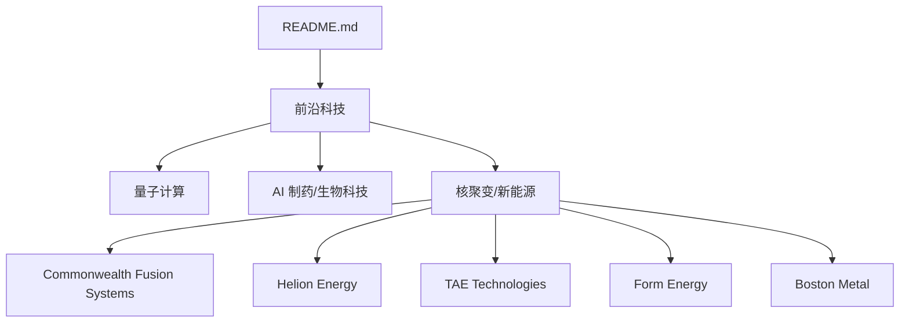
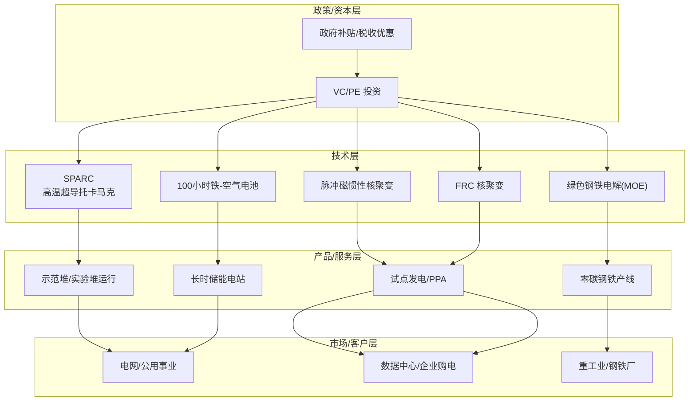
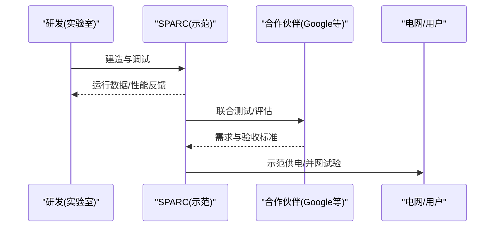
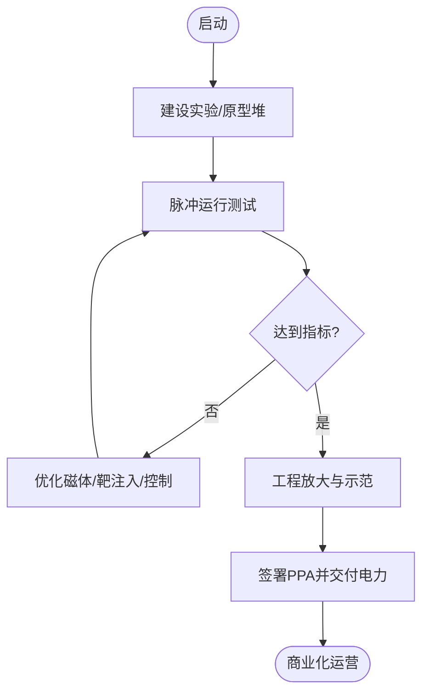
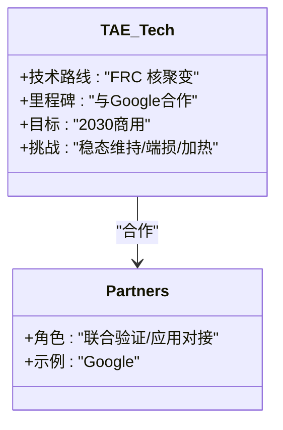
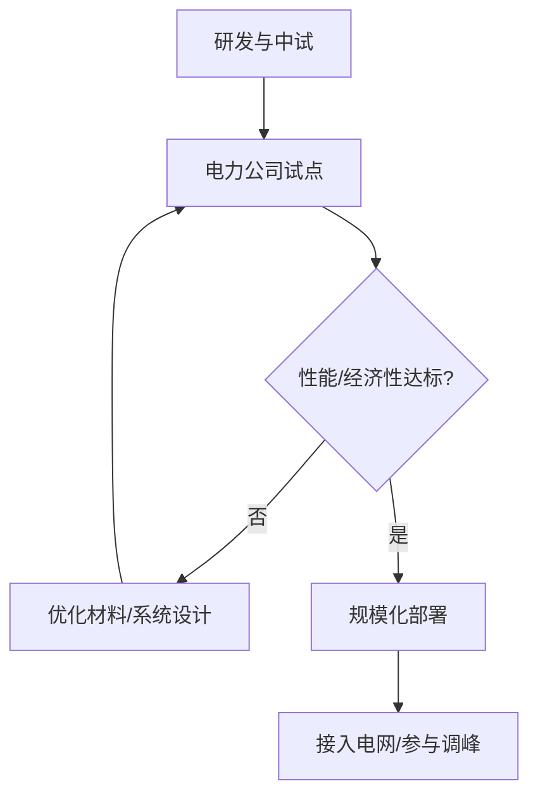
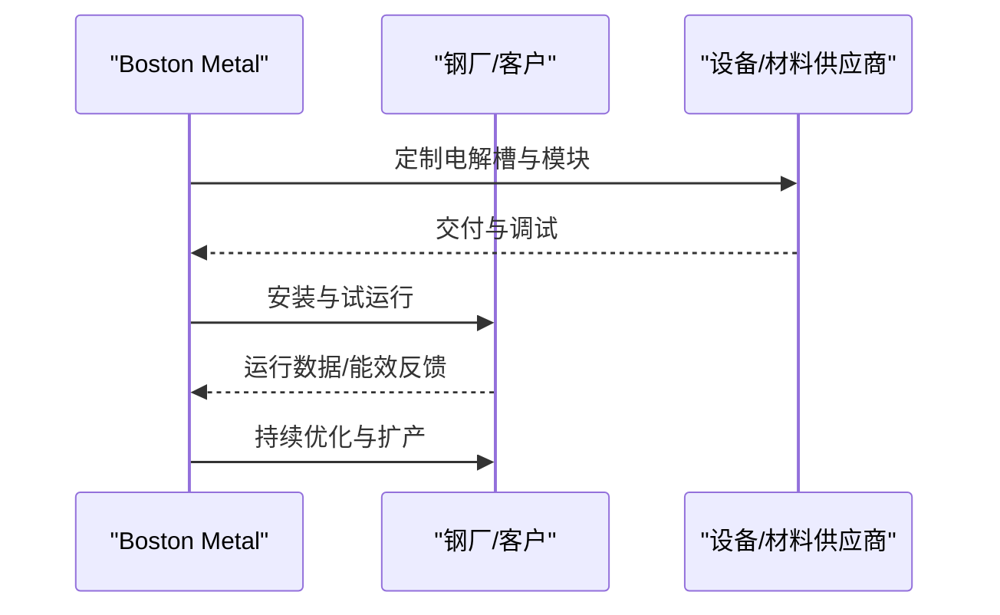
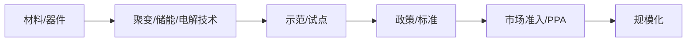

# 核聚变 / 新能源

<cite>
**本文引用的文件**
- [README.md](file://README.md)
</cite>

## 目录
1. [简介](#简介)
2. [项目结构](#项目结构)
3. [核心组件](#核心组件)
4. [架构总览](#架构总览)
5. [详细组件分析](#详细组件分析)
6. [依赖关系分析](#依赖关系分析)
7. [性能与商业化考量](#性能与商业化考量)
8. [故障排查与风险清单](#故障排查与风险清单)
9. [结论](#结论)
10. [附录](#附录)

## 简介
本文件聚焦“核聚变/新能源”赛道，基于仓库中收录的初创公司条目，系统梳理 Commonwealth Fusion Systems（高温超导托卡马克 SPARC）、Helion Energy（脉冲磁惯性核聚变）、TAE Technologies（Field-Reversed Configuration 核聚变）、Form Energy（100小时铁-空气电池储能）和 Boston Metal（绿色钢铁电解技术）的技术路线、融资规模、商业化时间表、政策与市场潜力。内容旨在帮助读者快速理解各技术的成熟度、关键挑战与落地路径。

## 项目结构
仓库以单文件 README 形式组织，按赛道分类汇总前沿公司与数据。与本文相关的信息集中在“前沿科技 > 核聚变/新能源”小节，涵盖五家公司的基本信息、最新融资与亮点。

图表来源
- [README.md:557-583](file://README.md#L557-L583)

章节来源
- [README.md:557-583](file://README.md#L557-L583)

## 核心组件
本节对五家公司进行要点提炼，便于横向对比：

- Commonwealth Fusion Systems（CFS）
  - 技术路线：高温超导托卡马克 SPARC
  - 累计融资：$3B+
  - 里程碑：2025年8月 Series B2 $863M；目标2027演示
  - 合作：与 Google 合作

- Helion Energy
  - 技术路线：脉冲磁惯性核聚变
  - 累计融资：$1.5B+
  - 里程碑：2025年1月 $425M；目标2028商用发电；与 Microsoft 签 PPA

- TAE Technologies
  - 技术路线：Field-Reversed Configuration（FRC）核聚变
  - 累计融资：$1.2B+
  - 里程碑：与 Google 合作；目标2030商用

- Form Energy
  - 技术路线：100小时铁-空气电池储能
  - 累计融资：2023年 Series F $450M（估值 $2.7B）
  - 里程碑：与多家美国电力公司签约

- Boston Metal
  - 技术路线：绿色钢铁电解（模块化 MOE）
  - 累计融资：$300M+
  - 里程碑：去碳化重工业

章节来源
- [README.md:557-583](file://README.md#L557-L583)

## 架构总览
从“技术—产品—市场—政策”四个维度构建行业全景图，帮助理解各公司所处阶段与协同关系。

图表来源
- [README.md:557-583](file://README.md#L557-L583)

## 详细组件分析

### Commonwealth Fusion Systems（CFS）
- 技术要点
  - 采用高温超导磁体提升约束性能，缩短研发周期，推进紧凑型托卡马克工程化。
  - SPARC 作为关键验证平台，目标是实现净能量增益或接近的工程指标，为后续商业堆铺路。
- 商业化时间表
  - 依据公开信息，目标在2027年前完成演示验证，随后进入工程放大与示范堆阶段。
- 技术挑战
  - 高场磁体材料可靠性、等离子体控制与稳态运行、热负荷与偏滤器设计、系统集成与成本控制。
- 政策支持与市场潜力
  - 美国清洁能源政策与公私合作推动聚变示范；大型科技公司（如 Google）参与采购与合作，增强商业化确定性。
  - 若示范成功，有望在2030年代中期参与基荷电源与区域电网调峰。

图表来源
- [README.md:557-564](file://README.md#L557-L564)

章节来源
- [README.md:557-564](file://README.md#L557-L564)

### Helion Energy
- 技术要点
  - 脉冲磁惯性核聚变，通过磁场压缩燃料靶实现聚变点火，具备较高功率密度与潜在快速部署优势。
- 商业化时间表
  - 目标2028年实现商用发电；已签署与 Microsoft 的购电协议（PPA），锁定早期客户。
- 技术挑战
  - 脉冲式运行的稳定性与寿命、靶注入与压缩效率、材料抗辐照与热循环、系统集成与运维成本。
- 政策支持与市场潜力
  - 企业级 PPA 模式降低早期市场风险；数据中心与高耗能产业对稳定清洁电力的需求提供明确出口。

图表来源
- [README.md:565-570](file://README.md#L565-L570)

章节来源
- [README.md:565-570](file://README.md#L565-L570)

### TAE Technologies
- 技术要点
  - 基于 Field-Reversed Configuration（FRC）的线性/环形装置，追求高β值与紧凑结构，简化约束方案。
- 商业化时间表
  - 目标2030年实现商用；已与 Google 开展合作，推进工程验证与未来应用对接。
- 技术挑战
  - FRC 的稳态维持与湍流抑制、端部损失控制、加热与电流驱动效率、材料与部件寿命。
- 政策支持与市场潜力
  - 与头部企业合作有助于加速工程化；若达成目标，可在2030年代参与区域电网与工业供能。

图表来源
- [README.md:571-574](file://README.md#L571-L574)

章节来源
- [README.md:571-574](file://README.md#L571-L574)

### Form Energy
- 技术要点
  - 铁-空气电池实现100小时级别长时储能，适合跨日/跨周调峰与可再生能源平滑。
- 商业化时间表
  - 已完成多轮融资（含2023年 Series F $450M），并与多家美国电力公司签约，推进示范项目与规模化部署。
- 技术挑战
  - 循环寿命与衰减、电极与电解质工程、系统热管理、全生命周期成本与回收。
- 政策支持与市场潜力
  - 长时储能在高比例可再生能源电网中价值凸显；政策激励与电力市场机制完善将加速渗透。

图表来源
- [README.md:575-579](file://README.md#L575-L579)

章节来源
- [README.md:575-579](file://README.md#L575-L579)

### Boston Metal
- 技术要点
  - 采用模块化电解（MOE）工艺生产绿色钢铁，替代传统高炉-转炉流程，显著降低碳排放。
- 商业化时间表
  - 累计融资 $300M+，推进模块化产线与示范工厂，逐步向规模化量产过渡。
- 技术挑战
  - 电解槽耐久性、能耗与热集成、原料预处理与杂质控制、设备标准化与供应链配套。
- 政策支持与市场潜力
  - 重工业脱碳政策与碳定价机制利好；钢铁行业降碳压力带来强劲需求。

图表来源
- [README.md:580-583](file://README.md#L580-L583)

章节来源
- [README.md:580-583](file://README.md#L580-L583)

## 依赖关系分析
- 技术与工程依赖
  - 聚变公司依赖先进材料（高温超导磁体、抗辐照材料）、精密制造与控制算法。
  - 长时储能与绿色钢铁依赖电化学/冶金工程突破与供应链成熟。
- 市场与政策依赖
  - 购电协议（PPA）、电网接入、碳定价与补贴影响商业化节奏。
  - 与大型科技企业（如 Google、Microsoft）的合作可加速验证与早期市场获取。

图表来源
- [README.md:557-583](file://README.md#L557-L583)

章节来源
- [README.md:557-583](file://README.md#L557-L583)

## 性能与商业化考量
- 聚变（CFS/Helion/TAE）
  - 关键指标：净能量增益、稳态运行时长、可用率、单位容量成本、维护周期。
  - 商业化路径：示范→工程放大→示范堆→首批商业堆；PPA 与联合开发降低早期风险。
- 长时储能（Form Energy）
  - 关键指标：循环寿命、自放电率、系统效率、度电成本、安全与环保。
  - 商业化路径：试点→多站点示范→规模化部署；与电力市场机制结合提升收益。
- 绿色钢铁（Boston Metal）
  - 关键指标：能耗强度、碳减排量、产品品质一致性、产能爬坡速度。
  - 商业化路径：模块化产线→标杆工厂→复制推广；受碳价与绿色采购驱动。

[本节为通用指导，不直接分析具体文件]

## 故障排查与风险清单
- 聚变
  - 磁体失超、等离子体不稳定性、热负荷与偏滤器烧蚀、部件寿命不足。
  - 应对：冗余设计、在线监测、材料迭代、严格验收与可靠性验证。
- 长时储能
  - 容量衰减、热失控风险、系统效率不达预期。
  - 应对：BMS/热管理优化、失效保护、全生命周期成本核算。
- 绿色钢铁
  - 电解槽腐蚀、能耗偏高、产品杂质超标。
  - 应对：材料升级、工艺闭环、质量追溯与认证。

[本节为通用指导，不直接分析具体文件]

## 结论
- 聚变领域呈现“多路线并行、工程化加速”的趋势：CFS 聚焦高场托卡马克示范，Helion 以脉冲磁惯性路线推进 PPA 与早期交付，TAE 以 FRC 探索更简化的约束方案。三者均依赖材料与控制技术进步，以及与头部企业的合作来缩短商业化路径。
- 新能源侧，Form Energy 的长时储能与 Boston Metal 的绿色钢铁分别瞄准电网调峰与重工业脱碳两大刚需场景，具备明确的商业化抓手与政策驱动。
- 综合来看，2025–2026 年的融资与合作活动表明该赛道正从“科研验证”迈向“工程示范”，未来3–5年将是决定商业化拐点的关键窗口。

[本节为总结性内容，不直接分析具体文件]

## 附录
- 数据来源说明：本文所有事实性信息均来自仓库 README 中“核聚变/新能源”小节的公司条目，包括技术路线、融资规模、里程碑与亮点。
- 建议进一步跟踪：各公司官网、技术白皮书、示范项目进展、PPA 公告与监管审批动态。

[本节为补充说明，不直接分析具体文件]