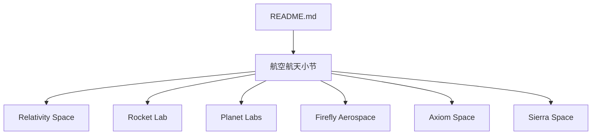
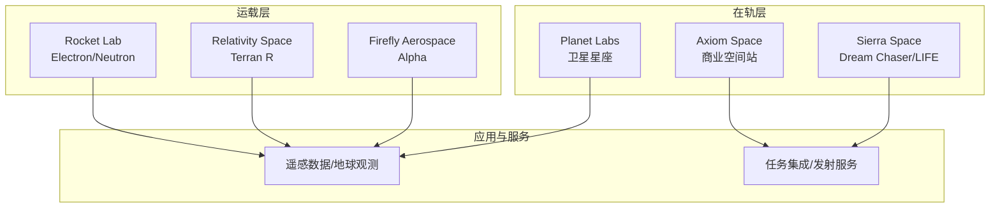
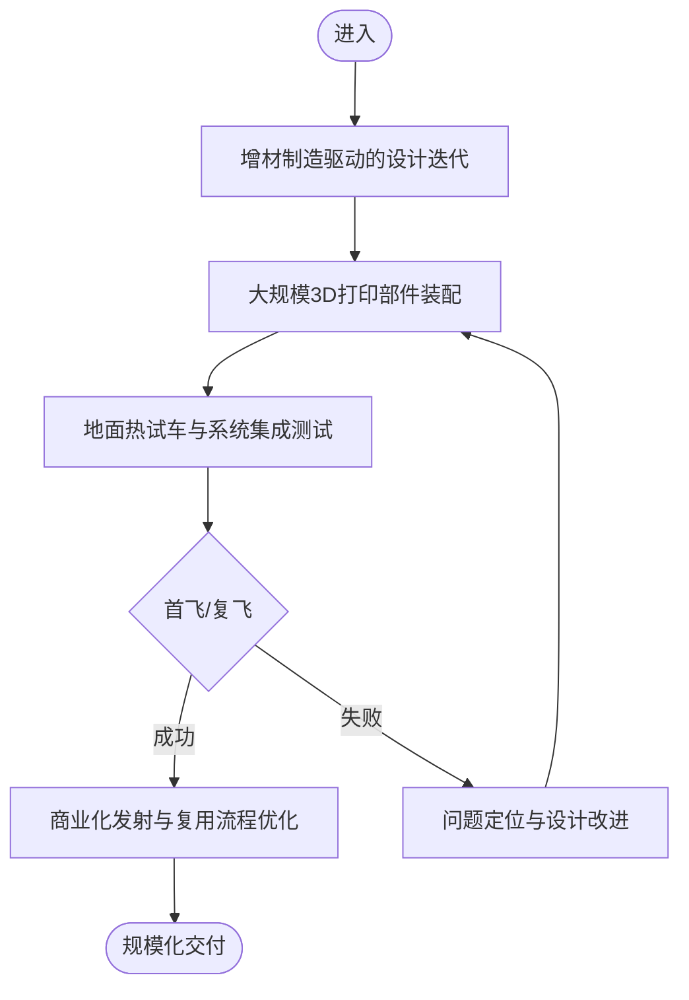
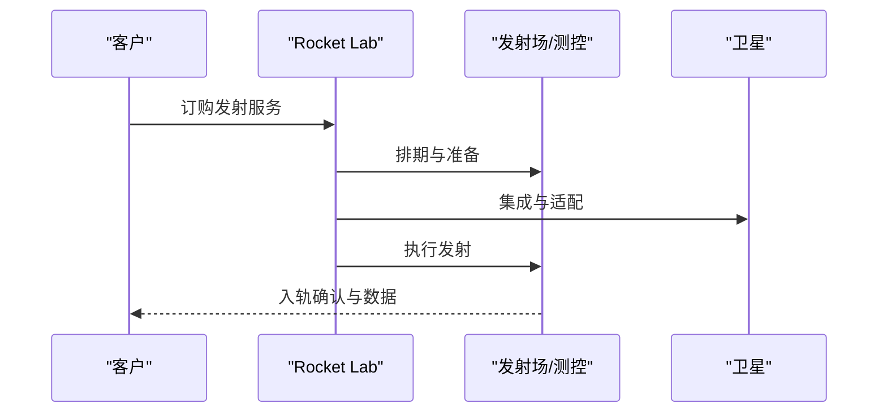
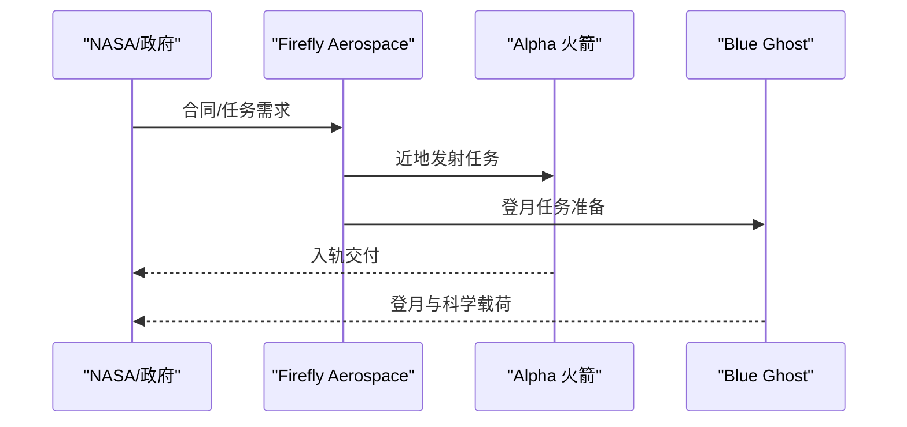
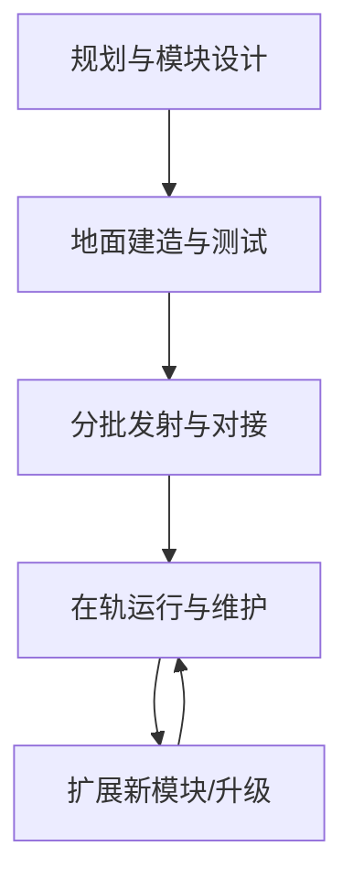
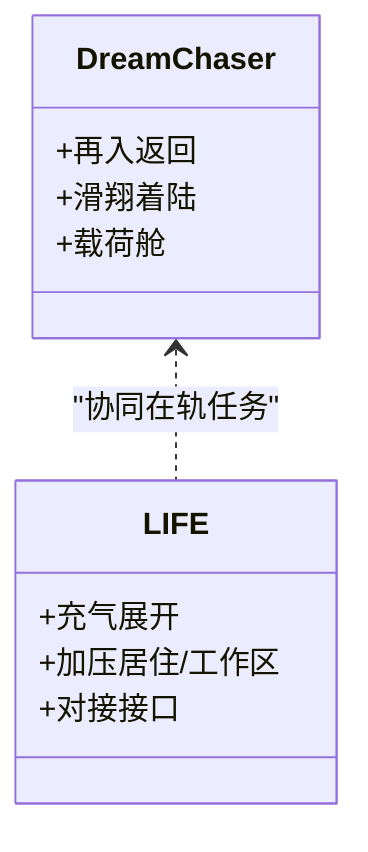
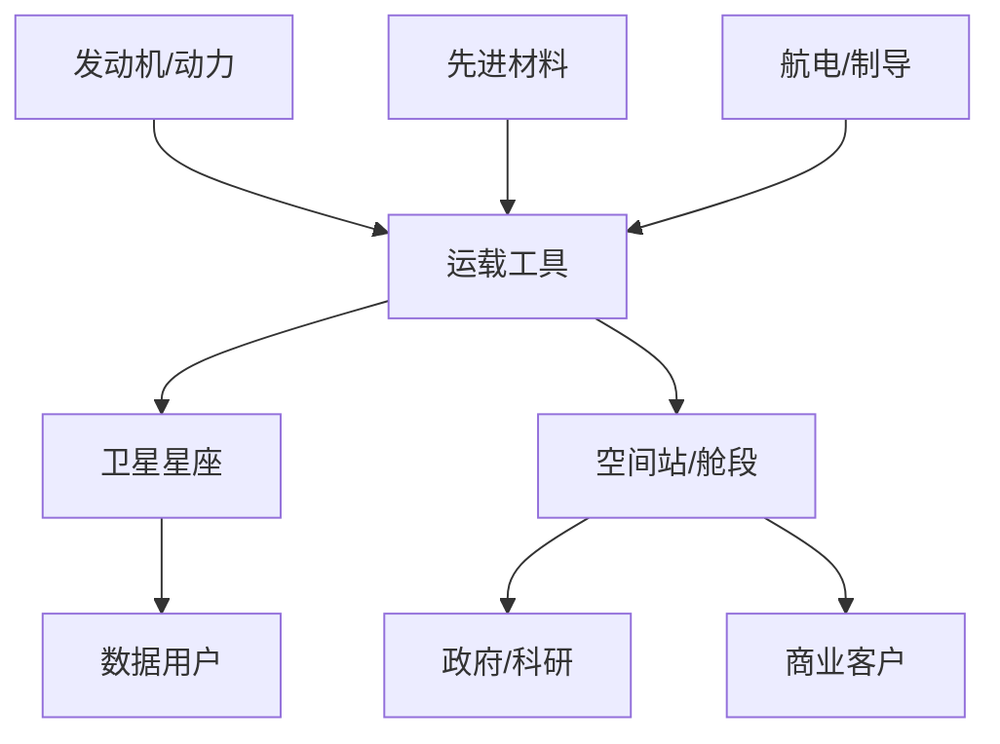

# 航空航天

<cite>
**本文引用的文件**
- [README.md](file://README.md)
</cite>

## 目录
1. [简介](#简介)
2. [项目结构](#项目结构)
3. [核心组件](#核心组件)
4. [架构总览](#架构总览)
5. [详细组件分析](#详细组件分析)
6. [依赖关系分析](#依赖关系分析)
7. [性能与交付考量](#性能与交付考量)
8. [故障排查指南](#故障排查指南)
9. [结论](#结论)
10. [附录](#附录)

## 简介
本文件聚焦商业航天领域，围绕 Relativity Space、Rocket Lab、Planet Labs、Firefly Aerospace、Axiom Space、Sierra Space 等公司，梳理其技术路线、市场趋势、政府合同与私人任务进展。内容基于仓库中的“航空航天”条目进行归纳与扩展说明，帮助读者快速理解当前商业航天的关键参与者与行业动态。

## 项目结构
仓库为单文件清单型文档，按赛道组织初创公司信息；其中“航空航天”小节集中列出相关公司与要点。该结构便于横向对比不同公司在产品、融资与里程碑方面的信息。

图表来源
- [README.md:586-615](file://README.md#L586-L615)

章节来源
- [README.md:586-615](file://README.md#L586-L615)

## 核心组件
本节概述各公司在商业航天中的角色与代表性能力：
- 可回收/3D打印火箭与发射服务（如 Relativity Space）
- 小型卫星发射与在轨服务（如 Rocket Lab）
- 卫星星座与地球观测数据服务（如 Planet Labs）
- 月球着陆器与深空载荷（如 Firefly Aerospace）
- 商业空间站与近地轨道设施（如 Axiom Space）
- 可重复使用太空飞机与充气舱段（如 Sierra Space）

章节来源
- [README.md:586-615](file://README.md#L586-L615)

## 架构总览
从系统视角看，商业航天生态由“运载—在轨—应用—服务”四层构成：
- 运载层：提供入轨与深空投放能力（Electron、Terran R、Alpha 等）
- 在轨层：卫星星座、空间基础设施（观测星座、空间站模块、充气舱段）
- 应用层：遥感数据、通信、导航增强、科学实验载荷
- 服务层：发射调度、在轨维护、数据分发、任务集成

图表来源
- [README.md:586-615](file://README.md#L586-L615)

## 详细组件分析

### Relativity Space（3D打印火箭）
- 定位：以增材制造为核心的可回收火箭方案，推进 Terran R 系列研发与生产体系构建
- 技术要点：3D打印大型金属构件、快速迭代设计、降低制造成本与周期
- 市场与任务：面向小中型载荷的发射需求，探索复用与快速交付模式
- 风险与挑战：工程验证、可靠性与经济性平衡、监管与适航认证

图表来源
- [README.md:590-594](file://README.md#L590-L594)

章节来源
- [README.md:590-594](file://README.md#L590-L594)

### Rocket Lab（Electron、Neutron）
- 定位：专注小型卫星发射与在轨服务，具备高频次发射与稳定交付能力
- 技术要点：固体/液体混合与液体发动机路线并行，逐步推进更大运力平台
- 市场与任务：全球小卫星发射主力之一，拓展在轨服务与星座部署
- 风险与挑战：竞争加剧、成本控制、发射场与供应链稳定性

图表来源
- [README.md:595-598](file://README.md#L595-L598)

章节来源
- [README.md:595-598](file://README.md#L595-L598)

### Planet Labs（卫星成像/地球观测）
- 定位：运营大规模卫星星座，提供高频次、高分辨率地球观测数据
- 技术要点：星座化部署、自动化数据处理、与云平台合作分发
- 市场与任务：农业、保险、灾害监测、国防与科研等多行业应用
- 风险与挑战：数据质量与时效性、隐私与合规、市场竞争

图表来源
- [README.md:600-602](file://README.md#L600-L602)

章节来源
- [README.md:600-602](file://README.md#L600-L602)

### Firefly Aerospace（Alpha、Blue Ghost）
- 定位：轻型运载与月球着陆器双轮驱动，参与政府与商业深空任务
- 技术要点：Alpha 火箭用于近地轨道发射；Blue Ghost 作为月球着陆器平台
- 市场与任务：NASA 等政府合同与商业载荷并存，推进登月与在轨服务
- 风险与挑战：深空任务复杂性、可靠性与进度管理

图表来源
- [README.md:604-606](file://README.md#L604-L606)

章节来源
- [README.md:604-606](file://README.md#L604-L606)

### Axiom Space（商业空间站）
- 定位：建设并运营商业近地轨道空间站，承接 ISS 退役后的长期驻留与科研需求
- 技术要点：模块化建造、与现有空间站对接、生命保障与在轨维护
- 市场与任务：政府与商业用户共享空间资源，开展微重力实验与旅游
- 风险与挑战：资金与进度、国际协作与监管、在轨安全

图表来源
- [README.md:608-610](file://README.md#L608-L610)

章节来源
- [README.md:608-610](file://README.md#L608-L610)

### Sierra Space（Dream Chaser、LIFE）
- 定位：可重复使用太空飞机与充气式舱段，服务于货运、返回与在轨设施
- 技术要点：滑翔返回、再入热防护、充气舱段展开与加压
- 市场与任务：政府合同为主，兼顾商业载荷与在轨服务
- 风险与挑战：复杂再入与着陆精度、充气结构可靠性

图表来源
- [README.md:612-614](file://README.md#L612-L614)

章节来源
- [README.md:612-614](file://README.md#L612-L614)

## 依赖关系分析
- 上游依赖：发动机、材料、电子与制导、发射场与测控网络、监管审批
- 下游依赖：卫星制造商、数据消费者、政府机构与商业客户
- 相互耦合：发射节奏影响星座部署；在轨服务依赖可靠运载；政府合同推动技术成熟

图表来源
- [README.md:586-615](file://README.md#L586-L615)

章节来源
- [README.md:586-615](file://README.md#L586-L615)

## 性能与交付考量
- 发射频次与可靠性：高可靠与低成本是核心竞争力，需持续优化测试与质量控制
- 复用与快速周转：通过复用设计与标准化流程缩短交付周期
- 供应链韧性：关键部件多源化与库存策略，降低断供风险
- 数据与服务SLA：对观测数据时效性与可用性提出严格要求

[本节为通用指导，不直接分析具体文件]

## 故障排查指南
- 发射前检查：推进剂加注、点火序列、遥测链路自检
- 在轨异常：姿态控制、电源管理、热控与通信中断处置
- 数据质量：校准与去噪、重访周期与分辨率评估
- 任务复盘：根因分析、回归测试与流程改进

[本节为通用指导，不直接分析具体文件]

## 结论
商业航天正从“示范验证”迈向“规模化交付”，在运载、在轨与应用各环节形成清晰分工与协作。Relativity Space 以增材制造重塑制造范式；Rocket Lab 在小卫星发射领域建立稳定能力；Planet Labs 以星座化观测服务赋能多行业；Firefly Aerospace 打通近地与深空任务；Axiom Space 与 Sierra Space 布局在轨基础设施与可重复使用平台。未来，随着政府合同与私人任务的共同推进，行业将加速向低成本、高可靠与可持续方向发展。

[本节为总结性内容，不直接分析具体文件]

## 附录
- 数据来源与参考：详见仓库“关键数据来源”部分，涵盖 Forbes、CB Insights、Crunchbase、PitchBook 等权威渠道
- 贡献方式：欢迎在合适分类下补充更新，遵循收录标准与格式规范

章节来源
- [README.md:870-945](file://README.md#L870-L945)