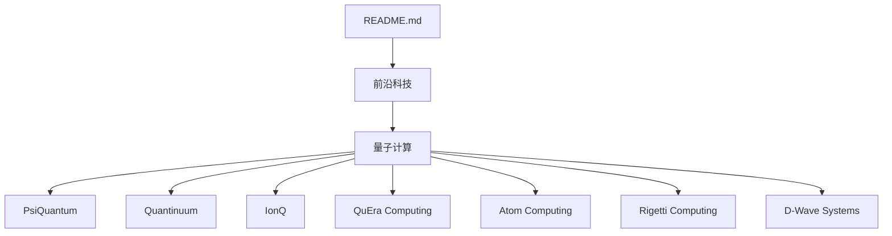
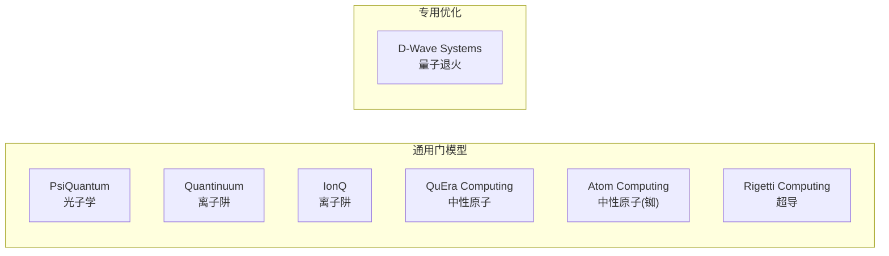

# 量子计算

<cite>
**本文引用的文件**
- [README.md](file://README.md)
</cite>

## 目录
1. [简介](#简介)
2. [项目结构](#项目结构)
3. [核心组件](#核心组件)
4. [架构总览](#架构总览)
5. [详细组件分析](#详细组件分析)
6. [依赖关系分析](#依赖关系分析)
7. [性能与成熟度考量](#性能与成熟度考量)
8. [故障排查指南](#故障排查指南)
9. [结论](#结论)
10. [附录](#附录)

## 简介
本文件聚焦量子计算赛道，基于仓库中“前沿科技—量子计算”条目，梳理并对比以下公司及其技术路线：PsiQuantum（光子学）、Quantinuum（离子阱）、IonQ（已上市，离子阱）、QuEra Computing（中性原子）、Atom Computing（中性原子/铷）、Rigetti Computing（超导）、D-Wave Systems（量子退火）。内容涵盖各路线的成熟度、商业化前景、投资价值与竞争格局，并结合公开信息对量子比特规模、纠错能力与应用场景进行指标化解读。

## 项目结构
仓库为单文件清单型文档，按赛道组织公司条目；量子计算部分位于“前沿科技”子章节，提供各公司的基础信息与融资/里程碑亮点。

**图表来源**
- [README.md:491-525](file://README.md#L491-L525)

**章节来源**
- [README.md:491-525](file://README.md#L491-L525)

## 核心组件
本节以“公司—技术路线—关键事实”的方式提炼要点，便于横向比较。

- PsiQuantum（光子学）
  - 总部：Palo Alto；成立：2015
  - 产品方向：基于光子学的百万级量子比特系统
  - 融资与估值：2025年9月完成Series E 10亿美元，BlackRock领投，估值约70亿美元
  - 合作制造：与GlobalFoundries合作芯片制造
  - 参考来源路径：[README.md:495-499](file://README.md#L495-L499)

- Quantinuum（离子阱）
  - 产品方向：H系列离子阱量子计算机
  - 融资与估值：2025年9月6亿美元；2026年6月再一轮累计达16.8亿美元，合并后估值超100亿美元
  - 技术特点：逻辑量子比特路线领先
  - 背景：Honeywell与Cambridge Quantum合并
  - 参考来源路径：[README.md:501-504](file://README.md#L501-L504)

- IonQ（离子阱，已上市）
  - 产品方向：Forte、IonQ Tempo等
  - 地位：第一家纯量子计算上市公司
  - 参考来源路径：[README.md:506-508](file://README.md#L506-L508)

- QuEra Computing（中性原子）
  - 总部：Boston；产品方向：中性原子量子计算机
  - 投资与估值：获Google Ventures投资；2026年Q2估值快速攀升
  - 参考来源路径：[README.md:510-512](file://README.md#L510-L512)

- Atom Computing（中性原子/铷）
  - 产品方向：中性原子（铷）量子计算
  - 里程碑：2024年首次实现1,000+量子比特
  - 参考来源路径：[README.md:514-516](file://README.md#L514-L516)

- Rigetti Computing（超导）
  - 产品方向：超导量子计算
  - 地位：第一家全栈量子计算上市公司
  - 参考来源路径：[README.md:518-520](file://README.md#L518-L520)

- D-Wave Systems（量子退火）
  - 产品方向：量子退火机
  - 地位：商业化最久的量子计算公司；专注优化问题
  - 参考来源路径：[README.md:522-524](file://README.md#L522-L524)

**章节来源**
- [README.md:495-524](file://README.md#L495-L524)

## 架构总览
从技术路线维度，可将上述公司归入四类平台：通用门模型（光子学、离子阱、中性原子、超导）与专用优化（量子退火）。下图展示公司与技术路线的映射关系。

**图表来源**
- [README.md:495-524](file://README.md#L495-L524)

## 详细组件分析

### 光子学路线：PsiQuantum
- 技术定位：面向大规模容错的光子量子计算，强调可扩展性与工业制造协同
- 商业化路径：通过先进制程代工（与GlobalFoundries合作）推进芯片量产能力
- 投资价值：大额私募融资背书，具备规模化工程落地潜力
- 风险点：光子量子计算的工程复杂度极高，容错与互连仍是挑战
- 参考来源路径：[README.md:495-499](file://README.md#L495-L499)

### 离子阱路线：Quantinuum 与 IonQ
- Quantinuum
  - 优势：逻辑量子比特路线领先，融合Honeywell工程能力与剑桥学术生态
  - 商业化：多轮融资支撑研发与生态建设，估值进入头部梯队
  - 参考来源路径：[README.md:501-504](file://README.md#L501-L504)
- IonQ
  - 优势：作为首家纯量子计算上市公司，具备资本市场通道与品牌效应
  - 商业化：产品线覆盖教育与企业场景，持续迭代硬件与软件栈
  - 参考来源路径：[README.md:506-508](file://README.md#L506-L508)

### 中性原子路线：QuEra Computing 与 Atom Computing
- QuEra Computing
  - 优势：中性原子阵列的可编程性与高连通性，获顶级风投支持
  - 商业化：估值快速提升，显示市场对其技术路线的认可
  - 参考来源路径：[README.md:510-512](file://README.md#L510-L512)
- Atom Computing
  - 优势：在铷原子体系上实现千比特量级，体现规模化进展
  - 商业化：以原子数增长为里程碑，推动算法与应用的早期验证
  - 参考来源路径：[README.md:514-516](file://README.md#L514-L516)

### 超导路线：Rigetti Computing
- 技术定位：全栈超导量子计算，软硬件一体化
- 商业化：上市公司身份带来资本与生态优势，持续拓展云访问与开发者生态
- 参考来源路径：[README.md:518-520](file://README.md#L518-L520)

### 量子退火：D-Wave Systems
- 技术定位：面向组合优化问题的专用求解器
- 商业化：商业化历史最长，聚焦物流、金融、材料等领域优化场景
- 参考来源路径：[README.md:522-524](file://README.md#L522-L524)

**章节来源**
- [README.md:495-524](file://README.md#L495-L524)

## 依赖关系分析
- 供应链依赖
  - 光子学：高端光电子器件与先进制程代工（如GlobalFoundries）
  - 离子阱：精密激光控制、真空与低温工程
  - 中性原子：冷原子系统与光学晶格/光镊阵列
  - 超导：极低温稀释制冷机、微波控制链路
  - 退火：专用磁通量子比特与退火控制链
- 生态依赖
  - 云平台与SDK：多家公司提供云端访问与开发工具
  - 应用生态：化学模拟、组合优化、机器学习等早期用例
- 资金与政策
  - 政府资助与产业联盟对长期研发至关重要
  - 资本市场热度影响融资节奏与人才吸引

（本节为概念性分析，不直接引用具体代码或条目）

## 性能与成熟度考量
- 量子比特数量
  - 中性原子（Atom Computing）：2024年实现1,000+量子比特里程碑
  - 其他路线：公开披露的比特规模差异较大，需结合保真度与连通性综合评估
  - 参考来源路径：[README.md:514-516](file://README.md#L514-L516)
- 纠错能力
  - 离子阱（Quantinuum）：强调“逻辑量子比特”路线，目标通过编码提升有效算力
  - 光子学（PsiQuantum）：面向大规模容错的工程化路径
  - 其他路线：纠错仍在演进，需关注错误率、寿命与可缩放性
  - 参考来源路径：[README.md:501-504](file://README.md#L501-L504), [README.md:495-499](file://README.md#L495-L499)
- 应用场景
  - 通用门模型：化学与材料模拟、密码学、机器学习等中长期场景
  - 量子退火：组合优化（调度、路由、资产配置等）
  - 参考来源路径：[README.md:522-524](file://README.md#L522-L524)
- 商业化前景
  - 短期：专用优化（退火）更易落地；通用门模型处于“有噪声中等规模”阶段
  - 中期：逻辑量子比特与纠错突破将打开更多应用空间
  - 长期：大规模容错量子计算可能重塑多个行业

（本节为概念性分析，不直接引用具体代码或条目）

## 故障排查指南
- 若需评估某家公司技术成熟度，建议核查以下公开信息源
  - 官方技术白皮书与路线图
  - 第三方评测基准与同行评议论文
  - 客户案例与云服务平台可用性
- 常见风险信号
  - 频繁变更技术路线或延迟关键里程碑
  - 过度宣传而缺乏可复现实验数据
  - 供应链瓶颈导致交付延期

（本节为通用指导，不直接引用具体代码或条目）

## 结论
- 竞争格局
  - 光子学（PsiQuantum）：工程化与制造协同是关键
  - 离子阱（Quantinuum、IonQ）：逻辑量子比特与生态建设并重
  - 中性原子（QuEra、Atom Computing）：比特规模与可编程性优势明显
  - 超导（Rigetti）：全栈能力与开发者生态
  - 退火（D-Wave）：专用优化场景的商业化先行者
- 投资价值
  - 关注具备清晰工程路径、强供应链能力与明确商业化里程碑的公司
  - 重视纠错与逻辑量子比特进展，这是跨越“有噪声中等规模”的关键
- 风险提示
  - 技术不确定性高、周期长；需结合多方证据审慎评估

（本节为总结性内容，不直接引用具体代码或条目）

## 附录
- 数据来源说明
  - 本文件所有公司条目均来自仓库中的“前沿科技—量子计算”部分，引用位置见各小节“参考来源路径”
- 延伸阅读建议
  - 关注各公司官网、技术博客与年度路线图更新
  - 跟踪行业报告与权威媒体对量子计算进展的报道

（本节为补充信息，不直接引用具体代码或条目）