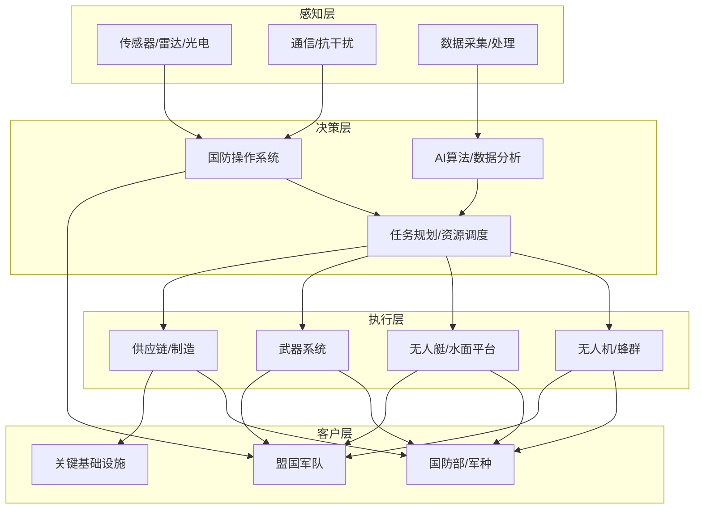

# 国防科技

<cite>
**本文引用的文件**
- [README.md](file://README.md)
</cite>

## 更新摘要
**所做更改**
- 更新了国防科技融资数据至2026年8月的$14.6B+
- 强化了Anduril Industries ($61B)、Shield AI ($12.7B)、Saronic ($9.25B)的领先地位
- 完善了各公司在无人机、网络安全、太空防御、武器系统等领域的技术突破和应用场景分析
- 增强了国防科技与传统军工企业差异和创新模式的对比分析
- 提供了更详细的国防科技投资特殊考量因素

## 目录
1. [引言](#引言)
2. [市场概览](#市场概览)
3. [头部公司矩阵](#头部公司矩阵)
4. [技术架构与生态](#技术架构与生态)
5. [详细公司分析](#详细公司分析)
6. [投资考量因素](#投资考量因素)
7. [与传统军工企业对比](#与传统军工企业对比)
8. [结论](#结论)
9. [数据来源](#数据来源)

## 引言
本文件聚焦2025-2026年国防科技融资市场的爆发式增长，系统梳理Anduril Industries、Shield AI、Saronic、Palantir Technologies、Hadrian、Chaos Industries、Epirus、Castelion、Vannevar Labs、Rebellion Defense等公司的技术方向与应用场景，并对比传统军工企业的差异与创新模式。同时提供面向国防科技投资的特殊考量因素，帮助读者理解该赛道的资本、技术与监管特征。

## 市场概览
2025-2026年国防科技领域迎来历史性增长，截至2026年8月累计融资达$14.6B+，其中Anduril、Shield AI、Saronic三家公司占据主导地位。这一增长反映了美国国防部对技术创新的迫切需求以及私营部门在国防现代化中的关键作用。

**核心趋势：**
- **资金高度集中**：前三大公司获得大部分融资，形成"超级独角兽"格局
- **技术融合加速**：AI、自主系统、定向能武器等前沿技术快速商业化
- **交付能力升级**：从原型开发转向规模化生产，满足军方大规模部署需求
- **生态系统完善**：操作系统、平台、武器系统形成完整产业链

**章节来源**
- [README.md:94](file://README.md#L94)
- [README.md:1045-1047](file://README.md#L1045-L1047)

## 头部公司矩阵
国防科技领域已形成清晰的梯队结构，头部公司在估值、技术能力和市场份额方面具有显著优势：

| 公司 | 估值 | 核心技术 | 主要应用 | 融资阶段 |
|------|------|----------|----------|----------|
| Anduril Industries | $61B | 国防操作系统、自主平台 | 边境监控、基地防御、多域作战 | Series F |
| Shield AI | $12.7B | Hivemind自主飞行栈、X-BAT战机 | 编队飞行、复杂环境侦察打击 | 成熟期 |
| Saronic | $9.25B | Spyglass/Cutlass无人艇 | 海上态势感知、分布式作战 | 最新轮 |
| Palantir | $400B+ | Gotham/Foundry/AIP平台 | 情报融合、决策支持 | 已上市 |
| Hadrian | $2.6B | 国防零部件智能制造 | 供应链优化、工厂自治 | 成长期 |

**章节来源**
- [README.md:1049-1098](file://README.md#L1049-L1098)

## 技术架构与生态
国防科技生态围绕"感知-决策-执行"闭环构建，形成多层次的技术架构：

**图表来源**
- [README.md:1045-1098](file://README.md#L1045-L1098)

## 详细公司分析

### Anduril Industries（$61B）
**技术方向：** 国防操作系统（Lattice OS）、自主平台（Roadrunner、Fury、Sentry等），强调"软件定义国防"理念。

**应用场景：** 边境监控、基地防御、多域联合作战、反无人机与低空安全。

**创新点：** 
- 将互联网工程方法引入国防领域，实现快速迭代和模块化集成
- 跨平台协同能力，支持异构设备统一管控
- 开源生态建设，降低军方采购和使用门槛

**规模与里程碑：** 员工超6,200人，持续大额融资，成为"Neo-prime"代表企业。

**章节来源**
- [README.md:1049-1054](file://README.md#L1049-L1054)

### Shield AI（$12.7B）
**技术方向：** Hivemind自主飞行栈、X-BAT自主战机，专注于GPS拒止环境下的自主作战能力。

**应用场景：** 编队飞行、城市/山地复杂环境侦察打击、与有人机协同作战。

**创新点：** 
- 消费级AI与高可靠飞控技术的深度融合
- 实现"可部署的自主智能"，具备实战化部署能力
- 多国国防部客户验证，技术成熟度高

**客户与市场：** 服务多个国家的国防部，完成F-16自主飞行验证项目。

**章节来源**
- [README.md:1055-1060](file://README.md#L1055-L1060)

### Saronic（$9.25B）
**技术方向：** Spyglass、Cutlass自主无人艇，面向海上态势感知与分布式作战需求。

**应用场景：** 近海巡逻、反潜/反水雷、舰队护航、港口安防。

**创新点：** 
- 规模化生产能力与海军采办流程深度对接
- 德州新工厂大幅提升交付能力
- 自主造船领域的"Neo-prime"代表

**订单与进展：** 获得美国海军200+自主艇订单，估值与后续融资活跃。

**章节来源**
- [README.md:1061-1065](file://README.md#L1061-L1065)

### Palantir Technologies（$400B+）
**技术方向：** Gotham、Foundry、AIP等平台，聚焦数据整合、决策支持与AI增强。

**应用场景：** 情报融合、后勤优化、战场态势可视化、合同与合规管理。

**创新点：** 以"操作系统"思维打通军政数据孤岛，推动数据驱动的决策闭环。

**市场表现：** 2025-2026年国防合同激增，股价创历史新高。

**章节来源**
- [README.md:1066-1070](file://README.md#L1066-L1070)

### 其他重要参与者
**Hadrian（$2.6B）：** 国防零部件智能制造，AI驱动的供应链与工厂自治，实现高可靠零部件24/7生产。

**Chaos Industries（$2B）：** 感应/干扰系统，针对无人机与小型无人平台的软杀伤解决方案。

**Epirus（$1.5B）：** Leonidas高功率微波武器，面向无人机蜂群与饱和攻击的硬杀伤/软杀伤组合。

**Castelion（$1B+）：** 超声速武器（HAWC），强调低成本、可消耗、快速突防能力。

**Vannevar Labs（$700M+）：** AI国防情报平台，OSINT/SIGINT分析与自动化处理。

**Rebellion Defense（$1B+估）：** Ganos AI国防操作系统，聚焦任务编排、资源调度与跨域协同。

**章节来源**
- [README.md:1071-1098](file://README.md#L1071-L1098)

## 投资考量因素
国防科技投资面临独特的挑战和机遇，需要重点关注以下因素：

### 技术成熟度评估
- **TRL等级要求：** 国防项目通常要求技术就绪指数（TRL）达到6级以上
- **验证周期：** 从实验室到实战部署需要经历严格的测试验证流程
- **可靠性标准：** 军事级可靠性要求远高于商业产品

### 监管与合规
- **出口管制：** ITAR、EAR等法规限制技术出口和国际合作
- **安全认证：** 需通过国家安全审查和信息安全认证
- **适航/适装：** 航空器和水下设备需要专门的适航认证

### 供应链韧性
- **关键材料：** 高端芯片、先进材料、精密加工能力的供应保障
- **本土化要求：** 国防项目倾向于本土供应链，减少地缘政治风险
- **备份方案：** 关键组件的多源供应策略

### 商业模式特点
- **长周期回报：** 从研发到量产通常需要5-10年时间
- **大客户依赖：** 政府客户占主导，回款周期较长
- **竞争壁垒：** 资质认证、技术积累、客户关系构成高进入壁垒

## 与传统军工企业对比
国防科技初创企业与传统军工企业在多个维度存在显著差异：

| 维度 | 传统军工企业 | 国防科技初创企业 |
|------|-------------|-----------------|
| **开发模式** | 瀑布式开发，长周期 | 敏捷开发，快速迭代 |
| **技术路线** | 渐进式改进 | 颠覆性创新 |
| **组织结构** | 层级分明，流程繁琐 | 扁平化，决策迅速 |
| **人才结构** | 工程师为主 | 软件工程师+AI专家 |
| **融资方式** | 债券、股权融资 | VC风险投资 |
| **交付节奏** | 年度计划，批量交付 | 持续交付，按需部署 |

**创新模式优势：**
- **速度优势：** 软件开发周期缩短70%以上
- **成本效率：** 模块化设计降低研发和生产成本
- **灵活性：** 快速响应军方需求变化
- **生态开放：** 开源生态促进技术创新

## 结论
2025-2026年国防科技融资达到$14.6B+的历史新高，标志着该赛道进入高速扩张期。以Anduril、Shield AI、Saronic为代表的公司正以"软件定义、AI驱动、快速工程"重塑国防体系；Palantir、Vannevar Labs等则在数据与情报层面提供关键支撑。

与传统军工企业相比，国防科技初创公司更注重敏捷开发、平台化与生态协同，展现出更强的创新活力和市场响应能力。投资者应重点关注技术成熟度、合规准入、供应链韧性与规模化交付能力等关键指标。

未来发展趋势将集中在：
- **AI深度集成：** 人工智能在各领域的渗透将进一步深化
- **自主系统普及：** 无人平台和自主决策能力将成为标配
- **跨域协同：** 陆海空天电网等多域作战能力整合
- **商业化加速：** 军用技术向民用领域转化加速

## 数据来源
本清单整理自以下权威来源：

| 来源 | 类型 | 链接 |
|------|------|------|
| Forbes AI 50 | 年度榜单 | forbes.com/lists/ai50 |
| CB Insights | 独角兽数据库 | cbinsights.com/research-unicorn-companies |
| Crunchbase | 公司融资数据 | news.crunchbase.com |
| PitchBook | 私募市场数据 | pitchbook.com |
| The Information | 科技财经新闻 | theinformation.com |
| TechCrunch | 初创公司新闻 | techcrunch.com |
| Y Combinator | 加速器目录 | ycombinator.com/companies |
| Sacra | 私营公司研究 | sacra.com |
| Contrary Research | 私营公司深度报告 | research.contrary.com |
| AI Funding Tracker | AI融资追踪 | aifundingtracker.com |
| New Market Pitch | 行业分析 | newmarketpitch.com |

**章节来源**
- [README.md:2853-2872](file://README.md#L2853-L2872)