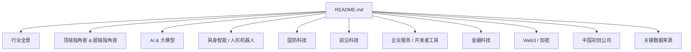
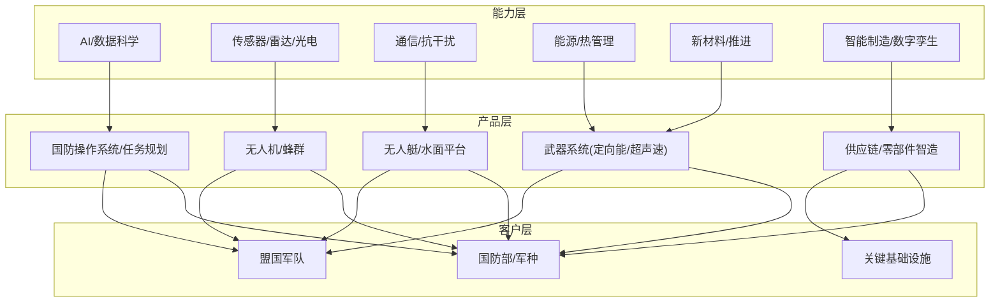
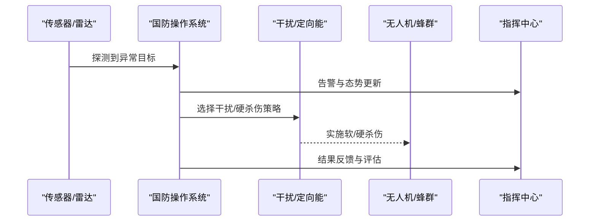
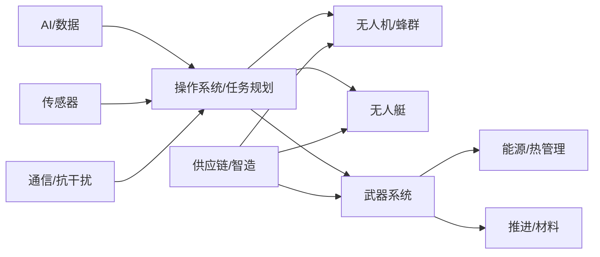

# 国防科技

<cite>
**本文引用的文件**
- [README.md](file://README.md)
</cite>

## 目录
1. [引言](#引言)
2. [项目结构](#项目结构)
3. [核心组件](#核心组件)
4. [架构总览](#架构总览)
5. [详细组件分析](#详细组件分析)
6. [依赖关系分析](#依赖关系分析)
7. [性能与交付考量](#性能与交付考量)
8. [故障排查指南](#故障排查指南)
9. [结论](#结论)
10. [附录](#附录)

## 引言
本文件聚焦 2025 年国防科技融资市场的爆发式增长，系统梳理 Anduril Industries、Shield AI、Saronic、Palantir Technologies、Hadrian、Chaos Industries、Epirus、Castelion、Vannevar Labs、Rebellion Defense 等公司的技术方向与应用场景，并对比传统军工企业的差异与创新模式。同时提供面向国防科技投资的特殊考量因素，帮助读者理解该赛道的资本、技术与监管特征。

## 项目结构
本项目以单一文档 README.md 为核心，按赛道组织公司条目，其中“国防科技”板块集中呈现 2025–2026 年头部公司与关键数据。文档采用“概览—分赛道—数据来源—贡献指南”的结构，便于快速定位与扩展。

图表来源
- [README.md:21-44](file://README.md#L21-L44)
- [README.md:432-486](file://README.md#L432-L486)

章节来源
- [README.md:21-44](file://README.md#L21-L44)
- [README.md:432-486](file://README.md#L432-L486)

## 核心组件
- 市场概览：2025 年国防科技融资达 $49.1B，同比近翻倍；2026 年截至 8 月已超 $14.6B+，Anduril、Shield AI、Saronic 领跑。
- 头部公司矩阵：涵盖无人机/无人艇、AI 情报平台、高功率微波武器、超声速武器、国防供应链智能制造等方向。
- 投资趋势：资金向头部集中，交易数下降但单轮金额暴涨；AI 在国防领域渗透加速（软件定义、数据驱动、快速迭代）。

章节来源
- [README.md:48-66](file://README.md#L48-L66)
- [README.md:432-486](file://README.md#L432-L486)

## 架构总览
从“能力层—产品层—客户层”视角看国防科技生态：
- 能力层：AI 算法、传感器、通信、能源、材料、制造自动化。
- 产品层：自主平台（无人机/无人艇）、操作系统（指挥控制/任务规划）、武器系统（定向能/超声速）、供应链与制造（柔性产线/数字孪生）。
- 客户层：国防部、军种、盟国军队、关键基础设施防护方。

[此图为概念性架构图，不直接映射具体源码文件]

## 详细组件分析
本节对“国防科技”板块中的代表性公司进行逐条解析，结合其技术方向、应用场景与商业化进展。

### Anduril Industries（$61B）
- 技术方向：国防操作系统（Lattice OS）、自主平台（Roadrunner、Fury、Sentry 等），强调“软件定义国防”。
- 应用场景：边境监控、基地防御、多域联合作战、反无人机与低空安全。
- 创新点：将互联网工程方法引入国防，快速迭代、模块化集成、跨平台协同。
- 规模与里程碑：员工超 6,200 人，持续大额融资，成为“Neo-prime”代表。

章节来源
- [README.md:432-486](file://README.md#L432-L486)

### Shield AI（$12.7B）
- 技术方向：Hivemind 自主飞行栈、X-BAT 自主战机，强调无 GPS/拒止环境下的自主作战。
- 应用场景：编队飞行、城市/山地复杂环境侦察打击、与有人机协同。
- 创新点：将消费级 AI 与高可靠飞控融合，实现“可部署的自主智能”。
- 客户与市场：多国国防部客户，F-16 自主飞行验证。

章节来源
- [README.md:432-486](file://README.md#L432-L486)

### Saronic（$4B）
- 技术方向：Spyglass、Cutlass 自主无人艇，面向海上态势感知与分布式作战。
- 应用场景：近海巡逻、反潜/反水雷、舰队护航、港口安防。
- 创新点：规模化生产与海军采办对接，德州新工厂提升交付能力。
- 订单与进展：美国海军 200+ 自主艇订单，估值与后续融资活跃。

章节来源
- [README.md:432-486](file://README.md#L432-L486)

### Palantir Technologies（已上市，$400B+）
- 技术方向：Gotham、Foundry、AIP 等平台，聚焦数据整合、决策支持与 AI 增强。
- 应用场景：情报融合、后勤优化、战场态势可视化、合同与合规管理。
- 创新点：以“操作系统”思维打通军政数据孤岛，推动数据驱动的决策闭环。
- 市场表现：2025–2026 国防合同激增，股价创新高。

章节来源
- [README.md:432-486](file://README.md#L432-L486)

### Hadrian（$2.6B）
- 技术方向：国防零部件智能制造，AI 驱动的供应链与工厂自治。
- 应用场景：高可靠零部件 24/7 生产、质量追溯、弹性产能。
- 创新点：用工业 AI 与数字孪生重构传统军工供应链，缩短交付周期。

章节来源
- [README.md:432-486](file://README.md#L432-L486)

### Chaos Industries（$2B）
- 技术方向：感应/干扰系统，针对无人机与小型无人平台的软杀伤。
- 应用场景：低空安全、要地防空、城市反恐与关键设施保护。
- 创新点：硅谷风格快速原型与现场部署，2025 年员工规模快速增长。

章节来源
- [README.md:432-486](file://README.md#L432-L486)

### Epirus（$1.5B）
- 技术方向：Leonidas 高功率微波武器，面向无人机蜂群与饱和攻击的硬杀伤/软杀伤组合。
- 应用场景：要地防空、舰载/车载机动防御、反无人机集群。
- 创新点：定向能武器实用化，配合 AI 目标识别与火力分配。

章节来源
- [README.md:432-486](file://README.md#L432-L486)

### Castelion（$1B+）
- 技术方向：超声速武器（HAWC），强调低成本、可消耗、快速突防。
- 应用场景：精确打击、区域拒止、战术纵深打击。
- 创新点：由 Anduril 联合创始人创办，延续“软件定义 + 快速工程”的思路。

章节来源
- [README.md:432-486](file://README.md#L432-L486)

### Vannevar Labs（$700M+）
- 技术方向：AI 国防情报平台，OSINT/SIGINT 分析与自动化。
- 应用场景：开源情报采集、信号情报处理、威胁预警与报告生成。
- 创新点：以 AI 放大分析师能力，缩短“数据—洞察—行动”链路。

章节来源
- [README.md:432-486](file://README.md#L432-L486)

### Rebellion Defense（$1B+估）
- 技术方向：Ganos AI 国防操作系统，聚焦任务编排、资源调度与跨域协同。
- 应用场景：联合全域作战、多平台任务规划、动态资源分配。
- 创新点：以 AI 为核心的“任务即服务”，提升联合作战效率。

章节来源
- [README.md:432-486](file://README.md#L432-L486)

#### 典型流程时序（以“低空安全拦截”为例）

[此图为概念性流程图，不直接映射具体源码文件]

## 依赖关系分析
- 技术耦合：AI 与传感器/通信深度耦合，形成“感知—决策—执行”闭环；定向能与推进/能源系统强相关。
- 供应链依赖：高端芯片、先进材料、精密加工与测试验证能力决定交付速度与可靠性。
- 合规与认证：适航/适装、电磁兼容、信息安全与出口管制是进入市场的门槛。
- 生态协同：操作系统类公司（如 Anduril、Rebellion Defense）与平台型公司（无人机/无人艇/武器系统）形成互补。

[此图为概念性依赖图，不直接映射具体源码文件]

## 性能与交付考量
- 实时性与鲁棒性：拒止环境下的高可靠自主导航与目标识别是关键指标。
- 可扩展性：平台需支持大规模编队与异构设备接入，具备横向扩展能力。
- 可维护性：模块化设计、远程诊断与OTA升级降低全寿命周期成本。
- 交付节奏：敏捷开发与快速试错，结合军方试验场验证，缩短 TRL 提升速度。
- 成本曲线：通过标准化与规模化制造降低单位成本，提高可消耗装备的经济性。

[本节为通用指导，不直接分析具体文件]

## 故障排查指南
- 传感器/通信链路：建立端到端链路健康检查与冗余切换机制，确保在强干扰下仍可工作。
- 自主决策模块：设置边界约束与降级策略，避免在未知场景出现不可预期行为。
- 武器系统：严格的安全互锁与发射前自检流程，确保误触发概率极低。
- 供应链与制造：关键物料双源或多源备份，工艺参数在线监控与异常报警。
- 数据安全：分级分类、最小权限与审计追踪，防止敏感数据泄露。

[本节为通用指导，不直接分析具体文件]

## 结论
2025 年国防科技融资达到 $49.1B，标志着该赛道进入高速扩张期。以 Anduril、Shield AI、Saronic 为代表的公司正以“软件定义、AI 驱动、快速工程”重塑国防体系；Palantir、Vannevar Labs 等则在数据与情报层面提供关键支撑。与传统军工企业相比，国防科技初创公司更注重敏捷开发、平台化与生态协同，投资需重点关注技术成熟度、合规准入、供应链韧性与规模化交付能力。

[本节为总结性内容，不直接分析具体文件]

## 附录
- 数据来源：本清单整理自 Forbes AI 50、CB Insights、Crunchbase、PitchBook、The Information、TechCrunch、Y Combinator、Sacra、Contrary Research、AI Funding Tracker、New Market Pitch 等权威来源。
- 贡献方式：欢迎 Fork 仓库并在合适分类下添加条目，遵循收录标准与排除范围。

章节来源
- [README.md:859-876](file://README.md#L859-L876)
- [README.md:879-908](file://README.md#L879-L908)