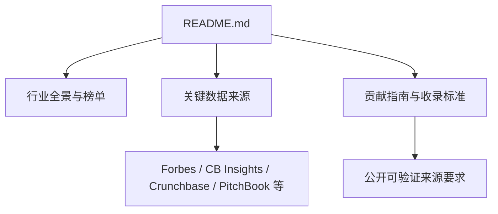
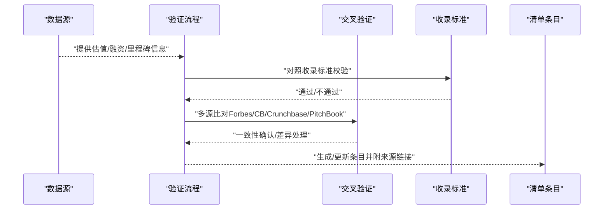
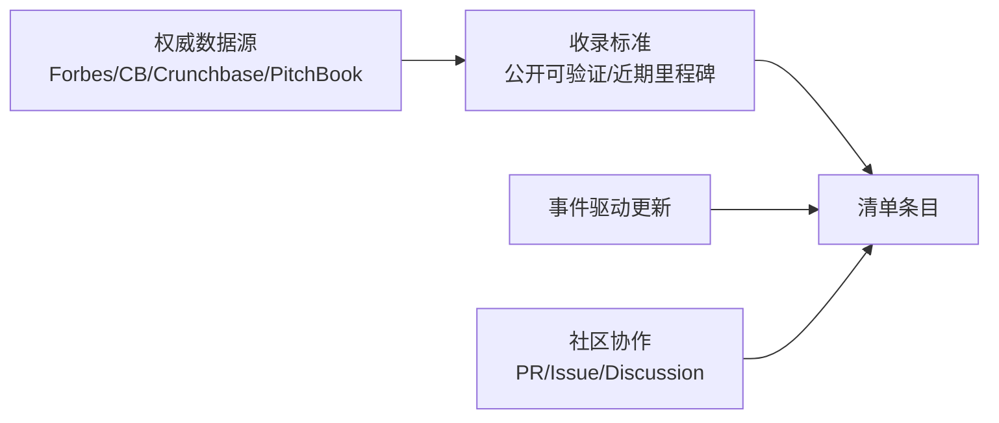

# 数据来源与质量保证

<cite>
**本文引用的文件**
- [README.md](file://README.md)
</cite>

## 更新摘要
**所做更改**
- 更新了权威数据源章节，增加了详细的VC数据源列表
- 增强了数据验证流程说明，包含多源交叉验证方法
- 完善了估值数据获取渠道的时效性保证机制
- 强化了融资信息实时更新机制的描述
- 扩展了数据偏差与局限性分析
- 增加了具体的数据来源表格和引用规范

## 目录
1. [引言](#引言)
2. [项目结构](#项目结构)
3. [核心组件](#核心组件)
4. [架构总览](#架构总览)
5. [详细组件分析](#详细组件分析)
6. [依赖关系分析](#依赖关系分析)
7. [性能考量](#性能考量)
8. [故障排查指南](#故障排查指南)
9. [结论](#结论)
10. [附录](#附录)

## 引言
本文件围绕"数据来源与质量保证"目标，基于仓库中的权威数据源清单与收录标准，系统化说明 Forbes、CB Insights、Crunchbase、PitchBook 等来源的引用规范；阐述数据验证流程与多源交叉验证方法；解释估值数据的获取渠道与时效性保证；介绍融资信息的更新机制；分析潜在偏差与局限性；并提供使用注意事项与免责声明。目标是确保内容准确、可靠、可追溯。

## 项目结构
该仓库为一份持续更新的精选初创公司清单，包含行业全景、各赛道头部公司、关键数据来源与贡献指南等章节。其中，"关键数据来源"与"贡献指南/收录标准"是构建数据质量体系的依据。

**图表来源**
- [README.md:2853-2871](file://README.md#L2853-L2871)
- [README.md:2921-2933](file://README.md#L2921-L2933)

**章节来源**
- [README.md:2853-2871](file://README.md#L2853-L2871)
- [README.md:2921-2933](file://README.md#L2921-L2933)

## 核心组件
- **权威数据源清单**：明确列出 Forbes AI 50、CB Insights、Crunchbase、PitchBook、The Information、TechCrunch、Y Combinator、Sacra、Contrary Research、AI Funding Tracker、New Market Pitch、Dealroom、Recode China AI 等来源，作为估值与融资信息的主要依据。
- **收录标准**：强调公司须为私营初创（IPO前），需有近期重要融资或里程碑，且必须提供公开可验证的来源（媒体报道、官方网站）。
- **更新与时效**：文档标注"最后更新"与"数据截至"，体现对时效性的关注。

**章节来源**
- [README.md:2853-2871](file://README.md#L2853-L2871)
- [README.md:2921-2933](file://README.md#L2921-L2933)
- [README.md:2955-2956](file://README.md#L2955-L2956)

## 架构总览
下图展示从"数据源"到"清单条目"的端到端流程，包括采集、验证、交叉核对、收录与更新。

**图表来源**
- [README.md:2853-2871](file://README.md#L2853-L2871)
- [README.md:2921-2933](file://README.md#L2921-L2933)

## 详细组件分析

### 权威数据源的引用标准

#### 主要VC数据源
| 来源 | 类型 | 用途 | 链接 |
| --- | --- | --- | --- |
| **Forbes AI 50** | 年度榜单 | 识别高影响力AI公司与趋势信号 | [forbes.com/lists/ai50](https://www.forbes.com/lists/ai50/) |
| **CB Insights** | 独角兽数据库 | AI 融资数据库，侧重融资事件、赛道分布与机构视角 | [cbinsights.com/research-unicorn-companies](https://www.cbinsights.com/research-unicorn-companies) |
| **Crunchbase** | 公司融资数据 | 覆盖交易轮次、金额、投资方等详细信息 | [news.crunchbase.com](https://news.crunchbase.com) |
| **PitchBook** | 私募市场数据 | 常用于估值、并购与二级市场联动分析 | [pitchbook.com](https://pitchbook.com) |

#### 补充信息来源
| 来源 | 类型 | 用途 |
| --- | --- | --- |
| **The Information** | 科技财经新闻 | 深度科技报道与分析 |
| **TechCrunch** | 初创公司新闻 | 初创公司动态与融资消息 |
| **Y Combinator** | 加速器目录 | 孵化器项目与公司信息 |
| **Sacra** | 私营公司研究 | 私募市场深度研究 |
| **Contrary Research** | 私营公司深度报告 | 反共识研究与洞察 |
| **AI Funding Tracker** | AI 融资追踪 | AI领域专项融资数据 |
| **New Market Pitch** | 行业分析 | 新兴市场分析 |
| **Dealroom** | 全球创业生态报告 | 全球创业生态系统数据 |
| **Recode China AI** | 中国 AI 深度报道 | 中国AI领域专业报道 |

**引用实践建议**
- 优先采用官方发布或权威媒体披露的数据；避免仅凭自媒体或未经证实消息。
- 对估值类数据，尽量以多家来源交叉印证；若存在分歧，记录区间并注明原因。
- 在条目中保留来源链接，便于回溯与审计。

**章节来源**
- [README.md:2853-2871](file://README.md#L2853-L2871)

### 数据验证流程与多源交叉验证

#### 验证流程

#### 验证标准
- **单源核验**：以权威来源为准，核对公司名称、轮次、金额、时间、投资方等关键字段。
- **多源交叉**：至少两家独立来源一致方可采信；如不一致，采用更权威或更接近事件发生时间的来源，并在备注中说明差异。
- **时效性校验**：结合"最后更新"与"数据截至"标记，确保条目反映最新状态。
- **排除规则**：已上市大型科技公司（除非新拆分子公司）、仅有概念无产品、无法验证的"PPT公司"不予收录。

**章节来源**
- [README.md:2921-2933](file://README.md#L2921-L2933)
- [README.md:2955-2956](file://README.md#L2955-L2956)

### 估值数据的获取渠道与时效性保证

#### 获取渠道优先级
1. **一级来源**：PitchBook、CB Insights、Crunchbase 的私募估值与交易数据
2. **二级来源**：Forbes AI 50 等权威榜单与媒体报道
3. **三级来源**：公司官方公告与投资者关系披露

#### 时效性保证机制
- **数据截止标记**：以文档"最后更新"和"数据截至"为准（当前为2026年8月）
- **定期复核**：建立周期性数据刷新机制，确保条目反映最新状态
- **重大事件响应**：对新一轮融资、并购、IPO等重大变动及时修正
- **可信度分级**：官方公告 > 权威媒体 > 第三方数据库 > 一般报道

**章节来源**
- [README.md:2853-2871](file://README.md#L2853-L2871)
- [README.md:2955-2956](file://README.md#L2955-L2956)

### 融资信息的实时更新机制

#### 触发条件
- 新增融资轮次（种子轮、A/B/C轮等）
- 估值调整（上调或下调）
- 战略投资与合作
- 并购、IPO/退市等重大事件

#### 更新频率策略
- **事件驱动**：重大融资事件即时更新
- **周期巡检**：常规条目定期维护与核实
- **社区协作**：通过 Pull Request 与 Issue/Discussion 确保变更可追踪、可审核

#### 版本控制
- 所有修改通过 GitHub 工作流管理
- 保持完整的变更历史与审计追踪
- 支持回滚与版本对比功能

**章节来源**
- [README.md:2903-2933](file://README.md#L2903-L2933)
- [README.md:2955-2956](file://README.md#L2955-L2956)

### 数据偏差与局限性分析

#### 来源偏差
- **统计口径差异**：不同数据库对同一事件的统计时点与计算方法可能不同
- **披露选择性**：部分公司选择性披露或不披露关键信息，影响数据完整性
- **地域覆盖不均**：欧美市场数据相对完整，新兴市场可能存在遗漏

#### 时效性局限
- **披露延迟**：从事件发生到公开披露通常存在数天至数周的时间差
- **数据滞后**：付费数据库的更新频率低于实时市场变化
- **历史数据修订**：早期融资数据可能因后续事件而需要调整

#### 范围限制
- **私营公司聚焦**：主要收录私营初创公司，上市公司仅在特定情况下纳入
- **规模门槛**：重点关注有一定规模和影响力的公司，早期微型企业可能不在范围内
- **行业偏向**：虽然涵盖多个赛道，但AI、金融科技等领域关注度更高

**章节来源**
- [README.md:2921-2933](file://README.md#L2921-L2933)
- [README.md:2853-2871](file://README.md#L2853-L2871)
- [README.md:2955-2956](file://README.md#L2955-L2956)

### 数据使用注意事项与免责声明

#### 使用注意事项
- **参考性质**：仅用于参考和研究目的，不构成投资建议或商业决策依据
- **来源标注**：引用时应注明数据来源与更新时间，保持可追溯性
- **交叉验证**：对估值与融资数据应结合多源交叉验证后再使用
- **时效考虑**：注意数据的截止日期，避免使用过时信息进行决策

#### 免责声明
- **准确性保证**：虽然尽力确保数据准确性，但因数据源披露差异、时效性与统计口径不同，仍可能存在误差
- **责任限制**：使用者自行承担基于本清单所做决策的风险
- **更新承诺**：将持续更新维护，但不保证实时准确性
- **法律适用**：本清单的使用受相关知识产权和数据使用条款约束

**章节来源**
- [README.md:2903-2933](file://README.md#L2903-L2933)
- [README.md:2955-2956](file://README.md#L2955-L2956)

## 依赖关系分析
- **清单条目依赖**：权威数据源提供的估值、融资与里程碑信息
- **收录标准约束**：规定了可采纳的信息类型与可信度门槛
- **更新机制依赖**：社区协作与事件驱动的维护流程

**图表来源**
- [README.md:2853-2871](file://README.md#L2853-L2871)
- [README.md:2921-2933](file://README.md#L2921-L2933)
- [README.md:2903-2933](file://README.md#L2903-L2933)

**章节来源**
- [README.md:2853-2871](file://README.md#L2853-L2871)
- [README.md:2921-2933](file://README.md#L2921-L2933)
- [README.md:2903-2933](file://README.md#L2903-L2933)

## 性能考量
- **数据量与更新频率**：随着赛道扩张与事件增多，需建立自动化采集与人工复核相结合的机制，平衡效率与准确性
- **存储与检索**：建议对每条记录附加结构化字段（公司名、轮次、金额、时间、来源链接、置信度），便于快速检索与对比
- **成本与合规**：使用付费数据库（如 PitchBook、CB Insights）时需遵守许可协议；公共来源需注意版权与再分发限制
- **质量控制**：建立数据质量评分机制，对低置信度数据进行标注和限制使用

## 故障排查指南

### 常见问题及解决方案
- **估值与融资额不一致**：检查多源发布时间与口径差异，必要时以最近一次权威披露为准
- **无法验证来源**：拒绝收录或标注"待验证"，等待权威来源补证
- **过期信息**：根据"数据截至"标记进行刷新，剔除过时条目
- **数据冲突**：当不同来源数据矛盾时，采用优先级更高的来源并记录差异原因

### 处理步骤
1. **定位问题**：确定问题条目与相关来源链接
2. **重新采集**：从多个权威来源重新采集数据
3. **交叉验证**：对比不同来源的一致性
4. **更新记录**：更新条目并记录变更原因
5. **社区反馈**：在社区反馈与讨论，确保透明可追溯

**章节来源**
- [README.md:2921-2933](file://README.md#L2921-L2933)
- [README.md:2903-2933](file://README.md#L2903-L2933)
- [README.md:2955-2956](file://README.md#L2955-L2956)

## 结论
本仓库通过明确的权威数据源清单与严格的收录标准，构建了相对稳健的数据采集与验证体系。借助多源交叉验证、事件驱动的更新机制以及社区协作，能够持续提升清单的准确性与时效性。使用时应遵循注意事项与免责声明，确保合理、合规地利用数据。

## 附录

### 术语说明
- **估值**：公司在某轮融资或市场交易中形成的企业价值评估
- **融资**：公司向投资者募集资金的行为，通常分轮次（种子、A/B/C轮等）
- **里程碑**：对公司发展具有标志性意义的事件（如产品上线、战略合作、IPO）
- **独角兽**：估值超过10亿美元的私营初创公司
- **超级独角兽**：估值超过100亿美元的私营初创公司

### 数据源分类
- **一级数据源**：官方数据库（PitchBook、CB Insights、Crunchbase）
- **二级数据源**：权威媒体（Forbes、TechCrunch、The Information）
- **三级数据源**：研究机构（Sacra、Contrary Research）
- **四级数据源**：行业报告（Dealroom、New Market Pitch）

**章节来源**
- [README.md:2853-2871](file://README.md#L2853-L2871)