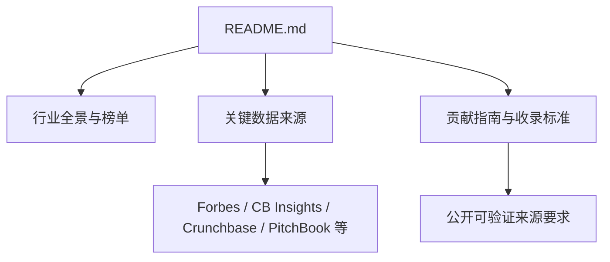
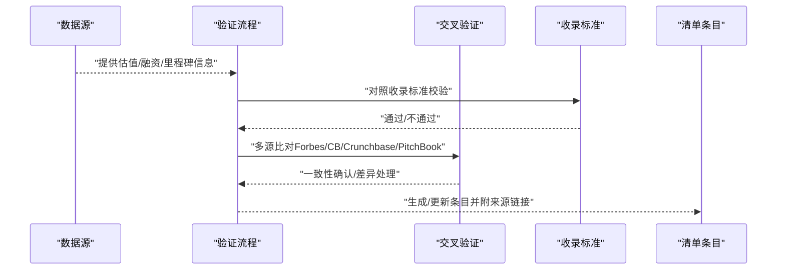
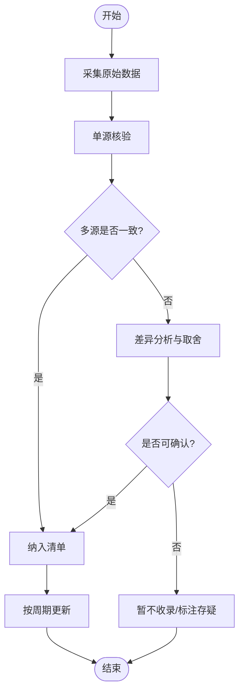
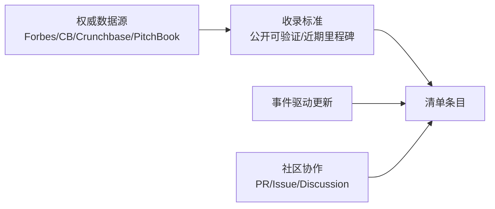

# 数据来源与质量保证

<cite>
**本文引用的文件**
- [README.md](file://README.md)
</cite>

## 目录
1. [引言](#引言)
2. [项目结构](#项目结构)
3. [核心组件](#核心组件)
4. [架构总览](#架构总览)
5. [详细组件分析](#详细组件分析)
6. [依赖关系分析](#依赖关系分析)
7. [性能考量](#性能考量)
8. [故障排查指南](#故障排查指南)
9. [结论](#结论)
10. [附录](#附录)

## 引言
本文件围绕“数据来源与质量保证”目标，基于仓库中的权威数据源清单与收录标准，系统化说明 Forbes、CB Insights、Crunchbase、PitchBook 等来源的引用规范；阐述数据验证流程与多源交叉验证方法；解释估值数据的获取渠道与时效性保证；介绍融资信息的更新机制；分析潜在偏差与局限性；并提供使用注意事项与免责声明。目标是确保内容准确、可靠、可追溯。

## 项目结构
该仓库为一份持续更新的精选初创公司清单，包含行业全景、各赛道头部公司、关键数据来源与贡献指南等章节。其中，“关键数据来源”与“贡献指南/收录标准”是构建数据质量体系的依据。

图表来源
- [README.md:870-887](file://README.md#L870-L887)
- [README.md:907-918](file://README.md#L907-L918)

章节来源
- [README.md:870-887](file://README.md#L870-L887)
- [README.md:907-918](file://README.md#L907-L918)

## 核心组件
- 权威数据源清单：明确列出 Forbes AI 50、CB Insights、Crunchbase、PitchBook、The Information、TechCrunch、Y Combinator、Sacra、Contrary Research、AI Funding Tracker、New Market Pitch 等来源，作为估值与融资信息的主要依据。
- 收录标准：强调公司须为私营初创（IPO前），需有近期重要融资或里程碑，且必须提供公开可验证的来源（媒体报道、官方网站）。
- 更新与时效：文档标注“最后更新”与“数据截至”，体现对时效性的关注。

章节来源
- [README.md:870-887](file://README.md#L870-L887)
- [README.md:907-918](file://README.md#L907-L918)
- [README.md:941-942](file://README.md#L941-L942)

## 架构总览
下图展示从“数据源”到“清单条目”的端到端流程，包括采集、验证、交叉核对、收录与更新。

图表来源
- [README.md:870-887](file://README.md#L870-L887)
- [README.md:907-918](file://README.md#L907-L918)

## 详细组件分析

### 权威数据源的引用标准
- Forbes AI 50：年度榜单，用于识别高影响力AI公司与趋势信号。
- CB Insights：AI 融资数据库，侧重融资事件、赛道分布与机构视角。
- Crunchbase：公司融资数据，覆盖交易轮次、金额、投资方等。
- PitchBook：私募市场数据，常用于估值、并购与二级市场联动分析。
- 其他补充来源：The Information、TechCrunch、Y Combinator、Sacra、Contrary Research、AI Funding Tracker、New Market Pitch，用于新闻、加速器项目、研究洞察与行业分析。

引用实践建议
- 优先采用官方发布或权威媒体披露的数据；避免仅凭自媒体或未经证实消息。
- 对估值类数据，尽量以多家来源交叉印证；若存在分歧，记录区间并注明原因。
- 在条目中保留来源链接，便于回溯与审计。

章节来源
- [README.md:870-887](file://README.md#L870-L887)

### 数据验证流程与多源交叉验证
- 单源核验：以权威来源为准，核对公司名称、轮次、金额、时间、投资方等关键字段。
- 多源交叉：至少两家独立来源一致方可采信；如不一致，采用更权威或更接近事件发生时间的来源，并在备注中说明差异。
- 时效性校验：结合“最后更新”与“数据截至”标记，确保条目反映最新状态。
- 排除规则：已上市大型科技公司（除非新拆分子公司）、仅有概念无产品、无法验证的“PPT公司”不予收录。

图表来源
- [README.md:907-918](file://README.md#L907-L918)
- [README.md:870-887](file://README.md#L870-L887)
- [README.md:941-942](file://README.md#L941-L942)

章节来源
- [README.md:907-918](file://README.md#L907-L918)
- [README.md:870-887](file://README.md#L870-L887)
- [README.md:941-942](file://README.md#L941-L942)

### 估值数据的获取渠道与时效性保证
- 获取渠道：主要依赖 PitchBook、CB Insights、Crunchbase 的私募估值与交易数据；辅以 Forbes AI 50 等榜单与权威媒体报道进行佐证。
- 时效性保证：以文档“最后更新”和“数据截至”为准，定期复核并更新条目；对重大变动（如新一轮融资、并购、IPO）及时修正。
- 可信度分级：官方公告 > 权威媒体 > 第三方数据库 > 一般报道；当出现冲突时，按此优先级取舍。

章节来源
- [README.md:870-887](file://README.md#L870-L887)
- [README.md:941-942](file://README.md#L941-L942)

### 融资信息的实时更新机制
- 触发条件：新增融资轮次、估值调整、战略投资、并购、IPO/退市等。
- 更新频率：结合“持续更新”承诺，按事件驱动与周期性复核相结合；重大事件即时更新，常规条目定期巡检。
- 版本控制：通过 Pull Request 与 Issue/Discussion 社区协作，确保变更可追踪、可审核。

章节来源
- [README.md:890-905](file://README.md#L890-L905)
- [README.md:941-942](file://README.md#L941-L942)

### 数据偏差与局限性分析
- 来源偏差：不同数据库口径与统计时点不同，可能导致估值与融资额差异。
- 披露偏差：部分公司选择性披露或不披露关键信息，影响准确性。
- 时效滞后：从事件发生到公开披露存在延迟，需以“数据截至”为准。
- 范围局限：仅收录私营初创公司，上市公司不在范围内（除非新拆分子公司）。

章节来源
- [README.md:907-918](file://README.md#L907-L918)
- [README.md:870-887](file://README.md#L870-L887)
- [README.md:941-942](file://README.md#L941-L942)

### 数据使用注意事项与免责声明
- 使用注意：
  - 仅参考用途，不构成投资建议或商业决策依据。
  - 引用时应注明数据来源与更新时间，保持可追溯。
  - 对估值与融资数据应结合多源交叉验证后再使用。
- 免责声明：
  - 因数据源披露差异、时效性与统计口径不同，可能存在误差。
  - 使用者自行承担基于本清单所做决策的风险。

章节来源
- [README.md:922-930](file://README.md#L922-L930)
- [README.md:941-942](file://README.md#L941-L942)

## 依赖关系分析
- 清单条目依赖权威数据源提供的估值、融资与里程碑信息。
- 收录标准约束了可采纳的信息类型与可信度门槛。
- 更新机制依赖社区协作与事件驱动的维护流程。

图表来源
- [README.md:870-887](file://README.md#L870-L887)
- [README.md:907-918](file://README.md#L907-L918)
- [README.md:890-905](file://README.md#L890-L905)

章节来源
- [README.md:870-887](file://README.md#L870-L887)
- [README.md:907-918](file://README.md#L907-L918)
- [README.md:890-905](file://README.md#L890-L905)

## 性能考量
- 数据量与更新频率：随着赛道扩张与事件增多，需建立自动化采集与人工复核相结合的机制，平衡效率与准确性。
- 存储与检索：建议对每条记录附加结构化字段（公司名、轮次、金额、时间、来源链接、置信度），便于快速检索与对比。
- 成本与合规：使用付费数据库（如 PitchBook、CB Insights）时需遵守许可协议；公共来源需注意版权与再分发限制。

[本节为通用指导，不直接分析具体文件]

## 故障排查指南
- 常见异常：
  - 估值与融资额不一致：检查多源发布时间与口径差异，必要时以最近一次权威披露为准。
  - 无法验证来源：拒绝收录或标注“待验证”，等待权威来源补证。
  - 过期信息：根据“数据截至”标记进行刷新，剔除过时条目。
- 处理步骤：
  - 定位问题条目与来源链接。
  - 重新采集并交叉验证。
  - 更新条目并记录变更原因。
  - 在社区反馈与讨论，确保透明可追溯。

章节来源
- [README.md:907-918](file://README.md#L907-L918)
- [README.md:890-905](file://README.md#L890-L905)
- [README.md:941-942](file://README.md#L941-L942)

## 结论
本仓库通过明确的权威数据源清单与严格的收录标准，构建了相对稳健的数据采集与验证体系。借助多源交叉验证、事件驱动的更新机制以及社区协作，能够持续提升清单的准确性与时效性。使用时应遵循注意事项与免责声明，确保合理、合规地利用数据。

[本节为总结性内容，不直接分析具体文件]

## 附录
- 术语说明：
  - 估值：公司在某轮融资或市场交易中形成的企业价值评估。
  - 融资：公司向投资者募集资金的行为，通常分轮次（种子、A/B/C…）。
  - 里程碑：对公司发展具有标志性意义的事件（如产品上线、战略合作、IPO）。
- 参考链接：见“关键数据来源”章节所列来源。

章节来源
- [README.md:870-887](file://README.md#L870-L887)