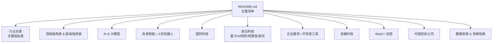
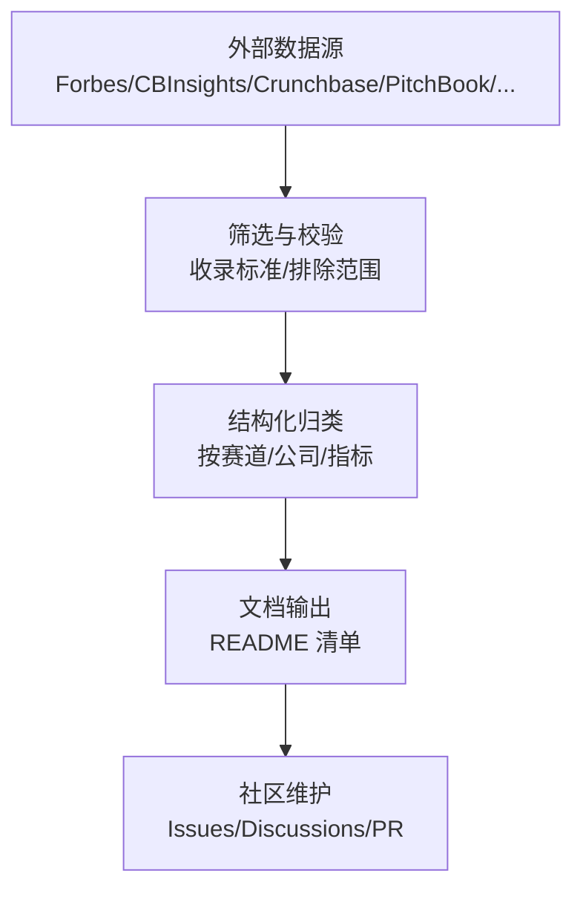
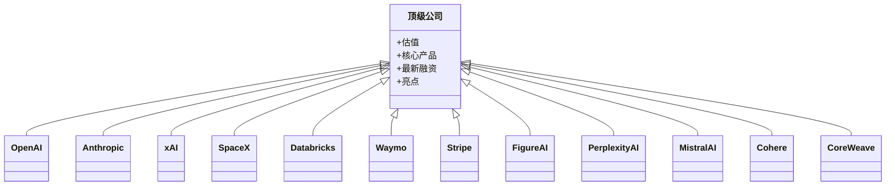
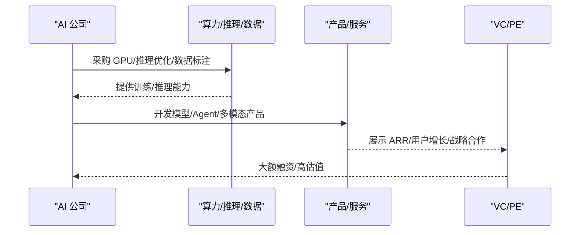
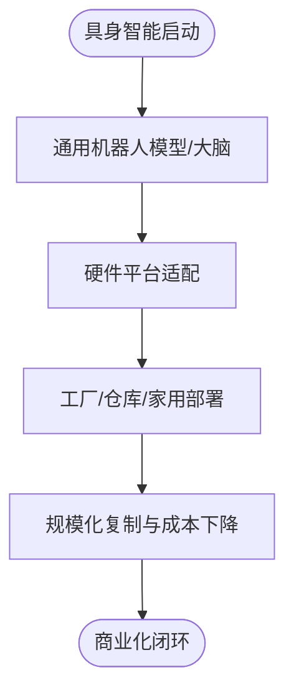
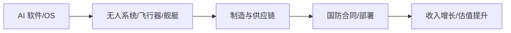
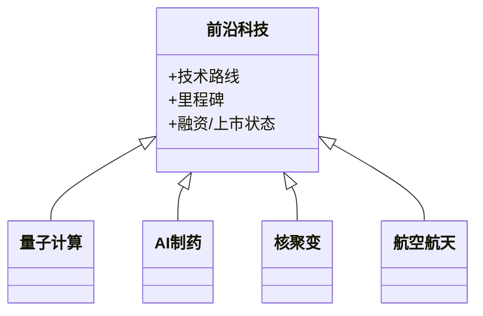
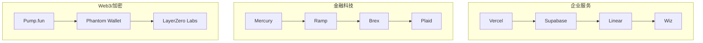
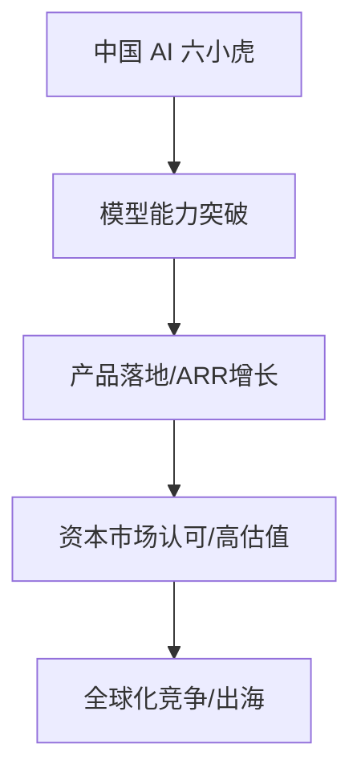
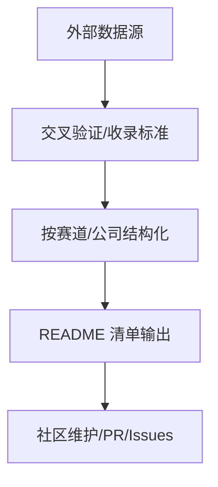

# 行业全景概览

<cite>
**本文引用的文件**
- [README.md](file://README.md)
</cite>

## 目录
1. [引言](#引言)
2. [项目结构](#项目结构)
3. [核心组件](#核心组件)
4. [架构总览](#架构总览)
5. [详细组件分析](#详细组件分析)
6. [依赖关系分析](#依赖关系分析)
7. [性能与趋势考量](#性能与趋势考量)
8. [故障排查指南](#故障排查指南)
9. [结论](#结论)
10. [附录](#附录)

## 引言
本文件基于仓库中的“Awesome Startups”清单，构建 2025–2026 年创投市场的全景概览。重点覆盖全球风险投资趋势、AI 领域占比超过 70% 的市场格局、具身智能与国防科技等热门赛道融资情况，以及中国 AI 公司（DeepSeek、Moonshot、Zhipu 等）跻身全球第一梯队的发展态势。文档同时提供关键指标表格与趋势图表，帮助读者理解资本流向与技术创新的互动关系，形成对当前创投生态的整体认知。

## 项目结构
该仓库以单文件 README 为核心，采用“按赛道组织 + 头部公司排序”的结构化清单方式，便于快速检索与横向对比。内容涵盖：
- 行业全景与关键指标表
- 顶级独角兽与超级独角兽
- 各赛道（AI、具身智能、国防科技、前沿科技、企业服务、金融科技、Web3/加密、中国初创公司）
- 数据来源与贡献指南



**章节来源**
- [README.md:1-45](file://README.md#L1-L45)

## 核心组件
- 关键指标表：汇总 2026 H1 全球 VC 投资规模、AI 占比、细分赛道融资规模、中国 AI 六小虎合计估值等，用于宏观把握市场热度与资金集中度。
- 赛道分类与头部公司：按赛道列出代表性公司与最新估值/融资信息，体现技术突破与商业化进展。
- 数据来源：引用 Forbes、CB Insights、Crunchbase、PitchBook、The Information、TechCrunch、Y Combinator、Sacra、Contrary Research、AI Funding Tracker、New Market Pitch 等权威来源，确保数据可追溯。

**章节来源**
- [README.md:48-66](file://README.md#L48-L66)
- [README.md:859-876](file://README.md#L859-L876)

## 架构总览
从“数据—分析—呈现”的角度看，该清单的架构是：
- 数据采集：来自多家权威机构与媒体公开报道
- 结构化整理：按赛道与头部公司维度组织
- 可视化呈现：通过表格与列表展示关键指标与公司亮点
- 持续更新：贡献指南与社区反馈机制保障时效性



[此图为概念性流程示意，不直接映射具体代码文件]

## 详细组件分析

### 关键指标与趋势解读
- 2026 H1 全球 VC 投资达 $510B，创历史新高，显著高于 2025 全年 $440B，显示资本加速涌入。
- AI 占总投资比例超过 70%，表明 AI 成为本轮周期的绝对主线。
- 具身智能在 2025 年融资超 $14B+，人形机器人从 Demo 走向商用部署。
- 国防科技在 2026 年截至 8 月融资超 $14.6B+，Anduril、Shield AI、Saronic 领跑。
- 数字健康在 2026 H1 融资 $7.4B，AI 驱动反弹。
- 中国 AI 六小虎合计估值超 $200B，体现中国 AI 复苏与全球化竞争力提升。

```mermaid
bar-chart
title "2026 H1 关键指标一览"
xaxis ["VC 投资", "AI 占比", "金融科技融资", "具身智能融资", "国防科技融资", "数字健康融资", "中国 AI 六小虎估值"]
yaxis ["金额(十亿美元)"]
series "数值" [510, 70, 28.6, 14, 14.6, 7.4, 200]
```

**章节来源**
- [README.md:48-66](file://README.md#L48-L66)

### 顶级独角兽与超级独角兽
- OpenAI、Anthropic、xAI、SpaceX、Databricks、Waymo、Stripe、Figure AI、Perplexity AI、Mistral AI、Cohere、CoreWeave 等公司在基础模型、AI 基础设施、自动驾驶、支付等领域占据领先地位。
- 这些公司的共同特征是：高研发投入、强产品力、规模化商业落地或平台效应。



**章节来源**
- [README.md:69-155](file://README.md#L69-L155)

### AI 与大模型
- 基础大模型：OpenAI、Anthropic、xAI、Mistral AI、Cohere、Sakana AI、DeepSeek 等，聚焦前沿模型能力与商业化。
- AI 编程/Coding Agent：Cursor、Devin、Replit、Lovable、Bolt.new、Codeium/Windsurf、Factory、v0 by Vercel 等，展现 AI 重塑软件工程的速度与效率。
- AI Agent/智能体平台：Harvey AI、Sierra、Decagon、Glean、Manus AI、Lindy AI 等，面向企业客服、法律、知识管理等场景。
- AI 基础设施：CoreWeave、Lambda、Together AI、Fireworks AI、Crusoe Energy、Anyscale、Scale AI 等，提供算力、推理优化、数据标注与编排能力。
- AI 视频/多模态生成：Runway、Pika、ElevenLabs、Luma AI、Suno、Stability AI、HeyGen、Synthesia 等，覆盖图像、语音、视频与数字人。



**章节来源**
- [README.md:157-369](file://README.md#L157-L369)

### 具身智能与人形机器人
- 代表公司：Figure AI、Skild AI、Physical Intelligence、1X Technologies、Apptronik、NEURA Robotics、Agility Robotics、Sanctuary AI、Unitree Robotics、Galbot。
- 趋势：从实验室 Demo 到工厂/仓库商用部署；跨硬件平台的通用“大脑”与模型融合；消费级与工业级并行发展。



**章节来源**
- [README.md:371-430](file://README.md#L371-L430)

### 国防科技
- 代表公司：Anduril Industries、Shield AI、Saronic、Palantir Technologies、Hadrian、Chaos Industries、Epirus、Castelion、Vannevar Labs、Rebellion Defense。
- 趋势：自主无人系统、AI 情报分析、供应链智能制造、高功率微波武器等方向快速发展；政府订单与企业员工规模快速增长。



**章节来源**
- [README.md:432-486](file://README.md#L432-L486)

### 前沿科技（量子计算、AI 制药、核聚变/新能源、航空航天）
- 量子计算：PsiQuantum、Quantinuum、IonQ、QuEra Computing、Atom Computing、Rigetti Computing、D-Wave Systems。
- AI 制药/生物科技：Isomorphic Labs、Recursion Pharmaceuticals、insitro、Insilico Medicine、Iambic。
- 核聚变/新能源：Commonwealth Fusion Systems、Helion Energy、TAE Technologies、Form Energy、Boston Metal。
- 航空航天：Relativity Space、Rocket Lab、Planet Labs、Firefly Aerospace、Axiom Space、Sierra Space。



**章节来源**
- [README.md:488-613](file://README.md#L488-L613)

### 企业服务/开发者工具、金融科技、Web3/加密
- 企业服务/开发者工具：Vercel、Supabase、Linear、Wiz、Snyk、Cyera、Tailscale、Hex、dbt Labs、Fivetran、Deel、Remote、Rippling、Clay、Gong、Attio。
- 金融科技：Mercury、Ramp、Brex、Plaid、Circle、Bridge (Stripe 子公司)、Worldcoin/Tools for Humanity、Altruist、Public.com。
- Web3/加密：Pump.fun、Phantom Wallet、LayerZero Labs、Story Protocol、Monad、Berachain、Polygon Labs。



**章节来源**
- [README.md:615-805](file://README.md#L615-L805)

### 中国初创公司
- 中国 AI 六小虎：Zhipu、Moonshot、Stepfun、MiniMax、01.AI、Baichuan；加上 DeepSeek，合计估值超 $200B。
- 其他重要公司：Pony.ai、WeRide 等在自动驾驶领域实现港股 IPO。
- 趋势：中国 AI 复苏明显，模型能力与商业化推进迅速，部分公司进入全球第一梯队。



**章节来源**
- [README.md:807-857](file://README.md#L807-L857)

## 依赖关系分析
- 数据依赖：所有指标与公司信息均来源于外部权威渠道（Forbes、CB Insights、Crunchbase、PitchBook、The Information、TechCrunch、Y Combinator、Sacra、Contrary Research、AI Funding Tracker、New Market Pitch）。
- 内容依赖：赛道划分与公司归类依赖于对技术与商业模式的判断，需结合公开报道与官方信息进行交叉验证。
- 更新依赖：贡献指南与社区反馈机制保证清单的时效性与准确性。



**章节来源**
- [README.md:859-932](file://README.md#L859-L932)

## 性能与趋势考量
- 资本集中度高：“Fewer deals, bigger checks”，交易数下降但单轮金额暴涨，资源向头部公司倾斜。
- AI 三大爆发点：基础模型（OpenAI/Anthropic/xAI）、AI 编程（Cursor）、AI Agent（Harvey），推动生产力与商业模式重构。
- 物理 AI 起飞：人形机器人在汽车工厂、仓储物流等场景落地，成本与可靠性逐步改善。
- 中国 AI 复苏：DeepSeek、Moonshot、Zhipu 等公司凭借模型能力与商业化进展跻身全球第一梯队。
- 支付基础设施独大：Stripe 以支付优势切入企业计费与加密支付，形成平台型护城河。

[本节为趋势总结，不直接分析具体文件]

## 故障排查指南
- 数据不一致：若发现某公司估值或融资信息与外部来源不符，建议对照“数据来源”列表进行核验，并通过 Issues 提交修正。
- 收录标准争议：对于仅概念阶段或无法验证的项目，依据“排除范围”进行处理；有产品上线、显著用户量或战略合作的公司优先收录。
- 更新滞后：通过 Pull Request 补充最新融资或里程碑，并在 Discussions 中讨论变更合理性。

**章节来源**
- [README.md:879-908](file://README.md#L879-L908)

## 结论
2025–2026 年创投市场在 AI 主线的驱动下呈现高增长与高集中度特征。AI 领域占比超过 70%，具身智能与国防科技等赛道获得大量资本注入，中国 AI 公司加速崛起并参与全球竞争。理解资本流向与技术创新的互动关系，有助于把握未来几年的产业机会与风险。

[本节为总结性内容，不直接分析具体文件]

## 附录
- 关键指标表与赛道概览已在“核心组件”与“详细组件分析”中提供。
- 数据来源与贡献指南详见“数据来源”与“贡献指南”部分，便于读者进一步追踪与参与维护。

**章节来源**
- [README.md:48-66](file://README.md#L48-L66)
- [README.md:859-932](file://README.md#L859-L932)