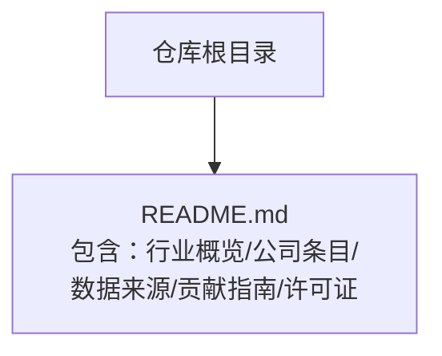
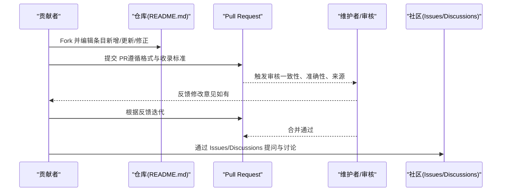
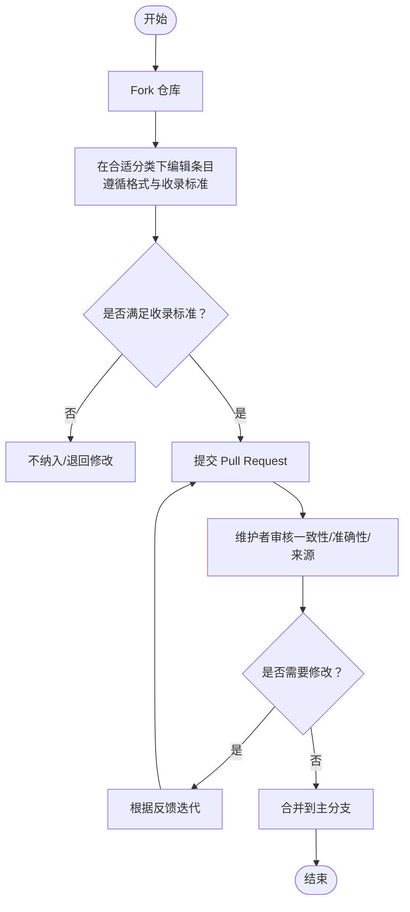
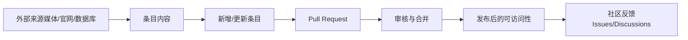

# 贡献指南

<cite>
**本文引用的文件**
- [README.md](file://README.md)
</cite>

## 更新摘要
**所做更改**
- 更新了贡献流程与编辑规范章节，增加了详细的格式要求和字段说明
- 扩展了收录与排除标准，明确了私营公司、融资里程碑和可验证来源的具体要求
- 新增了数据来源与核验机制的详细说明
- 完善了许可证与责任条款
- 增强了社区讨论与问题反馈机制的描述

## 目录
1. [简介](#简介)
2. [项目结构](#项目结构)
3. [核心组件](#核心组件)
4. [架构总览](#架构总览)
5. [详细组件分析](#详细组件分析)
6. [依赖关系分析](#依赖关系分析)
7. [性能与可维护性考虑](#性能与可维护性考虑)
8. [故障排查指南](#故障排查指南)
9. [结论](#结论)
10. [附录：常见问题与最佳实践](#附录：常见问题与最佳实践)

## 简介
本指南面向希望为"Awesome Startups"清单贡献内容的社区成员，涵盖如何添加新公司、更新现有条目、修正错误，以及编辑规范、格式标准、Pull Request 提交流程与审核标准、社区讨论与问题反馈机制、CC0 许可证使用条款与责任免除等。目标是确保内容质量一致、流程清晰高效，鼓励知识共享与协作。

## 项目结构
本项目采用单文件文档组织方式，所有信息（包括行业全景、各赛道公司条目、数据来源、贡献指南与许可证）均集中在 README 中。贡献者主要通过编辑该文件来更新内容。

**图表来源**
- [README.md:1-2957](file://README.md#L1-L2957)

**章节来源**
- [README.md:1-2957](file://README.md#L1-L2957)

## 核心组件
- **贡献入口与流程**：Fork → 在合适分类下按既定格式添加或修改条目 → 提交 Pull Request。
- **收录与排除标准**：限定私营初创公司、需有近期重要融资或里程碑、需公开可验证来源；优先产品已上线或有显著用户量/战略合作的公司；排除已上市大型科技公司、仅有概念无产品的项、无法验证的条目。
- **数据与来源**：提供权威数据来源列表，便于引用与核验。
- **许可证**：采用 CC0 1.0 通用许可证，允许自由使用、修改与分发，无需署名。
- **社区参与**：通过 Issues 反馈问题与建议，通过 Discussions 分享观点与讨论。

**章节来源**
- [README.md:2903-2957](file://README.md#L2903-L2957)

## 架构总览
从贡献视角看，整个流程围绕"内容标准化 + 审核把关 + 社区协作"展开。下图展示了贡献者与仓库之间的交互关系。

**图表来源**
- [README.md:2903-2957](file://README.md#L2903-L2957)

## 详细组件分析

### 贡献流程与编辑规范
- **步骤**
  - Fork 仓库。
  - 在合适的分类下添加或修改条目，严格遵循既有格式模板。
  - 提交 Pull Request，并在描述中说明变更内容与依据来源。
- **格式要点**
  - 条目标题包含公司名称与链接，并标注估值或关键指标。
  - 字段包括创始人、成立时间、核心产品、最新融资/里程碑、亮点等。
  - 保持语言风格一致，避免冗余与主观评价。
- **建议**
  - 每次 PR 聚焦单一主题（如仅新增某赛道条目），便于审核。
  - 附带外部来源链接以支持可验证性。

**章节来源**
- [README.md:2907-2920](file://README.md#L2907-L2920)

### 收录与排除标准
- **收录标准**
  - 公司须为私营初创公司（IPO 前）。
  - 需具备 2025–2026 年期间的重要融资或里程碑。
  - 需提供公开可验证的来源（媒体报道、官方网站等）。
  - 优先收录产品已上线、具有显著用户量或达成战略合作的公司。
- **排除范围**
  - 已上市大型科技公司（除非刚被拆分出的子公司）。
  - 仅有概念阶段、无实际产品的项目。
  - 无法验证信息的条目。

**章节来源**
- [README.md:2921-2933](file://README.md#L2921-L2933)

### 数据来源与核验
- **权威数据来源**：提供权威数据来源列表，用于支撑条目中的融资、估值、里程碑等信息。
- **核验机制**：建议在 PR 中直接附上相关来源链接，便于审核与后续维护。
- **数据时效性**：重点关注 2025-2026 年期间的最新融资和市场动态。

**章节来源**
- [README.md:2853-2872](file://README.md#L2853-L2872)

### 许可证与责任
- **许可证**
  - 采用 CC0 1.0 通用许可证，允许自由使用、修改与分发，无需署名。
- **责任与免责**
  - 内容基于公开信息整理，仅供参考；不构成投资建议或法律意见。
  - 使用者应自行判断信息的时效性与适用性。

**章节来源**
- [README.md:2936-2944](file://README.md#L2936-L2944)

### 社区讨论与问题反馈
- **Issues**：通过 Issues 反馈问题或提出改进建议。
- **Discussions**：通过 Discussions 分享看法、发起话题讨论。
- **跨语言支持**：鼓励跨语言与多地区视角的补充与讨论。

**章节来源**
- [README.md:2950-2957](file://README.md#L2950-L2957)

### 流程图：新增/更新条目的处理路径

**图表来源**
- [README.md:2903-2957](file://README.md#L2903-L2957)

## 依赖关系分析
- **内容依赖**：条目信息依赖外部权威来源（媒体、官网、数据库等）。
- **流程依赖**：贡献流程依赖 GitHub 的 Fork/PR 机制与社区协作工具（Issues/Discussions）。
- **规范依赖**：编辑规范与收录标准保障内容一致性与可信度。

**图表来源**
- [README.md:2853-2957](file://README.md#L2853-L2957)

**章节来源**
- [README.md:2853-2957](file://README.md#L2853-L2957)

## 性能与可维护性考虑
- **可读性**：统一格式与字段顺序，提升扫描效率。
- **可维护性**：分赛道组织条目，便于定位与维护。
- **可扩展性**：预留新增赛道与子类别的空间，避免大规模重构。
- **版本控制**：通过 PR 记录变更历史，便于回溯与审计。

## 故障排查指南
- **常见问题**
  - 格式不符：检查是否遵循模板字段与顺序。
  - 来源缺失：补充公开可验证的外部链接。
  - 收录标准不符：确认是否为私营初创公司且具备近期重要融资/里程碑。
- **处理建议**
  - 参考"收录与排除标准"逐项核对。
  - 在 PR 描述中明确变更点与依据来源。
  - 若不确定，先在 Issues 或 Discussions 中发起讨论。

**章节来源**
- [README.md:2921-2933](file://README.md#L2921-L2933)
- [README.md:2950-2957](file://README.md#L2950-L2957)

## 结论
通过明确的贡献流程、严格的收录标准、统一的编辑规范与开放的社区协作机制，本项目能够持续产出高质量、可信赖的初创公司清单。鼓励大家积极参与，共同完善知识库，推动知识共享与行业洞察。

## 附录：常见问题与最佳实践
- **如何快速上手**
  - 阅读"贡献指南"与"收录标准"，理解格式与要求。
  - 选择一个熟悉的赛道，先做小改动（如修正错别字或补充来源）。
- **最佳实践**
  - 一次 PR 只做一件事，便于审核与合并。
  - 每条信息都附上来源链接，提高可信度。
  - 使用简洁、客观的语言描述公司亮点。
- **争议处理**
  - 对存在争议的条目，先在 Discussions 中讨论共识。
  - 必要时通过 Issues 标记待核实项，暂缓合并。