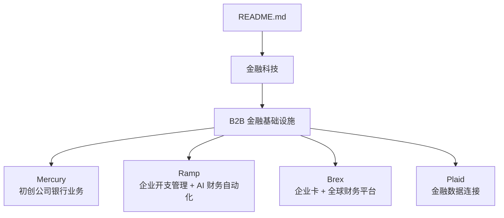
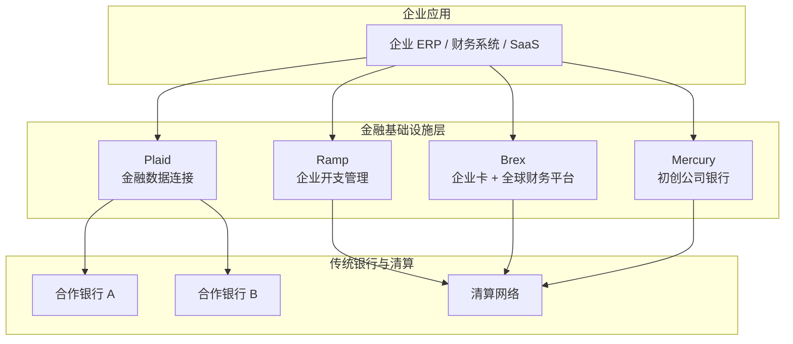
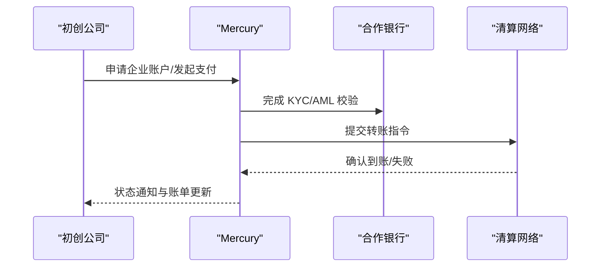
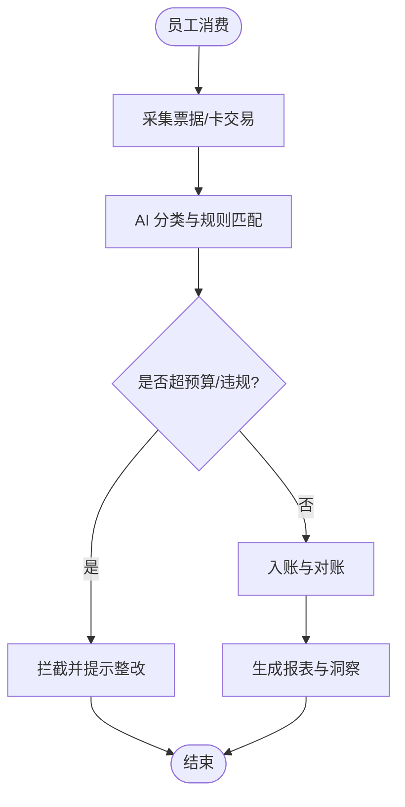
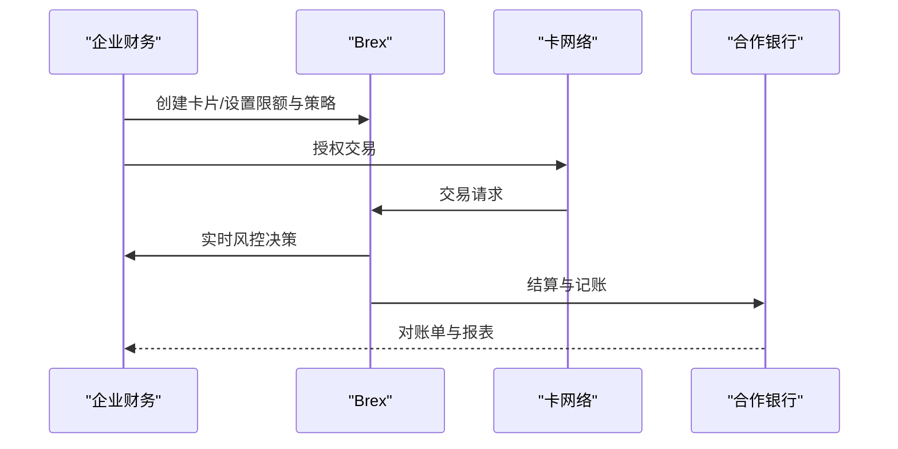
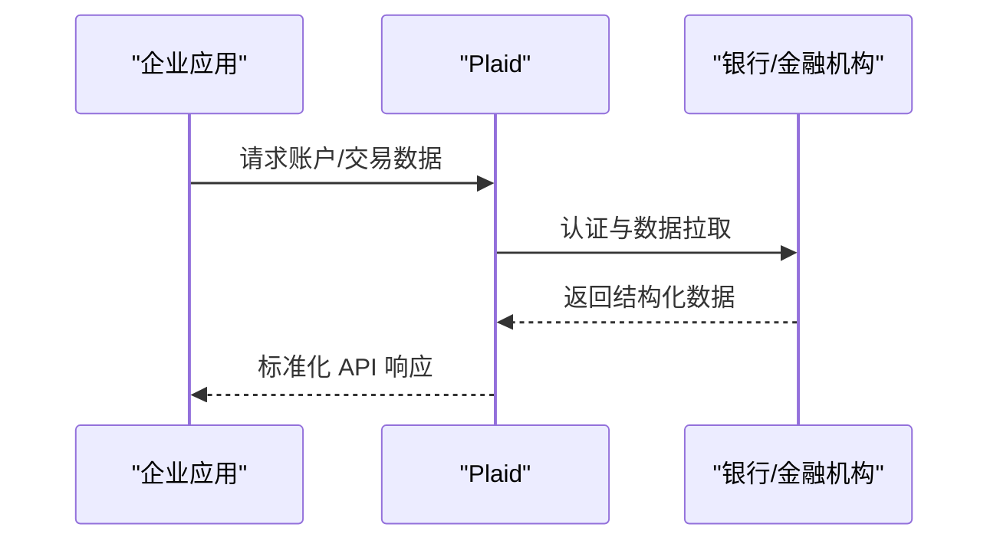
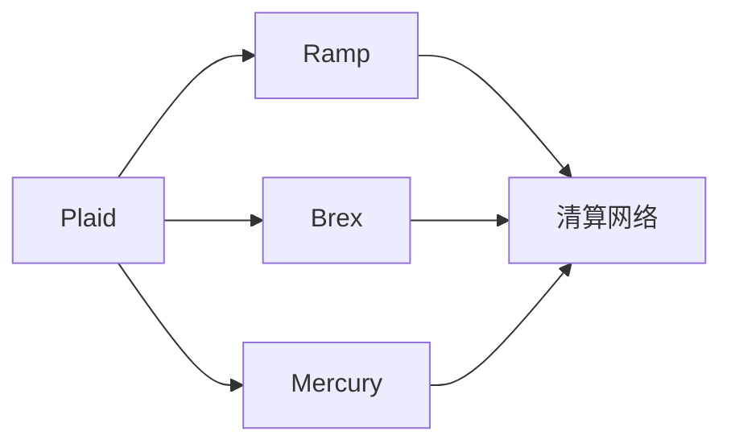

# B2B 金融基础设施

<cite>
**本文引用的文件**
- [README.md](file://README.md)
</cite>

## 目录
1. [引言](#引言)
2. [项目结构](#项目结构)
3. [核心组件](#核心组件)
4. [架构总览](#架构总览)
5. [详细组件分析](#详细组件分析)
6. [依赖关系分析](#依赖关系分析)
7. [性能与合规考量](#性能与合规考量)
8. [故障排查指南](#故障排查指南)
9. [结论](#结论)
10. [附录](#附录)

## 引言
本文件聚焦 B2B 金融基础设施，围绕 Mercury、Ramp、Brex、Plaid 等关键公司展开商业模式与技术架构分析，覆盖初创公司银行业务、企业开支管理、企业卡服务、金融数据连接等核心能力。同时梳理传统银行与金融科技公司的竞争格局、监管环境对业务模式的影响，并提供企业在选择金融基础设施时的实用指导（成本、集成难度、安全性评估）。内容基于仓库中“金融科技”板块的公开信息整理而成。

## 项目结构
仓库为单一 README 文档，按赛道组织，其中“金融科技”章节包含 B2B 金融基础设施相关条目，涵盖：
- 初创公司银行业务：Mercury
- 企业开支管理与财务自动化：Ramp
- 企业卡与全球财务平台：Brex
- 金融数据连接：Plaid

图表来源
- [README.md:716-742](file://README.md#L716-L742)

章节来源
- [README.md:716-742](file://README.md#L716-L742)

## 核心组件
- Mercury：面向初创公司的现代银行体验，提供账户、支付、现金管理等基础能力，服务于 YC 系及大量早期/成长期企业客户。
- Ramp：企业开支管理与 AI 驱动的财务自动化，帮助企业控制支出、优化流程并提升财务效率。
- Brex：企业卡与全球财务平台，提供企业支付、费用管控、账务与合规工具，已并入 Capital One 生态。
- Plaid：金融数据连接层，聚合多家银行与金融机构数据，为上层应用提供标准化 API，支撑余额查询、交易流水、KYC/KYB 等场景。

章节来源
- [README.md:720-742](file://README.md#L720-L742)

## 架构总览
下图展示 B2B 金融基础设施的典型分层与交互：企业应用通过 Plaid 接入银行数据；Mercury/Ramp/Brex 提供账户、卡与开支管理能力；传统银行作为底层资金与清算通道参与。

图表来源
- [README.md:720-742](file://README.md#L720-L742)

## 详细组件分析

### Mercury（初创公司银行业务）
- 定位与价值：为初创企业提供更现代的开户、支付与资金管理体验，降低早期融资与日常运营中的财务摩擦。
- 典型能力：企业账户开立、转账与收款、现金流可视化、基础报表与对账。
- 适用场景：YC 系及其他高增长初创公司；需要快速搭建财务体系的企业。
- 与传统银行差异：以产品化体验与开发者友好接口为主，强调速度、透明度和可组合性。

图表来源
- [README.md:720-725](file://README.md#L720-L725)

章节来源
- [README.md:720-725](file://README.md#L720-L725)

### Ramp（企业开支管理与 AI 财务自动化）
- 定位与价值：将企业费用审批、报销、发票处理与预算控制整合到统一平台，并通过 AI 自动化提升效率。
- 典型能力：虚拟/实体企业卡、智能审批流、费用分类与合规检查、自动对账、预算预警。
- 适用场景：中大型企业或快速增长团队；需要强管控与高自动化水平的财务流程。
- 与传统银行差异：以“开支即服务”为核心，强调流程自动化、数据洞察与风控前置。

图表来源
- [README.md:726-731](file://README.md#L726-L731)

章节来源
- [README.md:726-731](file://README.md#L726-L731)

### Brex（企业卡与全球财务平台）
- 定位与价值：为企业发行卡片并提供端到端的财务管理能力，支持多币种、多地区合规与结算。
- 典型能力：企业卡发行、费用策略配置、账务集成、合规与审计留痕。
- 适用场景：跨国企业、高合规要求的行业；需要统一支付与财务治理的组织。
- 市场动态：已被 Capital One 收购，融入更大生态，增强资本与渠道协同。

图表来源
- [README.md:732-737](file://README.md#L732-L737)

章节来源
- [README.md:732-737](file://README.md#L732-L737)

### Plaid（金融数据连接）
- 定位与价值：聚合多家银行与金融机构的数据接口，向上层应用提供统一的金融数据访问能力。
- 典型能力：账户与交易数据拉取、身份核验、余额与流水查询、支付发起（在部分地区）。
- 适用场景：任何需要“连接银行数据”的金融产品（如信贷、财富、会计软件、企业财务系统）。
- 生态角色：成为金融科技公司的事实标准中间层，显著降低对接银行的复杂度。

图表来源
- [README.md:738-742](file://README.md#L738-L742)

章节来源
- [README.md:738-742](file://README.md#L738-L742)

## 依赖关系分析
- 数据依赖：Ramp/Brex/Mercury 的上层功能往往依赖 Plaid 提供的银行数据接入能力，用于对账、风控与洞察。
- 清算依赖：所有支付与转账最终通过传统银行与清算网络完成，合规与流动性管理是关键约束。
- 生态整合：Brex 并入 Capital One，意味着其可在更广的银行生态内获得更强资源与渠道；Ramp 的高增长也体现其在企业财务自动化领域的吸引力。

图表来源
- [README.md:720-742](file://README.md#L720-L742)

章节来源
- [README.md:720-742](file://README.md#L720-L742)

## 性能与合规考量
- 性能与可用性
  - 高并发交易与低延迟对账：需关注峰值处理能力与容灾设计。
  - 数据一致性：跨系统对账与事务边界需明确，避免重复入账或漏记。
- 安全与隐私
  - 数据最小化与加密传输：确保敏感财务数据在链路各节点得到保护。
  - 访问控制与审计：细粒度权限与操作日志满足内控与外部审计要求。
- 合规与监管
  - KYC/KYB、反洗钱（AML）、制裁名单筛查：必须贯穿开户、交易与监控全流程。
  - 地域合规：跨境支付与多币种结算需遵循当地法规与外汇政策。
  - 第三方依赖风险：Plaid 等中间层的稳定性与合规性直接影响上层应用。

[本节为通用指导，不直接分析具体文件]

## 故障排查指南
- 常见故障点
  - 银行数据同步失败：检查 Plaid 连接状态、凭证有效性、银行侧维护公告。
  - 交易被拒：核对限额策略、风控规则、商户类别与黑名单。
  - 对账不平：核查时间窗口、汇率折算、手续费与退款处理逻辑。
- 排查步骤
  - 定位错误码与日志：从上游（银行/清算）到下游（应用）逐层验证。
  - 复现与隔离：使用沙箱或测试账户模拟问题路径。
  - 回滚与补偿：必要时执行冲正、手工调账与人工复核。
- 预防建议
  - 建立监控告警：关键指标包括成功率、延迟、对账差异率。
  - 定期演练：灾难恢复与应急切换流程。
  - 供应商管理：对 Plaid、银行、卡网络等第三方进行 SLA 与风险评估。

[本节为通用指导，不直接分析具体文件]

## 结论
- Mercury、Ramp、Brex、Plaid 分别在企业银行、开支自动化、企业卡与金融数据连接四个关键环节形成互补能力，共同构成现代 B2B 金融基础设施的核心。
- 传统银行与金融科技的竞争体现在“体验与速度”“数据与生态”“合规与信任”三个维度；并购与联盟正在重塑格局。
- 企业选型应综合评估成本模型、集成复杂度、安全与合规成熟度，以及供应商的长期战略与生态能力。

[本节为总结性内容，不直接分析具体文件]

## 附录
- 参考来源：本文件关于 Mercury、Ramp、Brex、Plaid 的信息均来源于仓库“金融科技”章节的公开条目。
- 扩展阅读：可结合仓库中其他赛道的趋势与案例，理解金融基础设施在企业数字化中的作用。

[本节为补充说明，不直接分析具体文件]