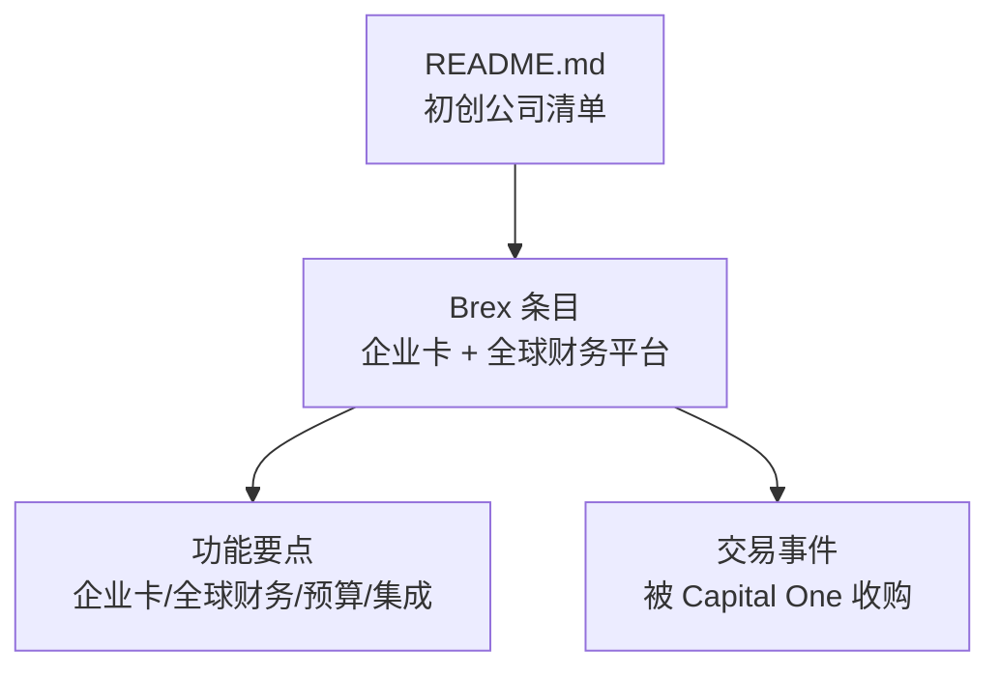
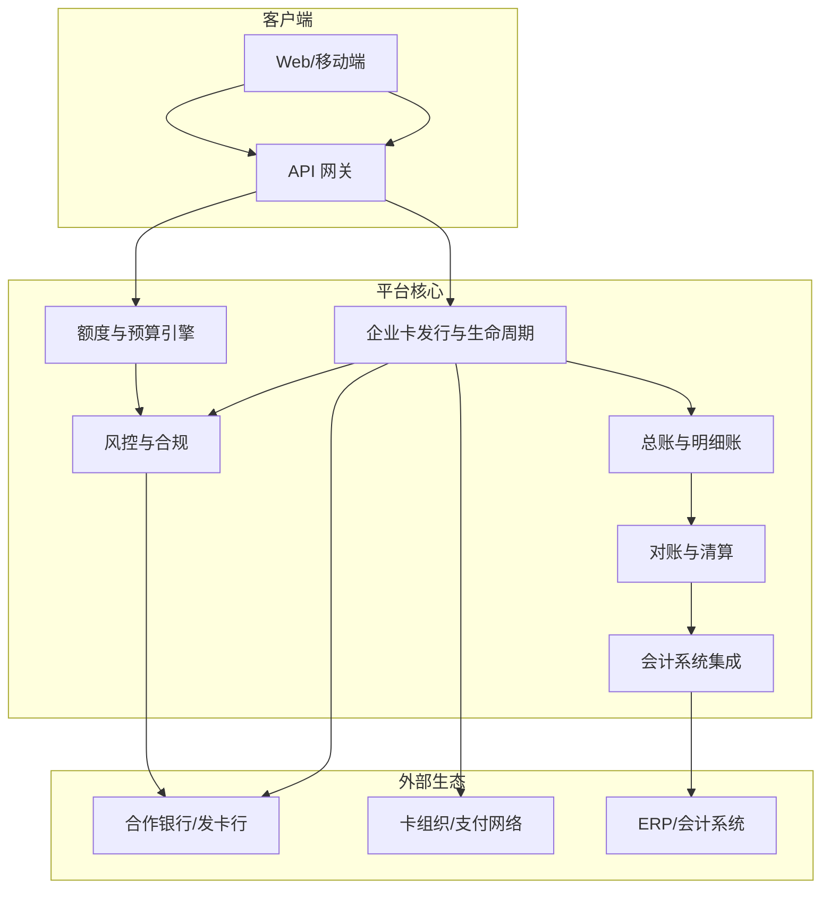
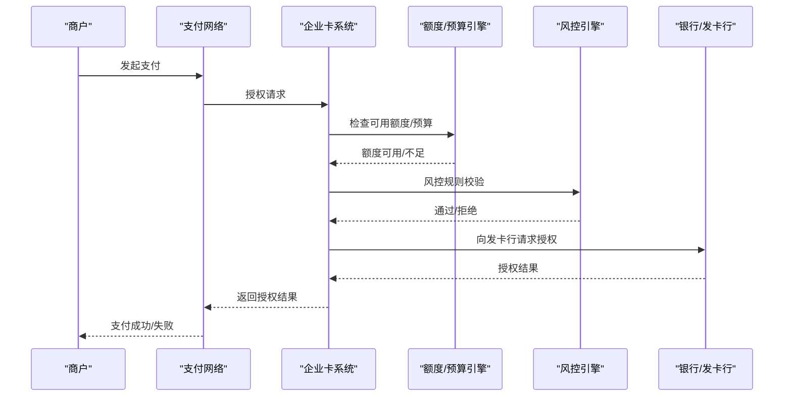
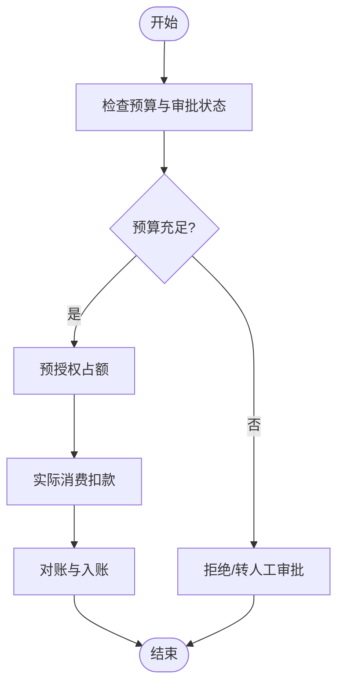
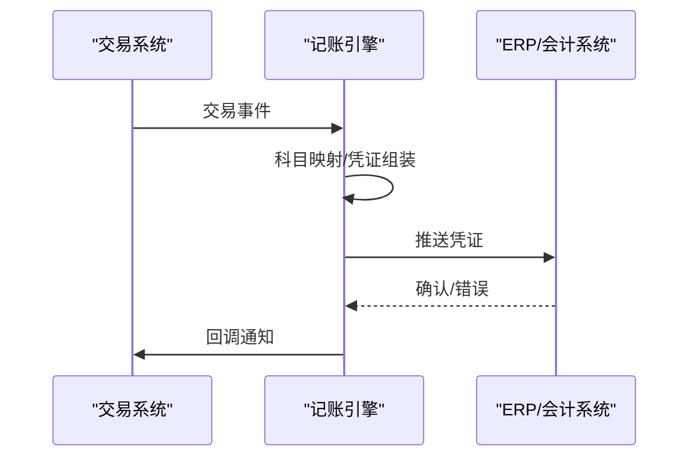
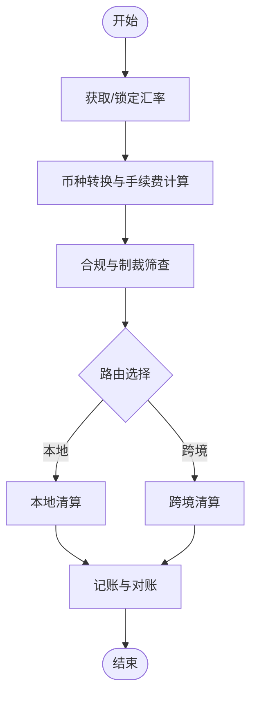
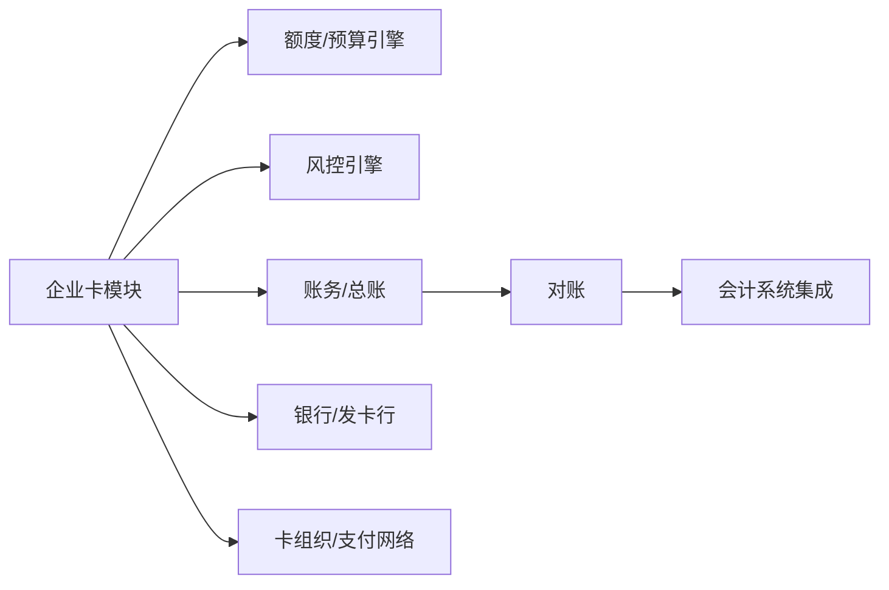

# Brex - 企业卡+财务平台

<cite>
**本文引用的文件**
- [README.md](file://README.md)
</cite>

## 目录
1. [引言](#引言)
2. [项目结构](#项目结构)
3. [核心组件](#核心组件)
4. [架构总览](#架构总览)
5. [详细组件分析](#详细组件分析)
6. [依赖关系分析](#依赖关系分析)
7. [性能考量](#性能考量)
8. [故障排查指南](#故障排查指南)
9. [结论](#结论)
10. [附录](#附录)

## 引言
本文件基于仓库中的公开信息，围绕 Brex 的企业信用卡服务与全球财务平台能力进行系统化梳理，涵盖多币种支持、实时预算管理、会计系统集成等关键主题；同时结合其被 Capital One 收购的背景，讨论战略意义与市场影响。文档还总结了疫情期间的发展轨迹与后续转型策略，提供企业选择 Brex 的决策框架（含成本效益分析与迁移策略），并探讨企业金融服务的技术架构与安全标准。

## 项目结构
该仓库为一份“精选初创公司清单”，其中包含对 Brex 的条目式记录。由于仓库未包含 Brex 的代码或产品实现细节，本文所有关于 Brex 的功能描述均来源于清单中对 Brex 的条目化信息，并结合通用企业金融平台的行业实践进行归纳说明。

图表来源
- [README.md:966-970](file://README.md#L966-L970)

章节来源
- [README.md:966-970](file://README.md#L966-L970)

## 核心组件
根据清单中 Brex 的条目，可提炼出以下核心组件与能力方向：
- 企业信用卡：面向企业的支付与费用管理工具
- 全球财务平台：覆盖多币种、跨境结算、资金可视化的财务管理中枢
- 实时预算管理：在消费发生前/发生时进行额度控制与审批流
- 会计系统集成：与企业会计系统对接，自动化记账与对账

上述能力构成一个以“企业卡”为入口、以“全球财务平台”为核心的闭环体系，支撑企业在复杂业务场景下的支出治理与合规管控。

章节来源
- [README.md:966-970](file://README.md#L966-L970)

## 架构总览
下图展示了一个典型的企业卡+财务平台的高层架构视图，体现前端交互、风控与额度、账务与会计集成、以及外部银行/卡组织/支付网络的协作关系。该图为概念性架构图，用于帮助理解系统边界与数据流向。

[此图为概念性架构图，不直接映射到具体源码文件]

## 详细组件分析

### 企业卡与支付链路
- 角色与职责
  - 企业卡发行与生命周期管理：卡片申请、激活、挂失、续期、权限配置
  - 支付路由与清算：通过卡组织/支付网络完成授权、清算与结算
  - 风控与合规：交易拦截、黑名单、地理围栏、商户类别限制、反洗钱校验
- 数据流
  - 消费请求经风控与额度校验后进入支付网络，返回授权结果
  - 日终对账将交易流水与银行/卡组织账单对齐，生成会计分录
- 关键指标
  - 授权成功率、拒付率、平均处理时延、对账差异率

[此图为概念性时序图，不直接映射到具体源码文件]

### 实时预算管理与审批流
- 目标
  - 在消费发生前进行预算占用与审批，避免超支
- 流程要点
  - 预算池按部门/项目/成本中心划分
  - 预授权占额、消费扣减、退款释放
  - 多级审批与阈值触发（如大额、敏感商户）
- 异常处理
  - 预算不足时的降级策略（部分放行/转人工）
  - 审批超时自动回滚或升级

[此图为概念性流程图，不直接映射到具体源码文件]

### 会计系统集成
- 集成范围
  - 凭证生成、科目映射、辅助核算（部门/项目/成本中心）
  - 批量导入/导出、接口直连、定时同步
- 一致性保障
  - 幂等设计、去重、重试机制
  - 差异检测与告警、手工调整通道
- 审计与合规
  - 操作留痕、变更追踪、报表输出

[此图为概念性时序图，不直接映射到具体源码文件]

### 多币种支持与跨境结算
- 能力要点
  - 多币种账户与余额可视化
  - 汇率获取与锁定、汇兑损益计算
  - 跨境收付款路径优化与合规校验
- 风险点
  - 汇率波动、制裁名单筛查、外汇管制

[此图为概念性流程图，不直接映射到具体源码文件]

## 依赖关系分析
- 内部依赖
  - 企业卡模块依赖额度/预算引擎与风控引擎
  - 账务模块依赖对账与会计集成
- 外部依赖
  - 银行/发卡行：账户开立、资金清算
  - 卡组织/支付网络：授权、清算、结算
  - 会计系统：凭证推送、对账核对
- 耦合与解耦
  - 通过 API 网关与消息队列降低紧耦合
  - 使用幂等键与事务边界保证一致性

[此图为概念性依赖图，不直接映射到具体源码文件]

## 性能考量
- 高并发授权
  - 缓存热点数据（商户白名单、限额策略）
  - 异步审批与批处理合并
- 低延迟对账
  - 增量对账、分片并行
  - 差异快速定位与自动修复
- 可扩展性
  - 水平扩展微服务
  - 弹性伸缩应对峰值（如月末/年末）

[本节为通用性能建议，不直接引用具体文件]

## 故障排查指南
- 常见问题
  - 授权失败：检查风控规则、额度不足、银行侧拒绝
  - 对账不平：核对交易号、金额精度、汇率取值时间戳
  - 凭证缺失：检查接口连通性、幂等键冲突、重试策略
- 排障步骤
  - 日志聚合与链路追踪
  - 回放关键交易复现问题
  - 灰度回滚与熔断降级

[本节为通用排障建议，不直接引用具体文件]

## 结论
Brex 在企业卡与全球财务平台领域提供了从支付到账务的一体化解决方案，帮助企业实现“事前可控、事中可视、事后可溯”的费用治理闭环。其被 Capital One 收购标志着传统金融机构对新兴企业金融科技能力的整合与布局，有助于加速合规、风控与渠道协同。对于企业而言，选择 Brex 需综合评估成本收益、迁移复杂度与生态集成能力，制定分阶段迁移计划以降低切换风险。

[本节为总结性内容，不直接引用具体文件]

## 附录

### 背景信息与市场影响
- 根据清单记录，Brex 的核心产品定位为“企业卡 + 全球财务平台”，并在 2026 年被 Capital One 以 51.5 亿美元收购，体现了传统银行对新兴企业金融能力的重视与整合趋势。

章节来源
- [README.md:966-970](file://README.md#L966-L970)

### 企业选择 Brex 的决策框架
- 需求匹配
  - 是否需要多币种与跨境结算
  - 是否要求实时预算与审批
  - 是否与现有会计系统深度集成
- 成本效益分析
  - 直接成本：年费、交易费率、汇兑成本
  - 间接收益：效率提升、合规风险降低、现金流可视
- 迁移策略
  - 试点先行：选取单一部门或区域试点
  - 双轨运行：新旧系统并行一段时间
  - 数据迁移：历史交易与余额迁移验证
  - 培训与支持：用户培训、运维手册、应急预案

[本节为方法论指导，不直接引用具体文件]

### 技术架构与安全标准（概念性）
- 安全基线
  - 传输加密、存储加密、密钥管理
  - 访问控制、最小权限、审计日志
  - 威胁建模与渗透测试
- 合规与认证
  - PCI DSS、SOC 2、ISO 27001 等常见认证
  - 数据隐私与跨境合规
- 可靠性
  - 多活部署、容灾演练、RTO/RPO 目标
  - 监控告警与自愈机制

[本节为通用技术与安全建议，不直接引用具体文件]